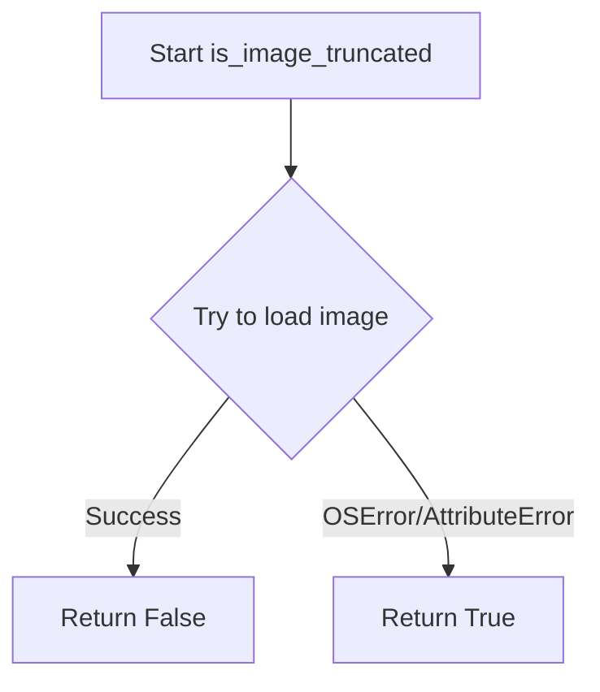
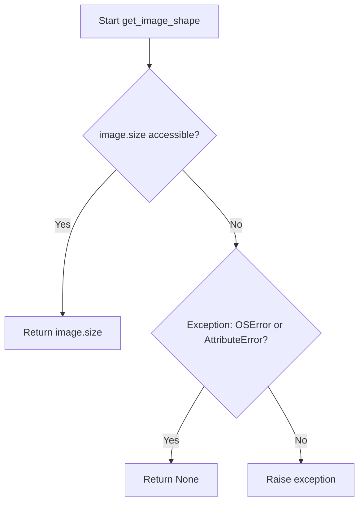
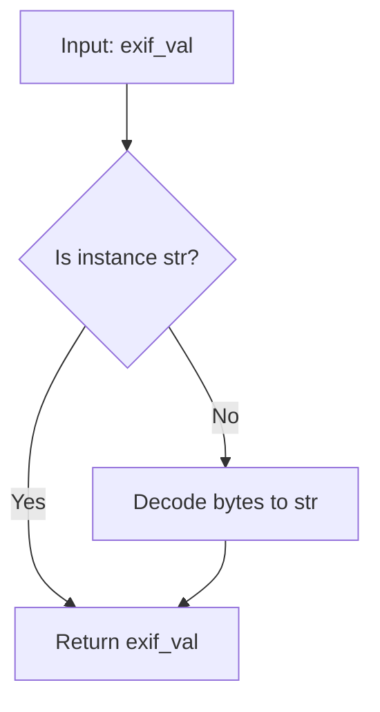
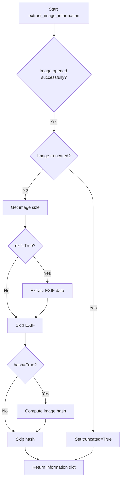
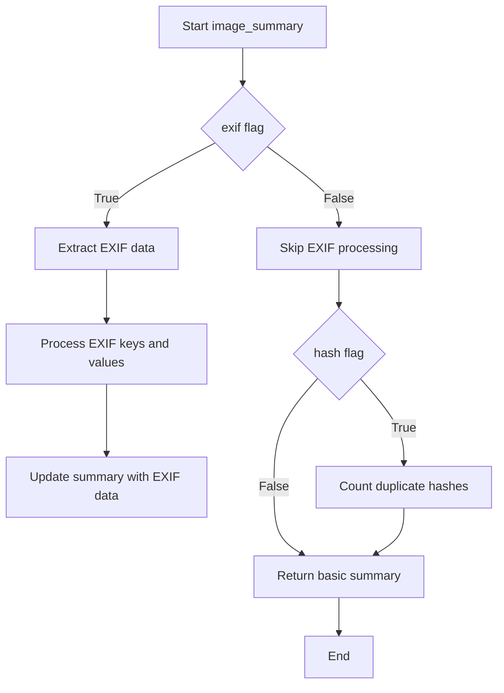

# `describe_image_pandas.py`

## `src.ydata_profiling.model.pandas.describe_image_pandas.open_image` · *function*

## Summary:
Attempts to safely open an image file using PIL and returns the image object or None if opening fails.

## Description:
This function provides a safe wrapper around PIL's Image.open() method to handle potentially invalid or corrupted image files gracefully. It's used in the image profiling pipeline to process image data without crashing the entire analysis when encountering problematic files.

The function is typically called during image data analysis phases where multiple image files need to be processed, such as when generating image statistics or performing image quality assessments.

## Args:
    path (Path): A pathlib.Path object pointing to the image file to be opened.

## Returns:
    Optional[Image.Image]: Returns a PIL Image object if the file is successfully opened, or None if the file is invalid, corrupted, or cannot be opened due to OS or attribute errors.

## Raises:
    None: This function catches and handles OSError and AttributeError exceptions internally, so no exceptions are raised to the caller.

## Constraints:
    Preconditions:
    - The path parameter must be a valid pathlib.Path object
    - The file at the specified path must be readable
    
    Postconditions:
    - The function always returns either a PIL Image object or None
    - No exceptions are propagated to the caller

## Side Effects:
    - Reads from the filesystem at the specified path
    - May trigger file system I/O operations

## Control Flow:
```mermaid
flowchart TD
    A[Call open_image with path] --> B{Try Image.open(path)}
    B -->|Success| C[Return Image object]
    B -->|OSError/AttributeError| D[Return None]
```

## Examples:
```python
from pathlib import Path
from PIL import Image

# Valid image file
image_path = Path("valid_image.jpg")
img = open_image(image_path)
if img is not None:
    print(f"Image size: {img.size}")
else:
    print("Could not open image")

# Invalid or corrupted file
bad_path = Path("corrupted_file.png")
img = open_image(bad_path)
assert img is None  # Will succeed for invalid files
```

## `src.ydata_profiling.model.pandas.describe_image_pandas.is_image_truncated` · *function*

## Summary:
Determines whether an image is truncated or corrupted by attempting to load it.

## Description:
Checks if an image object can be successfully loaded. This function is used to identify potentially corrupted or incomplete image files that may cause issues during further processing. The function attempts to load the image data and returns True if loading fails due to OSError or AttributeError, indicating the image is likely truncated or malformed.

## Args:
    image (PIL.Image): A PIL Image object to check for truncation

## Returns:
    bool: True if the image cannot be loaded (likely truncated/corrupted), False if loading succeeds

## Raises:
    None explicitly raised - handles exceptions internally

## Constraints:
    Preconditions:
        - Input must be a valid PIL Image object
        - The image object should be properly initialized
    
    Postconditions:
        - Always returns a boolean value
        - Does not modify the input image object

## Side Effects:
    None

## Control Flow:


## Examples:
```python
from PIL import Image

# Valid image
img = Image.open("valid_image.jpg")
result = is_image_truncated(img)  # Returns False

# Truncated image
try:
    img = Image.open("truncated_image.jpg")
    result = is_image_truncated(img)  # Returns True if loading fails
except Exception:
    # Handle invalid image file
    pass
```

## `src.ydata_profiling.model.pandas.describe_image_pandas.get_image_shape` · *function*

## Summary:
Retrieves the width and height dimensions of an image object safely, returning None if the operation fails.

## Description:
Extracts the size attribute from a PIL Image object while gracefully handling potential errors that may occur when accessing image metadata. This function serves as a safe wrapper around the image.size property access, preventing crashes when dealing with corrupted or improperly formatted image files.

## Args:
    image (PIL.Image): A PIL Image object from which to extract dimensions

## Returns:
    Optional[Tuple[int, int]]: A tuple containing (width, height) if successful, or None if the image size cannot be accessed due to OSError or AttributeError

## Raises:
    None explicitly raised - handles exceptions internally

## Constraints:
    Preconditions:
    - Input must be a valid PIL Image object
    - The image object must support the .size attribute access
    
    Postconditions:
    - Function always returns either a tuple of two integers or None
    - No modifications are made to the input image object

## Side Effects:
    None - This function performs no I/O operations or external state mutations

## Control Flow:


## Examples:
    # Successful case
    from PIL import Image
    img = Image.open('example.jpg')
    shape = get_image_shape(img)  # Returns (width, height) tuple
    
    # Error case
    bad_img = Image.new('RGB', (100, 100))  # Create a basic image
    # If somehow the image object is corrupted or malformed
    shape = get_image_shape(bad_img)  # Returns None if size access fails

## `src.ydata_profiling.model.pandas.describe_image_pandas.hash_image` · *function*

## Summary:
Computes a perceptual hash of an image using phash algorithm, returning None if hashing fails.

## Description:
This function applies the perceptual hash algorithm to an image to generate a hash string representation. It serves as a wrapper around imagehash.phash() with appropriate error handling to gracefully handle invalid images or unsupported formats.

The function is extracted into its own component to separate the hashing logic from higher-level image processing operations, providing a clean interface for image hashing with predictable error handling behavior.

## Args:
    image (Image): A PIL Image object to be hashed

## Returns:
    Optional[str]: String representation of the perceptual hash if successful, None if hashing fails due to OSError or AttributeError

## Raises:
    None explicitly raised, but catches and handles OSError and AttributeError internally

## Constraints:
    Preconditions:
    - Input must be a valid PIL Image object
    - Image data must be readable and supported by the underlying imagehash library
    
    Postconditions:
    - Returns either a string hash or None
    - Does not modify the input image object

## Side Effects:
    None - No I/O operations, external state mutations, or service calls occur

## Control Flow:
```mermaid
flowchart TD
    A[Start hash_image] --> B{imagehash.phash()}
    B -->|Success| C[return str(phash)]
    B -->|OSError/AttributeError| D[return None]
```

## Examples:
```python
from PIL import Image
# Valid image
img = Image.open('example.jpg')
hash_value = hash_image(img)  # Returns string hash or None

# Invalid image or unsupported format
bad_img = Image.new('RGB', (100, 100))  # Create blank image
hash_value = hash_image(bad_img)  # May return None if hashing fails
```

## `src.ydata_profiling.model.pandas.describe_image_pandas.decode_byte_exif` · *function*

## Summary:
Converts EXIF data from bytes to string format, handling both string and bytes inputs gracefully.

## Description:
This utility function normalizes EXIF data by ensuring it's returned as a string format. It accepts EXIF values that may be either string or bytes type and converts bytes to strings using UTF-8 decoding. This function is particularly useful in image metadata processing where EXIF data can arrive in different formats depending on how it was originally encoded or stored.

The function is extracted into its own component to provide a clean abstraction for handling EXIF data normalization, separating the concerns of data format conversion from the broader image analysis logic.

## Args:
    exif_val (Union[str, bytes]): EXIF data that can be either a string or bytes object. When provided as bytes, it will be decoded using UTF-8 encoding.

## Returns:
    str: The EXIF data as a string. If the input was already a string, it is returned unchanged. If the input was bytes, it is decoded to a string.

## Raises:
    UnicodeDecodeError: When bytes cannot be decoded using UTF-8 encoding, which would occur if the EXIF data contains invalid UTF-8 sequences.

## Constraints:
    Preconditions:
    - Input must be either a string or bytes object
    - Bytes input must be valid UTF-8 encoded data
    
    Postconditions:
    - Return value is always a string object
    - No modification to the original input data occurs

## Side Effects:
    None

## Control Flow:


## Examples:
    # String input (no change)
    result = decode_byte_exif("Camera Model: Canon EOS")
    # Returns: "Camera Model: Canon EOS"
    
    # Bytes input (decoded)
    result = decode_byte_exif(b"Camera Model: Canon EOS")
    # Returns: "Camera Model: Canon EOS"
    
    # Error case (invalid UTF-8)
    try:
        result = decode_byte_exif(b"\xff\xfe")
    except UnicodeDecodeError:
        print("Invalid UTF-8 sequence detected")
```

## `src.ydata_profiling.model.pandas.describe_image_pandas.extract_exif` · *function*

## Summary:
Extracts and decodes EXIF metadata from an image object into a human-readable dictionary format.

## Description:
This function safely retrieves EXIF metadata from an image and converts it into a dictionary mapping human-readable tag names to their corresponding values. It handles various error conditions gracefully and ensures proper decoding of byte-encoded EXIF values.

## Args:
    image (PIL.Image): A PIL Image object from which to extract EXIF metadata

## Returns:
    dict: A dictionary containing EXIF metadata where keys are human-readable tag names and values are the corresponding decoded values. Returns an empty dictionary if no EXIF data is available or if an error occurs during extraction.

## Raises:
    None: This function catches and handles all exceptions internally, returning an empty dictionary in case of errors.

## Constraints:
    Preconditions:
        - The input must be a valid PIL Image object
        - The image object must support the _getexif() method
    
    Postconditions:
        - Always returns a dictionary (never None)
        - All returned values are properly decoded strings or remain as strings

## Side Effects:
    None: This function performs no I/O operations or external state mutations.

## Control Flow:
```mermaid
flowchart TD
    A[Start extract_exif] --> B{image._getexif() != None?}
    B -- Yes --> C[Iterate through EXIF data]
    C --> D{Key in ExifTags.TAGS?}
    D -- Yes --> E[Map key to readable name]
    E --> F[Decode value with decode_byte_exif]
    F --> G[Add to result dict]
    D -- No --> H[Skip key]
    G --> I[Return result dict]
    H --> I
    B -- No --> J[Return empty dict]
    J --> I
    C --> K{Exception caught?}
    K -- Yes --> L[Return empty dict]
    K -- No --> I
```

## Examples:
```python
from PIL import Image
# Assuming img is a valid PIL Image object
exif_data = extract_exif(img)
print(exif_data)  # Prints dictionary of EXIF metadata or empty dict
```

## `src.ydata_profiling.model.pandas.describe_image_pandas.path_is_image` · *function*

## Summary:
Determines whether a given file path corresponds to an image file by checking its magic bytes and file header.

## Description:
This function serves as a utility to validate if a file path points to a valid image file. It leverages Python's built-in `imghdr` module to inspect the file's magic numbers and header information to determine image type. The function is extracted into its own component to provide a clean abstraction for image validation throughout the profiling system, separating concerns from the actual image processing logic.

## Args:
    p (Path): A pathlib.Path object representing the file path to be checked

## Returns:
    bool: True if the file at the given path appears to be an image file based on its header information, False otherwise

## Raises:
    None explicitly raised

## Constraints:
    Preconditions:
    - The Path object must point to an existing file (though the function doesn't verify this directly)
    - The file must be readable
    
    Postconditions:
    - The function returns a boolean value indicating image status
    - No side effects occur during execution

## Side Effects:
    None

## Control Flow:
```mermaid
flowchart TD
    A[Start path_is_image] --> B{imghdr.what(p) returns}
    B -->|Not None| C[Return True]
    B -->|None| D[Return False]
```

## Examples:
```python
from pathlib import Path

# Valid image file
image_path = Path("photo.jpg")
is_image = path_is_image(image_path)  # Returns True

# Non-image file
text_path = Path("document.txt")
is_image = path_is_image(text_path)  # Returns False

# Non-existent file
missing_path = Path("nonexistent.png")
is_image = path_is_image(missing_path)  # Returns False
```

## `src.ydata_profiling.model.pandas.describe_image_pandas.count_duplicate_hashes` · *function*

## Summary:
Counts the total number of duplicate image hash occurrences in a collection of image descriptions.

## Description:
Processes a collection of image descriptions to calculate how many duplicate perceptual hash values exist. This function identifies redundant or repeated images in a dataset by analyzing their perceptual hashes. It is typically used in image profiling to detect duplicate images.

## Args:
    image_descriptions (dict): Dictionary containing image metadata, where each entry may have a "hash" key representing the image's perceptual hash.

## Returns:
    int: The total number of duplicate hash occurrences. Returns 0 if no duplicates exist or if no valid hash entries are found.

## Raises:
    None explicitly raised by this function.

## Constraints:
    Preconditions:
    - Input must be a dictionary-like object that supports iteration
    - Each dictionary entry should contain a "hash" key or be filtered out
    - Hash values should be comparable and hashable
    
    Postconditions:
    - Returns a non-negative integer representing duplicate occurrences
    - Function is idempotent and has no side effects

## Side Effects:
    None.

## Control Flow:
```mermaid
flowchart TD
    A[Start count_duplicate_hashes] --> B[Iterate over image_descriptions]
    B --> C{Entry has "hash" key?}
    C -- Yes --> D[Extract hash value]
    D --> E[Build Series of hash values]
    C -- No --> F[Skip entry]
    E --> G[Calculate value_counts()]
    G --> H[Return counts.sum() - len(counts)]
```

## Examples:
```python
# Basic usage with duplicate hashes
image_descs = [
    {"hash": "a1b2c3", "filename": "img1.jpg"},
    {"hash": "d4e5f6", "filename": "img2.jpg"},
    {"hash": "a1b2c3", "filename": "img3.jpg"}
]
result = count_duplicate_hashes(image_descs)  # Returns 1 (one duplicate occurrence)

# No duplicates
image_descs = [
    {"hash": "a1b2c3", "filename": "img1.jpg"},
    {"hash": "d4e5f6", "filename": "img2.jpg"}
]
result = count_duplicate_hashes(image_descs)  # Returns 0

# Mixed entries with and without hashes
image_descs = [
    {"hash": "a1b2c3", "filename": "img1.jpg"},
    {"filename": "img2.jpg"},  # No hash key
    {"hash": "a1b2c3", "filename": "img3.jpg"}
]
result = count_duplicate_hashes(image_descs)  # Returns 1
```

## `src.ydata_profiling.model.pandas.describe_image_pandas.extract_exif_series` · *function*

## Summary:
Processes a collection of EXIF metadata dictionaries to compute value frequency distributions for EXIF keys and individual EXIF values.

## Description:
This function aggregates EXIF metadata from multiple images and computes frequency distributions for both the set of EXIF keys encountered and the values associated with each EXIF key. It's designed to provide statistical summaries of EXIF metadata characteristics across a dataset of images.

The function is typically called as part of image profiling workflows where EXIF metadata analysis is required. It extracts all unique EXIF keys and their corresponding values, then computes value counts to understand the distribution of metadata properties across the image collection.

## Args:
    image_exifs (list): A list of dictionaries, where each dictionary contains EXIF metadata for a single image. Each dictionary maps EXIF tag names to their corresponding values.

## Returns:
    dict: A dictionary containing:
        - "exif_keys": A dictionary mapping each unique EXIF key to its frequency count across all images
        - For each unique EXIF key found: A pandas Series with value counts for that specific EXIF key's values

## Raises:
    None explicitly raised by this function, though underlying pandas operations may raise exceptions for invalid inputs.

## Constraints:
    Preconditions:
        - Input must be a list of dictionaries
        - Each dictionary should contain EXIF metadata key-value pairs
        - All values in the dictionaries should be serializable for pandas Series creation
    
    Postconditions:
        - Output dictionary will always contain "exif_keys" key
        - Each EXIF key in the input will have a corresponding entry in the output dictionary
        - Value counts are computed using pandas Series.value_counts() method

## Side Effects:
    None

## Control Flow:
```mermaid
flowchart TD
    A[Start extract_exif_series] --> B[Initialize exif_keys and exif_values]
    B --> C[For each image_exif in image_exifs]
    C --> D[Extend exif_keys with image_exif keys]
    D --> E[For each exif_key, exif_val in image_exif]
    E --> F{Is exif_key in exif_values?}
    F -->|No| G[Add exif_key to exif_values with empty list]
    G --> H[Append exif_val to exif_values[exif_key]]
    F -->|Yes| H
    H --> I[End image_exif loop]
    I --> J[Create exif_keys series with value_counts]
    J --> K[For each key, value in exif_values]
    K --> L[Create series with value_counts for each key]
    L --> M[Return series dictionary]
```

## Examples:
```python
# Basic usage with sample EXIF data
sample_exifs = [
    {"Make": "Canon", "Model": "EOS 5D", "ExposureTime": "1/125"},
    {"Make": "Canon", "Model": "EOS 5D", "ExposureTime": "1/250"},
    {"Make": "Nikon", "Model": "D850", "ExposureTime": "1/125"}
]

result = extract_exif_series(sample_exifs)
# Result would contain:
# - "exif_keys": {"Make": 2, "Model": 2, "ExposureTime": 3}
# - "Make": Series with value counts for Make values
# - "Model": Series with value counts for Model values  
# - "ExposureTime": Series with value counts for ExposureTime values
```

## `src.ydata_profiling.model.pandas.describe_image_pandas.extract_image_information` · *function*

## Summary:
Extracts metadata and properties from an image file at the specified path, including size, truncation status, EXIF data, and hash information.

## Description:
This function serves as a centralized utility for gathering comprehensive image metadata from a file path. It handles image opening with proper error recovery, detects truncated images, and optionally extracts EXIF metadata and cryptographic hash values. The function is designed to be robust against various image corruption scenarios and provides a standardized interface for image analysis operations.

The function was extracted from inline processing logic to provide a reusable component for image metadata extraction, separating concerns between image loading and metadata analysis. This modularization allows for consistent handling of image data across different profiling contexts while maintaining clean separation of responsibilities.

## Args:
    path (Path): Absolute or relative path to the image file to analyze
    exif (bool): Flag indicating whether to extract EXIF metadata from the image. Defaults to False
    hash (bool): Flag indicating whether to compute a perceptual hash of the image. Defaults to False

## Returns:
    dict: Dictionary containing image information with the following keys:
        - "opened" (bool): Indicates whether the image was successfully opened
        - "truncated" (bool): Indicates whether the image appears to be truncated (only present if image was opened successfully)
        - "size" (tuple[int, int]): Image dimensions as (width, height) in pixels (only present if image was not truncated)
        - "exif" (dict): EXIF metadata dictionary (only present if exif=True and image was opened successfully)
        - "hash" (str): Perceptual hash of the image (only present if hash=True and image was opened successfully)

## Raises:
    None: This function handles all exceptions internally and returns appropriate status indicators

## Constraints:
    Preconditions:
        - The path parameter must be a valid Path object pointing to a file
        - The file at the specified path must be readable
    Postconditions:
        - Always returns a dictionary with at least the "opened" key
        - Keys are only present in the returned dictionary if their respective conditions are met
        - All returned values are properly typed according to their documented types

## Side Effects:
    - Reads image file from disk (I/O operation)
    - May perform additional file system operations during image loading
    - No external state mutations or service calls

## Control Flow:


## Examples:
```python
# Basic usage - extract basic image info
info = extract_image_information(Path("image.jpg"))
# Returns: {"opened": True, "truncated": False, "size": (1920, 1080)}

# With EXIF extraction
info = extract_image_information(Path("photo.jpg"), exif=True)
# Returns: {"opened": True, "truncated": False, "size": (1920, 1080), "exif": {...}}

# With hash computation
info = extract_image_information(Path("image.png"), hash=True)
# Returns: {"opened": True, "truncated": False, "size": (800, 600), "hash": "a1b2c3d4e5f6"}

# Handling corrupted image
info = extract_image_information(Path("corrupted.jpg"))
# Returns: {"opened": False} or {"opened": True, "truncated": True}
```

## `src.ydata_profiling.model.pandas.describe_image_pandas.image_summary` · *function*

## Summary:
Processes a pandas Series of image paths and generates comprehensive statistical summaries of image properties including dimensions, areas, and optional metadata like EXIF data and hash information.

## Description:
This function serves as the main entry point for analyzing image data in a pandas Series. It applies image processing operations to each image path in the series, extracting various properties such as dimensions, file size information, and optionally EXIF metadata and hash values. The function is designed to handle potentially malformed or truncated images gracefully while providing robust statistical summaries of the image collection.

The logic is extracted into its own function to separate the concerns of image processing from the higher-level data analysis workflow, allowing for reusable image summarization logic across different profiling contexts.

## Args:
    series (pd.Series): A pandas Series containing paths to image files as strings or Path objects
    exif (bool): Flag indicating whether to extract and process EXIF metadata from images. Defaults to False
    hash (bool): Flag indicating whether to compute and process image hashes for duplicate detection. Defaults to False

## Returns:
    dict: A dictionary containing comprehensive image statistics with the following keys:
        - n_truncated (int): Count of images that were detected as truncated or corrupted
        - image_dimensions (pd.Series): Series containing tuples of (width, height) for valid images
        - max_width (float): Maximum width among all valid images
        - mean_width (float): Mean width among all valid images
        - median_width (float): Median width among all valid images
        - min_width (float): Minimum width among all valid images
        - max_height (float): Maximum height among all valid images
        - mean_height (float): Mean height among all valid images
        - median_height (float): Median height among all valid images
        - min_height (float): Minimum height among all valid images
        - max_area (float): Maximum area (width × height) among all valid images
        - mean_area (float): Mean area among all valid images
        - median_area (float): Median area among all valid images
        - min_area (float): Minimum area among all valid images
        - n_duplicate_hash (int): Number of duplicate image hashes (only present when hash=True)
        - exif_keys_counts (dict): Dictionary counting occurrences of each EXIF key (only present when exif=True)
        - exif_data (dict): Dictionary containing detailed EXIF data statistics (only present when exif=True)

## Raises:
    None explicitly raised - All errors in image processing are handled gracefully through try/except blocks in helper functions

## Constraints:
    Preconditions:
        - Input series should contain valid file paths to image files
        - Images should be readable by PIL/Pillow library
    Postconditions:
        - Returns a dictionary with consistent structure regardless of processing options
        - Invalid images are filtered out appropriately without crashing the function

## Side Effects:
    - Reads image files from disk for processing
    - May perform I/O operations for each image in the series
    - No external state mutations or global variable modifications

## Control Flow:


## Examples:
```python
import pandas as pd
from ydata_profiling.model.pandas.describe_image_pandas import image_summary

# Basic usage - just dimensions and statistics
series = pd.Series(['image1.jpg', 'image2.png', 'image3.jpeg'])
summary = image_summary(series)
print(summary['max_width'])  # Shows maximum width
print(summary['mean_height'])  # Shows average height

# Usage with EXIF data extraction
summary_with_exif = image_summary(series, exif=True)
print(summary_with_exif['exif_keys_counts'])  # Shows EXIF key frequencies

# Usage with hash computation for duplicate detection
summary_with_hash = image_summary(series, hash=True)
print(summary_with_hash['n_duplicate_hash'])  # Shows number of duplicate images
```

## `src.ydata_profiling.model.pandas.describe_image_pandas.pandas_describe_image_1d` · *function*

## Summary:
Processes a pandas Series containing image file paths to compute descriptive statistics about the images.

## Description:
This function validates that a pandas Series contains valid image file paths without missing values, then computes comprehensive image metadata statistics by calling `image_summary`. It serves as the pandas-specific implementation for image analysis within the profiling framework, extracting information such as dimensions, areas, and optionally EXIF data and hash values based on configuration settings.

## Args:
    config (Settings): Configuration object containing profiling settings, specifically `config.vars.image.exif` flag for EXIF data processing
    series (pd.Series): Pandas Series containing file paths to image files as strings
    summary (dict): Dictionary to be updated with computed image statistics

## Returns:
    Tuple[Settings, pd.Series, dict]: The unchanged config, series, and updated summary dictionary containing image statistics

## Raises:
    ValueError: When the series contains NaN values or when the series doesn't have a string accessor (.str)

## Constraints:
    Preconditions:
        - The series must not contain any NaN values
        - The series must have a string accessor (.str) available
        - Each element in the series must be a valid file path to an image file
    Postconditions:
        - The summary dictionary is updated with image-related statistics
        - The function preserves the original config and series unchanged

## Side Effects:
    - Reads image files from disk to extract metadata (I/O operations)
    - May perform file system operations to validate image paths
    - Updates the provided summary dictionary in-place

## Control Flow:
```mermaid
flowchart TD
    A[Start pandas_describe_image_1d] --> B{series.hasnans?}
    B -- Yes --> C[raise ValueError]
    B -- No --> D{hasattr(series, "str")?}
    D -- No --> E[raise ValueError]
    D -- Yes --> F[summary.update(image_summary(...))]
    F --> G[Return (config, series, summary)]
```

## Examples:
```python
# Basic usage
config = Settings()
series = pd.Series(['image1.jpg', 'image2.png'])
summary = {}
config, series, summary = pandas_describe_image_1d(config, series, summary)

# With EXIF processing enabled
config.vars.image.exif = True
config, series, summary = pandas_describe_image_1d(config, series, summary)
```

