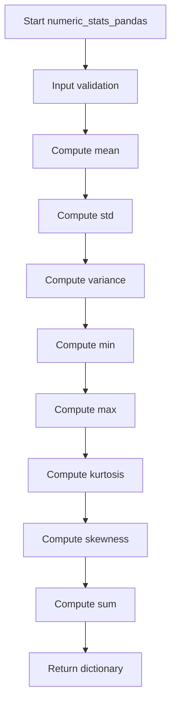
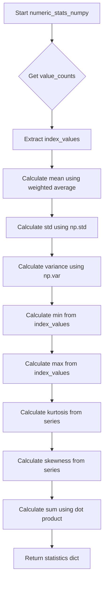
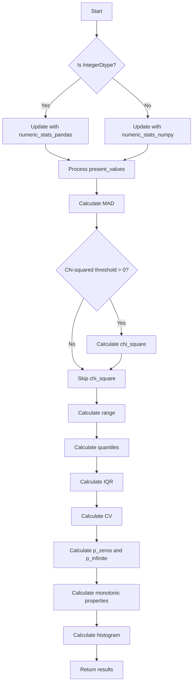

# `describe_numeric_pandas.py`

## `src.ydata_profiling.model.pandas.describe_numeric_pandas.mad` · *function*

## Summary:
Computes the Median Absolute Deviation (MAD) of a numeric array, providing a robust measure of statistical dispersion.

## Description:
This function calculates the Median Absolute Deviation, which measures the spread of a dataset by computing the median of absolute deviations from the dataset's median. It serves as a robust alternative to standard deviation that is less sensitive to outliers.

The function is typically used in data profiling contexts to provide insights about the variability of numeric data distributions while maintaining resistance to extreme values.

## Args:
    arr (np.ndarray): Input array of numeric values for which to compute the MAD

## Returns:
    np.ndarray: The computed Median Absolute Deviation as a scalar value (numpy array)

## Raises:
    None explicitly raised

## Constraints:
    Preconditions:
    - Input must be a valid numpy array of numeric values
    - Array should not be empty (though numpy handles empty arrays gracefully)
    
    Postconditions:
    - Output is always a scalar value representing the MAD
    - Result is non-negative since it's based on absolute deviations

## Side Effects:
    None

## Control Flow:
```mermaid
flowchart TD
    A[Input arr] --> B{Validate arr}
    B --> C[Compute np.median(arr)]
    C --> D[Compute arr - np.median(arr)]
    D --> E[Compute np.abs(arr - np.median(arr))]
    E --> F[Compute np.median(np.abs(arr - np.median(arr)))]
    F --> G[Return result]
```

## Examples:
```python
import numpy as np
# Basic usage
data = np.array([1, 2, 3, 4, 5])
result = mad(data)  # Returns the MAD of the array

# With potential outliers
data_with_outliers = np.array([1, 2, 3, 4, 100])
result = mad(data_with_outliers)  # Less affected by outlier than standard deviation
```

## `src.ydata_profiling.model.pandas.describe_numeric_pandas.numeric_stats_pandas` · *function*

## Summary:
Computes and returns a dictionary of basic descriptive statistics for a numeric pandas Series.

## Description:
This function calculates fundamental statistical measures for a given numeric pandas Series. It serves as a core utility in the profiling pipeline for extracting numerical characteristics from data columns. The function is designed to be lightweight and efficient, providing essential statistical information without complex processing or data transformations.

The function is typically called as part of the data profiling workflow when analyzing numeric columns in datasets. It's often used in conjunction with other statistical functions and preprocessing utilities within the ydata-profiling library's pandas-specific implementations.

## Args:
    series (pd.Series): A pandas Series containing numeric data for which statistics will be computed.

## Returns:
    dict[str, Any]: A dictionary containing the following statistical measures:
        - "mean": Arithmetic mean of the series values
        - "std": Standard deviation of the series values  
        - "variance": Variance of the series values
        - "min": Minimum value in the series
        - "max": Maximum value in the series
        - "kurtosis": Kurtosis measure of the series distribution
        - "skewness": Skewness measure of the series distribution
        - "sum": Sum of all values in the series

## Raises:
    None explicitly raised, though underlying pandas methods may raise exceptions for invalid operations (e.g., on empty series or incompatible data types).

## Constraints:
    Preconditions:
        - Input must be a valid pandas Series object
        - Series should contain numeric data for meaningful statistical computation
        - Series should not be completely empty (though pandas handles empty series gracefully)
    
    Postconditions:
        - Returns a dictionary with exactly 8 keys as specified
        - All returned values are numeric or NaN when appropriate
        - Function execution does not modify the input series

## Side Effects:
    None. The function performs no I/O operations, modifies no global state, and makes no external service calls.

## Control Flow:


## Examples:
```python
import pandas as pd
from src.ydata_profiling.model.pandas.describe_numeric_pandas import numeric_stats_pandas

# Basic usage
series = pd.Series([1, 2, 3, 4, 5])
stats = numeric_stats_pandas(series)
print(stats['mean'])  # Output: 3.0
print(stats['std'])   # Output: 1.4142135623730951

# With NaN values
series_with_nan = pd.Series([1, 2, None, 4, 5])
stats = numeric_stats_pandas(series_with_nan)
# Note: pandas automatically excludes NaN values from calculations
```

## `src.ydata_profiling.model.pandas.describe_numeric_pandas.numeric_stats_numpy` · *function*

## Summary:
Computes comprehensive numerical statistics for a pandas Series using NumPy operations.

## Description:
This function calculates various descriptive statistics for numeric data represented as a pandas Series. It leverages both value counts and direct array computations to provide accurate statistical measures while handling weighted calculations appropriately.

## Args:
    present_values (np.ndarray): Array containing the actual numeric values from the series, excluding NaN values.
    series (pd.Series): The original pandas Series object containing the numeric data.
    series_description (Dict[str, Any]): Dictionary containing metadata about the series, specifically including "value_counts_without_nan" key with value counts data.

## Returns:
    Dict[str, Any]: Dictionary containing computed statistical measures with keys:
        - "mean": Weighted average of index values from value counts
        - "std": Standard deviation of present values (sample standard deviation)
        - "variance": Variance of present values (sample variance)
        - "min": Minimum value from index values
        - "max": Maximum value from index values
        - "kurtosis": Kurtosis statistic calculated from the series
        - "skewness": Skewness statistic calculated from the series
        - "sum": Dot product of index values and value counts

## Raises:
    None explicitly raised in the function body.

## Constraints:
    Preconditions:
        - present_values must be a valid NumPy array of numeric values
        - series must be a valid pandas Series object
        - series_description must contain a "value_counts_without_nan" key with appropriate data
        - Index values from value_counts_without_nan should be compatible for arithmetic operations

    Postconditions:
        - All returned statistics are computed using appropriate sample statistics (ddof=1)
        - Statistical measures are consistent with pandas Series methods where applicable

## Side Effects:
    None.

## Control Flow:


## Examples:
```python
import numpy as np
import pandas as pd
from collections import defaultdict

# Example usage
series = pd.Series([1, 2, 2, 3, 3, 3])
series_description = {
    "value_counts_without_nan": pd.Series([1, 2, 3], index=[1, 2, 3])
}

present_values = series.dropna().values
result = numeric_stats_numpy(present_values, series, series_description)
print(result)
# Output would include: {'mean': 2.0, 'std': 0.816..., 'variance': 0.666..., ...}
```

## `src.ydata_profiling.model.pandas.describe_numeric_pandas.pandas_describe_numeric_1d` · *function*

## Summary:
Computes comprehensive descriptive statistics for a numeric pandas Series, including measures of central tendency, dispersion, shape, and special value counts.

## Description:
This function performs detailed statistical analysis on a numeric pandas Series by calculating various descriptive statistics and updating the summary dictionary with computed values. It handles both integer and regular numeric data types differently, computes advanced statistics like median absolute deviation and chi-square test, and generates histogram data for visualization.

The function is designed to be part of a larger profiling system where numeric series analysis is performed. It extracts this logic into its own function to separate concerns and make the code more modular and testable.

## Args:
    config (Settings): Configuration object containing settings for numeric variable analysis including chi-squared threshold and quantiles
    series (pd.Series): Input pandas Series containing numeric data to analyze
    summary (dict): Dictionary containing pre-computed summary statistics including value_counts_without_nan

## Returns:
    Tuple[Settings, pd.Series, dict]: Returns the unchanged config, the original series, and the updated summary dictionary with all computed statistics

## Raises:
    None explicitly raised - though underlying functions may raise exceptions

## Constraints:
    Preconditions:
    - The summary dictionary must contain "value_counts_without_nan" key
    - The series must be numeric (either regular numeric or IntegerDtype)
    - Config must have vars.num.chi_squared_threshold and vars.num.quantiles attributes
    
    Postconditions:
    - The returned summary dictionary contains all computed statistics
    - All special value counts (negative, infinite, zeros) are properly calculated and added to summary
    - Monotonicity properties are determined and stored in summary

## Side Effects:
    None - This function is pure and doesn't modify external state or perform I/O operations

## Control Flow:


## Examples:
```python
# Basic usage
config = Settings()
series = pd.Series([1, 2, 3, 4, 5])
summary = {"value_counts_without_nan": pd.Series([1, 2, 3, 4, 5], index=[1, 2, 3, 4, 5]), "n": 5, "n_distinct": 5}
config.vars.num.chi_squared_threshold = 0.05
config.vars.num.quantiles = [0.25, 0.5, 0.75]

updated_config, updated_series, updated_summary = pandas_describe_numeric_1d(config, series, summary)
```

