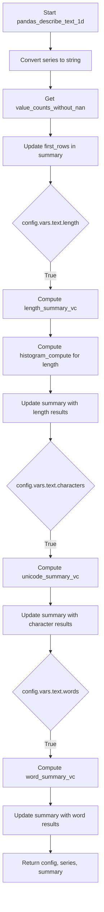

# `describe_text_pandas.py`

## `src.ydata_profiling.model.pandas.describe_text_pandas.pandas_describe_text_1d` · *function*

## Summary:
Processes and summarizes text data from a pandas Series, extracting length, character, and word statistics based on configuration settings.

## Description:
This function performs comprehensive text analysis on a pandas Series containing text data. It converts the series to string type, processes value counts, and conditionally computes various text statistics based on the configuration flags in `config.vars.text`. The function serves as a specialized data processing step in the profiling pipeline for text variables, enabling selective computation of text characteristics to optimize performance.

The function extracts text statistics such as length distributions, character type breakdowns, and word frequency counts only when their respective configuration flags are enabled. This modular approach allows for efficient profiling by avoiding unnecessary computations when certain text analyses are disabled.

## Args:
    config (Settings): Configuration object containing profiling settings, specifically `config.vars.text` flags that control which text analyses to perform.
    series (pd.Series): Input pandas Series containing text data to be analyzed.
    summary (dict): Dictionary containing existing summary statistics, including `value_counts_without_nan` which is used for text analysis.

## Returns:
    Tuple[Settings, pd.Series, dict]: A tuple containing:
    - The configuration object (potentially modified by nested function calls)
    - The processed series with all values converted to string type
    - The updated summary dictionary with additional text statistics added via .update() calls

## Raises:
    None explicitly raised by this function, though underlying helper functions may raise exceptions.

## Constraints:
    Preconditions:
    - The input `series` should be a valid pandas Series
    - The `summary` dictionary must contain a key `"value_counts_without_nan"` 
    - The `config` object must be a valid Settings instance with proper configuration structure
    
    Postconditions:
    - The returned `series` will be converted to string type
    - The `summary` dictionary will be updated with text-specific statistics based on configuration
    - The `config` remains unchanged (though the returned reference may be the same object)

## Side Effects:
    None directly observable side effects. The function modifies the input `summary` dictionary in-place via the `.update()` method calls.

## Control Flow:


## Examples:
```python
# Basic usage with default configuration
config = Settings()
series = pd.Series(['hello world', 'foo bar', 'baz'])
summary = {'value_counts_without_nan': pd.Series([1, 1, 1], index=['hello world', 'foo bar', 'baz'])}
updated_config, updated_series, updated_summary = pandas_describe_text_1d(config, series, summary)

# Usage with specific text analysis enabled/disabled
config.vars.text.length = False
config.vars.text.characters = True
config.vars.text.words = False
updated_config, updated_series, updated_summary = pandas_describe_text_1d(config, series, summary)
```

