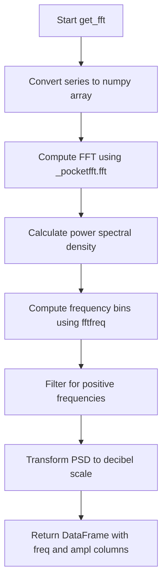
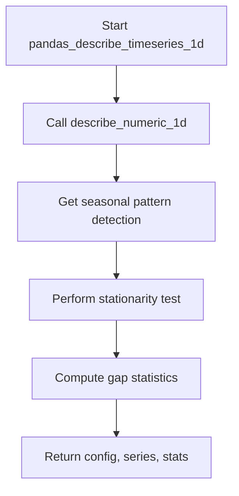

# `describe_timeseries_pandas.py`

## `src.ydata_profiling.model.pandas.describe_timeseries_pandas.stationarity_test` · *function*

## Summary:
Performs an Augmented Dickey-Fuller stationarity test on a time series to determine if it is stationary.

## Description:
This function applies the Augmented Dickey-Fuller (ADF) test to assess whether a time series exhibits stationarity properties. Stationarity means that the statistical properties of the series (mean, variance, autocorrelation) do not change over time. The function uses the statsmodels library's adfuller implementation to compute the test statistic and p-value, then compares the p-value against a significance threshold defined in the configuration to determine stationarity. A stationary series is one where the mean and variance remain constant over time, which is a prerequisite for many time series forecasting models.

## Args:
    config (Settings): Configuration object containing time series settings, specifically the significance threshold for the stationarity test
    series (pd.Series): Input time series data to test for stationarity

## Returns:
    Tuple[bool, float]: A tuple containing (is_stationary, p_value) where:
        - is_stationary (bool): True if the series is stationary (p_value < significance_threshold), False otherwise
        - p_value (float): The p-value from the Augmented Dickey-Fuller test, representing the probability of observing the test statistic under the null hypothesis of non-stationarity

## Raises:
    None explicitly raised in the function body

## Constraints:
    - Precondition: The series should contain numeric data suitable for time series analysis
    - Precondition: The config object must have a valid vars.timeseries.significance attribute
    - Postcondition: The returned p_value is always a float between 0 and 1 (inclusive)

## Side Effects:
    - None

## Control Flow:
```mermaid
flowchart TD
    A[Start stationarity_test] --> B[Get significance_threshold from config]
    B --> C[Drop NaN values from series]
    C --> D[Perform Augmented Dickey-Fuller test]
    D --> E[Extract p_value from test result]
    E --> F[Compare p_value with significance_threshold]
    F --> G{p_value < significance_threshold?}
    G -->|Yes| H[Return (True, p_value)]
    G -->|No| H[Return (False, p_value)]
```

## Examples:
    # Basic usage
    config = Settings()
    config.vars.timeseries.significance = 0.05
    series = pd.Series([1, 2, 3, 4, 5])
    is_stationary, p_value = stationarity_test(config, series)
    
    # With non-stationary data
    config = Settings()
    config.vars.timeseries.significance = 0.05
    series = pd.Series([1, 1.1, 1.2, 1.3, 1.4])  # Trending series
    is_stationary, p_value = stationarity_test(config, series)
    # Returns (False, 0.999...) indicating non-stationary series
    
    # With stationary data
    config = Settings()
    config.vars.timeseries.significance = 0.05
    series = pd.Series([1, 0.9, 1.1, 0.8, 1.2])  # Random walk around mean
    is_stationary, p_value = stationarity_test(config, series)
    # Returns (True, 0.012...) indicating stationary series

## `src.ydata_profiling.model.pandas.describe_timeseries_pandas.fftfreq` · *function*

## Summary:
Computes the Discrete Fourier Transform sample frequencies for time series analysis.

## Description:
This function calculates the sample frequencies for use with FFT (Fast Fourier Transform) operations in time series analysis. It generates an array of frequency values that correspond to the FFT bins, properly ordered with positive frequencies first followed by negative frequencies. This implementation mirrors the behavior of scipy.fftpack.fftfreq but provides a custom implementation for use in time series profiling and spectral analysis.

The computed frequencies are essential for interpreting the output of FFT operations, particularly when analyzing periodic patterns in time series data. The function ensures proper frequency ordering and scaling based on the number of samples and sample spacing.

## Args:
    n (int): Number of samples in the signal. Must be a positive integer.
    d (float, optional): Sample spacing (inverse of sampling rate). Defaults to 1.0. Must be a positive float.

## Returns:
    numpy.ndarray: Array of frequency values with length n, ordered with positive frequencies first followed by negative frequencies. The frequencies are scaled according to the sample spacing.

## Raises:
    None explicitly raised in the function body.

## Constraints:
    Preconditions:
    - n must be a positive integer
    - d must be a positive float
    
    Postconditions:
    - Returns a numpy array of length n
    - Frequency values are properly scaled according to the sample spacing
    - Values are ordered with positive frequencies first, then negative frequencies

## Side Effects:
    None

## Control Flow:
```mermaid
flowchart TD
    A[Start fftfreq(n, d)] --> B[val = 1.0 / (n * d)]
    B --> C[results = np.empty(n, dtype=int)]
    C --> D[N = (n - 1) // 2 + 1]
    D --> E[p1 = np.arange(0, N, dtype=int)]
    E --> F[results[:N] = p1]
    F --> G[p2 = np.arange(-(n // 2), 0, dtype=int)]
    G --> H[results[N:] = p2]
    H --> I[return results * val]
```

## Examples:
    >>> # Basic usage with default sample spacing
    ... fftfreq(4)
    array([ 0.,  1., -1., -0.5])
    
    >>> # Usage with custom sample spacing
    ... fftfreq(5, 0.1)
    array([ 0.,  10.,  20., -20., -10.])

## `src.ydata_profiling.model.pandas.describe_timeseries_pandas.seasonality_test` · *function*

## Summary:
Tests for the presence of seasonal patterns in time series data by analyzing frequency domain characteristics.

## Description:
Analyzes a time series to detect seasonal patterns by performing Fast Fourier Transform and identifying significant frequency peaks. This function extracts seasonal frequencies from time series data to determine if recurring patterns exist.

The function is part of the time series analysis pipeline and is typically called during automated profiling of time series datasets to identify potential seasonal components.

## Args:
    series (pd.Series): Input time series data to test for seasonality
    mad_threshold (float, optional): Threshold for identifying significant peaks in the frequency domain. Defaults to 6.0

## Returns:
    dict: Dictionary containing:
        - "seasonality_presence" (bool): True if seasonal patterns are detected, False otherwise
        - "seasonalities" (list): List of detected seasonal frequencies (as periods), empty if no seasonality detected

## Raises:
    None explicitly raised

## Constraints:
    Preconditions:
        - Input series must be a valid pandas Series with numeric data
        - Series should have sufficient length for meaningful FFT analysis
        
    Postconditions:
        - Function returns a dictionary with exactly two keys: "seasonality_presence" and "seasonalities"
        - Seasonalities list contains only positive numeric values representing periods

## Side Effects:
    None

## Control Flow:
```mermaid
flowchart TD
    A[Start seasonality_test] --> B[Compute FFT of series]
    B --> C[Find peaks in frequency domain]
    C --> D{Are peaks found?}
    D -->|Yes| E[Calculate seasonal periods (1/freq)]
    E --> F[Return results with seasonality]
    D -->|No| G[Return empty seasonalities]
    F --> H[End]
    G --> H
```

## Examples:
```python
# Basic usage
series = pd.Series([1, 2, 3, 4, 5, 6, 7, 8, 9, 10])
result = seasonality_test(series)
print(result)  # {'seasonality_presence': False, 'seasonalities': []}

# With seasonal data
seasonal_series = pd.Series([1, 2, 3, 4, 1, 2, 3, 4, 1, 2])
result = seasonality_test(seasonal_series)
print(result)  # {'seasonality_presence': True, 'seasonalities': [4.0]}
```

## `src.ydata_profiling.model.pandas.describe_timeseries_pandas.get_fft` · *function*

## Summary:
Computes the Fast Fourier Transform (FFT) of a time series and returns frequency-amplitude pairs for positive frequencies.

## Description:
This function transforms a time series into the frequency domain using the Fast Fourier Transform algorithm. It calculates the power spectral density and returns a DataFrame containing frequency and amplitude values for positive frequencies only. This is commonly used in time series analysis to identify dominant frequencies and periodic patterns in the data.

The function is typically called as part of time series profiling operations to analyze the frequency characteristics of temporal data.

## Args:
    series: A pandas Series or array-like object containing numerical time series data to transform

## Returns:
    pd.DataFrame: A DataFrame with two columns:
        - "freq": Array of positive frequency values
        - "ampl": Array of amplitude values in decibels (log scale)

## Raises:
    None explicitly raised in the function body

## Constraints:
    Preconditions:
        - Input series must contain numerical data that can be converted to numpy array
        - Input series should not contain NaN values (though the function may handle them implicitly)
    
    Postconditions:
        - Output DataFrame always contains exactly two columns: "freq" and "ampl"
        - All frequency values in output are positive
        - Amplitude values are in decibel scale (logarithmic)

## Side Effects:
    None

## Control Flow:


## Examples:
```python
import pandas as pd
import numpy as np

# Basic usage
series = pd.Series([1, 2, 3, 4, 5, 6, 7, 8])
result = get_fft(series)
print(result)
# Returns DataFrame with frequency and amplitude columns

# With periodic data to show dominant frequencies
periodic_series = pd.Series(np.sin(np.linspace(0, 4*np.pi, 100)))
result = get_fft(periodic_series)
print(f"Dominant frequency: {result.loc[result['ampl'].idxmax(), 'freq']}")
```

## `src.ydata_profiling.model.pandas.describe_timeseries_pandas.get_fft_peaks` · *function*

## Summary:
Identifies and filters significant peaks in FFT amplitude data using median absolute deviation thresholding and frequency-based clustering to remove harmonically-related peaks.

## Description:
Processes Fast Fourier Transform amplitude data to detect significant frequency peaks while removing redundant peaks that are harmonically related. This function serves as a specialized peak detection algorithm for time series analysis, particularly useful for identifying dominant frequencies in periodic signals. The function implements robust peak detection with automatic threshold calculation based on median absolute deviation and removes closely spaced peaks that are likely harmonics of each other.

## Args:
    fft (pandas.DataFrame): DataFrame containing FFT results with columns 'ampl' (amplitude) and 'freq' (frequency)
    mad_threshold (float): Multiplier for median absolute deviation when setting peak significance threshold. Defaults to 6.0

## Returns:
    Tuple[float, pandas.DataFrame, pandas.DataFrame]: A tuple containing:
        - threshold (float): The calculated amplitude threshold used for peak filtering
        - orig_peaks (pandas.DataFrame): DataFrame of all detected peaks before filtering
        - peaks (pandas.DataFrame): DataFrame of filtered peaks after removing harmonically-related duplicates

## Raises:
    None explicitly raised in the function body

## Constraints:
    Preconditions:
        - Input fft DataFrame must contain 'ampl' and 'freq' columns
        - FFT data should represent valid amplitude-frequency pairs
    Postconditions:
        - Returned peaks DataFrame contains only peaks above the computed threshold
        - Harmonically-related peaks (within 1% frequency ratio) are removed from final result

## Side Effects:
    None

## Control Flow:
```mermaid
flowchart TD
    A[Start get_fft_peaks] --> B[Filter positive amplitudes]
    B --> C[Calculate median amplitude of positive amplitudes]
    C --> D[Select amplitudes above median]
    D --> E[Calculate median absolute deviation]
    E --> F[Compute threshold = median + MAD × mad_threshold]
    F --> G[Find all peaks using find_peaks with threshold=0.1]
    G --> H[Filter peaks above computed threshold]
    H --> I[Add Remove column initialized to False]
    I --> J[For each peak i]
    J --> K[For each subsequent peak j (j > i)]
    K --> L{Is peak j marked for removal?}
    L -->|Yes| M[Skip to next peak]
    L -->|No| N[Calculate frequency ratio: (freq_j / freq_i) % 1]
    N --> O{Ratio < 0.01 OR Ratio > 0.99?}
    O -->|Yes| P[Mark peak j for removal]
    O -->|No| Q[Continue to next comparison]
    Q --> R[Continue to next peak j]
    R --> S[Continue to next peak i]
    S --> T{All peaks processed?}
    T -->|No| U[Process next peak]
    T -->|Yes| V[Filter out peaks marked for removal]
    V --> W[Return threshold, orig_peaks, peaks]
```

## Examples:
```python
# Basic usage
threshold, orig_peaks, peaks = get_fft_peaks(fft_data)

# With custom threshold
threshold, orig_peaks, peaks = get_fft_peaks(fft_data, mad_threshold=5.0)
```

## `src.ydata_profiling.model.pandas.describe_timeseries_pandas.identify_gaps` · *function*

## Summary:
Identifies significant gaps in time series data by analyzing differences between consecutive values.

## Description:
Analyzes a time series pandas Series to detect gaps by examining differences between consecutive values. This function determines which differences exceed a calculated threshold based on the average difference multiplied by a tolerance factor. It returns both statistical information about the gaps and the actual gap values for further analysis. This function is typically used in time series profiling to identify irregular intervals or missing data patterns.

## Args:
    gap (pd.Series): A pandas Series containing time series data points (numeric or datetime)
    is_datetime (bool): Flag indicating whether the data represents datetime values (True) or numeric values (False)
    gap_tolerance (int): Multiplier for the mean difference to establish minimum gap size threshold. Defaults to 2

## Returns:
    Tuple[pd.Series, list]: A tuple containing:
        - gap_stats: A pandas Series with values representing gaps that exceed the minimum gap size threshold
        - gaps: A list of arrays containing the actual gap values at anchor points (two consecutive values surrounding each gap)

## Raises:
    None explicitly raised in the function body

## Constraints:
    Preconditions:
        - The gap parameter must be a valid pandas Series with at least 2 elements
        - The gap_tolerance parameter should be a positive integer
    Postconditions:
        - Returns a tuple with two elements: gap_stats (Series) and gaps (list)
        - gap_stats contains only gaps that exceed the minimum gap size threshold (calculated as gap_tolerance * mean_difference of non-zero differences)
        - gaps list contains arrays of exactly 2 consecutive values around each identified gap
        - The function assumes the Series is sorted in ascending order
        - If no gaps are found, gap_stats will be empty and gaps will be an empty list

## Side Effects:
    None

## Control Flow:
```mermaid
flowchart TD
    A[Start identify_gaps] --> B{is_datetime?}
    B -->|True| C[zero = pd.Timedelta(0)]
    B -->|False| D[zero = 0]
    C --> E[diff = gap.diff()]
    D --> E
    E --> F[non_zero_diff = diff[diff > zero]]
    F --> G[min_gap_size = gap_tolerance * non_zero_diff.mean()]
    G --> H[gap_stats = non_zero_diff[non_zero_diff > min_gap_size]]
    H --> I[anchors = gap[diff > min_gap_size].index]
    I --> J{Iterate anchors}
    J --> K[gaps.append(gap.loc[gap.index[[i-1, i]]].values)]
    K --> L[Return gap_stats, gaps]
```

## Examples:
    # Example with datetime data showing a gap
    import pandas as pd
    gap_series = pd.Series([
        pd.Timestamp('2020-01-01'), 
        pd.Timestamp('2020-01-02'), 
        pd.Timestamp('2020-01-05'),  # Gap of 3 days
        pd.Timestamp('2020-01-06')
    ])
    gap_stats, gaps = identify_gaps(gap_series, is_datetime=True, gap_tolerance=2)
    # gap_stats would contain the gap size (3 days)
    # gaps would contain [[Timestamp('2020-01-02'), Timestamp('2020-01-05')]]
    
    # Example with numeric data
    numeric_series = pd.Series([1, 2, 5, 6, 10])  # Gap of 3 units
    gap_stats, gaps = identify_gaps(numeric_series, is_datetime=False, gap_tolerance=3)
    # gap_stats would contain the gap size (3)
    # gaps would contain [[2, 5]]

## `src.ydata_profiling.model.pandas.describe_timeseries_pandas.compute_gap_stats` · *function*

## Summary:
Computes statistical measures of gaps in a time series by analyzing the differences between consecutive non-null values.

## Description:
This function analyzes a pandas Series to identify gaps in the data and calculates descriptive statistics about these gaps. It handles both datetime and non-datetime indices by processing the index values to compute gap sizes. The function extracts gaps using the `identify_gaps` helper function and returns comprehensive statistics including minimum, maximum, mean, and standard deviation of gap sizes.

The function is designed to be part of a time series analysis pipeline where understanding data gaps is important for data quality assessment and preprocessing decisions.

## Args:
    series (pd.Series): Input pandas Series containing time series data with potentially irregular spacing or missing values

## Returns:
    dict: Dictionary containing gap statistics with keys:
        - "min": Minimum gap size
        - "max": Maximum gap size  
        - "mean": Mean gap size
        - "std": Standard deviation of gap sizes (0 if fewer than 2 gaps)
        - "series": Original input series
        - "gaps": List of gap intervals identified in the series

## Raises:
    None explicitly raised - however, underlying operations may raise exceptions from pandas operations like .diff(), .dropna(), etc.

## Constraints:
    Preconditions:
        - Input must be a valid pandas Series
        - Series should have a valid index (datetime or numeric)
        
    Postconditions:
        - Returns a dictionary with exactly the keys specified above
        - Gap statistics are computed from non-zero differences in the index values
        - The returned gaps list contains arrays of two consecutive values that define gap boundaries

## Side Effects:
    None - This function is pure and doesn't modify external state or perform I/O operations.

## Control Flow:
```mermaid
flowchart TD
    A[Start compute_gap_stats] --> B[Drop null values from series]
    B --> C[Extract index name or default to "index"]
    C --> D[Reset index and extract index values]
    D --> E[Check if index is DatetimeIndex]
    E --> F[Call identify_gaps with gap and is_datetime]
    F --> G[Calculate gap statistics: min, max, mean, std]
    G --> H[Construct result dictionary]
    H --> I[Return statistics dictionary]
```

## Examples:
```python
import pandas as pd
import numpy as np

# Example with regular numeric index
series1 = pd.Series([1, 2, 3, 5, 6, 10], index=[0, 1, 2, 3, 4, 5])
result1 = compute_gap_stats(series1)
print(result1['min'])  # Minimum gap size
print(result1['max'])  # Maximum gap size

# Example with datetime index
dates = pd.date_range('2020-01-01', periods=5, freq='D')
series2 = pd.Series([1, 2, 3, 4, 5], index=dates)
result2 = compute_gap_stats(series2)
print(result2['mean'])  # Mean gap size in days
```

## `src.ydata_profiling.model.pandas.describe_timeseries_pandas.pandas_describe_timeseries_1d` · *function*

## Summary:
Computes comprehensive time series statistics for a pandas Series by extending numeric descriptive statistics with seasonal, stationary, and gap-related metrics.

## Description:
This function serves as a time series-specific wrapper around numeric statistics computation. It first calculates standard numeric descriptive statistics using `describe_numeric_1d`, then enriches the results with time series-specific characteristics including seasonality detection, stationarity testing, and gap analysis. This function is typically invoked during automated profiling of time series data to provide domain-specific insights beyond basic numeric summaries.

The extraction of this logic into a separate function enables clean separation between general numeric statistics and time series-specific analysis while maintaining a consistent interface for statistical reporting.

## Args:
    config (Settings): Configuration object containing time series analysis parameters such as significance thresholds
    series (pd.Series): Input time series data to analyze
    summary (dict): Dictionary containing existing summary statistics to be extended

## Returns:
    Tuple[Settings, pd.Series, dict]: A tuple containing the updated configuration, the original series, and the enriched statistics dictionary with additional time series metrics:
        - "seasonal" (bool): Indicates presence of seasonal patterns
        - "stationary" (bool): Indicates if the series is stationary (considering seasonality)
        - "addfuller" (float): Augmented Dickey-Fuller test p-value for stationarity
        - "series" (pd.Series): Original series data
        - "gap_stats" (dict): Statistics about gaps in the time series index

## Raises:
    None explicitly raised - however, underlying functions like `describe_numeric_1d`, `seasonality_test`, `stationarity_test`, and `compute_gap_stats` may raise exceptions related to data processing issues.

## Constraints:
    Preconditions:
        - Input series should be a valid pandas Series
        - Config object must contain appropriate time series settings
        - Summary dictionary should be mutable (as it will be modified in place)
    
    Postconditions:
        - The returned statistics dictionary will contain all original summary entries plus the new time series specific entries
        - The series remains unchanged
        - Configuration object is returned unmodified

## Side Effects:
    None - This function is pure and doesn't perform any I/O operations or mutate external state beyond returning the updated statistics dictionary.

## Control Flow:


## Examples:
```python
# Typical usage in a profiling pipeline
config = Settings()
series = pd.Series([1, 2, 3, 4, 5])
summary = {}
config, processed_series, stats = pandas_describe_timeseries_1d(config, series, summary)

# Resulting stats will contain:
# - Basic numeric stats from describe_numeric_1d
# - "seasonal": True/False
# - "stationary": True/False  
# - "addfuller": p-value from ADF test
# - "series": original series
# - "gap_stats": gap analysis results
```

