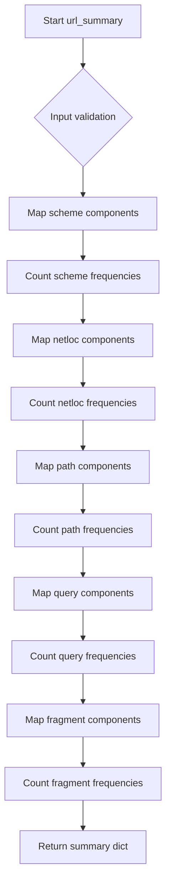
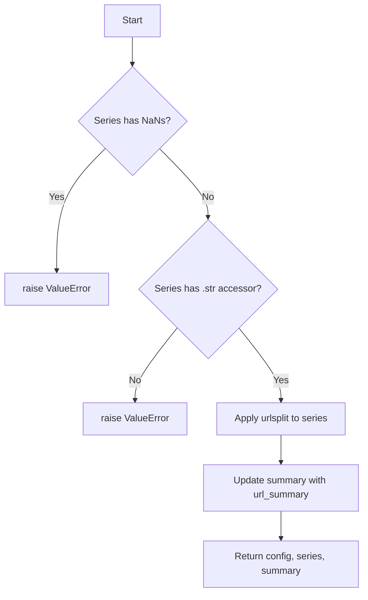

# `describe_url_pandas.py`

## `src.ydata_profiling.model.pandas.describe_url_pandas.url_summary` · *function*

## Summary:
Extracts and counts URL component distributions from a pandas Series of URL objects.

## Description:
Processes a pandas Series containing URL objects (parsed via urlsplit) to compute frequency counts for each URL component: scheme, network location, path, query string, and fragment identifier. This function serves as a utility for URL analysis in data profiling workflows.

## Args:
    series (pd.Series): A pandas Series containing URL objects parsed by urllib.parse.urlsplit. Each element should have scheme, netloc, path, query, and fragment attributes.

## Returns:
    dict: A dictionary containing five keys with pandas Series values representing count distributions:
        - "scheme_counts": Value counts of URL schemes (e.g., 'http', 'https')
        - "netloc_counts": Value counts of network locations (domain names)
        - "path_counts": Value counts of URL paths
        - "query_counts": Value counts of query strings
        - "fragment_counts": Value counts of fragment identifiers

## Raises:
    AttributeError: When elements in the series do not have scheme, netloc, path, query, or fragment attributes.

## Constraints:
    Preconditions:
        - Input series must contain URL objects with scheme, netloc, path, query, and fragment attributes
        - All elements in the series should be consistently formatted URL objects
    
    Postconditions:
        - Returns a dictionary with exactly five keys matching the URL component names
        - Each value is a pandas Series with integer counts

## Side Effects:
    None

## Control Flow:


## Examples:
```python
# Basic usage with parsed URLs
from urllib.parse import urlsplit
import pandas as pd

urls = [
    urlsplit('https://example.com/path?query=value#section'),
    urlsplit('http://example.com/path?query=value'),
    urlsplit('https://example.com/other')
]
series = pd.Series(urls)
result = url_summary(series)
print(result['scheme_counts'])
# Output: https    2
#         http     1
```

## `src.ydata_profiling.model.pandas.describe_url_pandas.pandas_describe_url_1d` · *function*

## Summary
Processes a pandas Series of URLs to extract and summarize URL components for data profiling.

## Description
Analyzes a pandas Series containing URL strings by parsing each URL into its constituent parts using `urlsplit` and computes frequency counts for various URL components. This function serves as a specialized data processing step in the profiling pipeline for URL-type data.

## Args
- config (Settings): Configuration settings for the profiling process
- series (pd.Series): Pandas Series containing URL strings to analyze
- summary (dict): Dictionary to accumulate summary statistics for URL analysis

## Returns
- Tuple[Settings, pd.Series, dict]: The unchanged config, processed series with parsed URL objects, and updated summary dictionary

## Raises
- ValueError: When the input series contains NaN values or lacks a string accessor (.str)

## Constraints
- Preconditions: Input series must not contain NaN values and must support string operations via .str accessor
- Postconditions: The series will contain parsed URL objects from `urlsplit`, and summary will include URL component frequency counts

## Side Effects
- Modifies the input summary dictionary by updating it with URL component counts
- No external I/O operations or state mutations beyond updating the summary

## Control Flow


## Examples
```python
# Basic usage in profiling context
config = Settings()
series = pd.Series(['https://example.com/path?query=value', 'http://test.org'])
summary = {}
config, processed_series, summary = pandas_describe_url_1d(config, series, summary)
```

