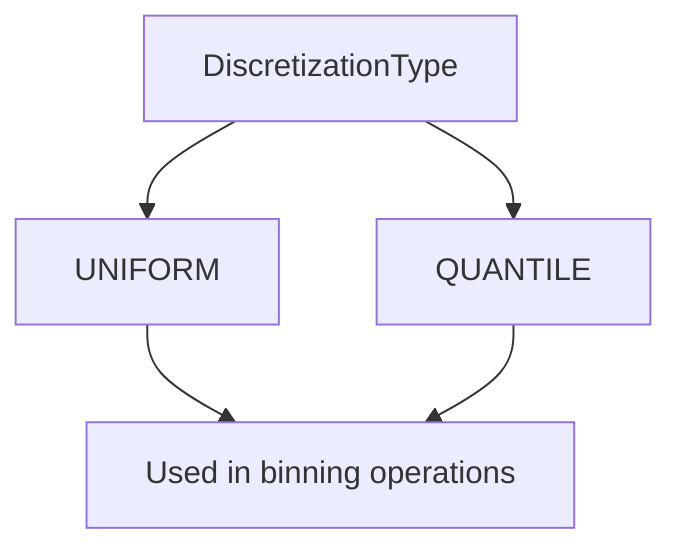
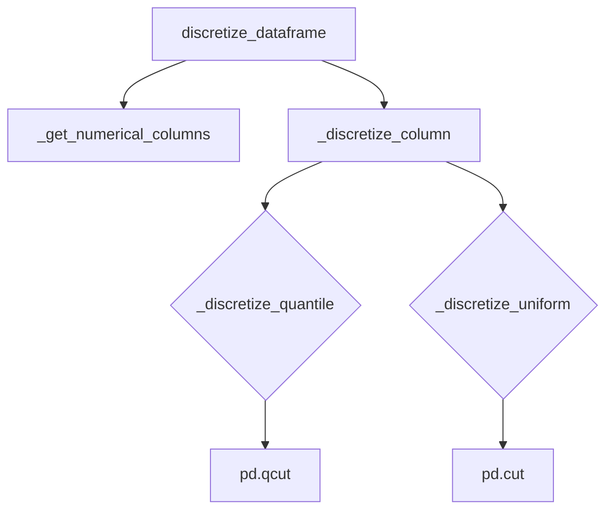

# `discretize_pandas.py`

## `src.ydata_profiling.model.pandas.discretize_pandas.DiscretizationType` · *class*

## Summary:
An enumeration defining discretization methods for converting continuous data into discrete bins.

## Description:
The DiscretizationType enum provides a standardized way to specify different discretization approaches when transforming continuous numerical data into categorical bins. This enum is used throughout the profiling system to determine how numeric columns should be binned for analysis and visualization purposes. The two available discretization methods are uniform binning and quantile-based binning.

## State:
- UNIFORM: Represents uniform discretization where bins have equal width intervals
- QUANTILE: Represents quantile-based discretization where bins contain approximately equal numbers of observations

## Lifecycle:
- Creation: Instances are created automatically when accessing enum members (UNIFORM or QUANTILE)
- Usage: Used as a parameter type in functions and methods that require discretization method specification
- Destruction: Managed automatically by Python's garbage collection

## Method Map:


## Raises:
This enum does not raise exceptions during instantiation or usage. All valid values are predefined constants.

## Example:
```python
from src.ydata_profiling.model.pandas.discretize_pandas import DiscretizationType

# Using the enum values
method1 = DiscretizationType.UNIFORM
method2 = DiscretizationType.QUANTILE

# Enum values can be compared
if method1 == DiscretizationType.UNIFORM:
    print("Using uniform discretization")

# Enum values can be used in function calls
def apply_discretization(data, method):
    if method == DiscretizationType.UNIFORM:
        # Apply uniform binning
        pass
    elif method == DiscretizationType.QUANTILE:
        # Apply quantile binning
        pass
```

## `src.ydata_profiling.model.pandas.discretize_pandas.Discretizer` · *class*

## Summary:
A class that discretizes numerical columns in pandas DataFrames using either quantile or uniform binning methods.

## Description:
The Discretizer class converts continuous numerical data into discrete bins. It supports two discretization strategies: quantile-based binning (where each bin contains approximately the same number of observations) and uniform binning (where bins have equal width ranges). This transformation is commonly used in data preprocessing for creating categorical features from continuous variables.

This class is typically used by profiling components that need to transform numerical data into binned form for analysis or visualization purposes. It requires a DiscretizationType enum with QUANTILE and UNIFORM values to specify the discretization method.

## State:
- discretization_type: DiscretizationType enum value indicating the discretization method (expected to be QUANTILE or UNIFORM)
- n_bins: int, number of bins to create for discretization (default: 10, must be > 0)
- reset_index: bool, whether to reset the DataFrame index after discretization (default: False)

## Lifecycle:
- Creation: Instantiate with a DiscretizationType method, optional n_bins (default 10), and optional reset_index (default False)
- Usage: Call discretize_dataframe() method with a pandas DataFrame to process it
- Destruction: No special cleanup required; standard Python garbage collection applies

## Method Map:


## Raises:
- TypeError: If the input dataframe is not a pandas DataFrame or if discretization_type is not a valid DiscretizationType enum value
- ValueError: If n_bins is less than or equal to 0, or if there are insufficient data points for quantile discretization
- AttributeError: If DiscretizationType enum values are not properly defined

## Example:
```python
# Assuming DiscretizationType enum with QUANTILE and UNIFORM values exists
discretizer = Discretizer(DiscretizationType.QUANTILE, n_bins=5, reset_index=True)
result_df = discretizer.discretize_dataframe(your_dataframe)
```

### `src.ydata_profiling.model.pandas.discretize_pandas.Discretizer.__init__` · *method*

## Summary:
Initializes a discretizer with specified discretization method, number of bins, and index reset behavior.

## Description:
Configures the discretizer instance with the discretization approach, bin count, and index handling preferences. This constructor prepares the object for discretizing numerical data in pandas DataFrames according to the specified parameters.

## Args:
    method (DiscretizationType): The discretization method to use (e.g., quantile or uniform binning)
    n_bins (int): Number of bins to create during discretization. Defaults to 10
    reset_index (bool): Whether to reset the DataFrame index after discretization. Defaults to False

## Returns:
    None: This method initializes instance attributes and does not return a value

## Raises:
    None: This method does not explicitly raise exceptions

## State Changes:
    Attributes READ: None
    Attributes WRITTEN: 
    - self.discretization_type: Stores the discretization method
    - self.n_bins: Stores the number of bins for discretization
    - self.reset_index: Stores the index reset preference

## Constraints:
    Preconditions:
    - The method parameter must be a valid DiscretizationType enum value
    - n_bins must be a positive integer
    
    Postconditions:
    - All instance attributes are properly initialized with provided values
    - The object is ready to be used for discretization operations

## Side Effects:
    None: This method performs no I/O operations or external service calls

### `src.ydata_profiling.model.pandas.discretize_pandas.Discretizer.discretize_dataframe` · *method*

## Summary:
Discretizes numerical columns in a DataFrame using either quantile or uniform binning while preserving non-numerical columns and maintaining the original column order.

## Description:
This method transforms numerical columns in the input DataFrame into discrete bins based on the discretization type configured in the Discretizer instance. It identifies numerical columns using pandas' select_dtypes method, applies the appropriate discretization technique (quantile or uniform), and returns a new DataFrame with the same structure but discretized numerical columns. The method preserves all non-numerical columns unchanged and maintains the original column ordering.

## Args:
    dataframe (pd.DataFrame): Input DataFrame containing mixed data types to be discretized

## Returns:
    pd.DataFrame: A new DataFrame with numerical columns discretized according to the configured method and number of bins

## Raises:
    None explicitly raised, but may raise exceptions from underlying pandas operations (pd.qcut, pd.cut) if invalid parameters are passed

## State Changes:
    Attributes READ: self.discretization_type, self.n_bins, self.reset_index
    Attributes WRITTEN: None

## Constraints:
    Preconditions:
    - Input dataframe must be a valid pandas DataFrame
    - Discretizer must be properly initialized with valid discretization_type and n_bins
    - DiscretizationType must be either QUANTILE or UNIFORM
    
    Postconditions:
    - Output DataFrame contains the same columns as input DataFrame
    - Numerical columns are converted to discrete bin indices
    - Non-numerical columns remain unchanged
    - Column order is preserved
    - Index handling follows reset_index configuration

## Side Effects:
    None - This method is pure and does not mutate the input DataFrame or cause external I/O operations

### `src.ydata_profiling.model.pandas.discretize_pandas.Discretizer._discretize_column` · *method*

## Summary:
Discretizes a pandas Series according to the configured discretization method (quantile or uniform binning).

## Description:
This private method serves as the main entry point for column discretization within the Discretizer class. It determines whether to apply quantile-based or uniform binning discretization based on the configured discretization type. The method delegates to specialized helper methods that perform the actual discretization operations.

The method is called during the dataframe discretization process by the `discretize_dataframe` method, which iterates through numerical columns and applies this method to each.

## Args:
    column (pd.Series): The pandas Series to be discretized

## Returns:
    pd.Series: A discretized pandas Series with integer bin labels representing the discretized values

## Raises:
    None explicitly raised - relies on underlying pandas functions which may raise exceptions for invalid inputs

## State Changes:
    Attributes READ: self.discretization_type, self.n_bins
    Attributes WRITTEN: None

## Constraints:
    Preconditions:
        - The column parameter must be a valid pandas Series
        - The discretization_type must be either DiscretizationType.QUANTILE or DiscretizationType.UNIFORM
        - The n_bins attribute must be a positive integer
    
    Postconditions:
        - Returns a pandas Series with the same length as the input column
        - All values in the returned series are integers representing bin indices

## Side Effects:
    None - This method is pure and doesn't cause any I/O or external service calls

### `src.ydata_profiling.model.pandas.discretize_pandas.Discretizer._descritize_quantile` · *method*

## Summary:
Converts a continuous numerical column into discrete quantile-based bins.

## Description:
This method applies quantile-based discretization to transform continuous numerical data into categorical bins. It divides the data into equally-sized groups based on rank order, ensuring each bin contains approximately the same number of observations. This method is called during the discretization process when the discretization type is set to QUANTILE.

The method is part of the Discretizer class's pipeline for converting numerical columns to discrete bins. It's invoked by the `_discretize_column` method when the discretization type is QUANTILE.

## Args:
    column (pd.Series): A pandas Series containing numerical data to be discretized into quantile bins.

## Returns:
    pd.Series: A pandas Series of integers representing the bin indices for each value in the input column. Values range from 0 to n_bins-1, where n_bins is determined by the Discretizer's n_bins attribute.

## Raises:
    None explicitly raised, though pandas qcut may raise exceptions for edge cases such as insufficient data or invalid parameters.

## State Changes:
    Attributes READ: self.n_bins
    Attributes WRITTEN: None

## Constraints:
    Preconditions:
    - The input column must contain numerical data
    - The Discretizer instance must have been initialized with a valid n_bins value (typically > 0)
    - The discretization_type of the Discretizer must be set to QUANTILE for this method to be called
    
    Postconditions:
    - The returned Series will have the same length as the input column
    - Each value in the returned Series will be an integer between 0 and n_bins-1
    - Values in the same bin will have identical bin indices

## Side Effects:
    None - This method is pure and doesn't cause any I/O operations or external service calls.

### `src.ydata_profiling.model.pandas.discretize_pandas.Discretizer._descritize_uniform` · *method*

## Summary:
Converts a continuous numerical column into discrete uniform bins by assigning each value to its corresponding bin index.

## Description:
This method performs uniform discretization on a pandas Series by dividing the data range into equally-sized bins and mapping each value to its bin index. It is used internally by the Discretizer class when the discretization type is set to UNIFORM.

The method is called from `_discretize_column` during the discretization process of numerical columns in a DataFrame.

## Args:
    column (pd.Series): A pandas Series containing numerical data to be discretized

## Returns:
    pd.Series: A pandas Series of integers representing the bin indices for each value in the input column. Values are assigned to bins such that each bin contains approximately equal ranges of data.

## Raises:
    None explicitly raised - however, underlying pandas operations may raise exceptions for invalid inputs

## State Changes:
    Attributes READ: self.n_bins
    Attributes WRITTEN: None

## Constraints:
    Preconditions:
        - Input column must be a valid pandas Series with numerical data
        - self.n_bins must be a positive integer
    Postconditions:
        - Output Series has same length as input column
        - Output values are integers in range [0, n_bins-1]
        - Values that cannot be binned due to duplicates are handled according to pandas duplicates="drop" parameter

## Side Effects:
    None - this method is pure and does not cause any I/O or external service calls

### `src.ydata_profiling.model.pandas.discretize_pandas.Discretizer._get_numerical_columns` · *method*

## Summary:
Returns a list of column names from a DataFrame that contain numerical data types.

## Description:
This method filters the provided DataFrame to identify columns with numerical data types (integers, floats, etc.) and returns their column names as a list. It is used internally by the Discretizer class to determine which columns require discretization operations.

The method leverages pandas' `select_dtypes` functionality with `include=np.number` to identify numerical columns, which includes all numeric data types supported by NumPy.

## Args:
    dataframe (pd.DataFrame): The input DataFrame to analyze for numerical columns

## Returns:
    List[str]: A list of column names that contain numerical data types

## Raises:
    None explicitly raised

## State Changes:
    Attributes READ: None
    Attributes WRITTEN: None

## Constraints:
    Preconditions: The input dataframe parameter must be a valid pandas DataFrame
    Postconditions: The returned list contains only column names that exist in the input DataFrame and have numerical data types

## Side Effects:
    None

