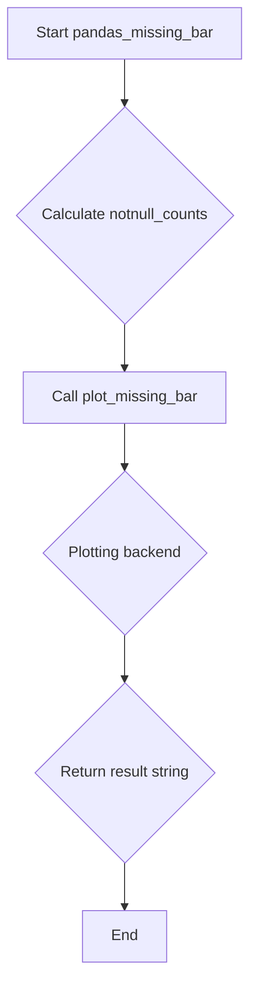

# `missing_pandas.py`

## `src.ydata_profiling.model.pandas.missing_pandas.pandas_missing_bar` · *function*

## Summary:
Generates a bar chart visualization showing the count of non-null values for each column in a DataFrame, used for missing data analysis.

## Description:
This function computes the count of non-null values for each column in the provided DataFrame and generates a bar chart visualization using the plotting backend. It serves as a pandas-specific implementation that bridges the data processing layer with the visualization layer for missing data reporting.

The function extracts the missing data analysis logic into its own component to maintain clean separation between data computation and visualization concerns. This allows for easier testing, reuse, and extension of the missing data visualization capabilities while keeping the pandas-specific implementation details isolated.

## Args:
    config (Settings): Configuration object containing visualization settings and preferences
    df (pandas.DataFrame): Input DataFrame containing the data to analyze for missing values

## Returns:
    str: String representation of the generated visualization image (either inline base64 encoded or file path depending on configuration)

## Raises:
    None explicitly raised by this function

## Constraints:
    Preconditions:
    - config must be a valid Settings object with proper visualization configuration
    - df must be a valid pandas DataFrame
    
    Postconditions:
    - Returns a string representing the generated visualization
    - The returned string can be used to display or save the visualization

## Side Effects:
    - Creates matplotlib figures and plots
    - May generate files if html.inline is False and assets_path is configured
    - Closes matplotlib figures after rendering to prevent memory leaks

## Control Flow:


## Examples:
```python
# Basic usage
from ydata_profiling.config import Settings
import pandas as pd

config = Settings()
df = pd.DataFrame({'A': [1, 2, None], 'B': [None, 2, 3]})
result = pandas_missing_bar(config, df)
# Returns a string representing the generated visualization
# This could be a base64 encoded image or file path depending on config.html.inline setting
```

## `src.ydata_profiling.model.pandas.missing_pandas.pandas_missing_matrix` · *function*

## Summary:
Generates a missing data matrix visualization for a pandas DataFrame showing patterns of missing values.

## Description:
Creates a heatmap-style visualization displaying the distribution of missing values across all columns in the input DataFrame. This function serves as a pandas-specific interface to the missing data visualization pipeline, preparing the required data structures and delegating to the visualization layer.

The function extracts column names, identifies missing values using pandas' `notnull()` method, and calculates the total number of rows to generate a comprehensive missing data matrix plot. The resulting visualization helps identify patterns in missing data that may impact analysis.

This function was extracted from inline code to provide a clean separation between data preparation and visualization logic, making it reusable and testable.

## Args:
    config (Settings): Configuration settings that control the visualization appearance and behavior, including styling and output format preferences
    df (pd.DataFrame): Input pandas DataFrame containing the data to visualize missing patterns for, with columns and rows of data

## Returns:
    str: A string representation of the missing data matrix visualization, typically as base64-encoded image data or HTML containing embedded image data, depending on configuration settings

## Raises:
    None explicitly raised by this function, though underlying visualization functions may raise exceptions related to invalid configurations or unsupported formats

## Constraints:
    Preconditions:
    - config must be a valid Settings object with appropriate visualization configuration
    - df must be a valid pandas DataFrame with columns and data
    - df.columns must be accessible and contain valid column names
    
    Postconditions:
    - Returns a valid string representation of the visualization
    - The returned visualization accurately reflects missing data patterns in the input DataFrame
    - Matplotlib figures are properly closed to prevent memory leaks

## Side Effects:
    - Creates matplotlib figures and plots for visualization
    - May generate temporary files if html.inline is False and assets_path is configured
    - Closes matplotlib figures after rendering to prevent memory leaks
    - May modify global matplotlib state during plotting operations

## Control Flow:
```mermaid
flowchart TD
    A[Start pandas_missing_matrix] --> B{Validate inputs}
    B --> C[Extract df.columns as list]
    C --> D[Calculate df.notnull().values]
    D --> E[Get length of df as nrows]
    E --> F[Call plot_missing_matrix]
    F --> G[Return result string]
```

## Examples:
```python
# Basic usage
from ydata_profiling import ProfileReport
import pandas as pd

df = pd.DataFrame({'A': [1, 2, None], 'B': [None, 2, 3]})
config = Settings()
result = pandas_missing_matrix(config, df)
# Returns string representation of missing data matrix visualization
# Typically base64-encoded image or HTML with embedded image
```

## `src.ydata_profiling.model.pandas.missing_pandas.pandas_missing_heatmap` · *function*

*No documentation generated.*

