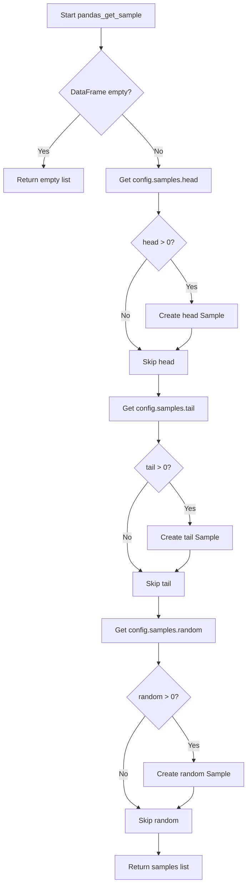

# `sample_pandas.py`

## `src.ydata_profiling.model.pandas.sample_pandas.pandas_get_sample` · *function*

## Summary:
Creates a list of sample data views (head, tail, and random) from a pandas DataFrame based on configuration settings.

## Description:
Generates multiple sample views of a pandas DataFrame including the first rows, last rows, and a random sample, according to the sampling configuration. This function extracts sampling logic from the profiling process to provide standardized sample generation for reporting purposes.

## Args:
    config (Settings): Configuration object containing sampling parameters (head, tail, random counts)
    df (pd.DataFrame): Input pandas DataFrame to sample from

## Returns:
    List[Sample]: A list of Sample objects containing different views of the DataFrame:
        - Sample with id="head" containing first rows
        - Sample with id="tail" containing last rows  
        - Sample with id="random" containing random sample rows
        Empty list is returned when DataFrame is empty

## Raises:
    None explicitly raised - handles empty DataFrame case gracefully

## Constraints:
    Preconditions:
        - config must be a valid Settings object with samples attribute
        - df must be a valid pandas DataFrame
    Postconditions:
        - Returns a list of Sample objects (possibly empty)
        - All returned samples have valid data and proper identifiers

## Side Effects:
    None - Pure function with no external state mutations or I/O operations

## Control Flow:


## Examples:
```python
# Basic usage with default settings
config = Settings()
df = pd.DataFrame({'A': [1, 2, 3, 4, 5], 'B': [6, 7, 8, 9, 10]})
samples = pandas_get_sample(config, df)
# Returns list with head and tail samples (random=0, so skipped)

# Usage with custom settings
config.samples.head = 2
config.samples.tail = 2
config.samples.random = 1
samples = pandas_get_sample(config, df)
# Returns list with head, tail, and random samples
```

