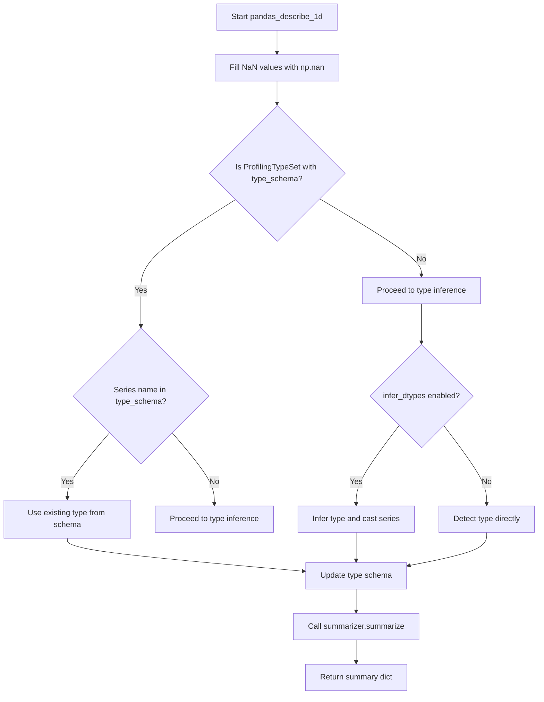
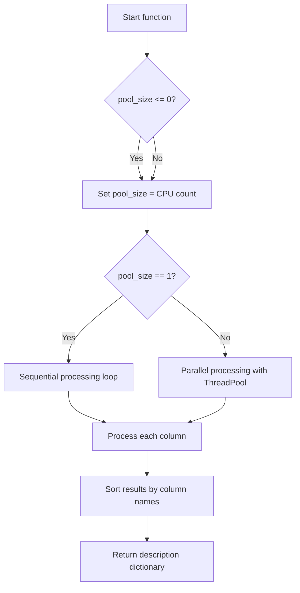

# `summary_pandas.py`

## `src.ydata_profiling.model.pandas.summary_pandas.pandas_describe_1d` · *function*

## Summary:
Determines the data type of a pandas Series and generates a statistical summary using a summarizer.

## Description:
This function processes a single pandas Series to determine its data type and then generates a comprehensive statistical summary. It handles type inference and casting when needed, and integrates with a summarizer to produce descriptive statistics. The function is designed to be part of a larger profiling pipeline where individual series are processed independently.

The function prioritizes type determination in this order:
1. Uses existing type information from the type schema if available and appropriate
2. Infers the type automatically if configuration allows it
3. Detects the type directly if neither of the above apply

This function serves as a bridge between type detection and statistical summarization in the profiling workflow, ensuring consistent type handling across different data series.

## Args:
    config (Settings): Configuration object containing profiling settings, including the infer_dtypes flag
    series (pd.Series): The pandas Series to be described
    summarizer (BaseSummarizer): Summarizer instance responsible for generating the statistical summary
    typeset (VisionsTypeset): Type detection and inference system for determining data types

## Returns:
    dict: A dictionary containing the statistical summary of the series, including various descriptive statistics and type information

## Raises:
    None explicitly raised in the function body

## Constraints:
    Preconditions:
    - config must be a valid Settings object
    - series must be a pandas Series
    - summarizer must be a valid BaseSummarizer instance
    - typeset must be a VisionsTypeset instance
    
    Postconditions:
    - The series will have NaN values filled with np.nan
    - The typeset.type_schema will be updated with the determined type for the series name
    - The returned dictionary will contain the statistical summary of the series

## Side Effects:
    - Modifies the typeset.type_schema dictionary by adding/updating the type for the series name
    - Calls methods on the summarizer which may perform I/O operations or external processing

## Control Flow:


## Examples:
    # Basic usage
    config = Settings()
    series = pd.Series([1, 2, 3, 4, 5])
    summarizer = BaseSummarizer()
    typeset = VisionsTypeset()
    
    result = pandas_describe_1d(config, series, summarizer, typeset)
    print(result)
    
    # Usage with existing type schema
    config = Settings(infer_dtypes=False)
    series = pd.Series(['a', 'b', 'c'])
    summarizer = BaseSummarizer()
    typeset = ProfilingTypeSet(config)
    typeset.type_schema['column_name'] = 'string'  # Pre-populate schema
    
    result = pandas_describe_1d(config, series, summarizer, typeset)
    
    # Usage with automatic type inference
    config = Settings(infer_dtypes=True)
    series = pd.Series([1, 2, 3, 4, 5])
    summarizer = BaseSummarizer()
    typeset = VisionsTypeset()
    
    result = pandas_describe_1d(config, series, summarizer, typeset)

## `src.ydata_profiling.model.pandas.summary_pandas.pandas_get_series_descriptions` · *function*

## Summary:
Processes a DataFrame to generate descriptive statistics for each column using parallel computation when appropriate.

## Description:
This function iterates through all columns in a DataFrame and generates detailed statistical descriptions for each series. It leverages multiprocessing to improve performance when multiple CPU cores are available, falling back to sequential processing when pool_size is set to 1 or less. The function integrates with the profiling configuration to control parallelism and sorting behavior.

Known callers within the codebase:
- Called by the main profiling pipeline when generating variable descriptions
- Typically triggered during the data profiling phase when describing individual variables

This logic is extracted into its own function to separate the concerns of data iteration and parallel processing from the core description logic, enabling reuse and making the main profiling pipeline cleaner.

## Args:
- config (Settings): Configuration object containing profiling settings including pool_size and sort preferences
- df (pd.DataFrame): Input DataFrame containing the data to be described
- summarizer (BaseSummarizer): Summarization handler responsible for generating statistical summaries
- typeset (VisionsTypeset): Type detection system for identifying data types
- pbar (tqdm): Progress bar for tracking processing status

## Returns:
- dict: A dictionary mapping column names to their respective descriptive statistics dictionaries

## Raises:
- ValueError: When an invalid sort parameter is provided to the sort_column_names utility function

## Constraints:
- Preconditions: All input parameters must be properly initialized and valid
- Postconditions: The returned dictionary will contain entries for all DataFrame columns in the specified order

## Side Effects:
- Updates the progress bar with processing status information
- May spawn multiple threads for parallel processing (when pool_size > 1)

## Control Flow:


## Examples:
```python
# Basic usage
config = Settings()
df = pd.DataFrame({'A': [1, 2, 3], 'B': ['x', 'y', 'z']})
summarizer = BaseSummarizer()
typeset = VisionsTypeset()
pbar = tqdm(total=len(df.columns))

result = pandas_get_series_descriptions(config, df, summarizer, typeset, pbar)
print(result)
# Returns: {'A': {...}, 'B': {...}} where each value is a statistics dictionary
```

