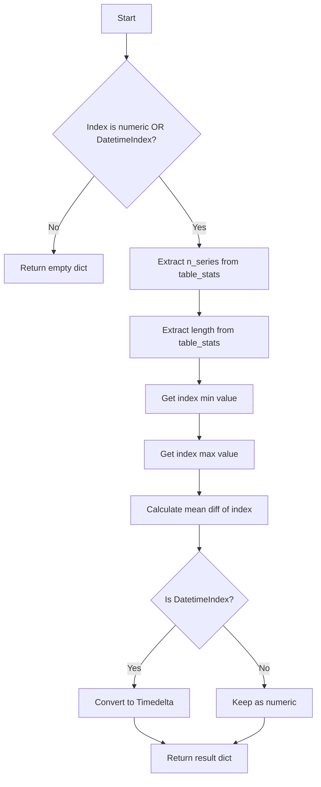

# `timeseries_index_pandas.py`

## `src.ydata_profiling.model.pandas.timeseries_index_pandas.pandas_get_time_index_description` · *function*

## Summary:
Extracts descriptive statistics about a DataFrame's time series index, returning metadata such as series count, data length, temporal bounds, and sampling period.

## Description:
This function validates that a DataFrame has a suitable time series index (numeric or datetime) and computes key statistical properties of that index. It serves as a pandas-specific implementation of the abstract `get_time_index_description` function, providing concrete analysis for time series data structures.

The function is typically called during data profiling workflows when analyzing time series datasets to extract structural information about the temporal indexing scheme.

## Args:
    config (Settings): Configuration settings for the profiling process
    df (pd.DataFrame): Input DataFrame whose index will be analyzed for time series characteristics
    table_stats (dict): Pre-computed statistics about the dataset including type information and row count

## Returns:
    dict: Dictionary containing time series index metadata with keys:
        - "n_series": Number of time series identified in the dataset (default: 0)
        - "length": Total number of rows in the DataFrame
        - "start": Minimum value of the index
        - "end": Maximum value of the index
        - "period": Average time interval between consecutive index values (as Timedelta for datetime indexes, otherwise as numeric)

## Raises:
    None explicitly raised - returns empty dict for invalid index types

## Constraints:
    Preconditions:
        - df must be a pandas DataFrame
        - table_stats must be a dictionary containing "types" and "n" keys
        - df.index must be either numeric or DatetimeIndex type
    
    Postconditions:
        - Returns empty dict if index is not numeric or DatetimeIndex
        - Returns dict with proper keys and values when index is valid

## Side Effects:
    None

## Control Flow:


## Examples:
```python
# Basic usage with numeric index
import pandas as pd
from ydata_profiling.config import Settings

df = pd.DataFrame({'value': [1, 2, 3, 4]}, index=[10, 20, 30, 40])
config = Settings()
table_stats = {"types": {"TimeSeries": 1}, "n": 4}

result = pandas_get_time_index_description(config, df, table_stats)
# Returns: {'n_series': 1, 'length': 4, 'start': 10, 'end': 40, 'period': 10.0}

# Usage with datetime index
dates = pd.date_range('2020-01-01', periods=4, freq='D')
df = pd.DataFrame({'value': [1, 2, 3, 4]}, index=dates)
result = pandas_get_time_index_description(config, df, table_stats)
# Returns: {'n_series': 1, 'length': 4, 'start': Timestamp('2020-01-01'), 'end': Timestamp('2020-01-04'), 'period': Timedelta('1 days')}
```

