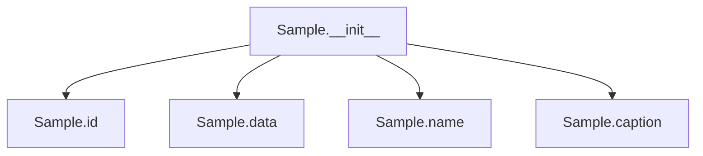

# `sample.py`

## `src.ydata_profiling.model.sample.Sample` · *class*

## Summary:
Data model for representing samples with identification, data payload, name, and optional caption.

## Description:
The Sample class is a Pydantic BaseModel designed to represent sample data objects within the profiling system. It provides a standardized structure for storing sample metadata (ID, name, caption) alongside sample data of any type. The data field uses a generic TypeVar T, which should be properly specified when subclassing or using this class in type annotations.

## State:
- id: str - Unique identifier for the sample
- data: T - Generic data payload associated with the sample (TypeVar T should be specified in subclasses or type annotations)
- name: str - Human-readable name for the sample
- caption: Optional[str] - Optional descriptive caption for the sample (defaults to None)

## Lifecycle:
- Creation: Instantiate with id, data, and name parameters; caption is optional
- Usage: Access fields directly or through standard Pydantic BaseModel methods
- Destruction: Managed automatically by Python's garbage collection

## Method Map:


## Raises:
- ValidationError: If any of the required fields fail validation during instantiation
- TypeError: If data type doesn't match expected constraints (when applicable)

## Example:
```python
# Basic usage (assuming proper type handling)
sample = Sample(id="sample_001", data=[1, 2, 3, 4], name="Test Sample")

# Access fields
print(sample.id)      # "sample_001"
print(sample.name)    # "Test Sample"
print(sample.data)    # [1, 2, 3, 4]

# Create with caption
sample_with_caption = Sample(
    id="sample_002", 
    data={"key": "value"}, 
    name="Data Sample", 
    caption="This is a sample with caption"
)
```

## `src.ydata_profiling.model.sample.get_sample` · *function*

## Summary
Interface function for creating Sample objects from configuration and data.

## Description
This function defines the interface for extracting and packaging data samples according to configuration settings. It is intended to be implemented by concrete functions that handle specific sampling strategies or data types. The function takes a configuration object and data input, and produces a list of Sample objects that represent data samples with associated metadata.

## Args
- config (Settings): Configuration object containing sampling parameters and preferences
- df (T): Input data structure to sample from, where T represents a generic type

## Returns
- List[Sample]: A list of Sample objects, each containing:
  - id: Unique identifier for the sample
  - data: The sampled data (of type T)
  - name: Name or label for the sample
  - caption: Optional descriptive text for the sample

## Raises
- NotImplementedError: This function is an interface that must be implemented by subclasses or concrete functions

## Constraints
- Preconditions: The config parameter must be a valid Settings object with appropriate sampling configuration
- Postconditions: The returned list contains Sample objects conforming to the Sample data model

## Side Effects
- None: This function does not perform any I/O operations or mutate external state

## Control Flow
```mermaid
flowchart TD
    A[get_sample called] --> B{config and df valid?}
    B -- No --> C[raise ValueError]
    B -- Yes --> D[Create Sample objects]
    D --> E[Return List[Sample]]
```

## Examples
```python
# This function would typically be used as:
config = Settings()
df = pd.DataFrame({'a': [1, 2, 3], 'b': [4, 5, 6]})
# samples = get_sample(config, df)  # Would return List[Sample]
```

## `src.ydata_profiling.model.sample.get_custom_sample` · *function*

## Summary:
Processes a dictionary sample and returns a list containing a single Sample object.

## Description:
This function takes a dictionary representing sample data and converts it into a Sample object with standardized fields. It ensures that optional fields 'name' and 'caption' exist in the input dictionary, providing default values if they are missing. The resulting Sample object is wrapped in a list and returned.

The function extracts the required 'data' field from the input dictionary and uses it to create a Sample instance with id="custom".

Known callers within the codebase:
- This function is likely called by other sampling-related functions in the same module when processing custom sample data provided by users
- It may be invoked during report generation when custom samples need to be rendered

Why this logic is extracted into its own function:
- Separates concerns by encapsulating the conversion logic from dictionary to Sample object
- Provides a consistent interface for creating custom samples regardless of whether optional fields are present
- Enables reuse of the sample creation logic across different parts of the profiling system
- Allows for easier testing and maintenance of the sample creation process

## Args:
    sample (dict): A dictionary containing sample data with at minimum a 'data' key. 
                   Optional keys include 'name' and 'caption' which will be set to None if missing.

## Returns:
    List[Sample]: A list containing exactly one Sample object initialized with the provided data and metadata.

## Raises:
    KeyError: If the 'data' key is missing from the input sample dictionary.

## Constraints:
    Preconditions:
    - The input sample dictionary must contain a 'data' key
    - The 'data' value should be compatible with the Sample class constructor
    
    Postconditions:
    - The returned list contains exactly one Sample object
    - The Sample object has id="custom"
    - The Sample object's name field is either the provided value or None
    - The Sample object's caption field is either the provided value or None

## Side Effects:
    None

## Control Flow:
```mermaid
flowchart TD
    A[Start get_custom_sample] --> B{Is "name" in sample?}
    B -- No --> C[Set sample["name"] = None]
    B -- Yes --> D[Skip]
    C --> D
    D --> E{Is "caption" in sample?}
    E -- No --> F[Set sample["caption"] = None]
    E -- Yes --> G[Skip]
    F --> G
    G --> H[Create Sample object]
    H --> I[Return list with Sample]
```

## Examples:
```python
# Basic usage with minimal data
sample_dict = {"data": [1, 2, 3, 4, 5]}
result = get_custom_sample(sample_dict)
# Returns: [Sample(id="custom", data=[1, 2, 3, 4, 5], name=None, caption=None)]

# Usage with all fields provided
sample_dict = {
    "data": {"column1": [1, 2], "column2": ["a", "b"]},
    "name": "My Custom Sample",
    "caption": "This is a test sample"
}
result = get_custom_sample(sample_dict)
# Returns: [Sample(id="custom", data={"column1": [1, 2], "column2": ["a", "b"]}, name="My Custom Sample", caption="This is a test sample")]
```

