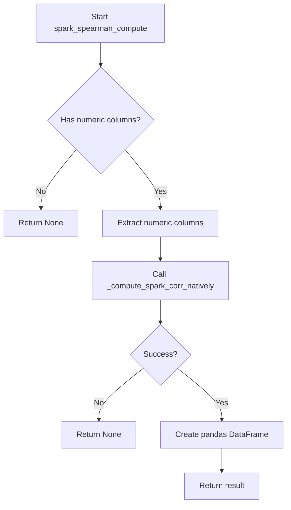
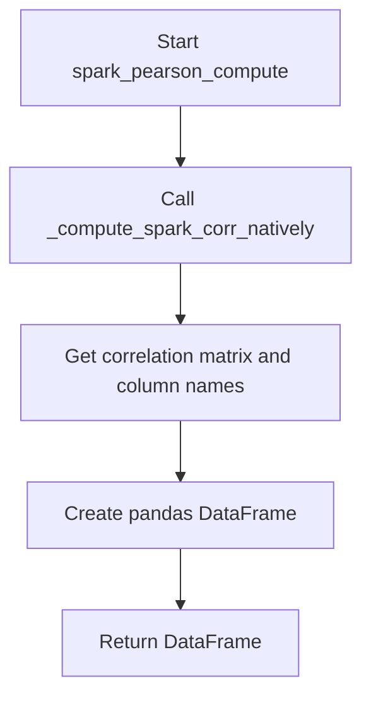
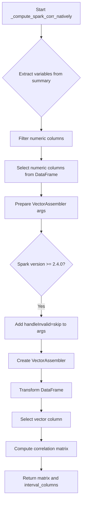
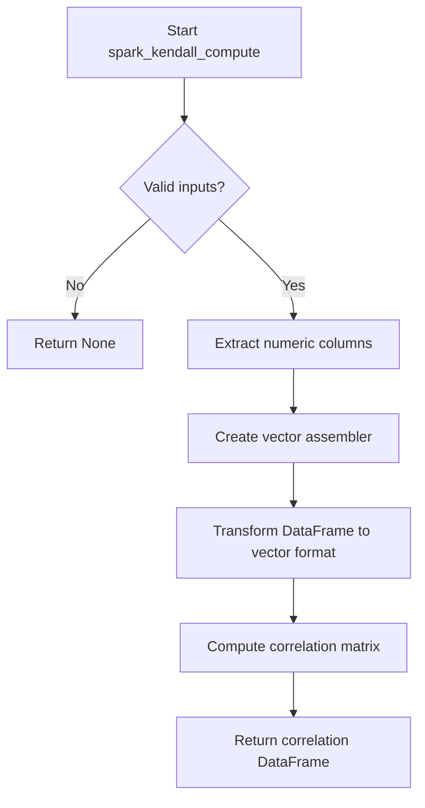
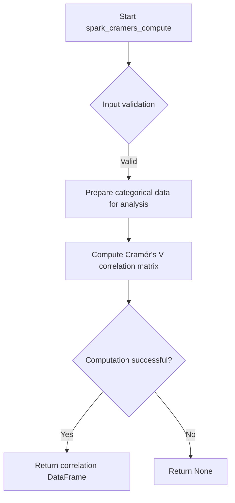

# `correlations_spark.py`

## `src.ydata_profiling.model.spark.correlations_spark.spark_spearman_compute` · *function*

## Summary:
Computes Spearman rank correlation coefficients for numeric columns in a Spark DataFrame and returns them as a pandas DataFrame.

## Description:
This function calculates Spearman rank correlation coefficients between numeric columns in a Spark DataFrame. It serves as a specialized wrapper around the native Spark correlation computation that handles the specific Spearman method. The function extracts numeric columns from the input DataFrame, prepares them for correlation analysis using Spark's VectorAssembler, and computes the correlation matrix using Spark's built-in correlation functionality.

## Args:
    config (Settings): Configuration settings for the profiling process
    df (DataFrame): Input Spark DataFrame containing the data to analyze
    summary (dict): Dictionary containing column metadata including type information

## Returns:
    Optional[pd.DataFrame]: A pandas DataFrame representing the Spearman correlation matrix with column names as both row and column indices. Returns None if no numeric columns are present or if the underlying computation fails.

## Raises:
    None explicitly raised in the function body, though underlying Spark operations may raise exceptions such as:
    - AnalysisException: When DataFrame operations fail
    - IllegalArgumentException: When invalid correlation method is specified

## Constraints:
    Preconditions:
    - Input DataFrame must be a valid Spark DataFrame
    - Summary dictionary must contain column metadata with type information
    - At least one numeric column must be present in the DataFrame
    
    Postconditions:
    - Returns a symmetric correlation matrix where all values are between -1 and 1
    - Matrix dimensions equal the number of numeric columns
    - Row and column labels correspond to numeric column names

## Side Effects:
    None directly observable from this function, though underlying Spark operations may involve:
    - Memory allocation for intermediate vector representations
    - Potential caching of processed DataFrames in Spark

## Control Flow:


## Examples:
    # Basic usage
    config = Settings()
    spark_df = spark.createDataFrame(data, schema)
    summary = {"col1": {"type": "Numeric"}, "col2": {"type": "Numeric"}}
    correlation_matrix = spark_spearman_compute(config, spark_df, summary)
    
    # Result would be a pandas DataFrame with shape (n, n) where n is number of numeric columns
    # Values represent Spearman correlation coefficients between pairs of columns

## `src.ydata_profiling.model.spark.correlations_spark.spark_pearson_compute` · *function*

## Summary:
Computes the Pearson correlation matrix for numeric columns in a Spark DataFrame and returns it as a pandas DataFrame.

## Description:
This function calculates Pearson correlation coefficients between all pairs of numeric columns in a Spark DataFrame. It leverages native Spark correlation computation and formats the result into a standard pandas DataFrame structure.

## Args:
    config (Settings): Configuration settings for the profiling process
    df (DataFrame): Input Spark DataFrame containing the data to analyze
    summary (dict): Dictionary containing column metadata including type information

## Returns:
    Optional[pd.DataFrame]: A pandas DataFrame representing the Pearson correlation matrix with numeric column names as both row and column indices, or None if no numeric columns are present

## Raises:
    None explicitly documented in the function signature

## Constraints:
    Preconditions:
    - Input DataFrame must contain at least one numeric column
    - Summary dictionary must contain valid column type information
    - Spark session must be properly initialized
    
    Postconditions:
    - Returns a symmetric correlation matrix with diagonal elements equal to 1.0
    - Matrix dimensions match the number of numeric columns in the input DataFrame

## Side Effects:
    None

## Control Flow:


## Examples:
```python
# Basic usage
config = Settings()
df = spark.createDataFrame(data, schema)
summary = {"col1": {"type": "Numeric"}, "col2": {"type": "Numeric"}}
correlation_matrix = spark_pearson_compute(config, df, summary)
```

## `src.ydata_profiling.model.spark.correlations_spark._compute_spark_corr_natively` · *function*

## Summary:
Computes a correlation matrix for numeric columns in a Spark DataFrame using native Spark correlation methods.

## Description:
This function extracts numeric columns from a DataFrame and computes their correlation matrix using Spark's built-in correlation computation capabilities. It serves as a utility function to handle correlation calculations specifically for Spark DataFrames with proper column filtering and preparation.

## Args:
    df (DataFrame): Input Spark DataFrame containing the data for correlation computation
    summary (dict): Dictionary containing column metadata with column names as keys and their descriptions as values
    corr_type (str): Type of correlation to compute (e.g., 'pearson', 'spearman')

## Returns:
    tuple: A tuple containing:
        - matrix: The computed correlation matrix as a 2D array
        - interval_columns (list): List of column names that were used in the correlation computation (numeric columns only)

## Raises:
    None explicitly raised in the function body

## Constraints:
    Preconditions:
        - df must be a valid Spark DataFrame
        - summary must be a dictionary with column names as keys and description dictionaries as values
        - description dictionaries must contain a "type" key
        - corr_type must be a valid correlation method supported by Spark's Correlation.corr()

    Postconditions:
        - Returns a correlation matrix only for numeric columns
        - The returned matrix dimensions match the number of numeric columns
        - interval_columns contains only the numeric columns that were processed

## Side Effects:
    None

## Control Flow:


## Examples:
```python
# Basic usage
df = spark.createDataFrame([(1, 2.0, 3.0), (4, 5.0, 6.0)], ["A", "B", "C"])
summary = {
    "A": {"type": "Numeric"},
    "B": {"type": "Numeric"}, 
    "C": {"type": "Numeric"}
}
matrix, columns = _compute_spark_corr_natively(df, summary, "pearson")
```

## `src.ydata_profiling.model.spark.correlations_spark.spark_kendall_compute` · *function*

## Summary:
Computes the Kendall correlation matrix for numeric columns in a Spark DataFrame (not yet implemented).

## Description:
This function is intended to calculate the Kendall rank correlation coefficients between numeric columns in a Spark DataFrame. It serves as part of the correlation computation suite that provides statistical measures of dependence between variables. Currently, the implementation raises NotImplementedError and needs to be completed.

The function follows the same pattern as other correlation computation functions in this module, filtering the DataFrame to only include numeric columns and computing the correlation matrix using Spark's native correlation functionality. Once implemented, it will call `_compute_spark_corr_natively` with the appropriate correlation type constant.

## Args:
    config (Settings): Configuration settings that control correlation computation behavior
    df (DataFrame): Input Spark DataFrame containing the data to analyze
    summary (dict): Column metadata summary providing type information for filtering

## Returns:
    Optional[pd.DataFrame]: A pandas DataFrame containing the Kendall correlation matrix with column names as both row and column indices, or None if computation fails or is disabled

## Raises:
    NotImplementedError: When the function is not yet implemented (current state)

## Constraints:
    Preconditions:
    - Input DataFrame must be a valid Spark DataFrame
    - Summary dictionary must contain column type information
    - Numeric columns must be present in the DataFrame for meaningful correlation computation
    
    Postconditions:
    - When implemented, returns a symmetric correlation matrix with values between -1 and 1
    - Matrix dimensions equal to number of numeric columns
    - Diagonal elements are always 1.0

## Side Effects:
    None

## Control Flow:


## Examples:
```python
# Basic usage (currently raises NotImplementedError)
config = Settings()
df = spark.createDataFrame(data, schema)
summary = {"col1": {"type": "Numeric"}, "col2": {"type": "Numeric"}}
# result = spark_kendall_compute(config, df, summary)  # Would raise NotImplementedError
```

## `src.ydata_profiling.model.spark.correlations_spark.spark_cramers_compute` · *function*

## Summary:
Computes Cramér's V correlation matrix for categorical variables in Spark DataFrames.

## Description:
This function serves as a Spark-specific implementation for calculating Cramér's V correlation coefficients between categorical variables. Cramér's V is a measure of association between two nominal categorical variables, normalized to lie between 0 and 1, making it suitable for analyzing relationships in categorical data.

This function follows the established pattern in the ydata-profiling codebase for implementing correlation computations in Spark environments. It is designed to be called as part of the correlation analysis pipeline alongside other correlation methods like Pearson, Spearman, and Kendall.

## Args:
    config (Settings): Configuration settings for the profiling process, containing parameters that influence correlation computation behavior
    df (DataFrame): Input Spark DataFrame containing the dataset to analyze
    summary (dict): Dictionary containing column metadata and summary statistics for all columns in the DataFrame

## Returns:
    Optional[pd.DataFrame]: A pandas DataFrame representing the symmetric correlation matrix where each cell [i,j] contains the Cramér's V coefficient between variables i and j. Returns None if the computation cannot be performed or is not applicable.

## Raises:
    NotImplementedError: This function is not yet implemented and raises this exception when called

## Constraints:
    Preconditions:
    - Input DataFrame must be a valid Spark DataFrame
    - Summary dictionary must contain complete column metadata
    - Config must be properly initialized Settings object
    
    Postconditions:
    - Function returns either a correlation matrix DataFrame or None
    - No modification to input DataFrame or configuration objects
    - No side effects on external systems

## Side Effects:
    None

## Control Flow:


## Examples:
```python
# Typical usage in correlation computation pipeline
config = Settings()
df = spark.createDataFrame(data, schema)
summary = {"col1": {"type": "Categorical"}, "col2": {"type": "Categorical"}}
result = spark_cramers_compute(config, df, summary)
if result is not None:
    # Process correlation results
    print("Cramér's V correlation matrix:")
    print(result)
else:
    # Handle case where correlation cannot be computed
    print("Cramér's V correlation not available")
```

## `src.ydata_profiling.model.spark.correlations_spark.spark_phi_k_compute` · *function*

## Summary:
Computes phi-k correlation matrix for categorical and numerical columns in a Spark DataFrame.

## Description:
This function calculates the phi-k correlation coefficients between columns in a Spark DataFrame using the phik library. It filters columns based on their data type and distinct value counts, then applies the phik correlation computation in a distributed Spark environment using pandas UDFs. The result is returned as a pandas DataFrame containing the correlation matrix.

## Args:
    config (Settings): Configuration object containing settings such as categorical_maximum_correlation_distinct threshold
    df (DataFrame): Input Spark DataFrame containing the data to analyze
    summary (dict): Dictionary containing column metadata including type and distinct count information

## Returns:
    Optional[pd.DataFrame]: Correlation matrix as a pandas DataFrame if sufficient columns exist, otherwise None

## Raises:
    None explicitly raised in the function body

## Constraints:
    Preconditions:
    - config must contain categorical_maximum_correlation_distinct attribute
    - df must be a valid Spark DataFrame
    - summary must be a dictionary with proper column metadata where each entry contains "type" and "n_distinct" keys
    
    Postconditions:
    - Returns None when fewer than 2 columns meet selection criteria
    - Returns a square correlation matrix when columns are selected
    - Matrix rows and columns correspond to selected column names

## Side Effects:
    None explicitly mentioned in the function body

## Control Flow:
```mermaid
flowchart TD
    A[Start spark_phi_k_compute] --> B{Columns available?}
    B -- No --> C[Return None]
    B -- Yes --> D[Filter numeric columns (Numeric type with >1 distinct values)]
    D --> E[Filter supported columns (Non-Unsupported type with 1 < n_distinct <= threshold)]
    E --> F[Combine selected columns]
    F --> G{Selected columns <= 1?}
    G -- Yes --> H[Return None]
    G -- No --> I[Create groupby DataFrame with literal column]
    I --> J[Define output schema matching selected columns]
    J --> K[Define spark_phik UDF with GROUPED_MAP type]
    K --> L{Has data in groupby_df?}
    L -- No --> M[Return empty DataFrame]
    L -- Yes --> N[Apply UDF grouped by literal column and process results]
    N --> O[Return correlation DataFrame]
```

## Examples:
    # Basic usage with Spark DataFrame
    config = Settings()
    spark_df = spark.createDataFrame(data, schema)
    summary = {"col1": {"type": "Numeric", "n_distinct": 5}, "col2": {"type": "Categorical", "n_distinct": 3}}
    result = spark_phi_k_compute(config, spark_df, summary)
    
    # Returns None when insufficient columns
    summary = {"col1": {"type": "Numeric", "n_distinct": 1}}  # Only 1 distinct value
    result = spark_phi_k_compute(config, spark_df, summary)  # Returns None

