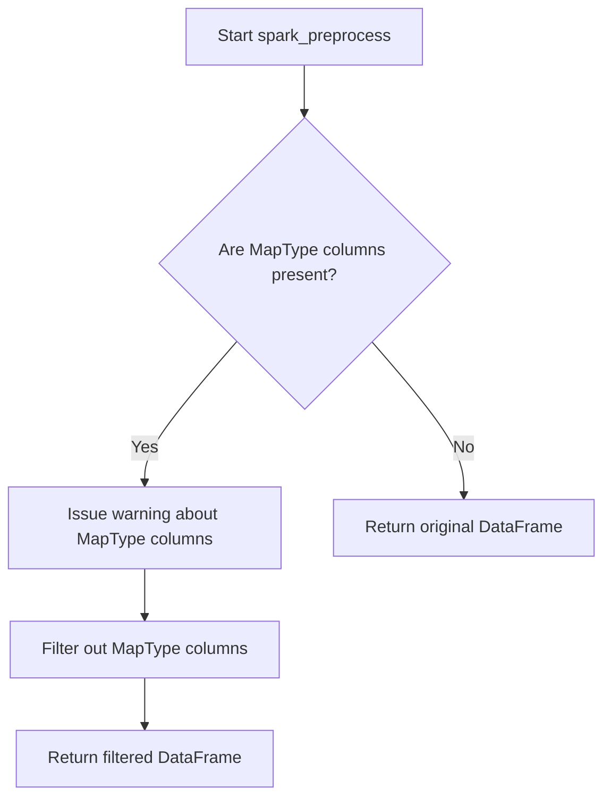

# `dataframe_spark.py`

## `src.ydata_profiling.model.spark.dataframe_spark.spark_check_dataframe` · *function*

## Summary:
Validates that the input is a PySpark DataFrame instance, issuing a warning if not.

## Description:
This function performs type validation on a DataFrame object to ensure it is an instance of pyspark.sql.DataFrame. It serves as a Spark-specific validation layer that prevents downstream processing errors when working with PySpark DataFrames. This function is typically called during the preprocessing phase of data profiling when working with Spark DataFrames.

The validation logic is extracted into its own function to enforce a clear responsibility boundary between type checking and data processing operations, making the code more modular and testable.

## Args:
    df (DataFrame): The DataFrame object to validate. Must be a PySpark DataFrame instance.

## Returns:
    None: This function does not return any value.

## Raises:
    None: This function does not raise exceptions directly, but issues a warning via Python's warnings module.

## Constraints:
    Preconditions:
    - The input parameter `df` should be passed as a DataFrame object
    - The function assumes that `pyspark.sql.DataFrame` is available in the environment
    
    Postconditions:
    - The function completes without raising exceptions
    - If validation fails, a warning is issued but execution continues

## Side Effects:
    - Issues a warning message via Python's warnings module when validation fails
    - No other side effects (no file I/O, no external state mutations)

## Control Flow:
```mermaid
flowchart TD
    A[spark_check_dataframe called] --> B{isinstance(df, DataFrame)?}
    B -- Yes --> C[Return None]
    B -- No --> D[Issue warning]
    D --> C
```

## Examples:
```python
from pyspark.sql import SparkSession
from ydata_profiling.model.spark.dataframe_spark import spark_check_dataframe

# Valid usage
spark = SparkSession.builder.appName("test").getOrCreate()
df = spark.createDataFrame([(1, "a"), (2, "b")], ["id", "value"])
spark_check_dataframe(df)  # No warning issued

# Invalid usage
spark_check_dataframe("not_a_dataframe")  # Warning issued
```

## `src.ydata_profiling.model.spark.dataframe_spark.spark_preprocess` · *function*

## Summary:
Removes MapType columns from Spark DataFrames to enable successful profiling operations.

## Description:
This function processes Spark DataFrames by identifying and removing columns with MapType data structure, as these columns are incompatible with standard profiling operations. When MapType columns are detected, they are excluded from the DataFrame with a warning message, allowing the profiling pipeline to continue with the remaining compatible columns. The configuration parameter is currently unused in this implementation.

## Args:
    config (Settings): Configuration settings object (currently unused in this implementation)
    df (DataFrame): Input Spark DataFrame to process

## Returns:
    DataFrame: A Spark DataFrame with MapType columns removed, or the original DataFrame if no MapType columns are present

## Raises:
    None explicitly raised, though warnings may be issued via the warnings module

## Constraints:
    Preconditions:
        - Input must be a valid PySpark DataFrame
        - Config parameter must be a valid Settings object
    Postconditions:
        - Returned DataFrame contains no columns with MapType data structure
        - Original DataFrame is not modified (immutable operation)

## Side Effects:
    - Issues a warning via Python's warnings module when MapType columns are detected and removed
    - No external state mutations or I/O operations

## Control Flow:


## Examples:
```python
# Basic usage
from pyspark.sql import SparkSession
from ydata_profiling.config import Settings

spark = SparkSession.builder.appName("test").getOrCreate()
df = spark.createDataFrame([(1, {"a": 1}), (2, {"b": 2})], ["id", "map_col"])
config = Settings()

# This will remove map_col and warn about it
processed_df = spark_preprocess(config, df)
```

