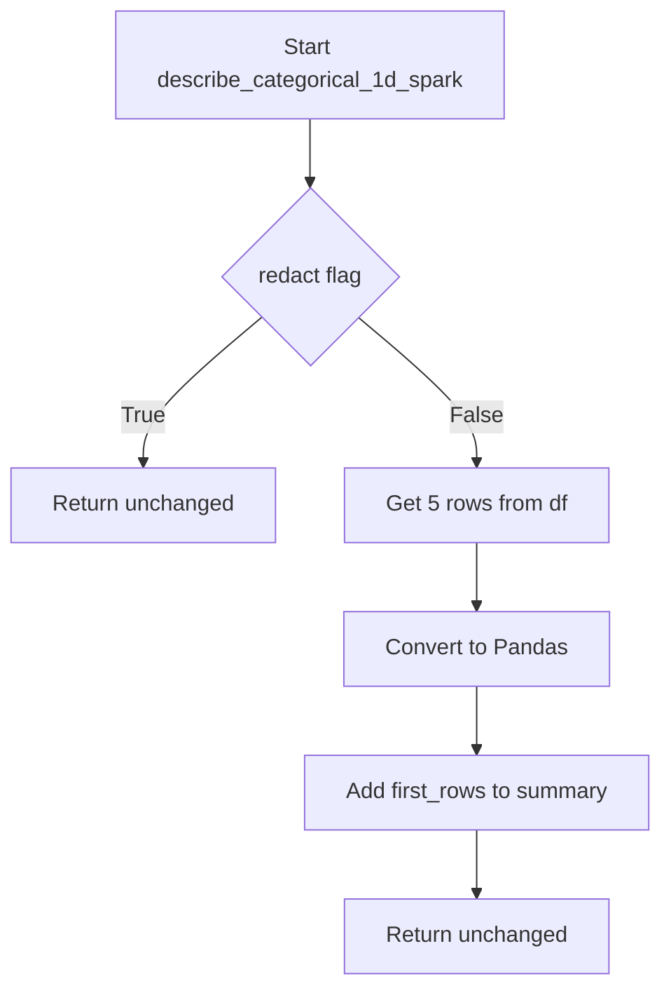

# `describe_categorical_spark.py`

## `src.ydata_profiling.model.spark.describe_categorical_spark.describe_categorical_1d_spark` · *function*

## Summary:
Processes categorical data in Spark format to extract first rows for summary when redaction is disabled.

## Description:
This function serves as a Spark-specific implementation for describing categorical data by extracting sample rows from a Spark DataFrame when redaction is disabled. It's designed to be part of a data profiling pipeline that handles categorical variables in distributed Spark environments.

The function acts as an adapter between the general categorical description logic and Spark DataFrame processing, ensuring that when redaction is disabled, sample rows are captured for display purposes while maintaining the Spark DataFrame structure for further processing.

## Args:
    config (Settings): Configuration object containing profiling settings, specifically the redact flag for categorical variables
    df (DataFrame): Spark DataFrame containing categorical data to be described
    summary (dict): Dictionary containing summary statistics for the categorical variable

## Returns:
    Tuple[Settings, DataFrame, dict]: The unchanged config, df, and summary parameters in a tuple format

## Raises:
    None explicitly raised

## Constraints:
    Preconditions:
    - config must be a valid Settings object with vars.cat.redact attribute
    - df must be a valid Spark DataFrame
    - summary must be a mutable dictionary object
    
    Postconditions:
    - If redact is False, summary dictionary will contain a "first_rows" key with sample data
    - If redact is True, summary remains unchanged
    - All input parameters are returned unchanged

## Side Effects:
    None

## Control Flow:

## Examples:
    # Basic usage with redaction disabled
    config = Settings()
    config.vars.cat.redact = False
    spark_df = spark.createDataFrame([(1, "A"), (2, "B")], ["id", "category"])
    summary = {}
    result_config, result_df, result_summary = describe_categorical_1d_spark(config, spark_df, summary)
    # result_summary now contains "first_rows" key with sample data
    
    # Usage with redaction enabled
    config.vars.cat.redact = True
    result_config, result_df, result_summary = describe_categorical_1d_spark(config, spark_df, summary)
    # result_summary remains unchanged

