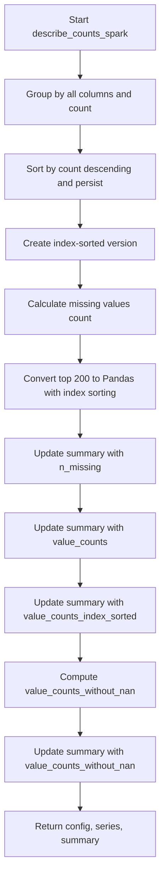

# `describe_counts_spark.py`

## `src.ydata_profiling.model.spark.describe_counts_spark.describe_counts_spark` · *function*

## Summary:
Computes value counts, missing value statistics, and related metadata for Spark DataFrame series, updating the summary dictionary with results.

## Description:
Processes a Spark DataFrame to calculate value frequencies, missing value counts, and organizes the data for statistical profiling. This function is designed specifically for Spark DataFrames and handles the distributed nature of Spark data processing while maintaining compatibility with the profiling framework's expectations.

The function performs several key operations:
1. Groups DataFrame rows by all columns to compute frequency counts
2. Sorts results by frequency count in descending order
3. Calculates missing value counts for the primary column
4. Converts top 200 results to Pandas format for easier indexing
5. Updates the summary dictionary with computed statistics

This logic is extracted into its own function to separate Spark-specific data processing concerns from the general profiling workflow, allowing for consistent interface handling across different data backends (Spark vs pandas).

## Args:
    config (Settings): Configuration settings for the profiling process
    series (DataFrame): Spark DataFrame containing the data series to analyze
    summary (dict): Dictionary to be updated with computed statistics and results

## Returns:
    Tuple[Settings, DataFrame, dict]: The unchanged config, series, and updated summary dictionary

## Raises:
    None explicitly raised - however, underlying Spark operations may raise exceptions related to:
    - DataFrame operations (groupBy, sort, limit)
    - Memory issues during persist() operations
    - Column access errors if series.columns is empty or malformed

## Constraints:
    Preconditions:
    - The series parameter must be a valid Spark DataFrame
    - The series DataFrame must have at least one column
    - The summary parameter must be a mutable dictionary
    - Config parameter must be a valid Settings object
    
    Postconditions:
    - The summary dictionary will contain the following keys:
      * "n_missing": integer count of missing values
      * "value_counts": persisted Spark DataFrame with value counts
      * "value_counts_index_sorted": Pandas Series with sorted value counts
      * "value_counts_without_nan": Pandas Series with value counts excluding NaN values

## Side Effects:
    - Persists intermediate Spark DataFrames in memory using .persist()
    - Converts Spark DataFrames to Pandas format via .toPandas() calls
    - Modifies the input summary dictionary in-place by adding new keys
    - May cause memory pressure due to persist() operations on large datasets

## Control Flow:

## Examples:
    # Basic usage in profiling workflow
    config = Settings()
    spark_df = spark_session.createDataFrame([(1,), (2,), (None,)], ["column1"])
    summary = {}
    
    config, spark_df, summary = describe_counts_spark(config, spark_df, summary)
    
    # Access computed results
    missing_count = summary["n_missing"]
    value_counts_df = summary["value_counts"]
    top_values = summary["value_counts_index_sorted"]

