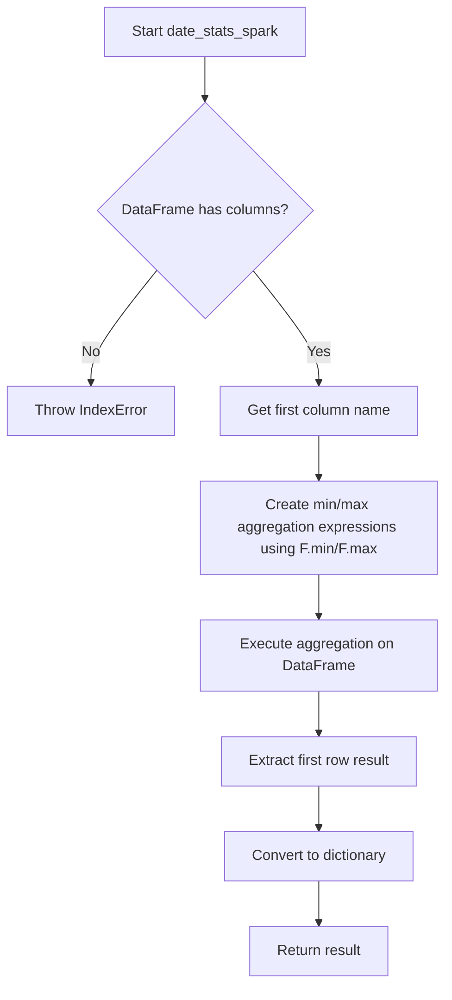
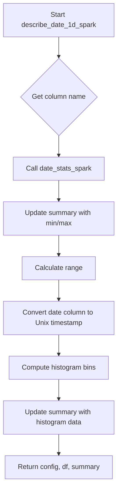

# `describe_date_spark.py`

## `src.ydata_profiling.model.spark.describe_date_spark.date_stats_spark` · *function*

## Summary:
Computes minimum and maximum date values for a single date column in a Spark DataFrame.

## Description:
This function extracts the first column from a Spark DataFrame and calculates the minimum and maximum date values using PySpark aggregation functions. It's designed to work with date-type columns in Spark environments and returns the results as a dictionary for further processing in data profiling workflows. The function assumes the DataFrame contains at least one column with date/time data.

## Args:
    df (DataFrame): A PySpark DataFrame containing at least one column with date data
    summary (dict): A dictionary containing summary statistics metadata (unused in current implementation)

## Returns:
    dict: A dictionary containing 'min' and 'max' keys with their respective date values from the DataFrame. The actual types of the returned values depend on the data type of the column being analyzed.

## Raises:
    IndexError: When the DataFrame has no columns (df.columns[0] fails)
    Exception: When PySpark aggregation fails due to invalid column references or incompatible data types

## Constraints:
    Preconditions:
        - The input DataFrame must contain at least one column
        - The first column in the DataFrame must contain date/time data compatible with PySpark's min/max functions
        - The DataFrame must be a valid PySpark DataFrame
    Postconditions:
        - Returns a dictionary with exactly two keys: 'min' and 'max'
        - The returned values are the actual minimum and maximum date values from the column

## Side Effects:
    None

## Control Flow:

## Examples:
    # Basic usage with a Spark DataFrame containing date data
    spark_df = spark.createDataFrame([(datetime(2020, 1, 1),), (datetime(2021, 12, 31),)], ["date_col"])
    result = date_stats_spark(spark_df, {})
    # Returns: {'min': datetime(2020, 1, 1), 'max': datetime(2021, 12, 31)}
    
    # With empty DataFrame (will raise IndexError)
    empty_df = spark.createDataFrame([], ["date_col"])
    # date_stats_spark(empty_df, {}) raises IndexError
``

## `src.ydata_profiling.model.spark.describe_date_spark.describe_date_1d_spark` · *function*

## Summary:
Processes a Spark DataFrame date column to compute descriptive statistics and histogram data for profiling.

## Description:
This function performs date column analysis for Spark DataFrames by computing min/max values, date range, converting dates to Unix timestamps, and generating histogram data for visualization. It's designed as part of the Spark-specific profiling pipeline and integrates with the broader ydata-profiling framework for statistical analysis.

The function extracts date statistics from the DataFrame, converts the date column to Unix timestamp format for numerical processing, and computes histogram bins for visual representation of date distributions. This logic is separated from inline processing to maintain clean responsibility boundaries in the profiling system.

## Args:
    config (Settings): Configuration object containing plot settings like histogram bin count
    df (DataFrame): Spark DataFrame containing a single date column to analyze
    summary (dict): Dictionary containing existing summary statistics to be updated

## Returns:
    Tuple[Settings, DataFrame, dict]: Updated configuration, DataFrame with Unix timestamp column, and extended summary dictionary containing min, max, range, and histogram data

## Raises:
    None explicitly documented - may raise exceptions from underlying Spark operations or DataFrame manipulations

## Constraints:
    Preconditions:
    - Input DataFrame must contain exactly one column
    - Column must contain valid date/datetime values that can be converted to Unix timestamps
    - Config must contain valid plot.histogram.bins setting
    
    Postconditions:
    - DataFrame column is converted to Unix timestamp format
    - Summary dictionary contains updated min, max, range, and histogram keys
    - Returned config remains unchanged

## Side Effects:
    - Modifies the input DataFrame by converting date column to Unix timestamp
    - Updates the input summary dictionary in-place
    - May perform Spark RDD operations for histogram computation

## Control Flow:

## Examples:
    # Basic usage with Spark DataFrame
    config = Settings()
    spark_df = spark.createDataFrame([(datetime(2023, 1, 1),), (datetime(2023, 12, 31),)], ["date_col"])
    summary = {"n_distinct": 365}
    
    updated_config, updated_df, updated_summary = describe_date_1d_spark(config, spark_df, summary)
    
    # Result contains:
    # - updated_summary with min, max, range, and histogram keys
    # - updated_df with date_col converted to Unix timestamps
``

