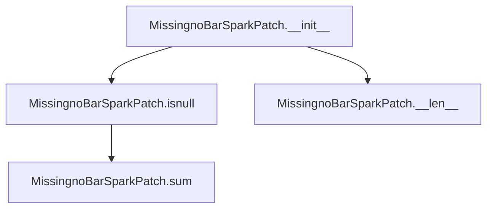
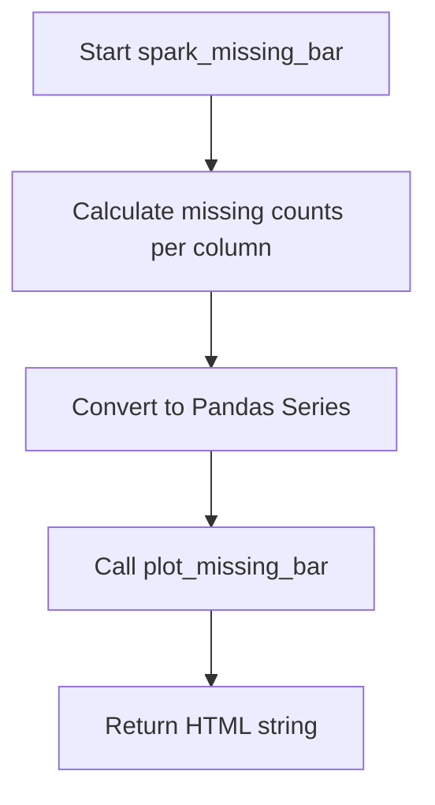
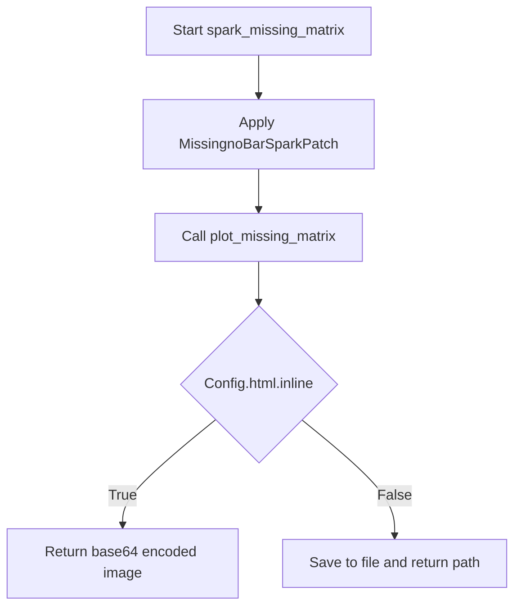
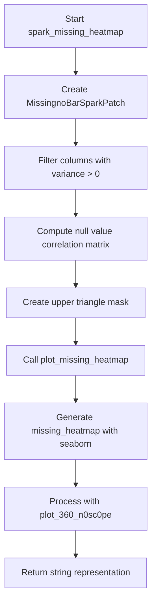

# `missing_spark.py`

## `src.ydata_profiling.model.spark.missing_spark.MissingnoBarSparkPatch` · *class*

## Summary:
A Spark-compatible patch class that enables missing data visualization functions to work with PySpark DataFrames by implementing pandas-like method signatures.

## Description:
The MissingnoBarSparkPatch class serves as a compatibility layer that allows missing data visualization functions (originally designed for pandas DataFrames) to operate on PySpark DataFrames. It patches core pandas operations like `isnull()` and `sum()` to work with Spark's distributed computing model while maintaining the expected interface for visualization functions.

This class is typically instantiated internally by the profiling system when working with Spark DataFrames to generate missing data reports and visualizations such as missing bar charts.

## State:
- df: DataFrame - The underlying PySpark DataFrame being wrapped
- columns: List[str] - Optional list of column names to process, defaults to None
- original_df_size: int - The original size of the DataFrame, defaults to None

## Lifecycle:
- Creation: Instantiated with a PySpark DataFrame, optional column list, and original DataFrame size
- Usage: Used internally by missing data visualization functions to provide Spark-compatible missing data analysis
- Destruction: No explicit cleanup required, relies on normal Python garbage collection

## Method Map:


## Raises:
- No explicit exceptions raised during initialization
- Exceptions may occur during DataFrame operations if the underlying Spark DataFrame is invalid

## Example:
```python
# Typically used internally by the profiling system
from pyspark.sql import DataFrame
from src.ydata_profiling.model.spark.missing_spark import MissingnoBarSparkPatch

# Create instance with Spark DataFrame
spark_df = spark.createDataFrame([(1, None), (2, "value")], ["id", "value"])
patch = MissingnoBarSparkPatch(spark_df, columns=["id", "value"], original_df_size=2)

# The patch enables compatibility with missing data visualization functions
result = patch.isnull().sum()  # Returns the underlying DataFrame
length = len(patch)  # Returns original_df_size
```

### `src.ydata_profiling.model.spark.missing_spark.MissingnoBarSparkPatch.__init__` · *method*

## Summary:
Initializes a MissingnoBarSparkPatch instance with Spark DataFrame and configuration parameters for missing data visualization.

## Description:
This constructor sets up the patch object that wraps Spark DataFrame operations for missing data analysis. It stores the DataFrame and associated metadata needed for generating missing data visualizations in Spark environments. The patch is designed to intercept and modify DataFrame operations to work with Spark's distributed computing model while maintaining compatibility with the standard missing data visualization functions.

## Args:
    df (DataFrame): The Spark DataFrame containing the data to analyze for missing values.
    columns (List[str], optional): List of column names to include in the missing data analysis. If None, all columns are analyzed. Defaults to None.
    original_df_size (int, optional): The original size of the DataFrame before any transformations. Used for length calculations. Defaults to None.

## Returns:
    None: This method initializes instance attributes and does not return a value.

## Raises:
    None: This method does not explicitly raise exceptions.

## State Changes:
    Attributes READ: None
    Attributes WRITTEN: 
    - self.df: Stores the Spark DataFrame reference
    - self.columns: Stores the column selection for analysis
    - self.original_df_size: Stores the original DataFrame size for length calculations

## Constraints:
    Preconditions:
    - df must be a valid PySpark DataFrame object
    - columns, if provided, must be a list of strings representing valid column names in df
    - original_df_size, if provided, must be a positive integer
    
    Postconditions:
    - Instance attributes self.df, self.columns, and self.original_df_size are properly initialized
    - All instance attributes are set to the provided parameter values or None if not provided

## Side Effects:
    None: This method only initializes instance attributes and does not perform I/O operations or mutate external state.

### `src.ydata_profiling.model.spark.missing_spark.MissingnoBarSparkPatch.isnull` · *method*

## Summary:
Returns the current instance, functioning as a minimal placeholder method in Spark missing data analysis.

## Description:
This method is part of the MissingnoBarSparkPatch class, which extends missing data analysis functionality for PySpark DataFrames. The method currently implements a minimal stub that simply returns the instance itself (self). In the context of missing data analysis, methods with names like `isnull` are typically expected to perform null value detection operations, but this implementation does not perform such operations. Instead, it serves as a placeholder that may be overridden or completed in a subclass to provide actual null checking functionality for Spark DataFrames.

## Args:
    None

## Returns:
    Any: The current instance (self) as returned by the method implementation.

## Raises:
    None explicitly raised

## State Changes:
    Attributes READ: None (method doesn't read any instance attributes)
    Attributes WRITTEN: None (method doesn't modify any instance attributes)

## Constraints:
    Preconditions: None specified
    Postconditions: None specified

## Side Effects:
    None

### `src.ydata_profiling.model.spark.missing_spark.MissingnoBarSparkPatch.sum` · *method*

## Summary:
Returns the underlying Spark DataFrame associated with the missing data visualization patch.

## Description:
This method provides access to the Spark DataFrame that contains the data being analyzed for missing values. It serves as a simple accessor method that exposes the internal DataFrame object for use in subsequent processing steps.

## Args:
    None

## Returns:
    DataFrame: The Spark DataFrame containing the data being analyzed for missing value patterns.

## Raises:
    None

## State Changes:
    Attributes READ: self.df
    Attributes WRITTEN: None

## Constraints:
    Preconditions: The instance must have a valid DataFrame assigned to self.df
    Postconditions: The returned DataFrame maintains the same schema and data as originally stored

## Side Effects:
    None

### `src.ydata_profiling.model.spark.missing_spark.MissingnoBarSparkPatch.__len__` · *method*

## Summary:
Returns the original DataFrame size for missing data visualization compatibility.

## Description:
This method implements the `__len__` magic method to provide the total number of rows in the original Spark DataFrame. It is part of the `MissingnoBarSparkPatch` class, which patches Spark DataFrame operations to enable compatibility with pandas-based missing data visualization functions. When missing data bar plots are generated, this method ensures that the visualization logic receives the correct total row count for calculating missing value percentages.

## Args:
    None

## Returns:
    Optional[int]: The total number of rows in the original DataFrame, or None if not initialized.

## Raises:
    None

## State Changes:
    Attributes READ: self.original_df_size
    Attributes WRITTEN: None

## Constraints:
    Preconditions: The instance must have been initialized with a valid original_df_size value
    Postconditions: The returned value represents the total row count of the original DataFrame

## Side Effects:
    None

## `src.ydata_profiling.model.spark.missing_spark.spark_missing_bar` · *function*

## Summary:
Generates a bar chart visualization showing missing value counts for each column in a Spark DataFrame.

## Description:
This function computes the count of missing (null or NaN) values for each column in a Spark DataFrame and generates a bar chart visualization using matplotlib. It serves as a Spark-specific implementation of the missing value visualization functionality, bridging the gap between Spark DataFrame processing and matplotlib-based plotting.

The function extracts missing value statistics from Spark DataFrames, converts them to pandas for compatibility with the plotting functions, and returns the resulting visualization as an HTML string representation.

## Args:
    config (Settings): Configuration object containing visualization settings such as style colors and image formats
    df (DataFrame): PySpark DataFrame containing the data to analyze for missing values

## Returns:
    str: HTML string representation of the missing value bar chart visualization containing the matplotlib plot

## Raises:
    None explicitly raised by this function, though underlying functions may raise exceptions

## Constraints:
    Preconditions:
    - config must be a valid Settings object with proper configuration
    - df must be a valid PySpark DataFrame with columns to analyze
    - The DataFrame should not be empty (though it can have empty columns)
    
    Postconditions:
    - Returns a valid HTML string representing the visualization
    - The returned visualization accurately reflects missing value counts for each column

## Side Effects:
    - Creates matplotlib figures and plots
    - May generate temporary files if config.html.inline is False
    - Closes matplotlib figures after saving
    - Uses plt.gcf() to access current figure
    - Converts Spark DataFrame to Pandas (potentially memory-intensive for large datasets)

## Control Flow:


## Examples:
```python
# Basic usage
from ydata_profiling.config import Settings
from pyspark.sql import SparkSession

spark = SparkSession.builder.appName("test").getOrCreate()
df = spark.createDataFrame([(1, None), (2, "value")], ["col1", "col2"])
config = Settings()

html_output = spark_missing_bar(config, df)
print(html_output)  # Prints HTML string of the visualization
```

## `src.ydata_profiling.model.spark.missing_spark.spark_missing_matrix` · *function*

## Summary:
Generates a missing data matrix visualization for Spark DataFrames by applying a patch to handle Spark-specific operations and creating a heatmap representation of missing values.

## Description:
This function creates a visualization showing the pattern of missing values across columns in a Spark DataFrame. It wraps the DataFrame with a `MissingnoBarSparkPatch` to handle Spark-specific method calls, then generates a matrix plot showing which cells are null vs. not-null. The resulting plot is returned as a string representation (HTML or base64 encoded image) suitable for inclusion in reports.

The function is specifically designed for Spark DataFrames and handles the differences between standard pandas operations and Spark's distributed computing model by patching methods like `.isnull()` and `.sum()`.

## Args:
    config (Settings): Configuration object containing report settings such as plot formatting, colors, and output preferences
    df (DataFrame): PySpark DataFrame containing the data to analyze for missing values

## Returns:
    str: String representation of the missing data matrix visualization, either as inline HTML or base64-encoded image data depending on configuration settings

## Raises:
    None explicitly raised by this function, though underlying plotting functions may raise exceptions related to invalid configurations or unsupported image formats

## Constraints:
    Preconditions:
    - The input DataFrame must be a valid PySpark DataFrame
    - The config object must be properly initialized with valid settings
    - The DataFrame should not be empty (though it can have columns with missing values)
    
    Postconditions:
    - Returns a valid string representation of a visualization
    - The returned string contains properly formatted plot data according to the configuration

## Side Effects:
    - Creates matplotlib figures internally for plotting
    - May generate temporary files if html.inline is False and assets_path is configured
    - Closes matplotlib figures after saving to prevent memory leaks

## Control Flow:


## Examples:
```python
# Basic usage with Spark DataFrame
from ydata_profiling.config import Settings
from pyspark.sql import SparkSession

spark = SparkSession.builder.appName("test").getOrCreate()
df = spark.createDataFrame([(1, None), (None, 2)], ["A", "B"])
config = Settings()

result = spark_missing_matrix(config, df)
# result contains HTML or base64 string of the missing data matrix
```

## `src.ydata_profiling.model.spark.missing_spark.spark_missing_heatmap` · *function*

## Summary:
Generates a heatmap visualization showing correlations between missing value patterns across Spark DataFrame columns.

## Description:
This function creates a correlation heatmap that visualizes how missing values are distributed and correlated across different columns in a Spark DataFrame. It processes the data to filter out columns with no variation in missing values, computes pairwise correlations between missing value patterns, and generates a visual representation using seaborn heatmaps.

The function is designed specifically for Spark DataFrames and uses a patched DataFrame wrapper to handle Spark-specific operations. It's part of the missing value analysis pipeline in the ydata-profiling library.

## Args:
    config (Settings): Configuration settings object containing visualization parameters like color maps and image formats
    df (DataFrame): Input Spark DataFrame to analyze for missing value patterns

## Returns:
    str: A string representation of the generated heatmap, either as inline base64-encoded image data or as a file path reference depending on configuration settings

## Raises:
    ValueError: When the image format specified in config is not supported (only "png" or "svg" are supported)

## Constraints:
    Preconditions:
        - Input DataFrame must be a valid PySpark DataFrame
        - Config object must contain valid plot configuration settings
        - DataFrame must have at least one column
    
    Postconditions:
        - Returns a valid string representation of the heatmap visualization
        - Original DataFrame is not modified
        - All matplotlib figures are properly closed after generation

## Side Effects:
    - Creates and closes matplotlib figures internally
    - May write files to disk if html.inline is False in config
    - Uses matplotlib and seaborn for visualization generation

## Control Flow:


## Examples:
```python
# Basic usage
from ydata_profiling.config import Settings
from pyspark.sql import SparkSession

spark = SparkSession.builder.appName("test").getOrCreate()
df = spark.createDataFrame([(1, None), (None, 2), (3, 4)], ["A", "B"])
config = Settings()

heatmap_result = spark_missing_heatmap(config, df)
print(heatmap_result)  # Returns string representation of heatmap
```

