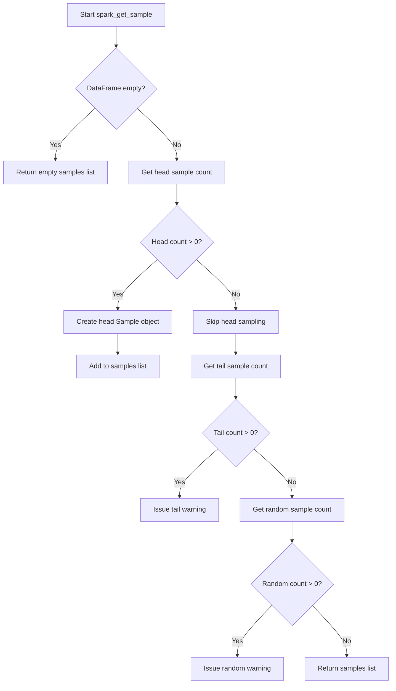

# `sample_spark.py`

## `src.ydata_profiling.model.spark.sample_spark.spark_get_sample` · *function*

## Summary:
Retrieves a list of sample data points from a Spark DataFrame for profiling purposes, including head samples while warning about unsupported tail and random sampling features.

## Description:
This function extracts sample data from a PySpark DataFrame according to configuration settings. It specifically implements head sampling for Spark environments while issuing warnings for tail and random sampling features that are not yet supported in the Spark implementation. The function serves as a Spark-specific override of the generic sample retrieval mechanism.

Known callers within the codebase:
- This function is likely called by the Spark-specific profiling pipeline when collecting sample data for report generation
- It would be invoked during the data profiling phase when sample data is needed for visualization and analysis

The logic is extracted into its own function to separate Spark-specific sample handling from the generic profiling logic, allowing for platform-specific implementations while maintaining a consistent interface.

## Args:
    config (Settings): Configuration object containing sampling parameters such as head, tail, and random sample counts
    df (DataFrame): PySpark DataFrame from which to extract samples

## Returns:
    List[Sample]: A list containing Sample objects representing the requested data samples. Currently only includes head samples, with empty list returned for empty DataFrames or when head sampling is disabled.

## Raises:
    None explicitly raised, though warnings are issued for unsupported features

## Constraints:
    Preconditions:
    - config must be a valid Settings object with properly initialized samples configuration
    - df must be a valid PySpark DataFrame
    
    Postconditions:
    - Returns an empty list for empty DataFrames
    - Returns a list containing at most one Sample object for head sampling
    - Issues appropriate warnings for unsupported tail/random sampling features

## Side Effects:
    - Issues Python warnings via the warnings module for unsupported tail and random sampling features
    - Converts Spark DataFrame to Pandas DataFrame using toPandas() method

## Control Flow:


## Examples:
```python
# Basic usage with a Spark DataFrame
from pyspark.sql import SparkSession
from ydata_profiling.config import Settings

spark = SparkSession.builder.appName("test").getOrCreate()
df = spark.createDataFrame([(1, "a"), (2, "b")], ["id", "value"])
config = Settings()

samples = spark_get_sample(config, df)
# Returns list with head sample if head count > 0, empty list otherwise
```

