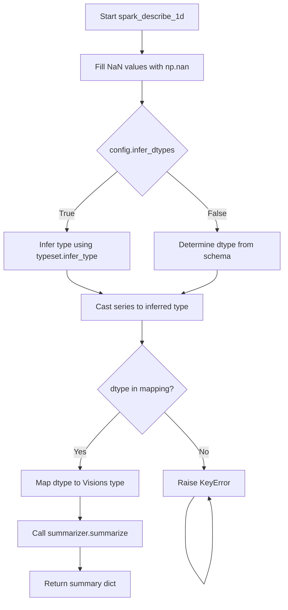

# `summary_spark.py`

## `src.ydata_profiling.model.spark.summary_spark.spark_describe_1d` · *function*

## Summary:
Processes a Spark DataFrame series to generate descriptive statistics using a summarizer and type inference.

## Description:
This function prepares a Spark DataFrame series for statistical analysis by handling missing values and type inference, then delegates the actual summarization to a provided summarizer instance. It serves as a bridge between Spark-specific data processing and the general summarization logic, enabling profiling of Spark DataFrames with consistent type handling.

## Args:
    config (Settings): Configuration object containing profiling settings
    series (DataFrame): Spark DataFrame containing a single column of data to summarize
    summarizer (BaseSummarizer): Summarizer instance responsible for generating the actual statistics
    typeset (VisionsTypeset): Type inference system for determining data types

## Returns:
    dict: A dictionary containing the descriptive statistics for the input series

## Raises:
    KeyError: When a data type from the Spark schema is not found in the hardcoded type mapping
    ValueError: When the series DataFrame doesn't have exactly one column (propagated from underlying operations)

## Constraints:
    Preconditions:
        - The series parameter must be a valid PySpark DataFrame with a single column
        - The config parameter must be properly initialized Settings object
        - The summarizer parameter must be a valid BaseSummarizer instance
        - The typeset parameter must be a valid VisionsTypeset instance
    
    Postconditions:
        - The returned dictionary contains the statistical summary of the series
        - Missing values in the series are replaced with np.nan

## Side Effects:
    None

## Control Flow:


## Examples:
    # Basic usage with inferred types
    result = spark_describe_1d(config, spark_df, summarizer, typeset)
    
    # Usage with explicit types (when infer_dtypes=False)
    config.infer_dtypes = False
    result = spark_describe_1d(config, spark_df, summarizer, typeset)

## `src.ydata_profiling.model.spark.summary_spark.spark_get_series_descriptions` · *function*

## Summary:
Computes descriptive statistics for each column in a Spark DataFrame using parallel processing while maintaining column order.

## Description:
Processes each column of a Spark DataFrame concurrently to generate comprehensive descriptive statistics. This function leverages multiprocessing to improve performance when analyzing large datasets with many columns. It extracts column-wise statistics using the `describe_1d` function and organizes the results in a structured dictionary format.

This function is extracted from inline logic to enable parallel execution and maintain clean separation between data processing and statistical computation. The multiprocessing approach allows for efficient utilization of multiple CPU cores when describing large datasets with many columns.

## Args:
    config (Settings): Configuration object containing analysis settings and preferences
    df (DataFrame): Spark DataFrame containing the data to be described
    summarizer (BaseSummarizer): Summarizer instance used to compute statistical summaries
    typeset (VisionsTypeset): Typeset used for type inference and validation
    pbar (tqdm): Progress bar instance for tracking processing progress

## Returns:
    dict: Dictionary mapping column names to their descriptive statistics dictionaries. Each statistics dictionary contains computed metrics such as count, mean, standard deviation, minimum, maximum, and other relevant statistics for the respective column. The returned dictionary preserves the original column order from the input DataFrame.

## Raises:
    Exception: Propagates exceptions that may occur during column processing by underlying functions (describe_1d, etc.)

## Constraints:
    Preconditions:
    - Input DataFrame must be a valid PySpark DataFrame
    - All parameters must be properly initialized and compatible with the expected types
    - Progress bar must be properly configured for updates
    
    Postconditions:
    - Returns a dictionary with keys matching all column names in the input DataFrame
    - Statistics dictionaries exclude "value_counts" field to reduce memory overhead
    - Column ordering in result matches the original column order of the input DataFrame
    - All columns in the input DataFrame are processed and included in the result

## Side Effects:
    - Updates the progress bar with descriptive status messages during processing
    - Processes DataFrame columns in parallel using 12 threads
    - May consume significant memory due to storing all column descriptions simultaneously
    - Modifies the progress bar's postfix string during execution

## Control Flow:
```mermaid
flowchart TD
    A[Start spark_get_series_descriptions] --> B[Initialize empty series_description dict]
    B --> C[Create args list with (column_name, df) tuples for all columns]
    C --> D[Create ThreadPool with 12 workers]
    D --> E[Process each column in parallel using multiprocess_1d]
    E --> F{Results available?}
    F -->|No| G[Update progress bar with column name]
    G --> H[Remove value_counts from description]
    H --> I[Store description in series_description]
    I --> J[Update progress bar]
    J --> F
    F -->|Yes| K[Reorder series_description to match df.columns order]
    K --> L[Sort column names according to config.sort if specified]
    L --> M[Return series_description]
```

## Examples:
```python
# Basic usage
config = Settings()
df = spark.read.parquet("data.parquet")
summarizer = BaseSummarizer()
typeset = VisionsTypeset()
pbar = tqdm(total=len(df.columns))

result = spark_get_series_descriptions(config, df, summarizer, typeset, pbar)

# Result structure:
# {
#     'column1': {'count': 1000, 'mean': 5.5, 'std': 1.2, ...},
#     'column2': {'count': 1000, 'mean': 10.2, 'std': 2.1, ...},
#     ...
# }
```

