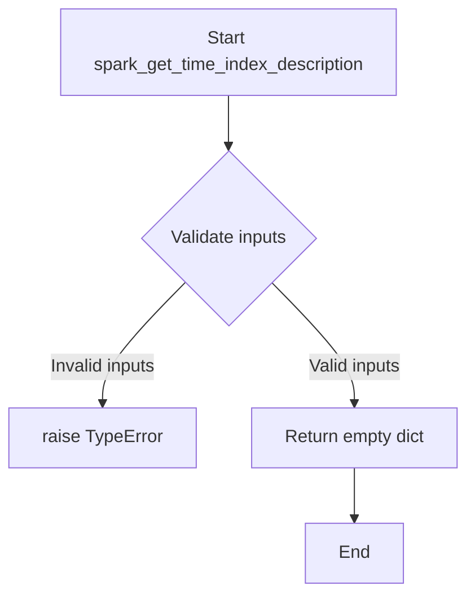

# `timeseries_index_spark.py`

## `src.ydata_profiling.model.spark.timeseries_index_spark.spark_get_time_index_description` · *function*

## Summary:
Placeholder implementation for Spark DataFrame time index description analysis.

## Description:
This function is a placeholder/stub implementation for Spark-specific time index description analysis. It implements the interface expected for time series data profiling in Spark environments. The function currently returns an empty dictionary but is intended to be replaced with a complete implementation that analyzes time index properties of Spark DataFrames.

The function follows the same pattern as other Spark-specific profiling functions in the codebase, taking configuration, Spark DataFrame, and table statistics as inputs, and returning descriptive statistics about time index characteristics.

## Args:
    config (Settings): Configuration settings for the profiling process
    df (DataFrame): Spark DataFrame containing the time series data
    table_stats (dict): Pre-computed statistics about the table structure and content

## Returns:
    dict: Currently returns an empty dictionary `{}`. A complete implementation would return a dictionary containing:
        - Time index column identification
        - Temporal data type information
        - Time range statistics (start/end dates)
        - Frequency analysis results
        - Missing value information for time index
        - Distribution characteristics

## Raises:
    NotImplementedError: When the underlying implementation is not yet completed (this is expected for the stub implementation)

## Constraints:
    Preconditions:
        - config must be a valid Settings object with appropriate profiling configurations
        - df must be a valid Spark DataFrame with proper schema
        - table_stats must be a dictionary containing pre-computed table metadata

    Postconditions:
        - Returns a dictionary with standardized keys for time index description
        - All returned values are compatible with the data profiling framework

## Side Effects:
    None: This function is stateless and does not modify external state or perform I/O operations.

## Control Flow:


## Examples:
```python
# Basic usage in Spark profiling context
config = Settings()
df = spark.createDataFrame(data, schema)
table_stats = {"n_rows": 1000, "columns": [...]}
result = spark_get_time_index_description(config, df, table_stats)
print(result)  # Prints: {}
```

