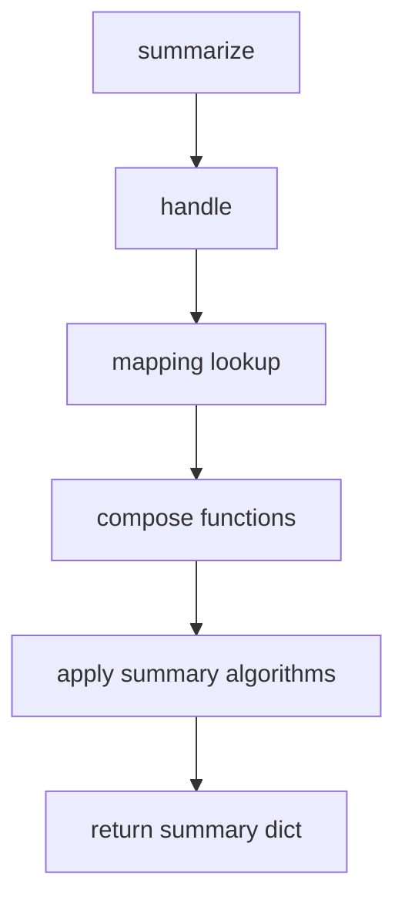

# `summarizer.py`

## `src.ydata_profiling.model.summarizer.BaseSummarizer` · *class*

## Summary:
BaseSummarizer is a handler class responsible for generating statistical summaries of pandas Series data based on their inferred data types.

## Description:
The BaseSummarizer class serves as the core component for generating descriptive statistics and summaries of data series in the profiling system. It inherits from Handler and leverages a mapping of data types to summary algorithms to provide type-appropriate statistical summaries. This class is typically instantiated by the profiling system internally and used to process individual columns of data during report generation.

## State:
- Inherits all state from Handler parent class including:
  - mapping: Dictionary mapping data type strings to lists of summary algorithm functions
  - typeset: VisionsTypeset object defining the type hierarchy
- No additional instance attributes beyond those inherited from Handler

## Lifecycle:
- Creation: Instantiated automatically by the profiling system with appropriate mapping and typeset parameters
- Usage: Called via the summarize() method with config, series, and dtype parameters
- Destruction: Managed by Python's garbage collection; no explicit cleanup required

## Method Map:


## Raises:
- No explicit exceptions defined in the method signature
- Exceptions may be raised by underlying handle() method or summary algorithms
- Type errors may occur if parameters don't match expected types

## Example:
```python
# Typical usage within the profiling system
config = Settings()
series = pd.Series([1, 2, 3, 4, 5])
dtype = Integer  # VisionsBaseType subclass

summarizer = BaseSummarizer(mapping={}, typeset=visions_typeset)
result = summarizer.summarize(config, series, dtype)
# Returns dictionary with statistical summary
```

### `src.ydata_profiling.model.summarizer.BaseSummarizer.summarize` · *method*

## Summary:
Generates a statistical summary for a pandas Series by invoking the registered handler for the specified data type.

## Description:
This method serves as the main entry point for generating descriptive statistics for a data series. It delegates the summarization task to the parent Handler class's handle mechanism, which selects and applies appropriate summary algorithms based on the provided data type. The method takes a configuration, series, and data type, and returns the resulting summary dictionary.

## Args:
    config (Settings): Configuration object containing settings for the summary generation process
    series (pd.Series): The pandas Series to summarize
    dtype (Type[VisionsBaseType]): The Visions data type of the series

## Returns:
    dict: A dictionary containing the statistical summary of the series, including various descriptive statistics and metadata

## Raises:
    None explicitly raised - relies on underlying handler mechanism for error propagation

## State Changes:
    Attributes READ: None - this method doesn't read any instance attributes directly
    Attributes WRITTEN: None - this method doesn't modify any instance attributes

## Constraints:
    Preconditions:
        - config must be a valid Settings object
        - series must be a valid pandas Series
        - dtype must be a valid VisionsBaseType subclass
    Postconditions:
        - Returns a dictionary with summary statistics for the given series
        - The returned dictionary follows the expected schema for profile summaries

## Side Effects:
    None - this method is pure and doesn't perform I/O operations or mutate external state

## `src.ydata_profiling.model.summarizer.PandasProfilingSummarizer` · *class*

*No documentation generated.*

### `src.ydata_profiling.model.summarizer.PandasProfilingSummarizer.__init__` · *method*

*No documentation generated.*

## `src.ydata_profiling.model.summarizer.format_summary` · *function*

## Summary:
Converts a summary object (either BaseDescription or dict) into a fully serializable dictionary format by recursively processing nested data structures.

## Description:
This function serves as a utility to normalize summary data structures for serialization purposes. It transforms BaseDescription objects into dictionaries and recursively processes their values to ensure all nested data types are converted to JSON-serializable formats. The function is designed to handle complex nested structures containing pandas Series, numpy arrays, and other non-serializable objects.

The logic is extracted into its own function to separate the concerns of data normalization from the core profiling logic, ensuring clean separation between data processing and serialization concerns.

## Args:
    summary (Union[BaseDescription, dict]): Input summary data that can be either a BaseDescription object or a dictionary containing variable descriptions and statistics.

## Returns:
    dict: A normalized dictionary representation of the summary with all values converted to JSON-serializable formats.

## Raises:
    None explicitly raised - though underlying operations may raise exceptions during type conversion.

## Constraints:
    Preconditions:
    - Input must be either a BaseDescription instance or a dictionary
    - All nested values should be compatible with the formatting logic
    
    Postconditions:
    - Output is guaranteed to be a dictionary
    - All values in the returned dictionary are JSON-serializable
    - The structure of the original summary is preserved

## Side Effects:
    None - this function is pure and doesn't modify external state.

## Control Flow:
```mermaid
flowchart TD
    A[Start format_summary] --> B{Input is BaseDescription?}
    B -- Yes --> C[Convert to dict using asdict()]
    B -- No --> D[Skip conversion]
    C --> E[Apply fmt() to all items]
    D --> E
    E --> F[Process each item with fmt()]
    F --> G{Item is dict?}
    G -- Yes --> H[Recursively apply fmt to dict values]
    G -- No --> I{Item is pd.Series?}
    I -- Yes --> J[Convert to dict then apply fmt()]
    I -- No --> K{Item is tuple of 2 np.arrays?}
    K -- Yes --> L[Convert to counts/bin_edges dict]
    K -- No --> M[Return item unchanged]
    H --> N[Return formatted dict]
    J --> N
    L --> N
    M --> N
    N --> O[Return processed summary]
```

## Examples:
```python
# Example 1: With BaseDescription object
from ydata_profiling.model import BaseDescription
summary_obj = BaseDescription(...)
result = format_summary(summary_obj)
# Returns a fully serializable dictionary

# Example 2: With dictionary input
input_dict = {
    'variable1': {'count': 100, 'mean': 5.5},
    'variable2': pd.Series([1, 2, 3])
}
result = format_summary(input_dict)
# Returns dictionary with all values properly serialized
```

## `src.ydata_profiling.model.summarizer._redact_column` · *function*

## Summary:
Redacts sensitive information from column summary data by replacing specific field values with anonymized placeholders.

## Description:
This function removes potentially sensitive data from column summary dictionaries by redacting specific fields that may contain identifiable information. It transforms key-value pairs in designated fields to generic placeholder names or values while preserving the original data structure.

The function is designed to be used in data profiling pipelines where privacy-preserving summaries are required. It specifically targets fields that may contain detailed statistical information or sample data that could reveal sensitive patterns.

## Args:
    column (Dict[str, Any]): A dictionary containing column summary data that may contain sensitive information to be redacted.

## Returns:
    Dict[str, Any]: The same column dictionary with specified fields redacted. The redaction replaces actual values with generic placeholders while maintaining the original data structure.

## Raises:
    None explicitly raised - however, the function may raise exceptions if the input column dictionary contains unexpected data structures that cause issues during processing.

## Constraints:
    Preconditions:
    - Input column must be a dictionary
    - Fields to be redacted must be accessible within the column dictionary
    
    Postconditions:
    - All specified fields in keys_to_redact will have their keys replaced with REDACTED_0, REDACTED_1, etc.
    - All specified fields in values_to_redact will have their values replaced with REDACTED_0, REDACTED_1, etc.
    - The returned dictionary maintains the same structure as the input

## Side Effects:
    None - This function is pure and does not perform any I/O operations or mutate external state.

## Control Flow:
```mermaid
flowchart TD
    A[Start _redact_column] --> B[Process keys_to_redact fields]
    B --> C{Field exists in column?}
    C -- No --> D[Skip field]
    C -- Yes --> E{Field values contain dicts?}
    E -- Yes --> F[Apply redact_key to each dict value]
    E -- No --> G[Apply redact_key to field directly]
    F --> H[Update column[field]]
    G --> H
    H --> I{More keys_to_redact fields?}
    I -- Yes --> B
    I -- No --> J[Process values_to_redact fields]
    J --> K{Field exists in column?}
    K -- No --> L[Skip field]
    K -- Yes --> M{Field values contain dicts?}
    M -- Yes --> N[Apply redact_value to each dict value]
    M -- No --> O[Apply redact_value to field directly]
    N --> P[Update column[field]]
    O --> P
    P --> Q{More values_to_redact fields?}
    Q -- Yes --> J
    Q -- No --> R[Return column]
```

## Examples:
```python
# Example usage with a column containing sensitive data
column_data = {
    "first_rows": {"row1": "sensitive_info", "row2": "more_sensitive"},
    "value_counts_without_nan": {"A": 10, "B": 5, "C": 3}
}

redacted_column = _redact_column(column_data)
# Result would have first_rows values replaced with REDACTED_0, REDACTED_1, etc.
# And value_counts_without_nan keys replaced with REDACTED_0, REDACTED_1, etc.
```

## `src.ydata_profiling.model.summarizer.redact_summary` · *function*

## Summary:
Processes a summary dictionary to redact sensitive information from categorical and text columns based on configuration settings.

## Description:
Evaluates each column in the summary dictionary against configuration-based redaction criteria. When a column matches the redaction conditions (categorical columns when cat.redact is True, or text columns when text.redact is True), the function applies redaction logic to those columns. Note: the current implementation has a logical flaw where column modifications don't persist in the summary dictionary.

## Args:
    summary (dict): A dictionary containing variable summaries with a "variables" key mapping to column descriptions
    config (Settings): Configuration object containing redaction settings for categorical and text variables

## Returns:
    dict: The summary dictionary (unchanged due to implementation flaw)

## Raises:
    None explicitly raised

## Constraints:
    Preconditions:
    - The summary dictionary must contain a "variables" key with column descriptions
    - Each column description in summary["variables"] must be a dictionary with a "type" key
    - The config object must have vars.cat.redact and vars.text.redact attributes
    
    Postconditions:
    - The returned dictionary is identical to the input summary dictionary
    - The function does not actually modify the summary in place due to implementation limitations
    - Columns that meet redaction criteria are processed through _redact_column function but changes are not persisted

## Side Effects:
    None

## Control Flow:
```mermaid
flowchart TD
    A[Start redact_summary] --> B{config.vars.cat.redact AND col.type == "Categorical"}
    B -- True --> C[_redact_column(col)]
    B -- False --> D{config.vars.text.redact AND col.type == "Text"}
    D -- True --> E[_redact_column(col)]
    D -- False --> F[Continue]
    C --> G[Local col reassigned]
    E --> G
    G --> H[Return summary (unchanged)]
    F --> H
```

## Examples:
    # Basic usage with categorical redaction enabled
    config = Settings(vars=VarsConfig(cat=CatConfig(redact=True), text=TextConfig(redact=False)))
    summary = {"variables": {"col1": {"type": "Categorical", "data": "sensitive"}}}
    result = redact_summary(summary, config)
    # result equals summary (no change due to implementation flaw)
    
    # Usage with text redaction enabled
    config = Settings(vars=VarsConfig(cat=CatConfig(redact=False), text=TextConfig(redact=True)))
    summary = {"variables": {"col2": {"type": "Text", "data": "sensitive"}}}
    result = redact_summary(summary, config)
    # result equals summary (no change due to implementation flaw)
    
    # No redaction applied
    config = Settings(vars=VarsConfig(cat=CatConfig(redact=False), text=TextConfig(redact=False)))
    summary = {"variables": {"col3": {"type": "Numeric", "data": "non-sensitive"}}}
    result = redact_summary(summary, config)
    # result equals summary (no change)

