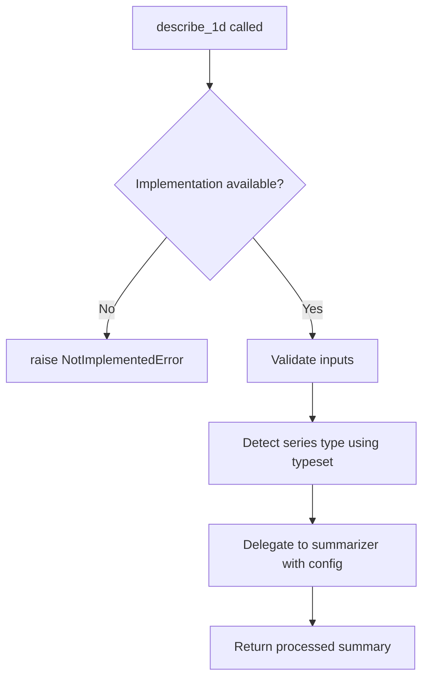
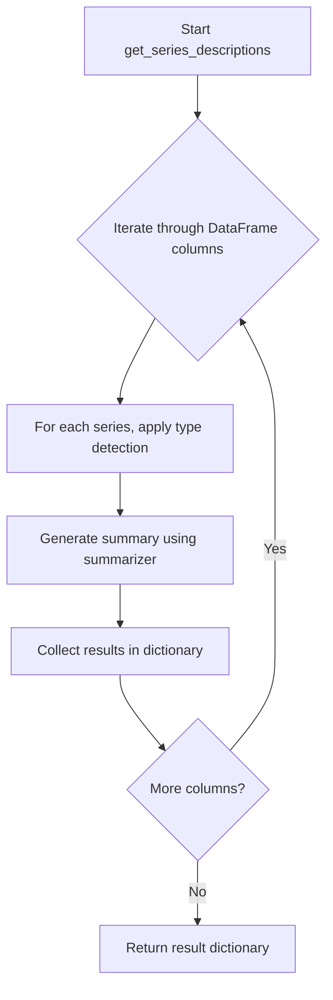

# `summary.py`

## `src.ydata_profiling.model.summary.describe_1d` · *function*

## Summary:
Abstract interface for describing 1-dimensional data series with statistical summaries.

## Description:
This function defines the interface for generating descriptive statistics and metadata for 1-dimensional data series. As an abstract method that raises NotImplementedError, it establishes the contract for concrete implementations that handle the actual data description logic. The function coordinates between configuration settings, data series, type detection, and summarization processes to produce comprehensive statistical profiles.

## Args:
    config (Settings): Configuration settings that control the profiling behavior and output format
    series (Any): The 1-dimensional data series to be described, typically a pandas Series or similar
    summarizer (BaseSummarizer): An instance of a summarizer that handles the actual statistical computation and data processing
    typeset (VisionsTypeset): A set of type definitions used for determining the appropriate data type classification

## Returns:
    dict: A dictionary containing the descriptive statistics and metadata for the input series, including various summary metrics, type information, and data characteristics

## Raises:
    NotImplementedError: When the function is called without a concrete implementation

## Constraints:
    Preconditions:
        - config must be a valid Settings object with proper configuration
        - series must be a valid 1-dimensional data structure
        - summarizer must be a properly initialized BaseSummarizer instance
        - typeset must be a valid VisionsTypeset instance with appropriate type definitions
    
    Postconditions:
        - The returned dictionary contains all relevant descriptive statistics for the series
        - The output respects the configuration settings provided in the config parameter

## Side Effects:
    None: This function is designed to be stateless and not modify external state or perform I/O operations

## Control Flow:


## Examples:
```python
# This function would be implemented by subclasses
class ConcreteDescriber(BaseDescriber):
    def describe_1d(self, config, series, summarizer, typeset):
        # Implementation would process the series
        return summarizer.summarize(config, series, detected_type)

# Usage in profiling pipeline
config = Settings()
series = pd.Series([1, 2, 3, 4, 5])
summarizer = BaseSummarizer()
typeset = VisionsTypeset()

# This would call the concrete implementation
result = describe_1d(config, series, summarizer, typeset)
```

## `src.ydata_profiling.model.summary.get_series_descriptions` · *function*

## Summary:
Generates descriptive statistics and metadata for each series in a DataFrame for data profiling purposes.

## Description:
This function is designed to process each series/column in a DataFrame to generate comprehensive descriptive statistics and metadata. It serves as a key component in the data profiling pipeline, collecting information about data types, distributions, and quality indicators for each series.

The function is intended to leverage the provided summarizer, typeset, and configuration to produce detailed series descriptions that contribute to the overall data profiling report. It operates on a per-series basis, processing each column sequentially.

## Args:
    config (Settings): Configuration settings that control the profiling behavior and output format
    df (Any): The input DataFrame containing the data series to be described
    summarizer (BaseSummarizer): Summarizer instance responsible for generating statistical summaries for each series
    typeset (VisionsTypeset): Type detection system that identifies and categorizes data types in the series
    pbar (tqdm): Progress bar iterator for tracking processing progress through series

## Returns:
    dict: A dictionary mapping series/column names to their respective descriptive statistics and metadata. Each entry contains type information, summary statistics, and quality indicators for the corresponding series.

## Raises:
    NotImplementedError: When the function has not been implemented in the current version

## Constraints:
    Preconditions:
        - config must be a valid Settings object with proper configuration
        - df must be a valid DataFrame-like object with accessible columns
        - summarizer must be an initialized BaseSummarizer instance
        - typeset must be a properly configured VisionsTypeset instance
        - pbar must be a valid tqdm progress bar instance
    
    Postconditions:
        - Function should return a dictionary with keys matching DataFrame column names
        - Each dictionary value should contain comprehensive series descriptions

## Side Effects:
    None directly, but may indirectly cause:
        - Progress updates in the provided tqdm progress bar
        - Potential caching or logging operations through the summarizer

## Control Flow:


## Examples:
    # Typical usage in a profiling pipeline
    config = Settings()
    df = pd.DataFrame({'col1': [1,2,3], 'col2': ['a','b','c']})
    summarizer = BaseSummarizer()
    typeset = VisionsTypeset()
    pbar = tqdm(df.columns)
    
    # This function should return a dictionary mapping column names to their descriptions
    # descriptions = get_series_descriptions(config, df, summarizer, typeset, pbar)
    # Result structure: {'col1': {...description...}, 'col2': {...description...}}
``

