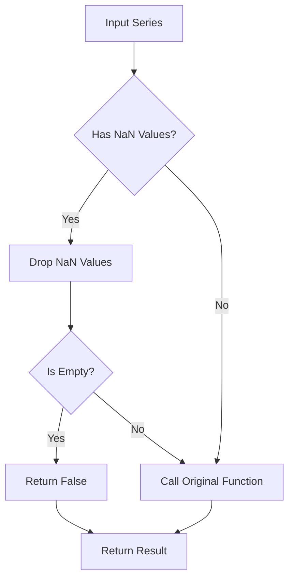
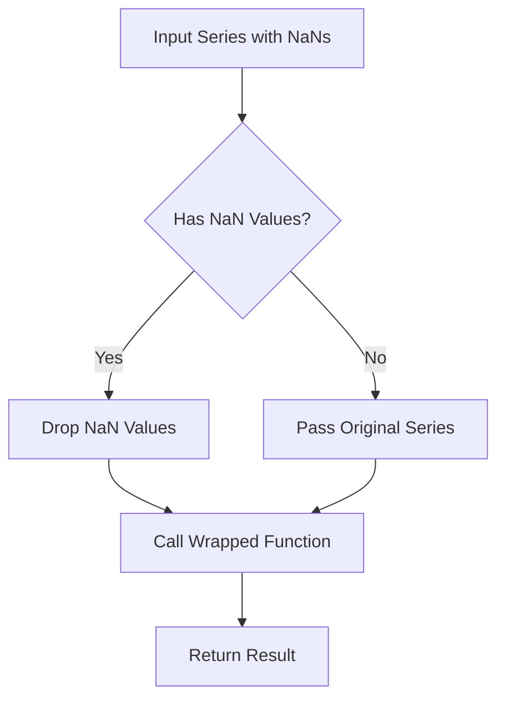
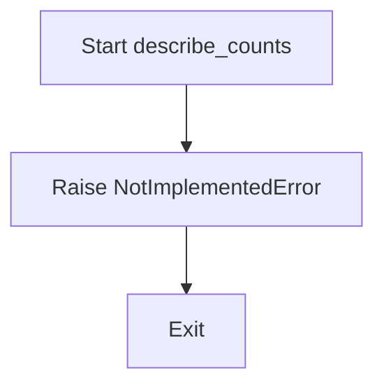
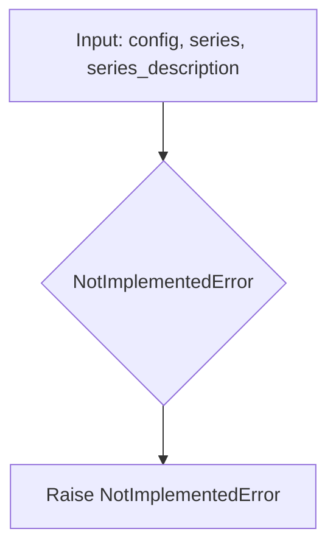
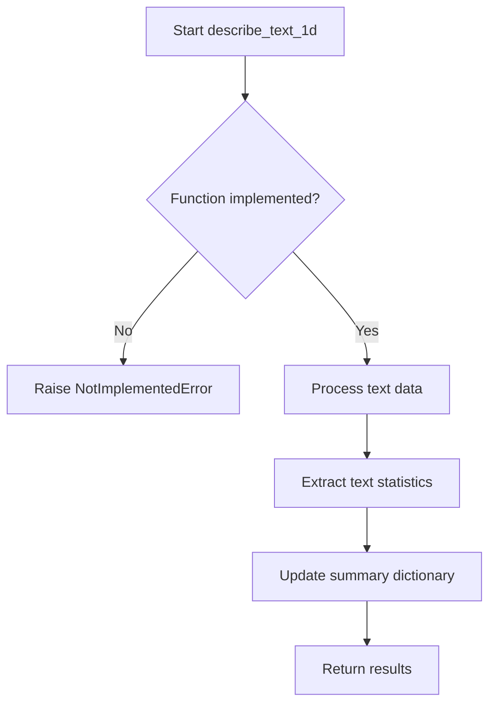
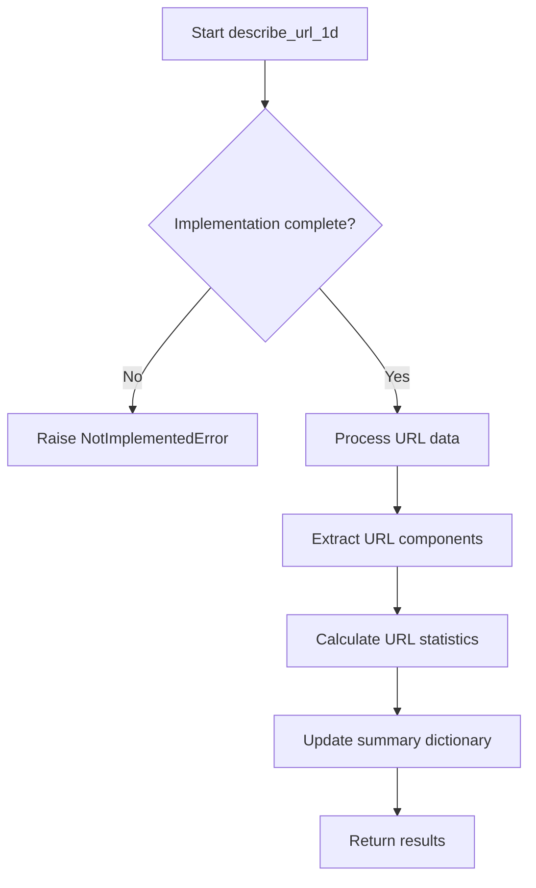
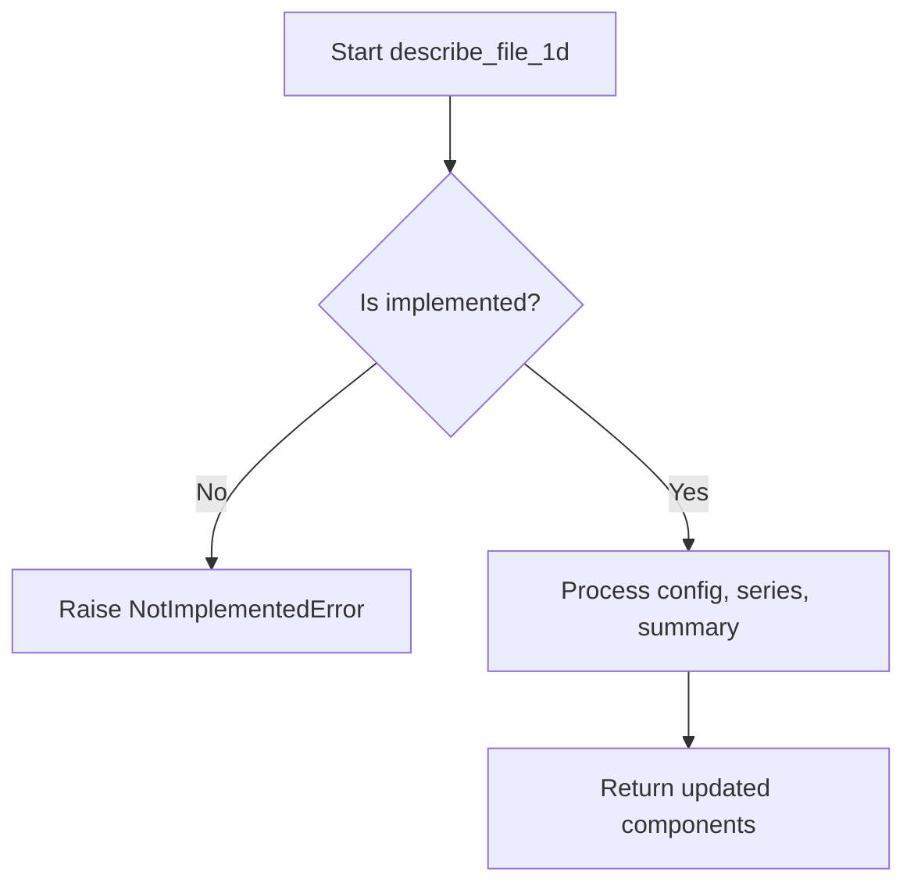
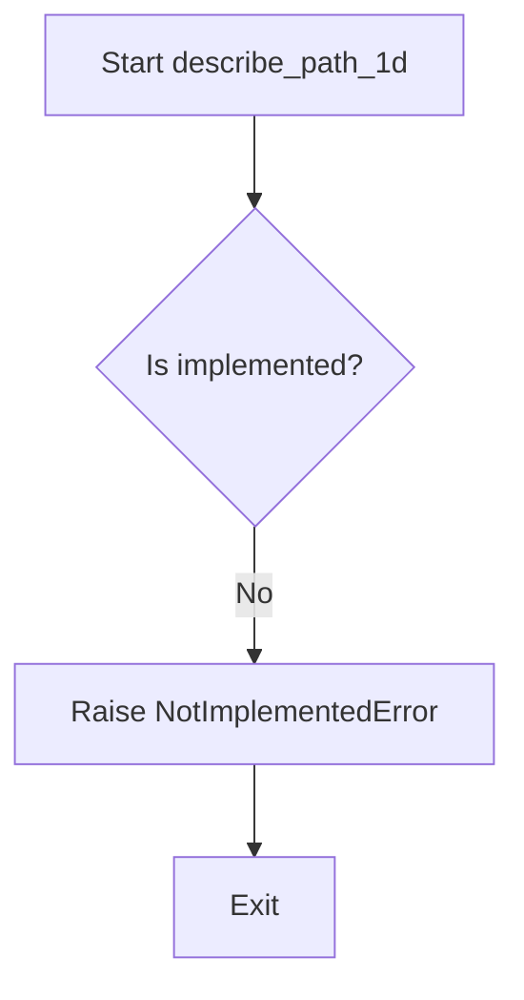
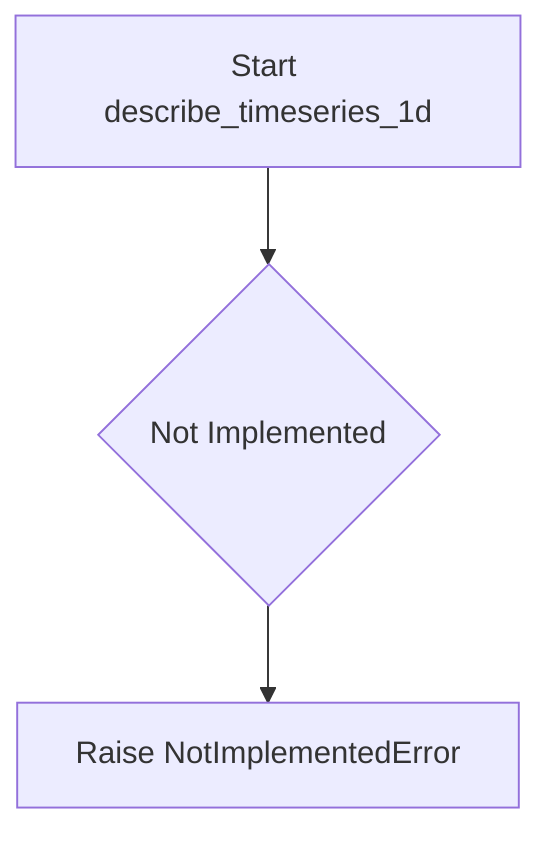

# `summary_algorithms.py`

## `src.ydata_profiling.model.summary_algorithms.func_nullable_series_contains` · *function*

## Summary:
Decorator that preprocesses pandas Series to handle nullable data by removing NaN values before passing to wrapped functions.

## Description:
This decorator wraps functions that process pandas Series data, automatically handling cases where the input series contains NaN values. It removes NaN values from the series and ensures that empty results after cleaning are handled gracefully by returning False instead of allowing downstream functions to process empty data.

## Args:
    fn (Callable): The function to be decorated, expected to accept (config: Settings, series: pd.Series, state: dict, *args, **kwargs) and return a boolean value.

## Returns:
    Callable: A decorated function that processes the input series by removing NaN values before calling the original function.

## Raises:
    None explicitly raised by this decorator, though the wrapped function may raise exceptions.

## Constraints:
    Preconditions:
    - Input series must be a pandas Series object
    - Wrapped function must accept (config: Settings, series: pd.Series, state: dict, *args, **kwargs) signature
    - config parameter must be of type Settings
    
    Postconditions:
    - If input series contains only NaN values, returns False
    - If input series is empty, returns False
    - Otherwise, returns result of wrapped function call

## Side Effects:
    None

## Control Flow:


## Examples:
```python
@func_nullable_series_contains
def my_analysis_function(config: Settings, series: pd.Series, state: dict) -> bool:
    # Analysis logic here
    return True

# Usage:
result = my_analysis_function(settings, series_with_nans, {})
# If series_with_nans contained only NaN values, result would be False
```

## `src.ydata_profiling.model.summary_algorithms.histogram_compute` · *function*

## Summary:
Computes histogram statistics for data profiling with configurable binning and weighting options.

## Description:
This function generates histogram data for numerical data profiling, applying configurable binning strategies and optional weighting. It handles automatic bin selection based on data characteristics and configuration settings, while respecting maximum bin limits. The function is designed to be used in data profiling pipelines where histogram data is needed for visualization and statistical analysis.

## Args:
    config (Settings): Configuration object containing plot settings including histogram parameters
    finite_values (np.ndarray): Array of finite numerical values to compute histogram for
    n_unique (int): Number of unique values in the dataset
    name (str, optional): Key name to store histogram results in returned dictionary. Defaults to "histogram"
    weights (np.ndarray, optional): Weights for each value in finite_values. When max_bins is exceeded, weights must match the number of bins to be used. Defaults to None

## Returns:
    dict: Dictionary containing histogram data under the specified name key. The value is a tuple of (histogram_counts, bin_edges) from numpy.histogram where:
        - histogram_counts: array of histogram bin counts
        - bin_edges: array of bin edge values

## Raises:
    None explicitly raised - relies on underlying numpy functions which may raise exceptions for invalid inputs

## Constraints:
    Preconditions:
        - finite_values must be a valid numpy array of numerical values
        - n_unique must be a positive integer representing unique values count
        - config must contain valid plot.histogram configuration
    Postconditions:
        - Returns a dictionary with exactly one entry (keyed by name parameter)
        - The histogram result follows numpy.histogram format (counts, bin_edges)
        - Bin edges are properly calculated according to configuration limits
        - When max_bins is exceeded, weights are either preserved or set to None based on length matching

## Side Effects:
    None - Pure function with no external state mutation or I/O operations

## Control Flow:
```mermaid
flowchart TD
    A[Start histogram_compute] --> B{hist_config.bins == 0?}
    B -- Yes --> C[bins_arg = "auto"]
    B -- No --> D[bins_arg = min(hist_config.bins, n_unique)]
    C --> E[bins = np.histogram_bin_edges(finite_values, bins=bins_arg)]
    D --> E
    E --> F{len(bins) > hist_config.max_bins?}
    F -- Yes --> G[bins = np.histogram_bin_edges(finite_values, bins=hist_config.max_bins)]
    G --> H{weights != None AND len(weights) == hist_config.max_bins?}
    H -- Yes --> I[weights = weights]
    H -- No --> J[weights = None]
    F -- No --> K[weights unchanged]
    I --> L
    J --> L
    K --> L
    L --> M[stats[name] = np.histogram(...)]
    M --> N[Return stats]
```

## Examples:
    # Basic usage
    config = Settings()
    values = np.array([1, 2, 2, 3, 3, 3])
    result = histogram_compute(config, values, 3)
    # Returns: {'histogram': (array([1, 2, 3]), array([1., 2., 3., 4.]))}

    # With custom name
    result = histogram_compute(config, values, 3, name="my_histogram")
    # Returns: {'my_histogram': (array([1, 2, 3]), array([1., 2., 3., 4.]))}

    # With weights
    weights = np.array([1.0, 1.0, 1.0, 1.0, 1.0, 1.0])
    result = histogram_compute(config, values, 3, weights=weights)
    # Returns: {'histogram': (array([1, 2, 3]), array([1., 2., 3., 4.]))}

## `src.ydata_profiling.model.summary_algorithms.chi_square` · *function*

## Summary:
Computes the chi-square test statistic and p-value for goodness of fit using observed frequencies.

## Description:
Performs a chi-square goodness of fit test to determine if the observed frequency distribution matches an expected distribution. When no histogram is provided, automatically generates a histogram from the input values using numpy's automatic bin selection.

## Args:
    values (Optional[np.ndarray]): Array of observed values to compute histogram from. Required when histogram is None.
    histogram (Optional[np.ndarray]): Array of observed frequencies. When None, computed from values using numpy.histogram.

## Returns:
    dict: Dictionary containing chi-square test results with keys:
        - statistic: The chi-square test statistic
        - pvalue: The p-value of the test

## Raises:
    None explicitly raised, but may raise exceptions from:
        - numpy.histogram_bin_edges when values is invalid
        - numpy.histogram when values is invalid  
        - scipy.stats.chisquare when histogram contains invalid values

## Constraints:
    Preconditions:
        - When histogram is None, values must be a valid numpy array with numeric data
        - When histogram is provided, it must be a valid numpy array of observed frequencies
        - Both values and histogram should contain numeric data suitable for chi-square testing
    
    Postconditions:
        - Returns a dictionary with exactly two keys: 'statistic' and 'pvalue'
        - All returned values are numeric (float or int)

## Side Effects:
    None

## Control Flow:
```mermaid
flowchart TD
    A[chi_square called] --> B{histogram == None?}
    B -- Yes --> C[Compute bins with np.histogram_bin_edges]
    C --> D[Compute histogram with np.histogram]
    D --> E[Call scipy.stats.chisquare]
    B -- No --> F[Directly call scipy.stats.chisquare]
    E --> G[Return dict(chisquare._asdict())]
    F --> G
```

## Examples:
    # Basic usage with values
    result = chi_square(values=np.array([1, 2, 2, 3, 3, 3]))
    print(result['statistic'])  # Chi-square statistic
    print(result['pvalue'])     # P-value
    
    # Usage with pre-computed histogram
    hist = np.array([1, 2, 3])
    result = chi_square(histogram=hist)
    print(result)  # {'statistic': ..., 'pvalue': ...}
```

## `src.ydata_profiling.model.summary_algorithms.series_hashable` · *function*

## Summary:
Decorator that conditionally executes a profiling function only when a series is hashable.

## Description:
This decorator wraps a profiling function and prevents its execution when the series is not hashable. It serves as a guard mechanism to ensure that profiling operations requiring hashable data are only applied to appropriate data types. The decorator checks the "hashable" flag in the summary dictionary and either returns early or proceeds with the wrapped function execution.

In data profiling contexts, hashable refers to data types that can be used as dictionary keys or set elements, such as strings, numbers, and tuples containing hashable elements. Non-hashable types like lists or dictionaries cannot be used in this way.

## Args:
    fn (Callable[[Settings, pd.Series, dict], Tuple[Settings, pd.Series, dict]]): The profiling function to be conditionally executed. This function must accept (Settings, pd.Series, dict) parameters and return (Settings, pd.Series, dict).

## Returns:
    Callable[[Settings, pd.Series, dict], Tuple[Settings, pd.Series, dict]]: A wrapped function that conditionally executes the original function based on hashability. The returned function maintains the same signature as the input function.

## Raises:
    None explicitly raised - the wrapped function may raise exceptions, but this decorator doesn't introduce new exceptions.

## Constraints:
    Preconditions:
    - The summary dictionary must contain a "hashable" key with a boolean value
    - The input parameters must match the expected signature: (Settings, pd.Series, dict)
    - The wrapped function must return a tuple of (Settings, pd.Series, dict)
    
    Postconditions:
    - If series is not hashable, returns input parameters unchanged
    - If series is hashable, returns result of wrapped function

## Side Effects:
    None - This decorator doesn't perform I/O or mutate external state directly.

## Control Flow:
```mermaid
flowchart TD
    A[series_hashable decorator] --> B{summary["hashable"]}
    B -- False --> C[Return config, series, summary]
    B -- True --> D[Execute fn(config, series, summary)]
    D --> E[Return fn result]
    C --> E
```

## Examples:
```python
@series_hashable
def calculate_unique_values(config: Settings, series: pd.Series, summary: dict) -> Tuple[Settings, pd.Series, dict]:
    # This function will only execute if summary["hashable"] is True
    unique_count = series.nunique()
    summary["unique_count"] = unique_count
    return config, series, summary

# Usage in profiling pipeline:
# When processing a dataset, if a column contains non-hashable data types,
# this decorator ensures that hashable-specific operations are skipped
# rather than causing errors.
```

## `src.ydata_profiling.model.summary_algorithms.series_handle_nulls` · *function*

## Summary:
Decorator that removes null values from pandas Series before processing, ensuring downstream functions work with clean data.

## Description:
This decorator function wraps another function that processes pandas Series data. It automatically detects and removes NaN values from the input series before passing the cleaned data to the wrapped function. This ensures that subsequent analysis operations work with complete data rather than having to handle null values repeatedly.

The function is designed to be applied as a decorator to various summary algorithms that process Series data, providing consistent null-value handling across different analysis operations.

## Args:
    fn (Callable[[Settings, pd.Series, dict], Tuple[Settings, pd.Series, dict]]): The function to be wrapped. This function should accept configuration settings, a pandas Series, and a summary dictionary, and return a tuple containing updated settings, series, and summary.

## Returns:
    Callable[[Settings, pd.Series, dict], Tuple[Settings, pd.Series, dict]]: A wrapped version of the input function that automatically handles null values in the Series.

## Raises:
    None explicitly raised by this decorator. Any exceptions would come from the wrapped function `fn`.

## Constraints:
    Preconditions:
    - Input series must be a valid pandas Series object
    - Function `fn` must accept the expected signature: (Settings, pd.Series, dict) -> Tuple[Settings, pd.Series, dict]
    
    Postconditions:
    - The returned series from the wrapped function will not contain any null values
    - The configuration and summary dictionaries are passed through unchanged (except potentially modified by the wrapped function)

## Side Effects:
    None directly caused by this decorator. However, it modifies the input Series by dropping null values, which could affect downstream processing if the original data integrity is important.

## Control Flow:


## Examples:
```python
@series_handle_nulls
def calculate_mean(config: Settings, series: pd.Series, summary: dict) -> Tuple[Settings, pd.Series, dict]:
    # This function will receive a series without NaN values
    mean_value = series.mean()
    summary['mean'] = mean_value
    return config, series, summary
```

## `src.ydata_profiling.model.summary_algorithms.named_aggregate_summary` · *function*

## Summary:
Generates a dictionary of aggregate statistical measures (max, mean, median, min) for a given series with prefixed keys.

## Description:
This function computes standard descriptive statistics (maximum, mean, median, minimum) for a pandas Series and returns them in a dictionary with keys formatted as "max_{key}", "mean_{key}", "median_{key}", and "min_{key}". The function is designed to provide consistent statistical summaries with configurable naming prefixes.

## Args:
    series (pd.Series): Input pandas Series containing numeric data for statistical computation
    key (str): String prefix used to format the dictionary keys for the returned statistics

## Returns:
    dict: Dictionary containing the computed statistics with keys following the pattern "max_{key}", "mean_{key}", "median_{key}", and "min_{key}"

## Raises:
    None explicitly raised in the function body

## Constraints:
    Preconditions:
    - The series parameter must be a valid pandas Series object
    - The series should contain numeric data for meaningful statistical computation
    - The key parameter must be a string
    
    Postconditions:
    - The returned dictionary will always contain exactly 4 keys
    - All values in the returned dictionary will be numeric (float or int)

## Side Effects:
    None

## Control Flow:
```mermaid
flowchart TD
    A[Start named_aggregate_summary] --> B[Validate inputs]
    B --> C[Compute max_{key}]
    C --> D[Compute mean_{key}]
    D --> E[Compute median_{key}]
    E --> F[Compute min_{key}]
    F --> G[Return summary dictionary]
```

## Examples:
```python
# Basic usage
series = pd.Series([1, 2, 3, 4, 5])
result = named_aggregate_summary(series, "value")
# Returns: {'max_value': 5, 'mean_value': 3.0, 'median_value': 3, 'min_value': 1}

# With different key
series = pd.Series([10, 20, 30])
result = named_aggregate_summary(series, "score")
# Returns: {'max_score': 30, 'mean_score': 20.0, 'median_score': 20, 'min_score': 10}
```

## `src.ydata_profiling.model.summary_algorithms.describe_counts` · *function*

## Summary:
Abstract interface for count statistics computation in data profiling workflows.

## Description:
This function represents an abstract interface for implementing count-based statistical analysis within the ydata-profiling framework. As a placeholder, it is intended to be overridden by specific implementations that handle count statistics for various data types and profiling contexts.

The function signature follows a standard pattern used throughout the profiling system where configuration, data series, and summary dictionaries are processed and returned in a consistent format.

## Args:
    config (Settings): Configuration object containing profiling settings and parameters
    series (Any): Input data series to analyze for count statistics  
    summary (dict): Dictionary containing existing profiling results to be updated with new count metrics

## Returns:
    Tuple[Settings, Any, dict]: A tuple containing the configuration, series, and summary dictionary in that order

## Raises:
    NotImplementedError: This function is not implemented and must be overridden by specific implementations

## Constraints:
    Preconditions:
    - config must be a valid Settings object
    - series should be compatible with count-based statistical operations
    - summary must be a mutable dictionary
    
    Postconditions:
    - Function signature remains consistent with expected profiling workflow interface

## Side Effects:
    None: This function does not modify external state or perform I/O operations

## Control Flow:


## Examples:
```python
# This function would typically be called in a profiling pipeline
# but currently raises NotImplementedError
config = Settings()
series = pd.Series([1, 2, 2, 3, 3, 3])
summary = {}

# This call would raise NotImplementedError
# result = describe_counts(config, series, summary)
```

## `src.ydata_profiling.model.summary_algorithms.describe_supported` · *function*

## Summary:
Abstract interface for identifying supported statistical measures for data series profiling.

## Description:
This function represents an abstract interface within the ydata-profiling library's statistical description system. It is designed to determine which statistical measures and operations are appropriate for describing a given data series during the profiling process. The function follows a standardized pattern where configuration settings, data series, and metadata are processed to identify supported statistical operations.

The current implementation raises NotImplementedError, indicating that this is an abstract method that must be implemented by specific subclasses or method overloads to handle different data types appropriately. This design pattern allows for polymorphic behavior across different series types (numeric, categorical, datetime, etc.).

## Args:
    config (Settings): Configuration settings controlling the profiling behavior and supported statistics
    series (Any): The data series being profiled, which can be of various types (numeric, categorical, datetime, etc.)
    series_description (dict): Existing metadata and description of the series being processed

## Returns:
    Tuple[Settings, Any, dict]: A tuple containing updated versions of the input parameters, though this specific implementation raises NotImplementedError

## Raises:
    NotImplementedError: Indicates that this abstract method must be implemented by subclasses or specific overloads for particular data types

## Constraints:
    Preconditions:
        - config must be a valid Settings object
        - series must be a valid data series object
        - series_description must be a dictionary containing valid metadata
    
    Postconditions:
        - The function signature maintains consistency with the profiling pipeline architecture
        - All returned components should be compatible with downstream processing steps

## Side Effects:
    None: This function does not perform any I/O operations or external state mutations

## Control Flow:


## Examples:
    # In a profiling pipeline, this function would be called as part of the description process
    # config = Settings()
    # series = pd.Series([1, 2, 3, 4, 5])
    # description = {}
    # try:
    #     updated_config, updated_series, updated_description = describe_supported(config, series, description)
    # except NotImplementedError:
    #     # This signals that a specific implementation is required for this data type
    #     # Implementation would be provided by subclasses or multimethod overloads
    #     pass

## `src.ydata_profiling.model.summary_algorithms.describe_generic` · *function*

## Summary:
Generates generic descriptive statistics for a data series while updating configuration and summary dictionaries.

## Description:
This function serves as a placeholder for generic data description logic in the ydata profiling system. It is designed to process a data series according to the provided configuration settings and update both the configuration and summary dictionaries with relevant statistical information. The function is intended to be overridden by more specific implementations for different data types or analysis approaches.

The function is typically called during the data profiling phase when generic statistical summaries need to be computed for various data series in a dataset.

## Args:
    config (Settings): Configuration settings object that controls the profiling behavior and parameters
    series (Any): The data series to be analyzed and described
    summary (dict): Dictionary containing existing summary statistics that will be updated with new information

## Returns:
    Tuple[Settings, Any, dict]: A tuple containing:
        - Updated Settings object with any configuration changes
        - Processed data series (potentially transformed or filtered)
        - Updated summary dictionary with new statistical information

## Raises:
    NotImplementedError: Always raised by this base implementation indicating that specific implementations must override this method

## Constraints:
    Preconditions:
        - config must be a valid Settings object
        - series must be a valid data series object
        - summary must be a mutable dictionary object
    
    Postconditions:
        - The function always raises NotImplementedError (base implementation)

## Side Effects:
    None - The base implementation does not perform any I/O operations or external state mutations

## Control Flow:
```mermaid
flowchart TD
    A[Start describe_generic] --> B{Is implemented?}
    B -- No --> C[Raise NotImplementedError]
    B -- Yes --> D[Process series with config]
    D --> E[Update summary dict]
    E --> F[Return (config, series, summary)]
```

## Examples:
```python
# This would normally be called internally by the profiling system
try:
    result = describe_generic(config, data_series, summary_dict)
except NotImplementedError:
    # This is expected for the base implementation
    print("Generic description not implemented - use specific algorithm")
```

## `src.ydata_profiling.model.summary_algorithms.describe_numeric_1d` · *function*

*No documentation generated.*

## `src.ydata_profiling.model.summary_algorithms.describe_text_1d` · *function*

## Summary:
Placeholder function for one-dimensional text data summarization in statistical profiling.

## Description:
This function serves as a placeholder for processing and summarizing one-dimensional text data series during automated data profiling. As part of the summary_algorithms module, it is intended to handle text-specific statistical analysis and feature extraction for text columns.

The function follows a consistent interface pattern with other type-specific summary functions like describe_numeric_1d and describe_categorical_1d, which process different data types in a uniform manner. When implemented, it should extract text-specific statistics and update the summary dictionary accordingly.

## Args:
    config (Settings): Configuration object containing profiling settings and options
    series (Any): Input data series containing text values to be analyzed
    summary (dict): Dictionary containing existing summary statistics that will be updated

## Returns:
    Tuple[Settings, Any, dict, Any]: A tuple containing:
        - Updated configuration object
        - Processed series data (potentially transformed or filtered)
        - Updated summary dictionary with text-specific statistics
        - Additional metadata or results from text analysis

## Raises:
    NotImplementedError: This function is not yet implemented and always raises this exception

## Constraints:
    Preconditions:
        - config must be a valid Settings object
        - series should contain text data or be convertible to text
        - summary should be a mutable dictionary object
    
    Postconditions:
        - When implemented, the returned summary dictionary will contain text-specific statistical entries
        - When implemented, the function should not modify the original series in-place

## Side Effects:
    None: This function is designed to be pure and not cause side effects

## Control Flow:


## Examples:
```python
# This function is not yet implemented and will raise NotImplementedError
# When implemented, it would be used in a profiling pipeline like:
from ydata_profiling.config import Settings
import pandas as pd

config = Settings()
series = pd.Series(['hello world', 'foo bar', 'test string'])
summary = {}

# Expected usage (currently raises NotImplementedError):
# updated_config, processed_series, updated_summary, metadata = describe_text_1d(config, series, summary)

# The expected behavior when implemented:
# - Analyze text characteristics (length, uniqueness, etc.)
# - Extract text-specific metrics
# - Update summary with text statistics
# - Return updated configuration and data
```

## `src.ydata_profiling.model.summary_algorithms.describe_date_1d` · *function*

## Summary:
Processes 1-dimensional date/time data and extracts temporal statistics for profiling.

## Description:
Analyzes date/time data in a single column (1D) and computes date-specific statistical measures to enrich the profiling summary. This function serves as a specialized handler for temporal data types within the data profiling framework, similar to other describe_* functions for numeric and categorical data.

## Args:
    config (Settings): Configuration object containing profiling settings and parameters
    series (Any): Input data series containing date/time values to be analyzed
    summary (dict): Dictionary containing existing profiling summary data that will be updated with date-specific statistics

## Returns:
    Tuple[Settings, Any, dict]: A tuple containing:
        - Updated configuration object (potentially modified based on date analysis)
        - Processed series (with potential transformations for date analysis)
        - Updated summary dictionary with date-specific statistics and temporal features

## Raises:
    NotImplementedError: This function is not yet implemented and raises an exception when called

## Constraints:
    Preconditions:
        - config must be a valid Settings object
        - series should contain date/time data or be convertible to datetime format
        - summary should be a mutable dictionary object
    
    Postconditions:
        - Function execution is not yet implemented (raises NotImplementedError)
        - When implemented, the summary dictionary will contain date-specific metrics

## Side Effects:
    None: Currently no side effects as the function is not implemented

## Control Flow:
```mermaid
flowchart TD
    A[Start describe_date_1d] --> B{Is implemented?}
    B -- No --> C[Raise NotImplementedError]
    B -- Yes --> D[Validate date series format]
    D --> E[Extract temporal features (year, month, day, etc.)]
    E --> F[Compute date statistics (min, max, count, etc.)]
    F --> G[Update summary with date metrics]
    G --> H[Return (config, series, summary)]
```

## Examples:
    # Typical usage in profiling pipeline for date columns
    try:
        config, processed_series, updated_summary = describe_date_1d(
            config=settings,
            series=date_column,
            summary=current_summary
        )
    except NotImplementedError:
        # Handle unimplemented function
        logger.warning("Date profiling not yet implemented")

## `src.ydata_profiling.model.summary_algorithms.describe_categorical_1d` · *function*

## Summary:
Computes descriptive statistics and summary information for a single-dimensional categorical data series.

## Description:
This function processes categorical data to generate comprehensive summary statistics and metadata. It analyzes the distribution of categories, computes frequency counts, identifies missing values, and updates the summary dictionary with categorical-specific metrics. The function follows a consistent pattern with other describe_* functions in the profiling module for type-specific data analysis.

## Args:
    config (Settings): Configuration object containing profiling settings and parameters
    series (pd.Series): Pandas Series containing categorical data to summarize
    summary (dict): Dictionary containing existing summary statistics to be updated

## Returns:
    Tuple[Settings, pd.Series, dict]: A tuple containing the (updated configuration, processed series, updated summary dictionary)

## Raises:
    NotImplementedError: When the function has not yet been implemented

## Constraints:
    Preconditions:
        - config must be a valid Settings object
        - series must be a pandas Series with categorical data type
        - summary must be a mutable dictionary object
    
    Postconditions:
        - The returned summary dictionary contains categorical-specific statistics
        - The series may be modified to include categorical metadata
        - Configuration object remains unchanged or is appropriately updated

## Side Effects:
    None: This function is designed to be pure and not cause external state changes

## Control Flow:
```mermaid
flowchart TD
    A[Start describe_categorical_1d] --> B{Validate inputs}
    B --> C{Series is categorical?}
    C -->|No| D[raise TypeError]
    C -->|Yes| E[Compute category frequencies]
    E --> F[Calculate missing value stats]
    F --> G[Update summary dictionary]
    G --> H[Return (config, series, summary)]
```

## Examples:
    # Typical usage in profiling workflow
    config = Settings()
    categorical_series = pd.Series(['A', 'B', 'A', 'C', None], dtype='category')
    summary = {}
    
    # This would normally compute statistics like:
    # - Category counts and percentages
    # - Missing value counts
    # - Unique category count
    # - Most frequent category
    
    result_config, result_series, result_summary = describe_categorical_1d(config, categorical_series, summary)
```

## `src.ydata_profiling.model.summary_algorithms.describe_url_1d` · *function*

## Summary:
Placeholder function for URL data summarization in 1D statistical profiling.

## Description:
This function serves as a placeholder for URL data analysis in the profiling pipeline. It is intended to process URL-type data from a pandas Series and extract meaningful statistical characteristics such as domain distribution, path patterns, protocol usage, and URL validity metrics. The function follows the standard pattern of other summary algorithms in this module by accepting configuration, data series, and a summary dictionary, then returning updated versions of these objects.

The function is designed to be part of a comprehensive data profiling system where different data types require specialized analysis routines. URL data often needs specific handling due to its structured nature and the variety of formats it can take.

## Args:
    config (Settings): Configuration object containing profiling settings and parameters
    series (Any): Input data series containing URL values to be analyzed
    summary (dict): Dictionary containing existing summary statistics that will be updated

## Returns:
    Tuple[Settings, Any, dict]: Returns a tuple containing the updated configuration, the processed series, and the updated summary dictionary

## Raises:
    NotImplementedError: Raised because this function is not yet implemented

## Constraints:
    Preconditions: 
    - config must be a valid Settings object
    - series should contain URL-like data or be compatible with URL processing
    - summary must be a mutable dictionary object
    
    Postconditions:
    - When implemented, the summary dictionary will be modified to include URL-specific statistics
    - When implemented, the returned series may be transformed or filtered based on URL validation

## Side Effects:
    None: This function does not perform any I/O operations or external state mutations

## Control Flow:


## Examples:
    # Placeholder usage - function currently raises NotImplementedError
    config = Settings()
    url_series = pd.Series(['https://example.com/path', 'http://test.org'])
    summary = {}
    # This will raise NotImplementedError currently
    # result_config, processed_series, updated_summary = describe_url_1d(config, url_series, summary)
    
    # Expected usage once implemented:
    # config = Settings()
    # url_series = pd.Series(['https://example.com/page?a=1', 'http://test.org/path'])
    # summary = {}
    # result_config, processed_series, updated_summary = describe_url_1d(config, url_series, summary)
    # The summary would contain URL-specific statistics like:
    # - Protocol distribution (HTTP vs HTTPS)
    # - Domain frequency counts
    # - Path complexity metrics

## `src.ydata_profiling.model.summary_algorithms.describe_file_1d` · *function*

## Summary:
Placeholder function for processing 1D data series in data profiling workflows.

## Description:
This function is intended to serve as a processing step for 1D data structures within the data profiling framework. It accepts configuration settings, a data series, and a summary dictionary, and is expected to return updated versions of these components. The function signature indicates it's part of a multimodal processing system for handling various data types.

As currently implemented, this function raises NotImplementedError, indicating it's not yet completed or integrated into the profiling pipeline.

## Args:
    config (Settings): Configuration object containing profiling parameters and settings
    series (Any): Input data series to be analyzed, typically a pandas Series or similar structure  
    summary (dict): Dictionary containing accumulated summary statistics and metadata

## Returns:
    Tuple[Settings, Any, dict]: A tuple containing updated configuration, processed series data, and updated summary statistics. The exact structure and content of these return values will be defined in the complete implementation.

## Raises:
    NotImplementedError: This function is not yet implemented and raises this exception when called

## Constraints:
    Preconditions:
        - config must be a valid Settings object instance
        - series should be compatible with data profiling operations
        - summary should be a mutable dictionary object
    
    Postconditions:
        - When implemented, function execution should not modify the original input series
        - When implemented, returned configuration should be valid and usable for subsequent processing
        - When implemented, summary dictionary should contain updated statistical information

## Side Effects:
    None: This function does not perform any I/O operations or external state mutations in its current form

## Control Flow:


## Examples:
```python
# This function is not yet implemented
# When implemented, it would be used like:
# config, series, summary = describe_file_1d(config, series, summary)
```

## `src.ydata_profiling.model.summary_algorithms.describe_path_1d` · *function*

## Summary:
Processes a 1-dimensional data path for profiling, updating configuration, data, and summary statistics.

## Description:
This function is designed to analyze and describe a 1-dimensional data path (typically a pandas Series) within a profiling context. It takes configuration settings, a data series, and an existing summary dictionary, then returns updated versions of these components after processing the data path.

The function is part of a data profiling system that analyzes datasets and builds comprehensive summaries of their characteristics. The "path" in the name likely refers to how data flows through the profiling pipeline or how a particular column/series is analyzed.

This function was not implemented in the current version and raises NotImplementedError.

## Args:
    config (Settings): Configuration settings for the profiling process
    series (Any): The 1-dimensional data series to be analyzed (typically a pandas Series)
    summary (dict): Existing summary statistics dictionary that will be updated

## Returns:
    Tuple[Settings, Any, dict]: A tuple containing:
        - Updated configuration settings
        - Processed data (same type as input series)
        - Updated summary dictionary with new statistics

## Raises:
    NotImplementedError: Always raised as this function is not implemented

## Constraints:
    Preconditions:
        - config must be a valid Settings object
        - series should be compatible with profiling operations
        - summary should be a mutable dictionary
    
    Postconditions:
        - Function always raises NotImplementedError (not implemented)

## Side Effects:
    None: This function does not perform any I/O operations or external state mutations.

## Control Flow:


## Examples:
```python
# This function would typically be used in a profiling pipeline like:
# config, processed_series, updated_summary = describe_path_1d(config, series, summary)
# But currently raises NotImplementedError
```

## `src.ydata_profiling.model.summary_algorithms.describe_image_1d` · *function*

*No documentation generated.*

## `src.ydata_profiling.model.summary_algorithms.describe_boolean_1d` · *function*

## Summary:
Placeholder function for analyzing and summarizing boolean data in a single column.

## Description:
This function serves as a placeholder for processing boolean data in data profiling pipelines. It is designed to analyze a pandas Series containing boolean values and update a summary dictionary with boolean-specific statistics. The function currently raises NotImplementedError as it is not yet implemented.

## Args:
    config (Settings): Configuration settings for the profiling process
    series (Any): Input data series, expected to contain boolean values
    summary (dict): Dictionary containing existing summary statistics to be updated

## Returns:
    Tuple[Settings, Any, dict]: Returns a tuple containing the configuration, series, and updated summary dictionary

## Raises:
    NotImplementedError: Raised by the current implementation indicating the function is not yet implemented

## Constraints:
    Preconditions:
        - The series parameter should contain boolean values or convertible boolean data
        - The summary dictionary should be initialized properly
        - Config should be a valid Settings object
    
    Postconditions:
        - When implemented, the summary dictionary will contain boolean-specific statistics
        - When implemented, the returned series will be unchanged (or properly processed)
        - When implemented, the configuration object will be returned unmodified

## Side Effects:
    None: This function is designed to be pure and not modify external state

## Control Flow:
```mermaid
flowchart TD
    A[Start describe_boolean_1d] --> B{Is function implemented?}
    B -- Yes --> C[Process boolean data]
    C --> D[Calculate boolean statistics]
    D --> E[Update summary dictionary]
    E --> F[Return (config, series, summary)]
    B -- No --> G[Raise NotImplementedError]
    G --> H[End]
```

## Examples:
    # This function is not yet implemented and will raise NotImplementedError
    # When implemented, it would typically be used in data profiling workflows:
    # config = Settings()
    # series = pd.Series([True, False, True, False])
    # summary = {}
    # result_config, result_series, result_summary = describe_boolean_1d(config, series, summary)
    # The result_summary would contain boolean-specific statistics like:
    # - count of True values
    # - count of False values
    # - percentage of True values
    # - missing value counts
```

## `src.ydata_profiling.model.summary_algorithms.describe_timeseries_1d` · *function*

## Summary:
Processes and summarizes one-dimensional time series data for statistical profiling.

## Description:
This function implements a specialized algorithm for analyzing and summarizing univariate time series data within the ydata-profiling framework. It is designed to extract statistical characteristics and temporal patterns from time series data, updating the summary statistics dictionary with relevant metrics such as trend analysis, seasonality detection, autocorrelation properties, and other time-dependent statistical measures.

The function is part of a multimethod dispatch system that handles different data types appropriately. It is currently not implemented and raises NotImplementedError, suggesting it's a placeholder for future implementation of time series-specific profiling capabilities.

Typical usage would involve this function being called during the profiling process when encountering time series data that requires specialized analysis beyond basic statistical summaries.

## Args:
    config (Settings): Configuration object containing profiling settings and parameters that influence how time series analysis is performed
    series (Any): Time series data in one dimension (typically pandas Series or array-like) containing temporal observations
    summary (dict): Dictionary containing existing summary statistics that will be augmented with time series specific metrics

## Returns:
    Tuple[Settings, Any, dict]: A tuple containing:
        - Updated configuration object (potentially modified based on time series characteristics)
        - Processed time series data (may include transformations, filtering, or sampling for analysis)
        - Updated summary dictionary with time series specific statistics added (such as trend coefficients, seasonal patterns, etc.)

## Raises:
    NotImplementedError: Always raised by this function as it is not yet implemented

## Constraints:
    Preconditions:
        - config parameter must be a valid Settings object with appropriate time series configuration
        - series parameter should contain time series data with temporal ordering
        - summary parameter should be a mutable dictionary object that can accept new key-value pairs
        
    Postconditions:
        - Function currently does not satisfy postconditions due to NotImplementedError

## Side Effects:
    None: This function does not perform any I/O operations or external state mutations in its current implementation

## Control Flow:


## Examples:
    Not applicable: Function is not implemented and raises NotImplementedError

