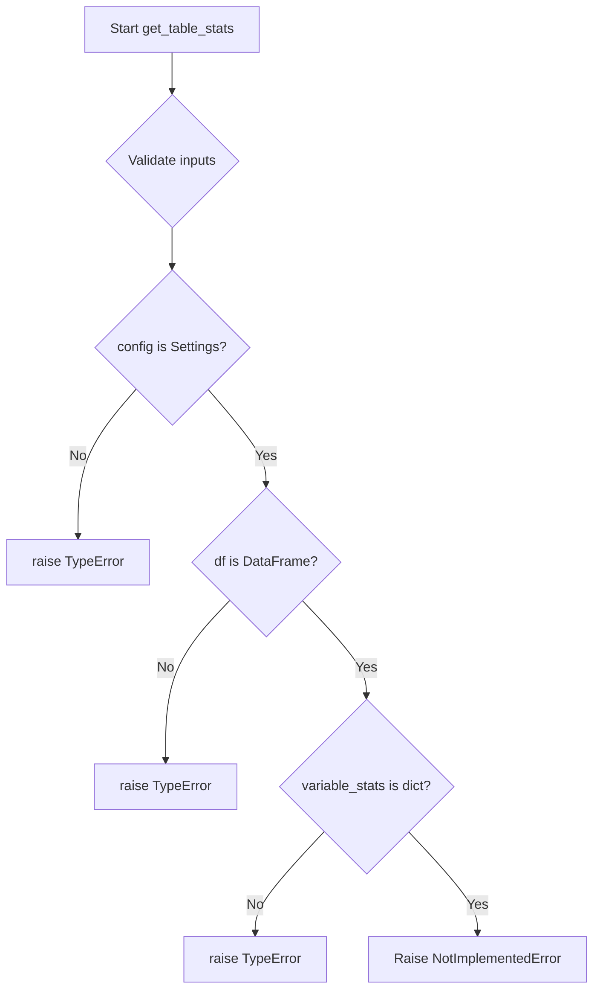

# `table.py`

## `src.ydata_profiling.model.table.get_table_stats` · *function*

## Summary:
Placeholder function for computing table-level statistics from DataFrame and variable statistics.

## Description:
This function serves as a placeholder for computing comprehensive table-level statistics from a DataFrame and associated variable-level statistics. It is intended to be implemented as part of a data profiling framework where variable-level statistics are aggregated into table-level metadata.

The function represents a key component in a data profiling pipeline where individual column statistics are consolidated into a unified view of the dataset's overall characteristics.

## Args:
    config (Settings): Configuration object containing profiling settings and options
    df (Any): Input DataFrame containing the data to profile
    variable_stats (dict): Dictionary containing variable-level statistics computed for each column

## Returns:
    dict: Placeholder return value indicating table-level statistics should be computed here

## Raises:
    NotImplementedError: This function is not yet implemented and raises this exception when called

## Constraints:
    Preconditions:
        - config must be a valid Settings object with proper configuration
        - df must be a valid DataFrame-like object
        - variable_stats must be a dictionary containing variable-level statistics
    
    Postconditions:
        - Function should return a dictionary with standardized table statistics keys
        - Implementation should respect the provided configuration settings

## Side Effects:
    None: This function does not perform any I/O operations or mutate external state

## Control Flow:


## Examples:
```python
# This function would typically be called in a profiling workflow
config = Settings()
df = pd.DataFrame({'A': [1, 2, 3], 'B': [4, 5, 6]})
variable_stats = {'A': {'count': 3, 'missing': 0}, 'B': {'count': 3, 'missing': 0}}

# This would raise NotImplementedError currently
# table_stats = get_table_stats(config, df, variable_stats)
```

