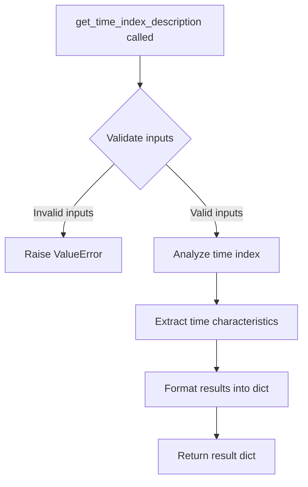

# `timeseries_index.py`

## `src.ydata_profiling.model.timeseries_index.get_time_index_description` · *function*

## Summary:
Extracts and describes the characteristics of a time index from time series data for profiling purposes.

## Description:
This function analyzes the time index of a time series DataFrame and generates a descriptive dictionary containing key characteristics and metadata about the time index. It serves as part of the data profiling pipeline to understand temporal properties of the dataset.

The function is designed to be implemented for time series data analysis, providing insights into the temporal structure of the data including frequency, range, and other time-related properties that are essential for time series profiling.

## Args:
    config (Settings): Configuration settings that control the profiling behavior and output format
    df (Any): The DataFrame containing time series data with a time index
    table_stats (dict): Pre-computed statistics about the entire table that may be relevant for time index analysis

## Returns:
    dict: A dictionary containing descriptive information about the time index, including but not limited to:
        - Time index frequency characteristics
        - Temporal range information
        - Index type and properties
        - Any relevant statistical summaries of the time index values

## Raises:
    NotImplementedError: This function is not yet implemented and raises this exception when called

## Constraints:
    Preconditions:
        - The input DataFrame should contain time series data with a valid time index
        - The table_stats dictionary should contain relevant metadata about the dataset
        - The config object should be properly initialized with appropriate settings

    Postconditions:
        - The returned dictionary should contain structured information about the time index
        - All time-related metadata should be accurately captured and formatted

## Side Effects:
    None: This function does not perform any I/O operations or mutate external state

## Control Flow:


## Examples:
```python
# Typical usage in a profiling pipeline
config = Settings()
df = pd.DataFrame({'date': pd.date_range('2020-01-01', periods=100), 'value': np.random.randn(100)})
table_stats = {'n_rows': 100, 'n_cols': 2}

# This would normally return detailed time index information
# result = get_time_index_description(config, df, table_stats)
```

