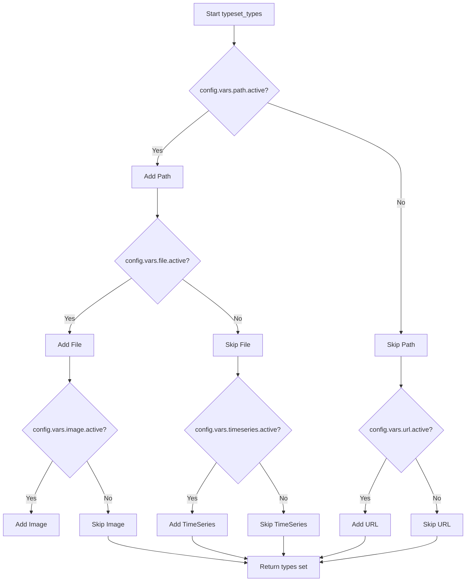
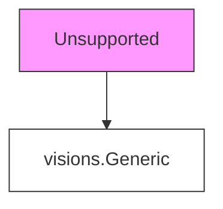
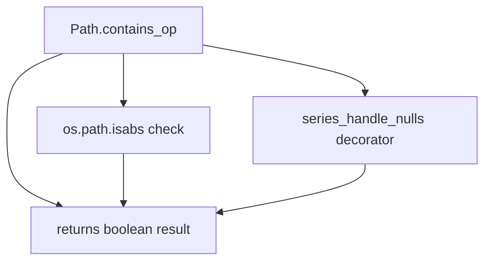

# `typeset.py`

## `src.ydata_profiling.model.typeset.series_handle_nulls` · *function*

## Summary:
Decorator that preprocesses pandas Series by handling null values before applying type inference logic.

## Description:
This decorator wraps type inference functions to automatically handle missing values in pandas Series. When a Series contains null values, it drops them before passing the cleaned data to the wrapped function. If all values are null, it returns False immediately without calling the wrapped function.

## Args:
    fn (Callable[..., bool]): The type inference function to wrap, which expects a pandas Series, state dictionary, and optional arguments.

## Returns:
    Callable[..., bool]: A decorated function that handles null values in the input Series before calling the original function.

## Raises:
    None explicitly raised - delegates any exceptions from the wrapped function.

## Constraints:
    Preconditions:
        - Input series must be a valid pandas Series
        - State dictionary must be mutable (can be modified)
        - Wrapped function must accept (series, state, *args, **kwargs) signature
    
    Postconditions:
        - If series has no nulls, original function is called with unchanged series
        - If series has nulls, original function is called with null-free series
        - If series becomes empty after dropping nulls, False is returned immediately

## Side Effects:
    None - does not perform I/O operations or mutate external state beyond modifying the input state dictionary.

## Control Flow:
```mermaid
flowchart TD
    A[series_handle_nulls called] --> B{hasnans in state?}
    B -- No --> C[state["hasnans"] = series.hasnans]
    C --> D{state["hasnans"]?}
    D -- Yes --> E[series = series.dropna()]
    E --> F{series.empty?}
    F -- Yes --> G[return False]
    F -- No --> H[fn(series, state, *args, **kwargs)]
    D -- No --> H
    B -- Yes --> D
```

## Examples:
```python
# Basic usage as decorator
@series_handle_nulls
def my_type_check(series, state, *args, **kwargs):
    return len(series) > 0

# Usage with pandas Series
import pandas as pd
series_with_nans = pd.Series([1, 2, None, 4])
state = {}
result = my_type_check(series_with_nans, state)  # Handles nulls internally
```

## `src.ydata_profiling.model.typeset.typeset_types` · *function*

## Summary:
Creates and returns a set of VisionsBaseType classes defining data type detection logic for profiling, with conditional inclusion based on configuration settings.

## Description:
This function constructs a collection of type classes that implement Visions' type detection framework. Each type class defines how to identify and relate different data types through `get_relations()` and `contains_op()` methods. The resulting set of types can be used by the profiling system to automatically detect column data types in datasets.

The function dynamically builds the type set based on configuration flags, allowing selective activation of advanced types like URLs, file paths, images, and time series analysis.

## Args:
    config (Settings): Configuration object containing flags that control which type classes are included in the returned set.

## Returns:
    Set[visions.VisionsBaseType]: A set of VisionsBaseType subclasses that define type detection logic for data profiling.

## Raises:
    None explicitly raised

## Constraints:
    Preconditions:
    - The config parameter must be a valid Settings object with properly initialized variables
    - All configuration variables (vars.path.active, vars.file.active, etc.) must be accessible
    
    Postconditions:
    - Always returns a set containing at least the basic types: Unsupported, Boolean, Numeric, Text, Categorical, DateTime
    - Conditional types (URL, Path, File, Image, TimeSeries) are only included when their respective config flags are True

## Side Effects:
    None

## Control Flow:


## Examples:
```python
# Basic usage with default configuration
from ydata_profiling.config import Settings
from ydata_profiling.model.typeset import typeset_types

config = Settings()
type_set = typeset_types(config)
print(len(type_set))  # Will include basic types: Unsupported, Boolean, Numeric, Text, Categorical, DateTime

# With path enabled
config.vars.path.active = True
type_set = typeset_types(config)
# Now includes Path type in addition to basic types
```

## `src.ydata_profiling.model.typeset.Unsupported` · *class*

## Summary:
Placeholder class representing an unsupported data type in the visions type system.

## Description:
The `Unsupported` class is a minimal implementation that inherits from `visions.Generic`. It serves as a fallback type in the type inference system for data that cannot be classified into any of the recognized data types. This class is typically instantiated automatically by the type detection framework when no other type relation matches the data characteristics.

## State:
- Inherits from `visions.Generic` 
- Contains no additional attributes or methods beyond the parent class
- Minimal implementation with `pass` statement

## Lifecycle:
- Creation: Instantiated automatically by the type inference system
- Usage: Used internally by the visions framework for type resolution
- Destruction: Managed by Python's garbage collection

## Method Map:


## Raises:
- No explicit exceptions defined in the class
- Inherits exception handling from `visions.Generic` parent class

## Example:
```python
# This class is used internally by the type detection system
# No direct instantiation is expected by users of the library

# Internally used when type inference fails to match other types
unsupported_type = Unsupported()  # Created automatically by system
```

## `src.ydata_profiling.model.typeset.Numeric` · *class*

## Summary:
Numeric represents a numeric data type in the ydata-profiling type detection system, identifying pandas Series containing numeric values while excluding boolean data.

## Description:
The Numeric class is a type detector that identifies numeric data within pandas Series. It serves as part of the vision-based type inference system used by ydata-profiling to automatically detect data types in datasets. This class specifically handles numeric data detection and transformation, distinguishing between numeric and boolean data types.

The class is designed to be used by the type inference engine to classify data columns. It provides both identity relations (for unsupported types) and inference relations (to convert text representations of numbers into actual numeric types).

## State:
- Inherits from visions.VisionsBaseType
- Contains no instance attributes beyond those inherited from the parent class
- The `config` variable referenced in the lambda function is expected to be provided from the broader context (likely from Settings or configuration system)

## Lifecycle:
- Creation: Instantiated automatically by the type inference system when needed
- Usage: Used by the type detection engine to determine if a Series contains numeric data
- Destruction: Managed automatically by Python's garbage collection

## Method Map:
```mermaid
graph TD
    A[Numeric.get_relations] --> B[IdentityRelation(Unsupported)]
    A --> C[InferenceRelation(Text)]
    C --> D[string_is_numeric]
    C --> E[string_to_numeric]
    F[Numeric.contains_op] --> G[pdt.is_numeric_dtype]
    F --> H[pdt.is_bool_dtype]
```

## Raises:
- No explicit exceptions are raised by the constructor
- The `contains_op` method relies on underlying pandas operations and may raise exceptions from pandas type checking functions if the Series is malformed
- The `get_relations` method may raise exceptions from the relation construction process

## Example:
```python
# The Numeric class is typically used internally by the profiling system
# Example of how it might be invoked during type inference:
import pandas as pd
from ydata_profiling.model.typeset import Numeric

# Create a sample numeric series
series = pd.Series([1, 2, 3, 4, 5])

# The contains_op method determines if series is numeric
result = Numeric.contains_op(series, {})

# The get_relations method defines how this type relates to others
relations = Numeric.get_relations()
```

### `src.ydata_profiling.model.typeset.Numeric.get_relations` · *method*

## Summary:
Returns the type relations for the Numeric type, defining how it relates to other types in the type inference system.

## Description:
This static method defines the relationship between the Numeric type and other types in the type system. It specifies that Numeric is identical to Unsupported and can be inferred from Text type using numeric validation and conversion functions. This method is part of the type inference framework that determines data types in datasets.

## Args:
    None

## Returns:
    Sequence[TypeRelation]: A sequence containing:
        - IdentityRelation(Unsupported): Indicates Numeric type is identical to Unsupported type
        - InferenceRelation(Text, relationship, transformer): Indicates Text type can be inferred to Numeric type using string_is_numeric validation and string_to_numeric transformation

## Raises:
    None explicitly raised

## State Changes:
    None

## Constraints:
    Preconditions:
        - The method assumes the existence of a global config object containing type configuration
        - The string_is_numeric and string_to_numeric functions must be properly defined and accessible
    Postconditions:
        - Returns a sequence of exactly two TypeRelation objects
        - First relation is always IdentityRelation(Unsupported)
        - Second relation always maps Text to Numeric type

## Side Effects:
    None

### `src.ydata_profiling.model.typeset.Numeric.contains_op` · *method*

## Summary:
Determines whether a pandas Series contains numeric data excluding boolean data types.

## Description:
This static method is part of the Numeric type inference system and evaluates whether a given pandas Series should be classified as numeric. It serves as a containment operation that checks the data type properties of the series while handling null values appropriately.

The method is decorated with `@multimethod` for polymorphic dispatch, `@series_not_empty` to ensure non-empty series, and `@series_handle_nulls` to manage missing values before evaluation.

## Args:
    series (pd.Series): The pandas Series to evaluate for numeric type membership
    state (dict): A dictionary containing metadata about the series, including null value tracking

## Returns:
    bool: True if the series has a numeric dtype and is not boolean dtype; False otherwise

## Raises:
    None explicitly raised - relies on underlying pandas type checking functions

## State Changes:
    Attributes READ: None
    Attributes WRITTEN: None

## Constraints:
    Preconditions:
        - The series parameter must be a valid pandas Series object
        - The state parameter must be a dictionary (can be empty)
    
    Postconditions:
        - Returns a boolean value indicating numeric type membership
        - The returned value is independent of the series' actual values, only its dtype

## Side Effects:
    None - This is a pure function that only performs type checking operations

## `src.ydata_profiling.model.typeset.Text` · *class*

## Summary:
Defines a text/string data type for the ydata-profiling framework, implementing type validation logic for string series.

## Description:
The Text class represents a text/string data type within the ydata-profiling system's type inference framework. It inherits from visions.VisionsBaseType and provides the necessary infrastructure to identify and validate string data types in pandas Series. This class is used by the profiling system to categorize data columns appropriately for statistical analysis and reporting.

The class implements two key methods: get_relations() which defines the relationship between this type and other types in the system, and contains_op() which performs validation checks on pandas Series to determine compatibility with the text type.

## State:
- Inherits all state from visions.VisionsBaseType parent class
- No additional instance attributes defined in this class
- The contains_op method operates on a pandas Series and state dictionary that contains type inference metadata

## Lifecycle:
- Creation: Automatically instantiated by the type inference system during profiling
- Usage: Called internally during type detection when validating if a Series matches the text type criteria
- Destruction: Managed by Python's garbage collection

## Method Map:
```mermaid
graph TD
    A[Text.get_relations] --> B[Returns IdentityRelation(Unsupported)]
    C[Text.contains_op] --> D[Validates series against text type criteria]
    D --> E[not pdt.is_categorical_dtype(series)]
    D --> F[pdt.is_string_dtype(series)]
    D --> G[series_is_string(series, state)]
    D --> H[Returns boolean validation result]
```

## Raises:
- No explicit exceptions raised by __init__ method (inherited from parent)
- Exceptions may be raised by underlying pandas dtype checking functions or series_is_string function
- The series_handle_nulls decorator may modify behavior with null values in the series

## Example:
```python
# The Text class is typically used internally by the profiling system
# Example of how contains_op would be used in the type inference process:
# result = Text.contains_op(my_series, {"some_state": "data"})
# This would return True if my_series passes all validation checks for text type
```

### `src.ydata_profiling.model.typeset.Text.get_relations` · *method*

## Summary:
Returns the type relations for the Text type, establishing an identity relationship with the Unsupported type.

## Description:
This static method defines the type relationships for the Text class within the Visions type system. It specifies that when a data series is identified as Text type, it should also be considered as Unsupported type according to the identity relation. This method is part of the type inference mechanism that helps the profiling system understand how different data types relate to each other.

The method is called during type inference operations when the system needs to determine the complete set of type relationships for the Text type. This allows the profiling system to properly categorize and handle text data in the context of the broader type hierarchy.

## Args:
    None

## Returns:
    Sequence[TypeRelation]: A sequence containing a single IdentityRelation that establishes an identity relationship between Text and Unsupported types.

## Raises:
    None

## State Changes:
    None

## Constraints:
    Preconditions:
    - This method is designed to be called as a static method on the Text class
    - The method should only be called during type inference initialization phase
    
    Postconditions:
    - The returned sequence always contains exactly one IdentityRelation
    - The IdentityRelation always relates Text to Unsupported type

## Side Effects:
    None

### `src.ydata_profiling.model.typeset.Text.contains_op` · *method*

## Summary:
Determines whether a pandas Series should be classified as Text type based on its data characteristics and type properties.

## Description:
This static method is part of the Text type inference system and evaluates whether a given pandas Series meets the criteria for being categorized as Text type. It serves as a type containment operation that checks if a series contains string-like data that should be treated as textual content rather than other data types like categories or numerics.

The method is decorated with `@series_handle_nulls` which preprocesses the series by handling null values before evaluation, ensuring robust type inference even with missing data.

## Args:
    series (pd.Series): The pandas Series to evaluate for Text type classification
    state (dict): A dictionary containing metadata about the series, including null value tracking

## Returns:
    bool: True if the series should be classified as Text type, False otherwise

## Raises:
    None explicitly raised - however, underlying operations may raise TypeError or ValueError during type conversion

## State Changes:
    Attributes READ: None (reads from the state dictionary indirectly via the decorator)
    Attributes WRITTEN: None

## Constraints:
    Preconditions:
    - The series should be a valid pandas Series object
    - The state dictionary should be properly initialized with required metadata
    
    Postconditions:
    - Returns a boolean value indicating Text type classification
    - The series itself is not modified
    - The state dictionary may be updated by the @series_handle_nulls decorator

## Side Effects:
    None - does not perform I/O operations or mutate external state beyond what's handled by decorators

## `src.ydata_profiling.model.typeset.DateTime` · *class*

## Summary:
Represents a datetime type in the visions type system for data profiling, providing methods to detect and infer datetime data from pandas Series.

## Description:
The DateTime class is a type definition within the ydata-profiling library's type system that identifies datetime data. It serves as a specialized type that can be detected in pandas Series and used for data profiling purposes. This class implements the standard VisionsBaseType interface to define datetime type relationships and detection logic.

This class is typically instantiated automatically by the type inference system when analyzing data, rather than being created directly by user code. It's part of the type set that helps categorize data fields in data profiling reports.

## State:
- Inherits from visions.VisionsBaseType (base type class)
- Contains no instance attributes beyond those inherited from the parent class
- The contains_op method operates on pandas Series and state dictionary parameters
- Uses internal utility functions for datetime detection and conversion

## Lifecycle:
- Creation: Automatically instantiated by the visions type system during type inference
- Usage: Called internally by the type detection and inference mechanisms when processing data
- Destruction: Managed by Python's garbage collection when no longer referenced

## Method Map:
```mermaid
graph TD
    A[DateTime.get_relations] --> B[IdentityRelation(Unsupported)]
    A --> C[InferenceRelation(Text)]
    C --> D[string_is_datetime]
    C --> E[string_to_datetime]
    F[DateTime.contains_op] --> G[pdt.is_datetime64_any_dtype]
    F --> H[series.apply(type).isin([datetime.date, datetime.datetime])]
```

## Raises:
- No explicit exceptions are documented in the source code
- The contains_op method is decorated with @series_handle_nulls which handles null value cases gracefully
- The implementation is designed to handle edge cases without raising exceptions

## Example:
```python
# This class is typically used internally by the profiling system
# When a pandas Series is analyzed for type detection, DateTime may be identified

# Example of internal usage pattern:
# series = pd.Series(['2023-01-01', '2023-01-02'])
# result = DateTime.contains_op(series, {})
# This would return True if the series contains datetime-like data
```

### `src.ydata_profiling.model.typeset.DateTime.get_relations` · *method*

## Summary:
Defines the type relationships for the DateTime type, establishing identity with Unsupported and inference from Text.

## Description:
This static method returns a sequence of TypeRelation objects that define how the DateTime type relates to other types in the visions type system. It establishes that DateTime is identical to the Unsupported type and can be inferred from Text type data using specific datetime conversion functions.

## Args:
    None

## Returns:
    Sequence[TypeRelation]: A sequence containing two TypeRelation objects:
        - IdentityRelation(Unsupported): Indicates DateTime type is treated identically to Unsupported type in the type system
        - InferenceRelation(Text, ..., string_to_datetime): Defines inference rules allowing Text data to be converted to DateTime type using string_is_datetime validation and string_to_datetime transformation

## Raises:
    None explicitly raised

## State Changes:
    None

## Constraints:
    Preconditions:
        - This method is a static method and operates independently of instance state
        - The visions framework must properly support IdentityRelation and InferenceRelation types
        - The Text and Unsupported types must be valid type identifiers within the visions system
        - The string_is_datetime and string_to_datetime utility functions must be available and functional
    
    Postconditions:
        - Returns exactly two TypeRelation objects in the specified order
        - The returned relations accurately represent the DateTime type's relationship to other types in the visions framework

## Side Effects:
    None

### `src.ydata_profiling.model.typeset.DateTime.contains_op` · *method*

## Summary:
Determines whether a pandas Series contains datetime data by checking both pandas datetime64 dtypes and builtin Python datetime types.

## Description:
This static method is used in the datetime type detection system to identify whether a given pandas Series contains datetime data. It serves as a core component in the type inference process for datetime data types. The method is decorated with `@series_handle_nulls` which ensures proper handling of null values in the series before processing.

## Args:
    series (pd.Series): The pandas Series to check for datetime content
    state (dict): A dictionary containing metadata about the series, including null value information

## Returns:
    bool: True if the series contains datetime data (either pandas datetime64 dtype or builtin datetime.date/datetime.datetime types), False otherwise

## Raises:
    None explicitly raised - however, underlying operations may raise exceptions from pandas operations

## State Changes:
    Attributes READ: None (reads from the state dictionary but doesn't modify it)
    Attributes WRITTEN: None

## Constraints:
    Preconditions: 
    - The series parameter must be a valid pandas Series
    - The state parameter must be a dictionary (can be empty)
    
    Postconditions:
    - Returns a boolean value indicating datetime content presence
    - The original series and state are not modified

## Side Effects:
    None - This method is pure and has no side effects beyond returning a boolean value

## `src.ydata_profiling.model.typeset.Categorical` · *class*

## Summary:
Represents a categorical data type in the visions type system for data profiling.

## Description:
The Categorical class implements a type checker for categorical data within the visions library framework. It defines how categorical data is identified and related to other data types such as Numeric and Text. This class is part of the ydata-profiling library's type inference system that automatically detects data types in datasets.

The class provides two main functionalities:
1. Type relations that define how categorical data relates to other data types
2. Validation logic to determine if a pandas Series contains categorical data

## State:
- Inherits from visions.VisionsBaseType
- No instance attributes beyond those inherited from parent class
- The get_relations method defines type relationships with other data types
- The contains_op method performs validation checks on series data

## Lifecycle:
- Creation: Instantiated automatically by the visions type system when building type hierarchies
- Usage: Called internally by the visions framework during type inference operations
- Destruction: Managed by Python's garbage collection

## Method Map:
```mermaid
graph TD
    A[Categorical] --> B[get_relations]
    A --> C[contains_op]
    B --> D[IdentityRelation(Unsupported)]
    B --> E[InferenceRelation(Numeric)]
    B --> F[InferenceRelation(Text)]
    C --> G[pd.Series validation with dtype checks]
```

## Raises:
- No explicit exceptions documented in the source code
- Exceptions may be raised by underlying visions framework operations or pandas dtype checking functions

## Example:
```python
# Used internally by the visions framework during type inference
# Typical usage would be:
# 1. get_relations() is called to establish type relationships
# 2. contains_op() is called during validation of candidate categorical data
```

### `src.ydata_profiling.model.typeset.Categorical.get_relations` · *method*

## Summary:
Defines the type relationships for categorical data, specifying when numeric and text data can be inferred as categorical.

## Description:
This static method returns a sequence of type relations that establish how the Categorical type connects to other types in the type inference system. It enables automatic type inference where numeric and text data may be classified as categorical based on statistical thresholds.

## Returns:
    Sequence[TypeRelation]: A list containing three TypeRelation objects:
        1. IdentityRelation(Unsupported): Categorical data is considered identical to unsupported data
        2. InferenceRelation(Numeric): Numeric data can be inferred as categorical when it has a limited number of unique values (controlled by configuration thresholds)
        3. InferenceRelation(Text): Text data can be inferred as categorical when it meets cardinality and uniqueness criteria (controlled by configuration thresholds)

## State Changes:
    - Attributes READ: None (method is static and doesn't modify instance state)
    - Attributes WRITTEN: None (method is static and doesn't modify instance state)

## Constraints:
    - Preconditions: The method assumes that `config` and imported helper functions (`numeric_is_category`, `string_is_category`) are available in the execution environment
    - Postconditions: The returned sequence always contains exactly three TypeRelation objects in the specified order

## Side Effects:
    - No direct I/O operations
    - No external service calls
    - No mutations to objects outside the method scope

### `src.ydata_profiling.model.typeset.Categorical.contains_op` · *method*

## Summary:
Checks if a pandas Series has a valid categorical data type (excluding boolean types) for type inference purposes.

## Description:
This static method serves as a type checking operation within the Categorical type system. It determines whether a given pandas Series should be considered as belonging to the categorical data type category, excluding boolean data types. The method is part of a polymorphic dispatch system used in data type inference and validation. It's decorated with `@multimethod`, `@series_not_empty`, and `@series_handle_nulls` to support type dispatch and handle edge cases like empty or null-containing series.

## Args:
    series (pd.Series): The pandas Series to check for categorical data type
    state (dict): A dictionary containing metadata about the series, including null value information

## Returns:
    bool: True if the series has a categorical dtype but not a boolean dtype, False otherwise

## Raises:
    None explicitly raised - however, underlying pandas API calls may raise exceptions for invalid inputs

## State Changes:
    Attributes READ: None (method is static and doesn't modify instance state)
    Attributes WRITTEN: None (method is static and doesn't modify instance state)

## Constraints:
    Preconditions:
    - The series parameter must be a valid pandas Series object
    - The state parameter must be a dictionary (can be empty)
    
    Postconditions:
    - Returns a boolean value indicating whether the series qualifies as categorical (but not boolean)
    - The method is idempotent and has no side effects

## Side Effects:
    None - This method performs only type checking operations without any I/O, external service calls, or mutations to objects outside its scope

## `src.ydata_profiling.model.typeset.Boolean` · *class*

*No documentation generated.*

### `src.ydata_profiling.model.typeset.Boolean.get_relations` · *method*

## Summary:
Returns type relations that define how boolean data types map to and from other data types in the type inference system.

## Description:
This static method configures the type relationships for boolean data types within the ydata-profiling type system. It returns a sequence of two TypeRelation objects that specify how boolean values relate to other data types during type inference.

The method establishes:
1. An identity relationship with Unsupported types (ensuring boolean types are not incorrectly classified as unsupported)
2. An inference relationship from Text type to Boolean type, using configured string mappings to convert text representations into boolean values through a relationship function and transformer function

This method is called during the initialization of the boolean type system to configure proper type conversion behavior for boolean data, particularly handling string representations of boolean values according to configured mappings.

## Args:
    None

## Returns:
    Sequence[TypeRelation]: A sequence containing exactly two TypeRelation objects:
        - IdentityRelation(Unsupported): Defines identity relationship with unsupported types
        - InferenceRelation(Text, relationship_function, transformer_function): Defines inference relationship from Text to Boolean type using partial applications of string_is_bool and string_to_bool functions with configured mappings

## Raises:
    None explicitly raised

## State Changes:
    None - This is a static method that doesn't modify instance state

## Constraints:
    Preconditions:
        - config.vars.bool.mappings must be properly initialized with string-to-boolean mapping dictionary
        - Text and Unsupported must be valid type identifiers in the type system
    Postconditions:
        - Returns exactly two TypeRelation objects in the specified configuration order
        - The inference relation uses the configured boolean string mappings for text-to-boolean conversion

## Side Effects:
    None - This method performs no I/O operations or external service calls

### `src.ydata_profiling.model.typeset.Boolean.contains_op` · *method*

## Summary:
Determines whether a pandas Series contains boolean values by checking data type and value content.

## Description:
This static method serves as a type checking operation to identify if a given pandas Series contains boolean values. It's part of the Boolean type detection system within the ydata-profiling library. The method handles two main cases: object dtype series where it validates that all values are either True or False, and other dtypes where it uses pandas' native boolean dtype checking.

## Args:
    series (pd.Series): The pandas Series to check for boolean values
    state (dict): A dictionary containing metadata about the series, including null value information

## Returns:
    bool: True if the series contains boolean values, False otherwise

## Raises:
    None explicitly raised - though the method includes a bare except clause that could mask exceptions

## State Changes:
    Attributes READ: None
    Attributes WRITTEN: Updates the state dictionary with "hasnans" key if not already present

## Constraints:
    Preconditions: 
    - The series parameter must be a valid pandas Series
    - The state parameter must be a dictionary
    
    Postconditions:
    - Returns a boolean value indicating presence of boolean data
    - The state dictionary may be updated with null value information

## Side Effects:
    - May modify the state dictionary by adding a "hasnans" key
    - Processes the series by potentially dropping null values when the series_handle_nulls decorator is applied

## `src.ydata_profiling.model.typeset.URL` · *class*

## Summary:
Represents the URL data type for data profiling, identifying pandas Series containing valid URL strings.

## Description:
The URL class is a specialized data type implementation within the ydata-profiling framework that identifies and validates pandas Series containing URL strings. It inherits from visions.VisionsBaseType and treats URLs as a special case of Text data type. This class is used during automated data type inference to recognize columns that contain uniform resource locators.

## State:
- Inherits all state from visions.VisionsBaseType parent class
- No additional instance attributes beyond those inherited
- The contains_op method operates on a pandas Series and state dictionary

## Lifecycle:
- Creation: Instantiated automatically by the profiling framework during type inference
- Usage: Called internally by the type inference system when validating potential URL data
- Destruction: Managed by Python's garbage collection

## Method Map:
```mermaid
graph TD
    A[URL.contains_op] --> B[series_handle_nulls]
    B --> C[urlparse(x) for x in series]
    C --> D[all(x.netloc and x.scheme for x in url_gen)]
```

## Raises:
- AttributeError: When elements in the series cannot be parsed by urlparse (caught internally)

## Example:
```python
# Typically used internally by the profiling framework
# URL instances are created automatically during type inference

# Example of what URL validation would check:
# Valid URLs: "https://www.example.com/path", "http://example.org"
# Invalid URLs: "not_a_url", "ftp://invalid", "" (empty string)
```

### `src.ydata_profiling.model.typeset.URL.get_relations` · *method*

## Summary:
Returns the type relations defining that URL data is identity-related to Text type.

## Description:
This static method defines the type relationships for the URL class within the ydata-profiling typeset system. It specifies that URL data is fundamentally identity-related to Text type, meaning URL data can be treated as textual data for type inference and processing purposes. This relationship enables the profiling system to recognize that URL data shares the same underlying representation as text data.

The method is called during type inference operations to establish the relationship between URL and Text types in the type hierarchy. This allows the profiling system to apply text-based transformations and analyses to URL data when appropriate.

In the context of the visions library type system, this IdentityRelation indicates that URL data can be directly converted to and from Text data without loss of information or semantic change.

## Args:
    None

## Returns:
    Sequence[TypeRelation]: A sequence containing exactly one IdentityRelation between URL and Text types, indicating that URL data is fundamentally equivalent to Text data in terms of type handling.

## Raises:
    None

## State Changes:
    None

## Constraints:
    Preconditions: None
    Postconditions: The returned sequence always contains exactly one IdentityRelation between URL and Text types.

## Side Effects:
    None

### `src.ydata_profiling.model.typeset.URL.contains_op` · *method*

## Summary:
Checks if all elements in a pandas Series are valid URLs by parsing them with urlparse and verifying they contain both scheme and network location components.

## Description:
This static method serves as a type checking operation for URL validation within the ydata-profiling typeset system. It determines whether every element in the provided pandas Series represents a valid URL structure by utilizing Python's urllib.parse.urlparse function to parse each element and verify it contains both a scheme (like 'http' or 'https') and a network location (netloc).

The method is decorated with `@series_handle_nulls` which automatically handles missing values by removing NaN entries before processing, returning False if all remaining values are NaN.

## Args:
    series (pd.Series): A pandas Series containing potential URL strings to validate
    state (dict): A dictionary containing metadata about the series, including null value tracking

## Returns:
    bool: True if all non-null elements in the series are valid URLs with both scheme and netloc components, False otherwise

## Raises:
    None explicitly raised - catches AttributeError internally

## State Changes:
    Attributes READ: None
    Attributes WRITTEN: None

## Constraints:
    Preconditions:
        - The series parameter must be a valid pandas Series object
        - The state parameter must be a dictionary (can be empty)
    
    Postconditions:
        - Returns a boolean value indicating URL validity for all non-null elements
        - If the series contains only NaN values, returns False due to series_handle_nulls decorator

## Side Effects:
    None - This is a pure function with no external I/O or state mutation beyond the internal handling of null values via the decorator

## `src.ydata_profiling.model.typeset.Path` · *class*

## Summary:
Represents a file path data type in the ydata-profiling type inference system, treated as equivalent to Text type.

## Description:
The Path class is a specialized data type used in ydata-profiling's type inference system to identify and validate absolute file paths. It inherits from visions.VisionsBaseType and implements the standard interface for type detection and validation. Path is considered semantically equivalent to Text in the type system, meaning it shares the same underlying representation and inference rules.

This class is primarily used during data profiling to identify columns containing file path data, particularly absolute paths, and ensures proper type classification for downstream processing.

## State:
- Inherits all state management from visions.VisionsBaseType parent class
- No additional instance attributes beyond those inherited
- Class-level configuration through static methods and relations

## Lifecycle:
- Creation: Instantiated automatically by the type inference system when analyzing data
- Usage: Called internally by the type inference engine during data profiling
- Destruction: Managed by Python's garbage collection; no explicit cleanup required

## Method Map:


## Raises:
- No explicit exceptions raised by Path constructor
- TypeError may be caught internally by series_handle_nulls decorator when processing invalid data types

## Example:
```python
# Used internally by ydata-profiling during type inference
# When a column contains absolute file paths like "/home/user/file.txt"
# The system will classify it as Path type

# Typical usage scenario:
# Column with data: ["/path/to/file1", "/another/path/file2"]
# Path.contains_op(series) would return True
```

### `src.ydata_profiling.model.typeset.Path.get_relations` · *method*

## Summary:
Returns the type relations defining that Path type is equivalent to Text type.

## Description:
This static method defines the type relationships for the Path class within the Visions type system. It returns a sequence containing a single IdentityRelation that establishes Path type as identical to Text type.

The method is part of the type inference system used by the profiling library to determine how different data types relate to each other. By returning [IdentityRelation(Text)], this implementation indicates that Path data should be processed and analyzed using the same mechanisms as Text data, since file paths are fundamentally string representations.

This relationship allows the profiling system to treat Path data consistently with Text data during type inference and analysis operations.

## Args:
    None

## Returns:
    Sequence[TypeRelation]: A sequence containing exactly one IdentityRelation that maps Path type to Text type.

## Raises:
    None

## State Changes:
    None

## Constraints:
    Preconditions:
    - This method is a static method and does not depend on instance state
    - The IdentityRelation class must be importable from visions.relations
    - The Text class must be defined and accessible in the current scope
    - The return type annotation Sequence[TypeRelation] must be compatible with the actual return value
    
    Postconditions:
    - Always returns a sequence with exactly one element
    - The single element is an IdentityRelation instance
    - The IdentityRelation connects Path to Text type

## Side Effects:
    None

### `src.ydata_profiling.model.typeset.Path.contains_op` · *method*

## Summary:
Determines if all elements in a pandas Series represent absolute file paths.

## Description:
This static method validates whether every string element in a pandas Series represents an absolute file path. It is used within the ydata-profiling type inference system to classify Series of strings as representing file paths rather than other string types.

The method leverages `os.path.isabs()` to test each element and is decorated with `@multimethod` for polymorphic dispatch and `@series_handle_nulls` for proper null value handling. When encountering a TypeError (such as when non-string elements are present), it gracefully returns False.

## Args:
    series (pd.Series): A pandas Series containing string elements representing file paths
    state (dict): A dictionary containing metadata about the series, including null tracking information

## Returns:
    bool: True if all non-null elements in the series are absolute paths according to `os.path.isabs()`, False otherwise

## Raises:
    None explicitly raised - TypeError is caught and handled internally by returning False

## State Changes:
    Attributes READ: None
    Attributes WRITTEN: None

## Constraints:
    Preconditions: 
    - The series parameter should contain elements that can be processed by `os.path.isabs()`
    - The state dictionary should contain proper null tracking information
    
    Postconditions:
    - Returns a boolean value indicating whether all valid paths are absolute
    - Gracefully handles empty series and null values through the `@series_handle_nulls` decorator
    - Handles TypeError exceptions by returning False

## Side Effects:
    None - This method is pure and does not perform I/O operations or modify external state

## `src.ydata_profiling.model.typeset.File` · *class*

## Summary:
Represents a file path type that identifies and validates existing files in a data series.

## Description:
The File class is a type specification used in data profiling to identify columns containing file path strings that correspond to actual files on the filesystem. It serves as a specialized type that inherits from visions.VisionsBaseType and provides validation logic to confirm that paths represent existing files rather than just path strings.

This class is part of a type inference system where File is considered equivalent to Path (via IdentityRelation), but with the additional constraint that the paths must actually exist on the filesystem.

## State:
- Inherits all state from visions.VisionsBaseType parent class
- No additional instance attributes defined
- Class-level static methods define behavior rather than instance state

## Lifecycle:
- Creation: Instantiated automatically by the visions type inference system when processing data
- Usage: Called internally by the type inference engine during data profiling operations
- Destruction: Managed by Python garbage collection

## Method Map:
```mermaid
graph TD
    A[File.get_relations] --> B[IdentityRelation(Path)]
    A --> C[returns Sequence[TypeRelation]]
    D[File.contains_op] --> E[os.path.exists check]
    D --> F[series_handle_nulls decorator]
```

## Raises:
- No explicit exceptions raised by __init__
- The contains_op method may raise TypeError if series contains non-string values (handled by series_handle_nulls decorator)

## Example:
```python
# Used internally by the profiling system
# When a column contains file paths like "/home/user/document.txt"
# The system will identify it as a File type if the files exist
file_type = File()
relations = file_type.get_relations()  # Returns [IdentityRelation(Path)]
```

### `src.ydata_profiling.model.typeset.File.get_relations` · *method*

## Summary:
Returns the type relations for file paths, establishing an identity relationship between file data and the Path type.

## Description:
This static method defines the type relationships for the File type within the data profiling system. It establishes that file path data maintains an identity relationship with the Path type, indicating that file path data should be treated as Path-type data in type inference systems.

## Args:
    None

## Returns:
    Sequence[TypeRelation]: A sequence containing a single IdentityRelation that maps file data to the Path type.

## Raises:
    None

## State Changes:
    Attributes READ: None
    Attributes WRITTEN: None

## Constraints:
    Preconditions: The method is static and does not require any instance state.
    Postconditions: Always returns a sequence with exactly one IdentityRelation for Path.

## Side Effects:
    None

### `src.ydata_profiling.model.typeset.File.contains_op` · *method*

## Summary:
Checks whether all file paths in a pandas Series exist on the filesystem.

## Description:
This function evaluates whether every path contained in the provided pandas Series corresponds to an existing file or directory on the filesystem. It's designed to be used as a type checking operation within a data profiling framework to identify columns containing file paths. The function returns True only if all paths in the series exist, False otherwise.

## Args:
    series (pd.Series): A pandas Series containing file paths as strings
    state (dict): A state dictionary containing configuration or contextual information (not used in current implementation)

## Returns:
    bool: True if all paths in the series exist, False if any path doesn't exist or if the series is empty

## Raises:
    None explicitly raised

## State Changes:
    Attributes READ: None (function is stateless)
    Attributes WRITTEN: None (function is stateless)

## Constraints:
    Preconditions: 
    - The series parameter must be a valid pandas Series
    - All elements in the series should be string representations of file paths
    - The state parameter should be a dictionary (though not actively used in the function body)
    
    Postconditions:
    - Returns a boolean value indicating existence of all paths
    - Function execution does not modify any external state
    - Empty series returns True (since there are no non-existing paths to contradict the universal quantifier)

## Side Effects:
    I/O: Performs filesystem operations using os.path.exists() for each path in the series
    External service calls: None
    Mutations to objects outside self: None

## `src.ydata_profiling.model.typeset.Image` · *class*

## Summary:
Represents a type detection class for image file paths in pandas Series, validating that paths correspond to valid image files using the imghdr module.

## Description:
The Image class is a type detection component that identifies whether a pandas Series contains file paths that correspond to valid image files. It serves as part of the type inference system in the ydata-profiling library, enabling automatic detection of image-related data types. This class is specifically designed to work with file paths that point to actual image files, making it useful for data profiling scenarios where image data needs to be identified and categorized separately from other data types.

The class implements the standard visions framework interface for type detection, inheriting from visions.VisionsBaseType and providing the necessary methods for type identification and validation. It establishes that Image types are identity-related to File types in the type inference system.

## State:
- Inherits from visions.VisionsBaseType (base class for type detection)
- Has a static `get_relations()` method that defines type relationships
- Has a static `contains_op()` method that validates image file paths
- Uses `imghdr.what()` to inspect each element and verify its image format compatibility
- Maintains state through the `state` dictionary parameter in `contains_op()`
- The `state` dictionary may contain a "hasnans" key indicating presence of null values

## Lifecycle:
- Creation: Instantiated automatically by the visions type system when type inference is performed
- Usage: Called internally by the type inference engine when determining column data types
- The `get_relations()` method returns the type relationship for Image type, establishing that Image types are identity-related to File types
- The `contains_op()` method is invoked during type validation of pandas Series data to check if paths represent valid image files
- No explicit destruction mechanism needed as it's a stateless utility class

## Method Map:
```mermaid
graph TD
    A[Image.contains_op] --> B[imghdr.what()]
    A --> C[series_handle_nulls]
    A --> D[state management]
    E[Image.get_relations] --> F[IdentityRelation(File)]
```

## Raises:
- No explicit exceptions raised by the Image class itself
- The `contains_op` method may raise exceptions from underlying operations:
  - `TypeError` from `imghdr.what()` if passed invalid arguments
  - `OSError` from file system operations if paths are inaccessible
  - Exceptions from `series_handle_nulls` decorator handling

## Example:
```python
import pandas as pd
from ydata_profiling.model.typeset import Image

# Create a pandas Series with image file paths
series = pd.Series(['image1.jpg', 'image2.png', 'image3.gif'])

# The contains_op method would be called internally by the type system
# to validate if these paths represent actual image files
result = Image.contains_op(series, {})

# The get_relations method defines the type relationship
relations = Image.get_relations()
# Returns [IdentityRelation(File)] indicating Image is equivalent to File type
```

### `src.ydata_profiling.model.typeset.Image.get_relations` · *method*

## Summary:
Returns the type relationship for Image type, establishing that Image types are identity-related to File types in the type inference system.

## Description:
This static method defines the type relationship for the Image class within the Visions type system. It specifies that Image types are identity-related to File types, meaning that when a series is identified as an Image type, it should be treated as equivalent to a File type during type inference operations. This relationship enables the type system to recognize that image data (represented as Image type) fundamentally represents file paths or file-like objects.

## Args:
    None

## Returns:
    Sequence[TypeRelation]: A sequence containing a single IdentityRelation that establishes the identity relationship between Image and File types.

## Raises:
    None

## State Changes:
    None

## Constraints:
    Preconditions: None
    Postconditions: The returned sequence always contains exactly one IdentityRelation mapping Image to File

## Side Effects:
    None

### `src.ydata_profiling.model.typeset.Image.contains_op` · *method*

## Summary:
Checks whether all elements in a series are valid image files by verifying their MIME type using the imghdr module.

## Description:
This function serves as a type checking operation that determines if every element in the input pandas Series represents a valid image file. It leverages the `imghdr.what()` function to inspect each element and verify its image format compatibility. This method is typically used within a type inference system to identify when a series should be classified as containing image data.

## Args:
    series (pd.Series): A pandas Series containing potential image file paths or binary data to validate
    state (dict): A dictionary containing processing state information, typically used for caching or configuration

## Returns:
    bool: True if all elements in the series are valid image files according to imghdr.what(), False otherwise

## Raises:
    None explicitly raised

## State Changes:
    Attributes READ: None
    Attributes WRITTEN: None

## Constraints:
    Preconditions: 
    - The series should contain elements that can be interpreted by imghdr.what() (file paths or binary data)
    - The state parameter should be a dictionary (though not necessarily used in this implementation)
    
    Postconditions:
    - Returns a boolean value indicating whether all elements are valid images
    - Does not modify the input series or state

## Side Effects:
    None

## `src.ydata_profiling.model.typeset.TimeSeries` · *class*

## Summary:
TimeSeries is a Visions type that identifies numeric data series exhibiting time-dependent patterns through autocorrelation analysis.

## Description:
The TimeSeries class serves as a type detector in the ydata-profiling framework, identifying numeric data series that display temporal dependencies. It is designed to recognize time series data by analyzing autocorrelation patterns rather than relying on date/time metadata. This class is particularly useful for detecting time series in datasets where temporal information isn't explicitly encoded in column names or data types.

The class follows the Visions type system pattern, implementing the standard interface for type detection and classification. It is considered equivalent to the Numeric type in the type hierarchy, meaning time series data is treated as a specialized form of numeric data. The class is automatically integrated into the type detection system through the Visions framework.

## State:
- Inherits from visions.VisionsBaseType
- Uses configuration settings from config.vars.timeseries for autocorrelation analysis:
  - autocorrelation_threshold: Minimum autocorrelation value to consider a series time-dependent
  - lags: List of lag values to test for autocorrelation
- The contains_op method operates on pandas Series objects and state dictionaries
- Requires pandas.api.types (aliased as pdt) and configuration module to be available

## Lifecycle:
- Creation: Instantiated automatically by the Visions type system when building type hierarchies
- Usage: Called internally by the profiling pipeline when determining data types for columns through the contains_op method
- Destruction: Managed by Python garbage collection; no explicit cleanup required

## Method Map:
```mermaid
graph TD
    A[TimeSeries.get_relations] --> B[Returns IdentityRelation(Numeric)]
    C[TimeSeries.contains_op] --> D[is_timedependent helper]
    D --> E[autocorrelation analysis using pandas.autocorr()]
    C --> F[pdt.is_numeric_dtype check]
    F --> G[Final boolean result]
```

## Raises:
- RuntimeWarning: May occur during autocorrelation calculations when dealing with insufficient data
- No explicit exceptions are raised by the TimeSeries class itself

## Example:
```python
# TimeSeries is used internally by the profiling system
# Typical usage would be:
# 1. System automatically detects time series data through contains_op
# 2. Configuration defines thresholds via config.vars.timeseries.autocorrelation
# 3. The type system recognizes time series as Numeric type equivalence

# Example of what the detection might find:
# series = pd.Series([1, 2, 3, 4, 5, 6, 7, 8, 9, 10])
# If series shows significant autocorrelation at various lags, 
# TimeSeries.contains_op(series) would return True
```

### `src.ydata_profiling.model.typeset.TimeSeries.get_relations` · *method*

## Summary:
Returns the type relations defining that TimeSeries data is identity-related to Numeric type.

## Description:
This static method returns the type relationship configuration for the TimeSeries class, specifying that TimeSeries data is identity-related to the Numeric type. This relationship is used by the type inference system to properly categorize time series data during profiling. The method is part of the Visions type system implementation that enables automatic data type detection and classification.

## Args:
    None

## Returns:
    Sequence[TypeRelation]: A sequence containing exactly one IdentityRelation instance that maps TimeSeries to Numeric type.

## Raises:
    None

## State Changes:
    Attributes READ: None
    Attributes WRITTEN: None

## Constraints:
    Preconditions: None
    Postconditions: The returned sequence always contains exactly one IdentityRelation(Numeric) instance

## Side Effects:
    None

### `src.ydata_profiling.model.typeset.TimeSeries.contains_op` · *method*

## Summary:
Determines if a pandas Series should be classified as a time series based on numeric type and autocorrelation analysis.

## Description:
This static method evaluates whether a given pandas Series represents time series data by checking two conditions: first, that the series contains numeric data (excluding boolean values); second, that the series exhibits time-dependent patterns through autocorrelation analysis at specified lags. This method is used in the type inference system to identify time series data patterns.

## Args:
    series (pd.Series): The pandas Series to evaluate for time series characteristics
    state (dict): A dictionary containing processing state information, likely including configuration settings

## Returns:
    bool: True if the series is numeric and time-dependent (has significant autocorrelation), False otherwise

## Raises:
    None explicitly raised, though underlying operations may raise pandas/numpy exceptions

## State Changes:
    Attributes READ: None - this is a static method that doesn't modify instance state
    Attributes WRITTEN: None - this is a static method that doesn't modify instance state

## Constraints:
    Preconditions:
        - The series parameter must be a valid pandas Series
        - The state parameter must be a dictionary (can be empty)
        - Configuration settings for timeseries autocorrelation threshold and lags must be available
    
    Postconditions:
        - Returns a boolean value indicating time series classification
        - The returned value is determined solely by the numeric nature and temporal dependencies of the input series

## Side Effects:
    - May suppress RuntimeWarnings during autocorrelation calculations
    - Uses pandas' autocorr() method which may involve computational overhead for large series
    - Accesses global configuration settings via config.vars.timeseries

## `src.ydata_profiling.model.typeset.ProfilingTypeSet` · *class*

## Summary:
A specialized type set implementation for profiling that extends VisionsTypeset with profiling-specific type definitions and configuration-driven type schema management.

## Description:
The ProfilingTypeSet class serves as the core type system for data profiling operations. It extends the VisionsTypeset base class to provide a specialized set of data types tailored for statistical analysis and data quality assessment. The class dynamically constructs its type definitions based on configuration settings and provides mechanisms for managing type schemas.

This class is typically instantiated by the profiling framework when initializing data analysis workflows. It acts as a central registry for data types that can be detected and inferred during profiling operations.

## State:
- config: Settings object containing profiling configuration options that influence which types are included in the type set
- type_schema: dict mapping column names to type specifications, used to override automatic type detection
- types: Inherited from VisionsTypeset, contains the set of supported data types (Numeric, Text, Categorical, DateTime, Boolean, etc.)

## Lifecycle:
- Creation: Instantiated with a Settings configuration object and optional type schema dictionary
- Usage: Used primarily for type inference and validation during data profiling operations
- Destruction: No explicit cleanup required; relies on Python's garbage collection

## Method Map:
```mermaid
graph TD
    A[ProfilingTypeSet.__init__] --> B[typeset_types(config)]
    B --> C[super().__init__(types)]
    A --> D[_init_type_schema(type_schema)]
    D --> E[_get_type(type_name)]
    E --> F[Return visions.VisionsBaseType]
```

## Raises:
- ValueError: When a type name specified in the type_schema is not found among the available types

## Example:
```python
# Create a profiling type set with default configuration
config = Settings()
type_set = ProfilingTypeSet(config)

# Create a profiling type set with custom type schema
custom_schema = {"column1": "numeric", "column2": "categorical"}
type_set = ProfilingTypeSet(config, custom_schema)
```

### `src.ydata_profiling.model.typeset.ProfilingTypeSet.__init__` · *method*

## Summary:
Initializes a ProfilingTypeSet instance with configuration and type schema, setting up the type inference system for data profiling.

## Description:
This constructor method initializes the ProfilingTypeSet object by configuring the type inference system. It establishes the base configuration, defines available data types through the typeset_types function, and prepares the type schema mapping. The method is called during object instantiation to properly configure the type system for subsequent profiling operations.

## Args:
    config (Settings): Configuration settings that define profiling behavior and type detection rules
    type_schema (dict, optional): Dictionary mapping column names to predefined type names. Defaults to None.

## Returns:
    None: This method initializes the object state and does not return a value.

## Raises:
    ValueError: If a type name in type_schema is not found during _get_type lookup.

## State Changes:
    Attributes READ: None
    Attributes WRITTEN: self.config, self.type_schema

## Constraints:
    Preconditions: 
    - config must be a valid Settings instance
    - type_schema, if provided, must be a dictionary mapping column names to valid type names
    
    Postconditions:
    - self.config is set to the provided configuration
    - self.type_schema is initialized as a mapping of column names to type objects
    - The parent visions.VisionsTypeset is properly initialized with type definitions

## Side Effects:
    - Suppresses UserWarning messages during parent class initialization
    - May perform I/O operations when validating type schema entries through _get_type method

### `src.ydata_profiling.model.typeset.ProfilingTypeSet._init_type_schema` · *method*

## Summary:
Converts a dictionary of type names to their corresponding VisionsBaseType objects for type schema initialization.

## Description:
Processes a type schema dictionary by mapping string type names to actual VisionsBaseType instances using the class's `_get_type` method. This transformation is essential for converting user-provided string-based type specifications into proper type objects that can be used for type inference and validation throughout the profiling process. The method is called during class initialization to prepare the type schema for subsequent operations.

## Args:
    type_schema (dict, optional): Dictionary mapping keys to string type names that should be converted to VisionsBaseType objects. Defaults to None, which is treated as an empty dictionary.

## Returns:
    dict: A new dictionary with the same keys but with values converted to VisionsBaseType instances instead of strings. Returns an empty dictionary if input is None or empty.

## Raises:
    ValueError: When a type name in the input dictionary does not correspond to any known type in the type set.

## State Changes:
    Attributes READ: self.types, self._get_type
    Attributes WRITTEN: None

## Constraints:
    Preconditions: The input dictionary should contain valid type names that exist in the class's type collection (`self.types`).
    Postconditions: All values in the returned dictionary are VisionsBaseType instances, not strings.

## Side Effects:
    None

### `src.ydata_profiling.model.typeset.ProfilingTypeSet._get_type` · *method*

## Summary:
Retrieves a type from the type set by its name, enabling type lookup for schema initialization.

## Description:
Searches through the available types in `self.types` to find and return a type whose name matches the provided `type_name`. This method is primarily used during schema initialization to convert string type names into actual type objects. The comparison is case-insensitive to accommodate various naming conventions.

## Args:
    type_name (str): The name of the type to retrieve, case-insensitive.

## Returns:
    visions.VisionsBaseType: The matching type object from the type set.

## Raises:
    ValueError: When no type with the specified name is found in `self.types`.

## State Changes:
    Attributes READ: self.types
    Attributes WRITTEN: None

## Constraints:
    Preconditions: 
    - `self.types` must be initialized and contain valid type objects
    - `type_name` must be a non-empty string
    
    Postconditions:
    - Returns a valid type object from `self.types` if found
    - Raises ValueError if type is not found

## Side Effects:
    None

