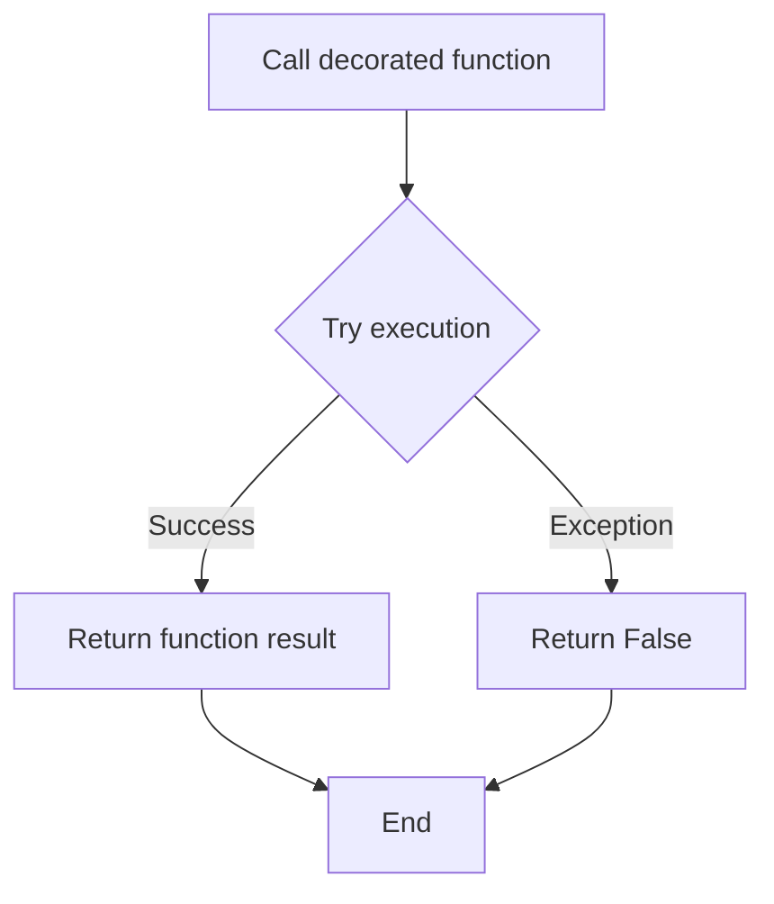
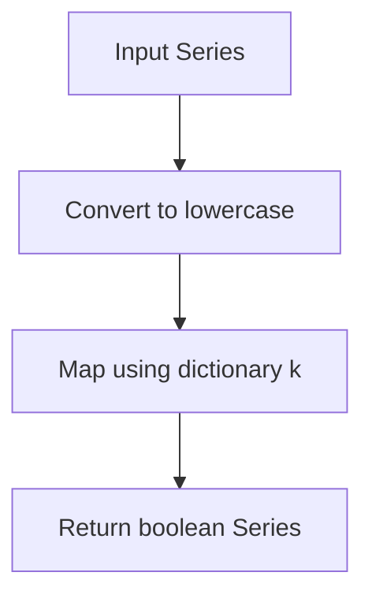
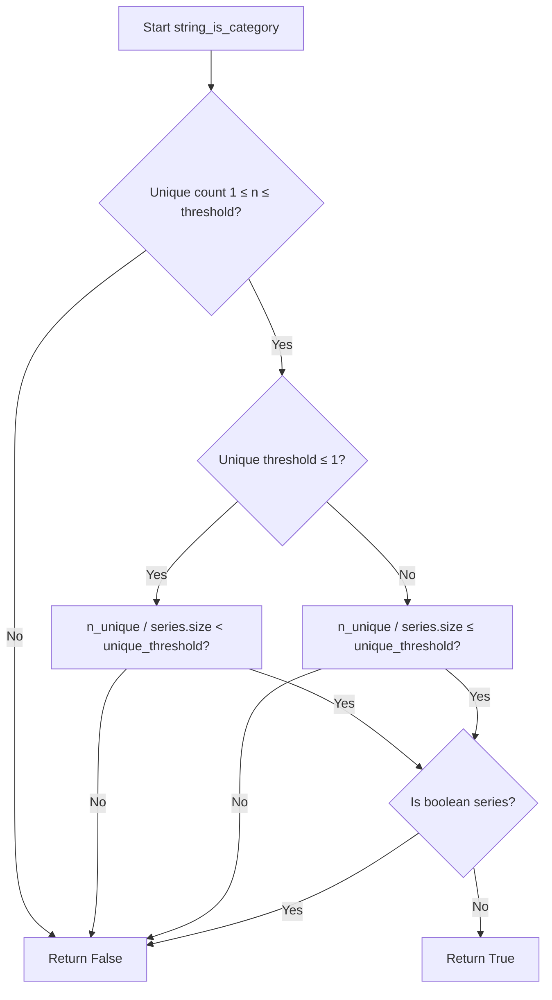

# `typeset_relations.py`

## `src.ydata_profiling.model.typeset_relations.is_nullable` · *function*

## Summary:
Determines whether a pandas Series contains at least one non-null value, indicating it can hold nullable data.

## Description:
This function evaluates if a given pandas Series has any non-null entries by comparing the count of non-null values against zero. It's used in data profiling to assess whether a column can contain null values during type inference and validation processes.

## Args:
    series (pandas.Series): The pandas Series to evaluate for nullability
    state (dict): A state dictionary containing contextual information for the profiling process

## Returns:
    bool: True if the series contains at least one non-null value, False otherwise

## Raises:
    None explicitly raised

## Constraints:
    Preconditions:
    - The series parameter must be a valid pandas Series object
    - The state parameter must be a dictionary (can be empty)
    
    Postconditions:
    - Returns a boolean value indicating presence of non-null values
    - Does not modify the input series or state

## Side Effects:
    None

## Control Flow:
```mermaid
flowchart TD
    A[Start is_nullable] --> B{series.count() > 0?}
    B -- Yes --> C[Return True]
    B -- No --> D[Return False]
    C --> E[End]
    D --> E
```

## Examples:
```python
import pandas as pd

# Example 1: Series with values
series1 = pd.Series([1, 2, 3])
result1 = is_nullable(series1, {})  # Returns True

# Example 2: Series with null values
series2 = pd.Series([1, None, 3])
result2 = is_nullable(series2, {})  # Returns True

# Example 3: Empty series
series3 = pd.Series([], dtype=object)
result3 = is_nullable(series3, {})  # Returns False

# Example 4: Series with all null values
series4 = pd.Series([None, None, None])
result4 = is_nullable(series4, {})  # Returns False
```

## `src.ydata_profiling.model.typeset_relations.try_func` · *function*

## Summary:
Decorator that wraps a function to catch all exceptions and return False instead of propagating errors.

## Description:
The `try_func` decorator creates a safe version of a function by wrapping it in a try-except block. When the wrapped function raises any exception (including unexpected ones), it gracefully returns False rather than allowing the exception to bubble up. This is particularly useful for validation functions or type checking operations that might fail on malformed data but should not interrupt the overall processing flow.

This function was extracted as a reusable utility to avoid repetitive try-except boilerplate code throughout the codebase, enforcing a consistent error handling pattern for potentially unstable operations.

## Args:
    fn (Callable): The function to wrap with exception handling. This function should accept a pandas Series as its first argument followed by optional arguments and keyword arguments and should logically return a boolean value.

## Returns:
    Callable: A new function that behaves like the original function but returns False if any exception occurs during execution. The returned function preserves the original function's name, docstring, and other metadata through functools.wraps.

## Raises:
    None: Exceptions are caught internally and converted to False return values.

## Constraints:
    Preconditions:
    - The decorated function must accept a pandas Series as its first parameter
    - The decorated function may accept additional positional and keyword arguments
    - The decorated function should logically return a boolean value (though this isn't enforced)

    Postconditions:
    - The returned function will always return a boolean value (True or False)
    - No exceptions will be raised from the decorated function call
    - The original function's metadata (name, docstring) is preserved

## Side Effects:
    None: This function doesn't perform any I/O operations or mutate external state.

## Control Flow:


## Examples:
```python
# Example usage with a type checking function
@try_func
def is_numeric_type(series: pd.Series) -> bool:
    return pd.api.types.is_numeric_dtype(series)

# Safe type checking that won't crash on malformed data
result = is_numeric_type(some_series)  # Returns True/False safely

# Another example with custom validation
@try_func
def has_valid_range(series: pd.Series, min_val: float, max_val: float) -> bool:
    return series.between(min_val, max_val).all()
```

## `src.ydata_profiling.model.typeset_relations.string_is_bool` · *function*

## Summary:
Determines whether all string values in a pandas Series can be classified as boolean-like values based on a provided mapping.

## Description:
This function evaluates if all non-null string values in a pandas Series are contained within the keys of a provided dictionary that maps string representations to boolean values. It handles null values gracefully and excludes categorical data types from consideration.

## Args:
    series (pd.Series): A pandas Series containing string values to evaluate
    state (dict): A dictionary containing metadata about the series, particularly for handling null values
    k (Dict[str, bool]): A dictionary mapping string representations to their boolean equivalents

## Returns:
    bool: True if all non-null string values in the series are present as keys in k, False otherwise

## Raises:
    None explicitly raised - uses @try_func decorator to catch and return False on any exception

## Constraints:
    Preconditions:
        - series should be a pandas Series
        - k should be a dictionary with string keys
        - state should be a dictionary (though not strictly validated)
    
    Postconditions:
        - Returns a boolean value indicating whether all string values match the provided boolean mappings

## Side Effects:
    None - This function is pure and doesn't modify external state or perform I/O operations

## Control Flow:
```mermaid
flowchart TD
    A[Start string_is_bool] --> B{Is categorical dtype?}
    B -- Yes --> C[Return False]
    B -- No --> D[Call tester function]
    D --> E{Has NaN values?}
    E -- Yes --> F[Drop NaN values]
    F --> G[Check if series empty?]
    G -- Yes --> H[Return False]
    G -- No --> I[Convert to lowercase and check membership]
    I --> J[Return result of .all()]
```

## Examples:
```python
# Example 1: All values match boolean mappings
k = {"true": True, "false": False}
series = pd.Series(["True", "False", "true"])
result = string_is_bool(series, {}, k)  # Returns True

# Example 2: Some values don't match
k = {"yes": True, "no": False}
series = pd.Series(["yes", "maybe", "no"])
result = string_is_bool(series, {}, k)  # Returns False

# Example 3: Categorical data returns False
k = {"true": True, "false": False}
series = pd.Series(pd.Categorical(["true", "false"]))
result = string_is_bool(series, {}, k)  # Returns False
```

## `src.ydata_profiling.model.typeset_relations.string_to_bool` · *function*

## Summary:
Converts string values in a pandas Series to boolean values using a provided mapping dictionary.

## Description:
This function transforms a pandas Series containing string values into a Series of boolean values by converting all strings to lowercase and mapping them according to a provided dictionary. It is part of a type conversion system used in data profiling to standardize string representations of boolean values into proper boolean types.

## Args:
    series (pd.Series): A pandas Series containing string values to be converted to booleans
    state (dict): A dictionary containing processing state information (not used in current implementation)
    k (Dict[str, bool]): A mapping dictionary where string keys (in lowercase) are mapped to boolean values

## Returns:
    pd.Series: A pandas Series with the same index as input, containing boolean values derived from the string-to-boolean mapping. Values not found in the mapping dictionary will result in NaN values.

## Raises:
    None explicitly raised in the function implementation

## Constraints:
    Preconditions:
    - The input series must be a valid pandas Series
    - The mapping dictionary `k` must contain string keys that correspond to values in the series (after lowercasing)
    - All values in the series should be convertible to strings

    Postconditions:
    - The returned Series will have the same length and index as the input Series
    - Values not found in the mapping dictionary will result in NaN values

## Side Effects:
    None

## Control Flow:


## Examples:
```python
# Basic usage with standard boolean strings
mapping = {"true": True, "false": False, "yes": True, "no": False}
series = pd.Series(["True", "FALSE", "Yes"])
result = string_to_bool(series, {}, mapping)
# Result: [True, False, True]

# With unmapped values (results in NaN)
mapping = {"true": True, "false": False}
series = pd.Series(["True", "Maybe", "False"])
result = string_to_bool(series, {}, mapping)
# Result: [True, nan, False]

# Empty series
mapping = {"true": True, "false": False}
series = pd.Series([], dtype=object)
result = string_to_bool(series, {}, mapping)
# Result: empty Series with same dtype
```

## `src.ydata_profiling.model.typeset_relations.numeric_is_category` · *function*

## Summary:
Determines whether a numeric series should be treated as categorical based on unique value count thresholds.

## Description:
This function evaluates if a numeric pandas Series should be classified as categorical by checking if the number of unique values falls within a specified threshold range. This logic is extracted into a separate function to encapsulate the decision-making process for type inference in data profiling.

## Args:
    series (pd.Series): A pandas Series containing numeric data to evaluate
    state (dict): Processing state dictionary (unused in current implementation)
    k (Settings): Configuration settings object containing the low_categorical_threshold parameter

## Returns:
    bool: True if the series has between 1 and k.vars.num.low_categorical_threshold unique values (inclusive), False otherwise

## Raises:
    None explicitly raised

## Constraints:
    Preconditions:
        - series must be a valid pandas Series
        - k must be a Settings object with vars.num.low_categorical_threshold attribute
    Postconditions:
        - Returns a boolean value indicating categorical classification decision

## Side Effects:
    None

## Control Flow:
```mermaid
flowchart TD
    A[Start numeric_is_category] --> B{series.nunique()}
    B --> C[threshold = k.vars.num.low_categorical_threshold]
    C --> D{1 ≤ n_unique ≤ threshold?}
    D -->|Yes| E[Return True]
    D -->|No| F[Return False]
    E --> G[End]
    F --> G
```

## Examples:
```python
# Example 1: Series with few unique values (should return True)
import pandas as pd
from ydata_profiling.config import Settings
series = pd.Series([1, 2, 2, 3, 3, 3])
settings = Settings()
settings.vars.num.low_categorical_threshold = 5
result = numeric_is_category(series, {}, settings)  # Returns True

# Example 2: Series with many unique values (should return False)
series = pd.Series([1, 2, 3, 4, 5, 6, 7, 8, 9, 10])
settings = Settings()
settings.vars.num.low_categorical_threshold = 5
result = numeric_is_category(series, {}, settings)  # Returns False
```

## `src.ydata_profiling.model.typeset_relations.to_category` · *function*

## Summary:
Converts a pandas Series to a categorical string representation while properly handling missing value representations.

## Description:
This function transforms a pandas Series into a string-based categorical representation, specifically designed to handle missing value indicators like "nan" and "<NA>" that may appear as string values in the original series. It ensures proper conversion to pandas' nullable string dtype while preserving the semantic meaning of missing data.

The function is typically used in data profiling pipelines where consistent type representation is required for analysis and reporting. It's extracted into its own function to encapsulate the specific logic for handling string conversions with special missing value handling, separating this concern from the broader type inference and conversion logic.

## Args:
    series (pd.Series): Input pandas Series to be converted to categorical string representation
    state (dict): State dictionary containing contextual information for the conversion process

## Returns:
    pd.Series: A pandas Series with string dtype, where missing values are properly represented as NaN rather than string "nan" or "<NA>"

## Raises:
    None explicitly raised in the function body

## Constraints:
    Preconditions:
    - The input series should be a valid pandas Series object
    - The state parameter should be a dictionary (though not validated in the function)
    
    Postconditions:
    - The returned Series will have string dtype
    - Any string representations of missing values ("nan", "<NA>") will be converted to actual NaN values
    - The function preserves the original length and index structure of the input series

## Side Effects:
    None

## Control Flow:
```mermaid
flowchart TD
    A[Start to_category] --> B{hasnans?}
    B -- Yes --> C[series.astype(str)]
    C --> D[val.replace("nan", np.nan)]
    D --> E[val.replace("<NA>", np.nan)]
    E --> F[return val.astype("string")]
    B -- No --> G[series.astype(str)]
    G --> H[return val.astype("string")]
```

## Examples:
```python
import pandas as pd
import numpy as np

# Example 1: Series with regular values
series1 = pd.Series(['a', 'b', 'c'])
result1 = to_category(series1, {})
# Returns: Series(['a', 'b', 'c'], dtype='string')

# Example 2: Series with NaN string representations
series2 = pd.Series(['a', 'nan', 'c', '<NA>'])
result2 = to_category(series2, {})
# Returns: Series(['a', nan, 'c', nan], dtype='string')
```

## `src.ydata_profiling.model.typeset_relations.series_is_string` · *function*

## Summary:
Checks if a pandas Series can be treated as containing string data by validating initial elements and performing type conversion comparison.

## Description:
This function determines whether a pandas Series should be classified as containing string data. It implements a two-stage validation process: first examining whether the initial five elements are strings, then attempting a full conversion to string type and comparing with the original values. This approach allows for robust detection of string-like data even when some values might be non-string types.

The function is designed to be resilient against type conversion errors and is commonly used in data profiling systems to identify appropriate data types for analysis.

## Args:
    series (pandas.Series): A pandas Series to evaluate for string data characteristics
    state (dict): A state dictionary used for contextual type checking (contents not utilized in this function)

## Returns:
    bool: True if the series contains string data or can be reliably converted to string data, False otherwise

## Raises:
    None explicitly raised - internally handles TypeError and ValueError exceptions

## Constraints:
    Preconditions:
    - The series parameter must be a valid pandas Series object
    - The state parameter must be a dictionary (though its contents are unused in this implementation)
    
    Postconditions:
    - Returns a boolean value indicating string data classification
    - Does not modify the input series or state parameters

## Side Effects:
    None - This function is pure and has no side effects

## Control Flow:
```mermaid
flowchart TD
    A[Start series_is_string] --> B{First 5 values all strings?}
    B -- No --> C[Return False]
    B -- Yes --> D[Attempt series.astype(str)]
    D --> E{Conversion successful?}
    E -- No --> F[Return False]
    E -- Yes --> G[Compare converted vs original]
    G --> H[Return comparison result]
```

## Examples:
    # Basic usage with string series
    series = pd.Series(['a', 'b', 'c'])
    result = series_is_string(series, {})
    # Returns True
    
    # Usage with mixed types (first 5 are strings but mixed later)
    series = pd.Series(['a', 'b', 'c', 1, 'd'])
    result = series_is_string(series, {})
    # Returns False because conversion fails
    
    # Usage with numeric series
    series = pd.Series([1, 2, 3])
    result = series_is_string(series, {})
    # Returns False

## `src.ydata_profiling.model.typeset_relations.string_is_category` · *function*

## Summary:
Determines whether a pandas Series containing strings should be classified as a categorical variable based on cardinality and uniqueness thresholds.

## Description:
This function evaluates if a given pandas Series meets the criteria for being treated as a categorical variable. It considers both the absolute number of unique values and the percentage of unique values relative to the total series size. The function also excludes series that would be classified as boolean values to prevent misclassification.

## Args:
    series (pd.Series): The pandas Series to evaluate for categorical classification
    state (dict): A dictionary containing metadata about the series, including null value tracking
    k (Settings): Configuration settings object containing categorical and boolean thresholds

## Returns:
    bool: True if the series should be treated as categorical, False otherwise

## Raises:
    None explicitly raised - uses try_func decorator that catches exceptions and returns False

## Constraints:
    Preconditions:
    - series must be a valid pandas Series
    - k must be a Settings object with vars.cat and vars.bool attributes properly configured
    - k.vars.cat.percentage_cat_threshold and k.vars.cat.cardinality_threshold must be defined
    
    Postconditions:
    - Returns a boolean value indicating categorical classification status
    - Does not modify the input series or state parameters

## Side Effects:
    None - This function is pure and has no side effects

## Control Flow:


## Examples:
```python
# Basic usage
settings = Settings()
series = pd.Series(['A', 'B', 'A', 'C'])
result = string_is_category(series, {}, settings)
# Returns True if unique values are within cardinality threshold and percentage threshold

# Edge case - too many unique values
settings = Settings()
series = pd.Series([f'item_{i}' for i in range(1000)])
result = string_is_category(series, {}, settings)
# Returns False due to exceeding cardinality threshold
```

## `src.ydata_profiling.model.typeset_relations.string_is_datetime` · *function*

## Summary:
Determines whether a string series contains values that can be converted to datetime objects.

## Description:
Checks if a pandas Series of strings can be successfully converted to datetime values. This function is used in type inference systems to identify potential datetime columns among string data. The function attempts conversion using the `string_to_datetime` utility and returns True if at least one value converts successfully, indicating the series likely contains datetime data.

## Args:
    series (pd.Series): A pandas Series containing string values to test for datetime conversion
    state (dict): A state dictionary containing configuration or contextual information for the conversion process

## Returns:
    bool: True if at least one value in the series can be converted to a datetime object, False otherwise

## Raises:
    None explicitly raised - uses a broad exception handler that catches all exceptions and returns False

## Constraints:
    Preconditions:
        - The series parameter must be a valid pandas Series
        - The state parameter must be a dictionary (though its contents are not validated)
    
    Postconditions:
        - Always returns a boolean value (True or False)
        - Does not modify the input series or state

## Side Effects:
    None - This function performs no I/O operations or external state mutations

## Control Flow:
```mermaid
flowchart TD
    A[Start string_is_datetime] --> B{Try string_to_datetime}
    B --> C[string_to_datetime(series, state)]
    C --> D{Conversion successful?}
    D -->|Yes| E[Check if any values are NA]
    E --> F[Return not isna().all()]
    D -->|No| G[Return False]
    G --> H[End]
    F --> H
```

## Examples:
```python
# Example 1: Series with valid datetime strings
series = pd.Series(['2023-01-01', '2023-01-02', 'invalid'])
result = string_is_datetime(series, {})
# Returns True because first two values convert to datetime

# Example 2: Series with no valid datetime strings  
series = pd.Series(['not_a_date', 'also_not_date', 'neither'])
result = string_is_datetime(series, {})
# Returns False because no values convert to datetime

# Example 3: Empty series
series = pd.Series([], dtype='object')
result = string_is_datetime(series, {})
# Returns False because all values are NA (empty series)
```

## `src.ydata_profiling.model.typeset_relations.string_is_numeric` · *function*

## Summary:
Determines whether a string-type pandas Series should be interpreted as numeric data.

## Description:
This function evaluates if a pandas Series containing string data should be classified as numeric. It performs several checks to ensure proper type inference, excluding boolean-like data and handling edge cases such as all-NaN series. This logic is extracted into a separate function to encapsulate the complex decision-making process for string-to-numeric type conversion, maintaining clean separation between type detection and classification logic.

## Args:
    series (pd.Series): A pandas Series that may contain string data to evaluate
    state (dict): A dictionary containing processing state information
    k (Settings): Configuration settings object containing numeric categorization thresholds

## Returns:
    bool: True if the series should be treated as numeric, False otherwise

## Raises:
    None explicitly raised - uses broad exception handling internally

## Constraints:
    Preconditions:
    - series parameter must be a valid pandas Series
    - state parameter must be a dictionary
    - k parameter must be a valid Settings object
    
    Postconditions:
    - Returns a boolean value indicating numeric classification
    - Does not modify the input series or state

## Side Effects:
    None

## Control Flow:
```mermaid
flowchart TD
    A[Start string_is_numeric] --> B{is_bool_dtype(series) OR object_is_bool(series,state)?}
    B -- Yes --> C[Return False]
    B -- No --> D[series.astype(float)]
    D --> E[pd.to_numeric(series, errors="coerce")]
    E --> F{r.hasnans AND r.count() == 0?}
    F -- Yes --> G[Return False]
    F -- No --> H[Return NOT numeric_is_category(series, state, k)]
```

## Examples:
```python
# Basic usage
result = string_is_numeric(pd.Series(['1', '2', '3']), {}, config_settings)
# Returns True

# Boolean-like strings
result = string_is_numeric(pd.Series(['True', 'False']), {}, config_settings)
# Returns False (excluded by object_is_bool check)

# All NaN series
result = string_is_numeric(pd.Series([None, None]), {}, config_settings)
# Returns False (excluded by NaN check)
```

## `src.ydata_profiling.model.typeset_relations.string_to_datetime` · *function*

## Summary:
Converts a pandas Series of string values to datetime objects with pandas version compatibility handling.

## Description:
This function transforms a pandas Series containing string representations of dates into proper datetime objects. It provides backward compatibility for different pandas versions by conditionally applying the appropriate datetime parsing parameters. The function is part of the typeset relations system that handles type conversions and validations in data profiling.

## Args:
    series (pd.Series): A pandas Series containing string values that represent dates/times
    state (dict): A state dictionary containing configuration or contextual information for the conversion process

## Returns:
    pd.Series: A pandas Series with the same length containing datetime objects instead of strings

## Raises:
    ValueError: When the input strings cannot be parsed as valid datetime values

## Constraints:
    Preconditions:
        - The input series must be a valid pandas Series
        - All elements in the series should be convertible to datetime strings
    Postconditions:
        - The returned series contains properly parsed datetime objects
        - The index of the input series is preserved in the output

## Side Effects:
    None

## Control Flow:
```mermaid
flowchart TD
    A[Start string_to_datetime] --> B{is_pandas_1()?}
    B -- Yes --> C[pd.to_datetime(series)]
    B -- No --> D[pd.to_datetime(series, format="mixed")]
    C --> E[Return datetime series]
    D --> E
```

## Examples:
```python
import pandas as pd
from src.ydata_profiling.model.typeset_relations import string_to_datetime

# Basic usage
series = pd.Series(['2023-01-01', '2023-01-02', '2023-01-03'])
result = string_to_datetime(series, {})
print(result.dtype)  # datetime64[ns]

# With mixed date formats
series_mixed = pd.Series(['2023-01-01', '01/02/2023', '2023.01.03'])
result = string_to_datetime(series_mixed, {})
```

## `src.ydata_profiling.model.typeset_relations.string_to_numeric` · *function*

## Summary:
Converts a pandas Series containing string representations of numbers into numeric data type, safely handling invalid entries by coercing them to NaN.

## Description:
This function serves as a utility for converting string data to numeric format within data profiling workflows. It is particularly useful when dealing with mixed-type data where numeric values are stored as strings, such as in CSV files with inconsistent typing. The function leverages pandas' built-in conversion capabilities with error coercion to ensure data integrity during type transformation.

The function is part of a typeset relations module that manages type conversions and relationships in data profiling contexts. It provides a standardized way to handle string-to-numeric conversions while maintaining data quality through graceful error handling.

## Args:
    series (pandas.Series): A pandas Series containing string values that may represent numeric data
    state (dict): A dictionary containing processing state information, currently unused in the implementation but reserved for future extensibility

## Returns:
    pandas.Series: A pandas Series with converted numeric data, where invalid string entries are replaced with NaN values. The returned series maintains the same index as the input series.

## Raises:
    None explicitly raised - relies on pandas.to_numeric which handles conversion errors gracefully

## Constraints:
    Preconditions:
        - Input series should be a valid pandas Series object
        - The series should contain elements that can be interpreted as numeric values or invalid entries
    Postconditions:
        - Output series will have the same length as input series
        - All valid numeric strings will be converted to appropriate numeric types (int64 or float64)
        - Invalid entries will be converted to NaN values
        - The index of the input series is preserved in the output

## Side Effects:
    None - This function is pure and does not modify external state or perform I/O operations

## Control Flow:
```mermaid
flowchart TD
    A[Input Series] --> B{pd.to_numeric with errors="coerce"}
    B --> C[Return Numeric Series]
    B --> D[Invalid entries become NaN]
```

## Examples:
```python
import pandas as pd
from src.ydata_profiling.model.typeset_relations import string_to_numeric

# Basic usage with mixed valid/invalid strings
series = pd.Series(['1', '2', '3.5', 'invalid', '42'])
result = string_to_numeric(series, {})
print(result)  
# [1.0, 2.0, 3.5, nan, 42.0]

# With all valid numeric strings
series = pd.Series(['10', '20', '30'])
result = string_to_numeric(series, {})
print(result)  
# [10.0, 20.0, 30.0]

# With empty series
series = pd.Series([], dtype='object')
result = string_to_numeric(series, {})
print(result)  
# Empty series with same dtype
```

## `src.ydata_profiling.model.typeset_relations.to_bool` · *function*

## Summary
Converts a pandas Series to a boolean dtype, selecting an appropriate boolean type based on the presence of missing values.

## Description
This function provides a standardized approach to converting pandas Series to boolean representation. When the input Series contains missing values (NaN), it uses a specialized boolean dtype designed to handle missing values properly. When no missing values are present, it uses the standard Python boolean dtype. This ensures consistent type handling throughout the ydata-profiling library's type conversion processes.

## Args
    series (pd.Series): Input pandas Series to be converted to boolean type

## Returns
    pd.Series: A pandas Series with boolean dtype. The specific boolean dtype used depends on whether the input Series contains missing values:
        - If series.hasnans is True: Uses a specialized boolean dtype (likely named by `hasnan_bool_name`)
        - If series.hasnans is False: Uses standard Python bool dtype

## Raises
    None explicitly raised in the function body

## Constraints
    Preconditions:
        - Input must be a valid pandas Series object
        - Series should contain data compatible with boolean conversion
    
    Postconditions:
        - Output Series will have boolean dtype
        - Data values are converted according to standard boolean conversion rules
        - Missing values are handled according to the selected boolean dtype

## Side Effects
    None

## Control Flow
```mermaid
flowchart TD
    A[Input Series] --> B{Has NaN Values?}
    B -->|Yes| C[Select hasnan_bool_name dtype]
    B -->|No| D[Select bool dtype]
    C --> E[Convert using astype()]
    D --> E
    E --> F[Return Series]
```

## Examples
```python
import pandas as pd

# Example with no NaN values
series1 = pd.Series([True, False, True])
result1 = to_bool(series1)  # Returns Series with bool dtype

# Example with NaN values  
series2 = pd.Series([True, False, None])
result2 = to_bool(series2)  # Returns Series with NaN-aware boolean dtype
```

## `src.ydata_profiling.model.typeset_relations.object_is_bool` · *function*

## Summary:
Determines whether an object-dtype pandas Series contains only boolean-like values.

## Description:
Checks if all elements in an object-dtype pandas Series are either True or False. This function evaluates whether a pandas Series with object dtype contains exclusively boolean values. It is used in type inference systems to identify when an object Series should be treated as boolean data.

## Args:
    series (pd.Series): A pandas Series to analyze for boolean content
    state (dict): A dictionary containing processing state information (currently unused in implementation)

## Returns:
    bool: True if the series contains only boolean-like values (True/False), False otherwise

## Raises:
    None explicitly raised - uses a broad except clause to catch any errors during evaluation

## Constraints:
    Preconditions:
        - The series parameter must be a valid pandas Series object
        - The state parameter must be a dictionary (though currently unused)
    
    Postconditions:
        - Returns a boolean value indicating whether all elements are boolean-like

## Side Effects:
    None

## Control Flow:
```mermaid
flowchart TD
    A[Start object_is_bool] --> B{Is object dtype?}
    B -- Yes --> C[Create bool_set = {True, False}]
    C --> D[Try all(item in bool_set for item in series)]
    D --> E{Exception occurred?}
    E -- Yes --> F[ret = False]
    E -- No --> G[ret = all() result]
    F --> H[Return ret]
    G --> H
    B -- No --> I[Return False]
```

## Examples:
    >>> import pandas as pd
    >>> series = pd.Series([True, False, True])
    >>> object_is_bool(series, {})
    True
    
    >>> series = pd.Series(['yes', 'no', 'maybe'])
    >>> object_is_bool(series, {})
    False
    
    >>> series = pd.Series([True, False, None])
    >>> object_is_bool(series, {})
    False

