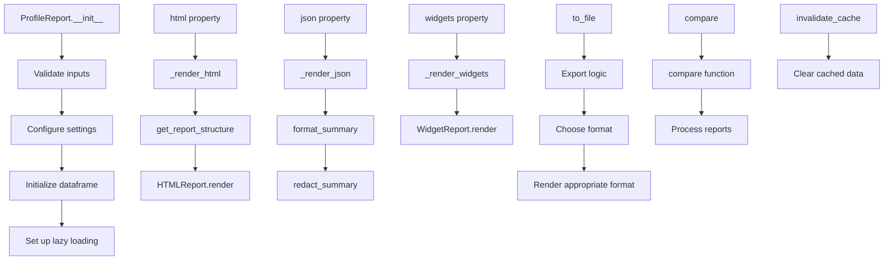

# `profile_report.py`

## `src.ydata_profiling.profile_report.ProfileReport` · *class*

## Summary:
A data profiling report generator that creates statistical summaries and visualizations from pandas DataFrames or Spark DataFrames.

## Description:
The ProfileReport class generates detailed statistical summaries, visualizations, and insights from input datasets. It provides lazy-loading capabilities for performance optimization and supports multiple output formats including HTML, JSON, and interactive widgets. The class is designed to be the primary interface for automated data profiling in the ydata-profiling library.

This class enables quick understanding of dataset characteristics through automated analysis and visualization, supporting both pandas and Spark DataFrames with configurable reporting behavior.

## State:
- df: Optional[Union[pd.DataFrame, sDataFrame]] - The input dataframe being profiled
- config: Settings - Configuration object controlling report generation behavior
- _description_set: BaseDescription - Cached description of the dataset (lazy-loaded)
- _report: Root - Cached report structure (lazy-loaded)
- _html: str - Cached HTML output (lazy-loaded)
- _widgets: Any - Cached widget-based report representation (lazy-loaded)
- _json: str - Cached JSON output (lazy-loaded)
- _df_hash: Optional[str] - Hash of the dataframe for caching purposes
- _sample: Optional[dict] - Sample data configuration
- _type_schema: Optional[dict] - Schema for type inference
- _typeset: Optional[VisionsTypeset] - Typeset for data type detection
- _summarizer: Optional[BaseSummarizer] - Summarizer for variable descriptions

## Lifecycle:
- Creation: Instantiate with a DataFrame and optional configuration parameters
- Usage: Access properties like html, json, widgets for report generation, or call methods like to_file() to export
- Destruction: Automatic cleanup through Python garbage collection, though manual cache invalidation via invalidate_cache() is available

## Method Map:


## Raises:
- ValueError: When initializing with no DataFrame and lazy=False, or when config_file and minimal are both specified, or when an empty DataFrame is provided
- NotImplementedError: When trying to use time-series mode with Spark DataFrames
- RuntimeError: When attempting to use widgets interface with comparing reports

## Example:
```python
import pandas as pd
from ydata_profiling import ProfileReport

# Create a sample dataframe
df = pd.DataFrame({
    'name': ['Alice', 'Bob', 'Charlie'],
    'age': [25, 30, 35],
    'salary': [50000, 60000, 70000]
})

# Generate profile report
profile = ProfileReport(df, title="Employee Data Profile")

# Export to HTML
profile.to_file("employee_report.html")

# Get HTML content
html_content = profile.to_html()

# Get JSON content  
json_content = profile.to_json()

# Compare with another report
profile2 = ProfileReport(df2)
comparison = profile.compare(profile2)
```

### `src.ydata_profiling.profile_report.ProfileReport.__init__` · *method*

## Summary:
Initializes a ProfileReport object with configuration settings and optional data frame for profiling.

## Description:
The ProfileReport constructor sets up the profiling configuration based on various input parameters, validates the inputs, initializes the data frame with appropriate preprocessing, and prepares the object for report generation. This method serves as the central initialization point that configures all profiling behavior and prepares the internal state for subsequent operations.

## Args:
- df (Optional[Union[pandas.DataFrame, pyspark.sql.DataFrame]]): Input data frame to profile, or None for lazy initialization
- minimal (bool): Enable minimal configuration mode, defaults to False
- tsmode (bool): Enable time-series mode, defaults to False
- sortby (Optional[str]): Column name to sort by in time-series mode
- sensitive (bool): Enable sensitive data handling mode, defaults to False
- explorative (bool): Enable explorative analysis mode, defaults to False
- dark_mode (bool): Enable dark theme for reports, defaults to False
- orange_mode (bool): Enable orange theme for reports, defaults to False
- sample (Optional[dict]): Sample configuration for data sampling
- config_file (Optional[Union[pathlib.Path, str]]): Path to YAML configuration file
- lazy (bool): Enable lazy evaluation, defaults to True
- typeset (Optional[visions.VisionsTypeset]): Custom typeset for type inference
- summarizer (Optional[ydata_profiling.model.summarizer.BaseSummarizer]): Custom summarizer for data summarization
- config (Optional[ydata_profiling.config.Settings]): Direct configuration object
- type_schema (Optional[dict]): Schema definition for data types
- **kwargs: Additional configuration parameters that can be passed as keyword arguments

## Returns:
None: This is a constructor method that initializes instance attributes

## Raises:
- ValueError: When df is None and lazy=False, or when config_file and minimal are both specified, or when an empty DataFrame is provided
- NotImplementedError: When time-series mode is enabled with Spark DataFrames

## State Changes:
- Attributes READ: None
- Attributes WRITTEN: self.df, self.config, self._df_hash, self._sample, self._type_schema, self._typeset, self._summarizer

## Constraints:
- Preconditions: 
  - If lazy=False, df must not be None
  - If config_file is specified, minimal must be False
  - If df is a pandas DataFrame, it must not be empty
  - If df is a Spark DataFrame and tsmode is True, NotImplementedError is raised
- Postconditions:
  - self.config contains properly merged configuration settings from multiple sources
  - self.df contains initialized data frame (potentially sorted for time-series)
  - All internal attributes are set according to input parameters

## Side Effects:
- May initialize and sort DataFrame if time-series mode is active
- May load configuration from file if config_file or minimal is specified
- May trigger report generation if lazy=False (evaluates self.report property)

### `src.ydata_profiling.profile_report.ProfileReport.__validate_inputs` · *method*

## Summary:
Validates initialization parameters for ProfileReport to ensure proper configuration and non-empty DataFrames.

## Description:
This private method performs input validation for the ProfileReport class constructor. It ensures that required parameters are properly set and that DataFrames are not empty. The validation occurs during object initialization to prevent invalid configurations before any profiling operations begin.

## Args:
    df (Optional[Union[pd.DataFrame, sDataFrame]]): Input DataFrame to profile, or None if lazy loading is enabled
    minimal (bool): Flag indicating minimal configuration mode
    tsmode (bool): Flag indicating time-series mode activation
    config_file (Optional[Union[Path, str]]): Path to configuration file, or None
    lazy (bool): Flag indicating lazy loading mode

## Returns:
    None: This method does not return any value

## Raises:
    ValueError: Raised when:
        - df is None and lazy is False (required DataFrame for non-lazy initialization)
        - config_file and minimal are both specified (mutually exclusive arguments)
        - DataFrame is empty (both pandas and Spark DataFrames)
    NotImplementedError: Raised when tsmode is True with Spark DataFrames

## State Changes:
    Attributes READ: None
    Attributes WRITTEN: None

## Constraints:
    Preconditions:
        - When lazy=False, df must not be None
        - config_file and minimal cannot both be specified
        - df must not be empty when provided
        - tsmode cannot be used with Spark DataFrames

    Postconditions:
        - All validation checks pass before ProfileReport initialization continues
        - Appropriate error messages are provided for invalid combinations

## Side Effects:
    None: This method performs only validation checks and raises exceptions when conditions are violated

### `src.ydata_profiling.profile_report.ProfileReport.__initialize_dataframe` · *method*

## Summary:
Initializes and prepares a pandas DataFrame for time-series analysis by sorting and setting appropriate index.

## Description:
This private method processes a pandas DataFrame to prepare it for time-series analysis when time-series mode is enabled in the report configuration. It ensures that time-series data is properly ordered and indexed for subsequent analysis steps. The method is called during ProfileReport initialization to preprocess the input DataFrame before further analysis.

## Args:
    df (Optional[Union[pd.DataFrame, sDataFrame]]): Input DataFrame to initialize, can be pandas or PySpark DataFrame
    report_config (Settings): Configuration settings that determine if time-series processing should be applied

## Returns:
    Optional[Union[pd.DataFrame, sDataFrame]]: The potentially modified DataFrame with proper sorting and indexing, or the original DataFrame if no processing was applied

## Raises:
    None explicitly raised

## State Changes:
    Attributes READ: None
    Attributes WRITTEN: None

## Constraints:
    Preconditions:
    - When time-series mode is active (report_config.vars.timeseries.active = True)
    - When df is a pandas DataFrame (isinstance(df, pd.DataFrame))
    - When df is not None
    
    Postconditions:
    - If time-series processing occurs, the DataFrame will be sorted appropriately
    - If sortby is specified, DataFrame will be sorted by that column and set as index
    - If no sortby is specified, DataFrame will be sorted by its index
    - Index name will be set to None after processing

## Side Effects:
    None

### `src.ydata_profiling.profile_report.ProfileReport.invalidate_cache` · *method*

## Summary:
Clears cached report components to force regeneration of rendered content.

## Description:
Invalidates cached representations of the profiling report, ensuring subsequent accesses will regenerate the content. This method is typically called when underlying data or configuration changes, making cached results stale.

## Args:
    subset (Optional[str]): Specifies which cache subset to invalidate. Valid values are None, "rendering", or "report". If None, all caches are invalidated. If "rendering", only rendering-related caches are cleared. If "report", only report-specific caches are cleared.

## Returns:
    None: This method does not return any value.

## Raises:
    ValueError: Raised when the subset parameter is provided but not one of the allowed values: None, "rendering", or "report".

## State Changes:
    Attributes READ: None
    Attributes WRITTEN: 
        - self._widgets: Set to None
        - self._json: Set to None  
        - self._html: Set to None
        - self._report: Set to None
        - self._description_set: Set to None

## Constraints:
    Preconditions: The method assumes the ProfileReport instance has the cached attributes (_widgets, _json, _html, _report, _description_set) initialized.
    Postconditions: All specified cached attributes are set to None, forcing regeneration on next access.

## Side Effects:
    None: This method only modifies internal state and does not perform I/O operations or external service calls.

### `src.ydata_profiling.profile_report.ProfileReport.typeset` · *method*

## Summary:
Provides lazy initialization and caching of the Visions-based typeset for variable type inference.

## Description:
This property implements lazy initialization of the profiling typeset, which is used for automatic variable type detection and classification in the dataset. The typeset is created only when first accessed and then cached in `self._typeset` for subsequent accesses. This approach avoids unnecessary computation during object initialization and improves performance for repeated accesses.

The method is separated from direct attribute access to enable lazy loading and caching behavior, preventing redundant instantiation of the typeset object which can be computationally expensive.

## Args:
    None

## Returns:
    Optional[VisionsTypeset]: The profiling typeset instance containing type inference rules and classifications. Returns None if no typeset is available.

## Raises:
    None explicitly raised

## State Changes:
    Attributes READ: self._typeset, self.config, self._type_schema
    Attributes WRITTEN: self._typeset (only during first access when None)

## Constraints:
    Preconditions: The ProfileReport object must be properly initialized with valid config and type schema
    Postconditions: The returned typeset is either the cached instance or a newly created one with proper configuration

## Side Effects:
    None

### `src.ydata_profiling.profile_report.ProfileReport.summarizer` · *method*

## Summary
Returns the summarizer instance for profiling data, creating it lazily if needed.

## Description
This property provides access to the summarizer object used for generating statistical summaries of data columns. It implements a lazy initialization pattern, creating a `PandasProfilingSummarizer` instance with the current typeset when first accessed. This approach ensures that the summarizer is only created when actually needed, improving performance for cases where it might not be used.

The method is called by the `description_set` property when building the descriptive statistics for the profile report, ensuring that the appropriate summarization logic is available for different data types.

## Args
None

## Returns
BaseSummarizer: An instance of BaseSummarizer (specifically PandasProfilingSummarizer) that handles the statistical summarization of data columns according to their detected types.

## Raises
None

## State Changes
- Attributes READ: self._summarizer, self.typeset
- Attributes WRITTEN: self._summarizer (only when initialized)

## Constraints
- Preconditions: The ProfileReport instance must be properly initialized with a valid config and typeset
- Postconditions: The returned summarizer instance will be cached in self._summarizer for subsequent accesses

## Side Effects
None

### `src.ydata_profiling.profile_report.ProfileReport.description_set` · *method*

## Summary:
Computes and caches the statistical description of the DataFrame, returning a BaseDescription object containing all profiling results.

## Description:
This method implements a lazy loading pattern for computing the statistical profile of the DataFrame. When first called, it executes the describe function to analyze the data and stores the result in `_description_set` for future access. Subsequent calls return the cached result without recomputing.

The method is called during various stages of report generation, particularly when accessing report components that require descriptive statistics. It serves as a central point for data profiling computation in the ProfileReport class.

## Args:
    None

## Returns:
    BaseDescription: An object containing comprehensive statistical analysis of the DataFrame including table statistics, variable descriptions, correlations, missing value patterns, alerts, and sample data.

## Raises:
    ValueError: If the DataFrame is None and the ProfileReport is configured for lazy evaluation.

## State Changes:
    Attributes READ: self._description_set, self.config, self.df, self.summarizer, self.typeset, self._sample
    Attributes WRITTEN: self._description_set (only on first call)

## Constraints:
    Preconditions: 
    - The ProfileReport instance must have a valid DataFrame (self.df) 
    - The instance must have properly initialized config, summarizer, and typeset attributes
    - The method should not be called with a None DataFrame in lazy mode
    
    Postconditions:
    - On first call, self._description_set will be populated with a BaseDescription instance
    - Subsequent calls will return the same cached BaseDescription instance
    - The returned BaseDescription contains complete profiling information

## Side Effects:
    None

### `src.ydata_profiling.profile_report.ProfileReport.df_hash` · *method*

## Summary:
Computes and caches a SHA256 hash of the underlying DataFrame for consistency checking and reproducibility.

## Description:
This property method computes a cryptographic hash of the DataFrame to uniquely identify its content. The hash is computed only once and cached in the `_df_hash` attribute for performance optimization. This enables efficient comparison of DataFrame contents without repeatedly processing the full dataset, which is particularly useful for ensuring reproducible profiling results and detecting DataFrame changes.

## Args:
    None

## Returns:
    Optional[str]: A hexadecimal SHA256 hash string prefixed with a hash prefix (typically "hash_"), or None if no DataFrame is available.

## Raises:
    None

## State Changes:
    Attributes READ: self._df_hash, self.df
    Attributes WRITTEN: self._df_hash (only when first computed and hash is successfully generated)

## Constraints:
    Preconditions: 
    - The method assumes `self.df` is either None or a valid pandas DataFrame
    - The method requires `hash_dataframe` function to properly handle the DataFrame
    - The hash computation depends on the exact content and structure of the DataFrame
    
    Postconditions:
    - If a DataFrame exists and is not None, `self._df_hash` will contain the computed hash after first access
    - If no DataFrame exists, returns None without modification
    - The hash value remains constant for the lifetime of the ProfileReport instance

## Side Effects:
    None

### `src.ydata_profiling.profile_report.ProfileReport.report` · *method*

## Summary:
Returns the cached report structure, generating it if necessary using configuration and description set.

## Description:
This method provides lazy initialization of the report structure. When first accessed, it creates a hierarchical report structure using `get_report_structure()` with the current configuration and description set, then caches it in `self._report` for subsequent accesses. This approach avoids recomputing the report structure multiple times during report generation.

The method is called by various rendering methods (`_render_html`, `_render_widgets`, `_render_json`) and other properties to access the underlying report structure for generating different output formats (HTML, widgets, JSON).

## Args:
    None

## Returns:
    Root: The root node of the report structure containing all report sections and elements.

## Raises:
    None explicitly raised

## State Changes:
    Attributes READ: 
    - self._report: Checks if report is already cached
    - self.config: Used as input to get_report_structure
    - self.description_set: Used as input to get_report_structure
    
    Attributes WRITTEN:
    - self._report: Set to the generated report structure on first access

## Constraints:
    Preconditions:
    - self.config must be a valid Settings object
    - self.description_set must be a valid BaseDescription object
    - The report structure generation process requires valid configuration and description data
    
    Postconditions:
    - On first call, self._report is populated with a Root object
    - Subsequent calls return the same cached Root object
    - The returned Root object contains all report sections and elements

## Side Effects:
    None

### `src.ydata_profiling.profile_report.ProfileReport.html` · *method*

## Summary:
Returns the cached HTML report content, generating it on first access if needed.

## Description:
This property provides access to the HTML report representation of the profiled data. It implements a lazy caching mechanism where the HTML content is only generated once and then stored in `self._html` for subsequent accesses. This approach optimizes performance by avoiding redundant HTML generation operations.

The method is typically called during report presentation or export operations, such as when displaying the report in Jupyter notebooks or saving it to a file. It serves as the primary interface for accessing the HTML representation of the profiling results.

## Args:
    None

## Returns:
    str: The HTML content of the profiling report. The returned string contains complete HTML markup for the report, including all visual elements, styling, and interactive components as configured in the report settings.

## Raises:
    None explicitly raised

## State Changes:
    Attributes READ: 
        - self._html: Checked for None to determine if HTML needs regeneration
        - self.report: Accessed via property to get the report structure
        - self.config: Accessed for HTML rendering configuration
        - self.description_set: Accessed via property to get analysis metadata
        
    Attributes WRITTEN:
        - self._html: Set to the generated HTML content on first access

## Constraints:
    Preconditions:
        - The ProfileReport instance must be properly initialized with data
        - The `self.report` property must be accessible (will be generated if needed)
        - The `self.config` must contain valid HTML rendering settings
        
    Postconditions:
        - On first call, `self._html` will be populated with the generated HTML string
        - Subsequent calls will return the same cached HTML string
        - The returned HTML string is a complete, valid HTML document ready for display or saving

## Side Effects:
    - Generates HTML content using the HTMLReport rendering engine by calling `self._render_html()`
    - May perform I/O operations when minifying HTML (if enabled in config via `self.config.html.minify_html`)
    - Uses tqdm progress bar during HTML generation (when `self.config.progress_bar` is enabled)
    - May create HTML assets directory if not using inline assets (depending on `self.config.html.inline` setting)

### `src.ydata_profiling.profile_report.ProfileReport.json` · *method*

*No documentation generated.*

### `src.ydata_profiling.profile_report.ProfileReport.widgets` · *method*

## Summary:
Returns the widget-based representation of the profiling report, caching the result for subsequent accesses.

## Description:
This property provides access to the interactive widget-based visualization of the profiling report. It implements a lazy loading pattern to avoid unnecessary computation. The method includes a guard clause that prevents widget rendering when comparing multiple reports, as this functionality is not yet supported.

## Args:
    None

## Returns:
    Any: The widget-based report representation, typically an interactive Jupyter widget object.

## Raises:
    RuntimeError: When attempting to render widgets for comparing reports (multiple datasets), indicating that HTML rendering should be used instead.

## State Changes:
    Attributes READ: 
    - self.description_set
    - self._widgets
    - self._description_set
    
    Attributes WRITTEN:
    - self._widgets (cached result of _render_widgets call)

## Constraints:
    Preconditions:
    - The ProfileReport instance must have been initialized with valid data
    - The report must not be in comparison mode (multiple datasets)
    
    Postconditions:
    - The returned widget object is cached in self._widgets for future access
    - If called multiple times, identical cached result is returned

## Side Effects:
    - Calls self._render_widgets() which creates a WidgetReport instance
    - May trigger progress bar display during widget rendering
    - Accesses self.report property internally

### `src.ydata_profiling.profile_report.ProfileReport.get_duplicates` · *method*

## Summary:
Returns the DataFrame containing duplicate rows identified during profile report generation.

## Description:
This method provides access to the duplicate rows detected in the dataset during the profiling process. It serves as a getter for the duplicates attribute stored within the report's description set, allowing users to retrieve and analyze duplicate data patterns.

## Args:
    None

## Returns:
    Optional[pd.DataFrame]: A DataFrame containing duplicate rows if duplicates were found, or None if no duplicates exist in the dataset.

## Raises:
    None

## State Changes:
    Attributes READ: self.description_set.duplicates
    Attributes WRITTEN: None

## Constraints:
    Preconditions: The ProfileReport must have been initialized with a DataFrame and the profiling process must have completed (or at least the description_set must be populated).
    Postconditions: The returned DataFrame (if any) contains rows that appear more than once in the original dataset.

## Side Effects:
    None

### `src.ydata_profiling.profile_report.ProfileReport.get_sample` · *method*

## Summary:
Returns the sample data from the profile report's description set.

## Description:
This method provides access to the sample data that was computed during the profiling process. The sample data represents a subset of the original DataFrame that was analyzed, typically used for display purposes in reports and visualizations. This method serves as a convenient accessor to retrieve the sample information without having to navigate through the full description set structure.

The sample data is internally generated during the profiling process and stored in the description set. The exact structure of the returned dictionary depends on the specific implementation of the sample generation mechanism, but it typically contains metadata about the sample including identification and content information.

## Args:
    None

## Returns:
    dict: A dictionary containing the sample data. The structure varies based on the implementation but generally includes identifying information about the sample.

## Raises:
    None

## State Changes:
    Attributes READ: self.description_set
    Attributes WRITTEN: None

## Constraints:
    Preconditions: The ProfileReport must have been initialized with a DataFrame or the lazy initialization must have been completed.
    Postconditions: The returned dictionary is a copy of the internal sample data and modifications to it won't affect the internal state.

## Side Effects:
    None

### `src.ydata_profiling.profile_report.ProfileReport.get_description` · *method*

## Summary:
Returns the descriptive statistics and analysis results from the profile report.

## Description:
Provides access to the comprehensive profiling description data that contains all statistical summaries, variable analyses, correlations, missing value patterns, and alerts generated during the profiling process. This method serves as a clean interface to retrieve the core analytical results without triggering recomputation.

## Args:
    None

## Returns:
    BaseDescription: An object containing all profiling results including table statistics, variable descriptions, correlations, missing value patterns, alerts, and metadata about the analysis.

## Raises:
    None

## State Changes:
    Attributes READ: self._description_set, self.description_set
    Attributes WRITTEN: None

## Constraints:
    Preconditions: The ProfileReport instance must have been initialized with a DataFrame or the lazy flag must be set to False.
    Postconditions: The returned BaseDescription object is immutable and represents the profiling results at the time of the last computation.

## Side Effects:
    None

### `src.ydata_profiling.profile_report.ProfileReport.get_rejected_variables` · *method*

## Summary:
Returns the set of column names that were rejected during the profiling process due to being flagged with REJECTED alerts.

## Description:
This method provides access to columns that were excluded from further analysis because they triggered rejection criteria during the profiling workflow. The filtering occurs on alerts with AlertType.REJECTED, which are generated when variables fail certain quality checks or validation rules defined in the profiling configuration.

## Args:
    self: The ProfileReport instance containing the profiling results and alerts.

## Returns:
    set: A set of strings representing column names that were rejected during profiling.

## Raises:
    None explicitly raised by this method.

## State Changes:
    Attributes READ: 
        - self.description_set (accessed via property to get alerts)
        - self.description_set.alerts (the collection of alerts from profiling)
    Attributes WRITTEN: None

## Constraints:
    Preconditions:
        - The ProfileReport instance must have completed profiling (description_set must be initialized)
        - self.description_set.alerts must be iterable and contain alert objects with alert_type and column_name attributes
    
    Postconditions:
        - Returns a set of unique column names (no duplicates)
        - Returns an empty set if no REJECTED alerts exist

## Side Effects:
    None

### `src.ydata_profiling.profile_report.ProfileReport.to_file` · *method*

## Summary:
Writes the profiling report to a file in either HTML or JSON format, managing assets and providing automatic download capabilities.

## Description:
Exports the profiling report to a file with the specified output path. The method automatically determines whether to generate an HTML or JSON report based on the file extension. For HTML reports, it manages asset files when not using inline assets and creates necessary directories. When running in Google Colab and silent=False, it attempts to automatically download the generated file.

## Args:
    output_file (Union[str, Path]): Path to the output file. Extension determines the format (.html or .json). If an unsupported extension is provided, it will be converted to .html with a warning.
    silent (bool): If False, attempts to automatically download the file in Google Colab environments. If True, only saves the file locally. Defaults to True.

## Returns:
    None: This method doesn't return anything.

## Raises:
    None explicitly raised, but may raise exceptions from underlying file operations or report generation.

## State Changes:
    Attributes READ: 
        - self.config: Used to determine HTML asset settings, progress bar configuration, and inline HTML settings
        - self._html: Accessed via self.to_html() property (cached HTML report)
        - self._json: Accessed via self.to_json() property (cached JSON report)
    
    Attributes WRITTEN: 
        - None: This method doesn't modify any instance attributes directly

## Constraints:
    Preconditions:
        - The ProfileReport instance must be properly initialized with data
        - The output_file path must be writable
        - If using HTML assets, the parent directory must be writable
        - The method assumes the report has already been generated
        
    Postconditions:
        - The output file will contain the formatted profiling report
        - For HTML reports, assets will be created in the appropriate location if needed
        - The file will be written with UTF-8 encoding

## Side Effects:
    - File I/O operations to write the report to disk
    - Directory creation for HTML assets when needed
    - Potential network calls for file downloads in Google Colab environments
    - Warning messages when unsupported file extensions are used
    - Progress bar display during file writing operation

### `src.ydata_profiling.profile_report.ProfileReport._render_html` · *method*

## Summary:
Renders the profiling report as an HTML string using the configured presentation settings.

## Description:
This method generates a complete HTML report from the internal report structure. It creates a deep copy of the report, converts it to HTML renderables using the HTMLReport factory, and applies various configuration options such as navigation bar visibility, asset handling, and HTML minification. The method is designed to be called internally by the `html` property and can also be invoked directly via `to_html()`.

## Args:
    None

## Returns:
    str: A complete HTML string containing the formatted profiling report

## Raises:
    None explicitly raised

## State Changes:
    Attributes READ:
    - self.report: The internal report structure to render
    - self.config: Configuration settings controlling rendering behavior
    - self.description_set: Contains metadata like title, date, and package version
    - self.config.html.navbar_show: Controls navbar visibility
    - self.config.html.use_local_assets: Controls offline vs online asset loading
    - self.config.html.inline: Controls inline CSS/JS inclusion
    - self.config.html.assets_prefix: Prefix for asset paths
    - self.config.html.style.primary_colors: Primary color for styling
    - self.config.html.style.logo: Logo configuration
    - self.config.html.style.theme: Theme configuration
    - self.config.html.minify_html: Controls HTML minification
    - self.config.progress_bar: Controls progress bar visibility
    
    Attributes WRITTEN:
    - self._html: Cached rendered HTML (when called via html property)

## Constraints:
    Preconditions:
    - self.report must be a valid Root object structure
    - self.description_set must contain analysis metadata (title, date_start, package info)
    - self.config must be properly initialized with HTML configuration settings
    
    Postconditions:
    - Returns a valid HTML string with complete report structure
    - Progress bar is updated once during execution

## Side Effects:
    - Creates a deep copy of the report structure
    - May perform I/O operations when minifying HTML
    - Updates progress bar display if enabled
    - May load external assets if offline mode is disabled

### `src.ydata_profiling.profile_report.ProfileReport._render_widgets` · *method*

## Summary:
Renders interactive widgets for a profiling report using the widget presentation flavour.

## Description:
This method generates interactive widgets representation of the profiling report. It leverages the WidgetReport class to transform the report structure into a widget-based interface suitable for Jupyter notebooks or similar environments. The method includes progress bar visualization during rendering to indicate processing status.

## Args:
    None

## Returns:
    Any: The rendered widget representation of the profiling report, typically a widget object or collection of widgets that can be displayed in interactive environments.

## Raises:
    None explicitly raised

## State Changes:
    Attributes READ: 
    - self.report: The report structure to be rendered
    - self.config.progress_bar: Configuration flag to control progress bar visibility
    
    Attributes WRITTEN: None

## Constraints:
    Preconditions:
    - self.report must be a valid report structure that can be deep-copied
    - self.config must be properly initialized with progress_bar attribute
    
    Postconditions:
    - Returns a widget-compatible object that can be displayed in interactive environments
    - Progress bar is updated to completion during execution

## Side Effects:
    - Creates a progress bar display using tqdm
    - Performs a deep copy of the report structure
    - May trigger widget rendering in Jupyter environments

### `src.ydata_profiling.profile_report.ProfileReport._render_json` · *method*

## Summary:
Converts the profile report's descriptive statistics into a JSON-formatted string representation.

## Description:
This method transforms the internal descriptive statistics of a profile report into a JSON string. It processes the `description_set` property which contains all the statistical summaries, applies formatting and redaction according to configuration settings, and serializes the result into a properly formatted JSON string. This method is primarily used internally by the `json` property to cache and return JSON representations of the profile report.

## Args:
    None

## Returns:
    str: A JSON-formatted string containing the complete profile report data with proper indentation (4 spaces).

## Raises:
    None explicitly raised

## State Changes:
    Attributes READ: 
    - self.description_set: The computed descriptive statistics for the dataset
    - self.config: Configuration settings that control redaction and progress bar behavior
    
    Attributes WRITTEN: 
    - None

## Constraints:
    Preconditions:
    - The `self.description_set` property must be initialized (either cached or computed)
    - The `self.config` property must be properly configured
    
    Postconditions:
    - Returns a valid JSON string representation of the profile report data
    - The returned string is properly indented with 4 spaces for readability

## Side Effects:
    - Uses tqdm progress bar for reporting progress (only when progress_bar config is enabled)
    - Calls external functions: `format_summary`, `redact_summary`, and `json.dumps`
    - May perform data conversion operations on various data types (pandas DataFrames, numpy arrays, etc.)

### `src.ydata_profiling.profile_report.ProfileReport.to_html` · *method*

## Summary:
Returns the HTML representation of the profiling report, generating it on first access if not already cached.

## Description:
This method provides access to the HTML-formatted profiling report. It serves as a getter for the cached HTML content, automatically triggering HTML generation if the report hasn't been rendered yet. This follows a lazy evaluation pattern to optimize performance by avoiding unnecessary HTML rendering operations.

## Args:
    None

## Returns:
    str: The HTML string representation of the profiling report

## Raises:
    None explicitly raised

## State Changes:
    Attributes READ: self.html (accessed via property)
    Attributes WRITTEN: None

## Constraints:
    Preconditions: The ProfileReport instance must be properly initialized with data
    Postconditions: Returns a valid HTML string representing the profiling report

## Side Effects:
    None

### `src.ydata_profiling.profile_report.ProfileReport.to_json` · *method*

## Summary:
Returns the JSON representation of the profiling report.

## Description:
This method provides access to the JSON-formatted profiling report data. It serves as a getter for the cached JSON representation, which is generated on-demand when first accessed and subsequently cached for performance.

## Args:
    None

## Returns:
    str: A JSON-formatted string containing the complete profiling report data.

## Raises:
    None

## State Changes:
    Attributes READ: self.json (via property)
    Attributes WRITTEN: None

## Constraints:
    Preconditions: The ProfileReport instance must be initialized with data.
    Postconditions: Returns a valid JSON string representing the profiling report.

## Side Effects:
    None

### `src.ydata_profiling.profile_report.ProfileReport.to_notebook_iframe` · *method*

## Summary:
Displays an interactive notebook iframe representation of the profiling report in Jupyter environments.

## Description:
This method renders and displays the profile report as an interactive iframe within Jupyter notebook environments. It serves as the primary visualization mechanism for displaying profiling results directly in notebooks. The method is automatically invoked when a ProfileReport object is displayed in a Jupyter cell due to its implementation of the `_repr_html_` magic method.

## Args:
    None

## Returns:
    None

## Raises:
    ValueError: If the configuration's iframe attribute is neither "src" nor "srcdoc"

## State Changes:
    Attributes READ: 
    - self.config: Configuration settings for the report
    - self: The ProfileReport instance containing the data and analysis

## Constraints:
    Preconditions:
    - Must be executed in a Jupyter notebook environment with IPython available
    - The ProfileReport instance must have been properly initialized with data
    - Configuration must specify a valid iframe attribute ("src" or "srcdoc")

    Postconditions:
    - The report is displayed in the notebook cell output
    - No modifications are made to the ProfileReport instance state

## Side Effects:
    - Displays output in Jupyter notebook cell
    - Suppresses warnings during iframe generation
    - May trigger network requests if iframe uses "src" attribute

### `src.ydata_profiling.profile_report.ProfileReport.to_widgets` · *method*

## Summary:
Displays the profiling report as interactive widgets in a Jupyter notebook environment.

## Description:
This method renders and displays the profiling report using ipywidgets in Jupyter notebooks. It provides an interactive visualization of the data profile that allows users to explore various aspects of their dataset through interactive controls. The method handles special cases for Google Colab environments by issuing warnings about ipywidgets compatibility issues.

## Args:
    None

## Returns:
    None

## Raises:
    None

## State Changes:
    Attributes READ: 
    - self.widgets (accessed via the widgets property)
    - self.config (used in widget rendering process)
    
    Attributes WRITTEN: 
    - None

## Constraints:
    Preconditions:
    - Must be executed in a Jupyter notebook environment
    - The widgets property must be computable (requires valid report structure)
    - For Google Colab, ipywidgets may not work properly due to platform limitations
    
    Postconditions:
    - Widgets are displayed in the notebook output cell
    - No modifications are made to the ProfileReport instance state

## Side Effects:
    - Displays content to the notebook output area using IPython.display
    - Issues warning message when running in Google Colab environment
    - May trigger network requests for asset loading in some configurations

### `src.ydata_profiling.profile_report.ProfileReport._repr_html_` · *method*

## Summary:
Displays the profile report as an interactive HTML iframe within a Jupyter notebook environment.

## Description:
This special method is automatically invoked by Jupyter notebooks when an instance of ProfileReport needs to be displayed. It provides an interactive visualization of the profiling results directly in the notebook interface. The method delegates to `to_notebook_iframe()` which handles the actual rendering and display logic using IPython's display functionality.

## Args:
    None

## Returns:
    None

## Raises:
    None

## State Changes:
    Attributes READ: self.config, self
    Attributes WRITTEN: None

## Constraints:
    Preconditions: 
    - The object must be initialized with a valid DataFrame or configuration
    - Must be running in a Jupyter notebook environment for effective display
    Postconditions: 
    - The report is displayed in the notebook cell output

## Side Effects:
    - Displays content in Jupyter notebook cell output via IPython's display mechanism
    - May trigger warnings to be suppressed via warnings.catch_warnings()

### `src.ydata_profiling.profile_report.ProfileReport.__repr__` · *method*

## Summary:
Returns a string representation of the ProfileReport object providing key metadata about the profiling report.

## Description:
This method returns a string representation that includes essential information about the ProfileReport instance, such as the underlying dataframe's dimensions and basic configuration details. This representation is primarily intended for debugging and logging purposes, allowing developers to quickly understand what data is being profiled and with what settings.

## Args:
    None

## Returns:
    str: A string representation in the format "ProfileReport(shape=(rows, cols), config=<config_info>)" or similar, containing key metadata about the profiling report.

## Raises:
    None

## State Changes:
    Attributes READ: 
    - self.df: Used to determine the shape/size of the dataframe for representation
    - self.config: Used to get configuration information for representation
    - self.df_hash: Used to get the dataframe hash if available

## Constraints:
    Preconditions: The method should work regardless of whether the report has been fully computed or not
    Postconditions: Always returns a string representation that provides meaningful metadata about the ProfileReport

## Side Effects:
    None

### `src.ydata_profiling.profile_report.ProfileReport.compare` · *method*

## Summary:
Compares this ProfileReport with another ProfileReport and returns a new ProfileReport representing their differences.

## Description:
This method enables comparison between two ProfileReport instances to identify differences in data characteristics, variable distributions, and statistical properties. It serves as a convenience wrapper around the core comparison logic implemented in ydata_profiling.compare_reports.compare.

The comparison process aligns columns between reports, validates compatibility, and generates a merged report highlighting discrepancies. This is particularly useful for monitoring data quality over time or comparing datasets from different sources.

This method exists as a clean interface for users to compare reports without needing to directly import or work with the compare_reports module. It handles the common case of comparing two ProfileReports with proper configuration inheritance.

## Args:
    other (ProfileReport): Another ProfileReport instance to compare against
    config (Optional[Settings]): Optional configuration settings to override the default configuration. If not provided, uses this report's configuration.

## Returns:
    ProfileReport: A new ProfileReport instance containing the comparison results, showing differences between the two reports.

## Raises:
    ValueError: If no reports are available for comparison or if reports have incompatible configurations
    TypeError: If reports have incompatible types (when the underlying compare function validates this)

## State Changes:
    Attributes READ: self.config
    Attributes WRITTEN: None (returns new instance)

## Constraints:
    Preconditions: 
    - The `other` parameter must be a ProfileReport instance
    - Both reports should have compatible data structures for meaningful comparison
    
    Postconditions:
    - Returns a new ProfileReport instance with comparison results
    - The returned report contains merged analysis information highlighting differences

## Side Effects:
    None

