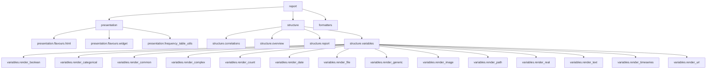

# `src.ydata_profiling.report`

## Tree:
    report/
    ├── presentation/
    │   ├── flavours/
    │   │   ├── html/
    │   │   └── widget/
    │   └── frequency_table_utils.py
    ├── structure/
    │   ├── correlations.py
    │   ├── overview.py
    │   ├── report.py
    │   └── variables/
    │       ├── render_boolean.py
    │       ├── render_categorical.py
    │       ├── render_common.py
    │       ├── render_complex.py
    │       ├── render_count.py
    │       ├── render_date.py
    │       ├── render_file.py
    │       ├── render_generic.py
    │       ├── render_image.py
    │       ├── render_path.py
    │       ├── render_real.py
    │       ├── render_text.py
    │       ├── render_timeseries.py
    │       └── render_url.py
    └── formatters.py

## Role:
Provides the complete reporting infrastructure for generating data profiling reports in various formats (HTML, Jupyter widgets) and structures the report content logically.

## Description:
This module owns the entire reporting system for data profiling, handling both the logical structure of reports and their presentation in different formats. It serves as the central hub for transforming data analysis results into human-readable reports.

The module is organized around two main concerns:
1. **Structure**: Defines how report content is organized hierarchically (overview, variables, correlations, etc.)
2. **Presentation**: Handles rendering of report elements in different output formats (HTML, Jupyter widgets)

Primary consumers include the main profiling entry points (`ProfileReport`) and the configuration system that determines output format.

## Components:
* `presentation/` - Contains rendering logic for different output formats (HTML, Jupyter widgets)
* `structure/` - Contains logic for organizing report content and building report structure
* `formatters.py` - Utility functions for formatting data values in reports

## Public API:
* `get_report_structure(config: Settings, summary: BaseDescription) -> Root` - Main entry point for building report structure
* `formatters` module - Provides utility functions for formatting values in reports
* Various renderable components like `HTML`, `Widget`, `Table`, `Image`, etc. for creating report elements

## Dependencies:
* Internal: `src.ydata_profiling.config` (Settings), `src.ydata_profiling.model` (BaseDescription), `src.ydata_profiling.plot` (plotting functions)
* External: `jinja2` (HTML templating), `ipywidgets` (Jupyter widget rendering), `tqdm` (progress bars)

## Constraints:
* Must be initialized with proper Settings configuration before use
* All renderable components must be properly linked to their content
* Thread safety: The module is stateless and thread-safe for concurrent rendering

---

## Files

- [`formatters.py`](report/formatters.md)

