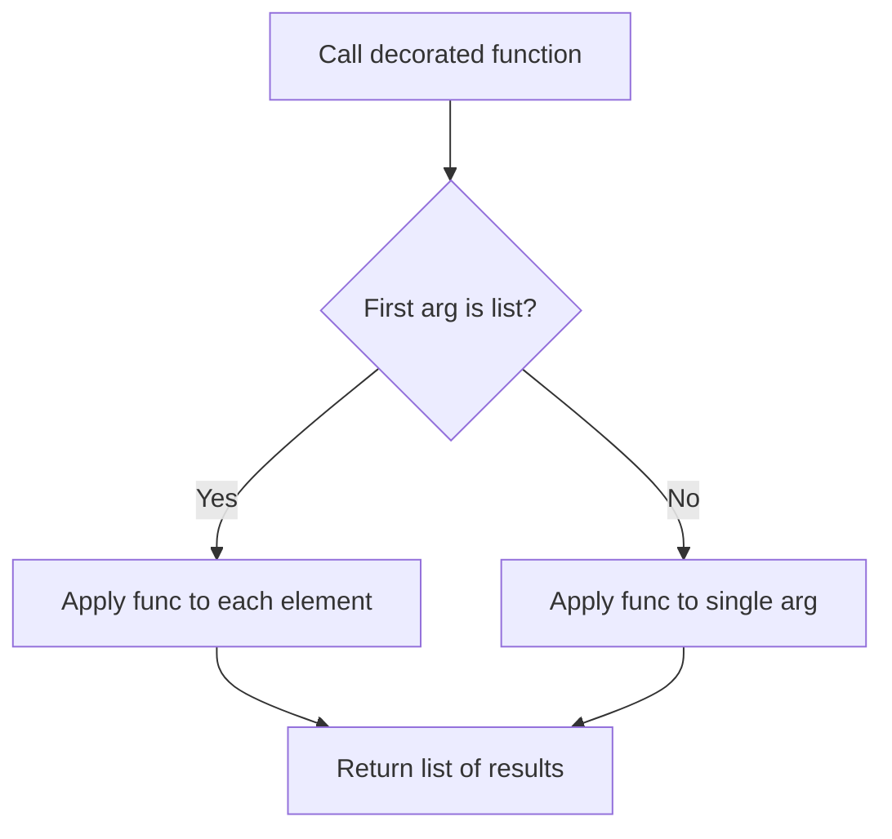
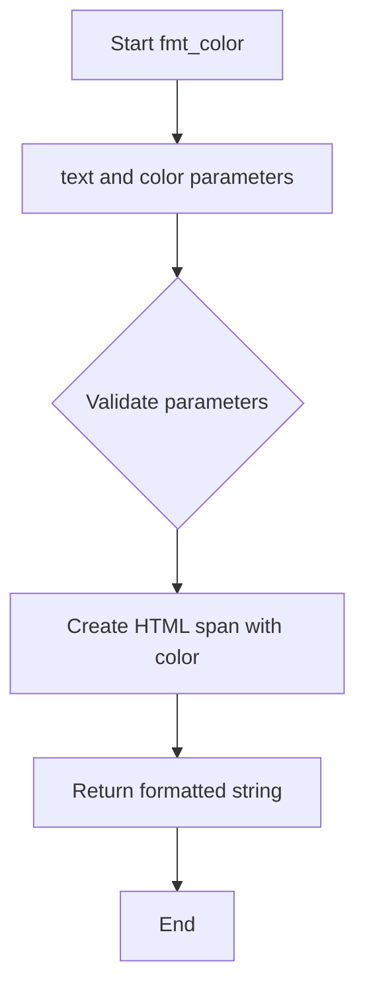
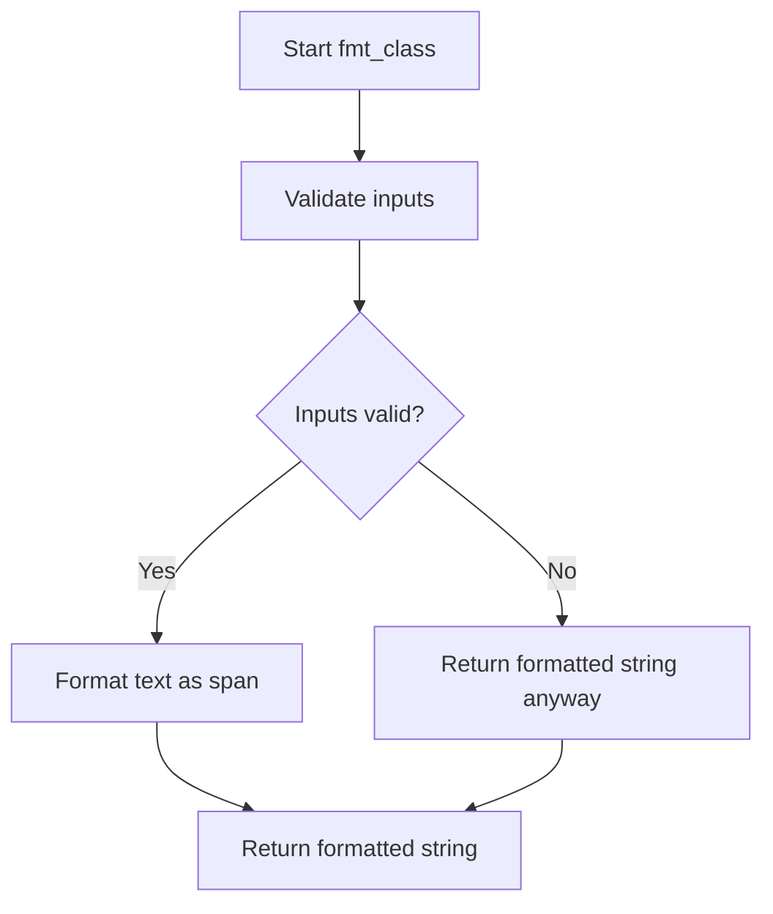
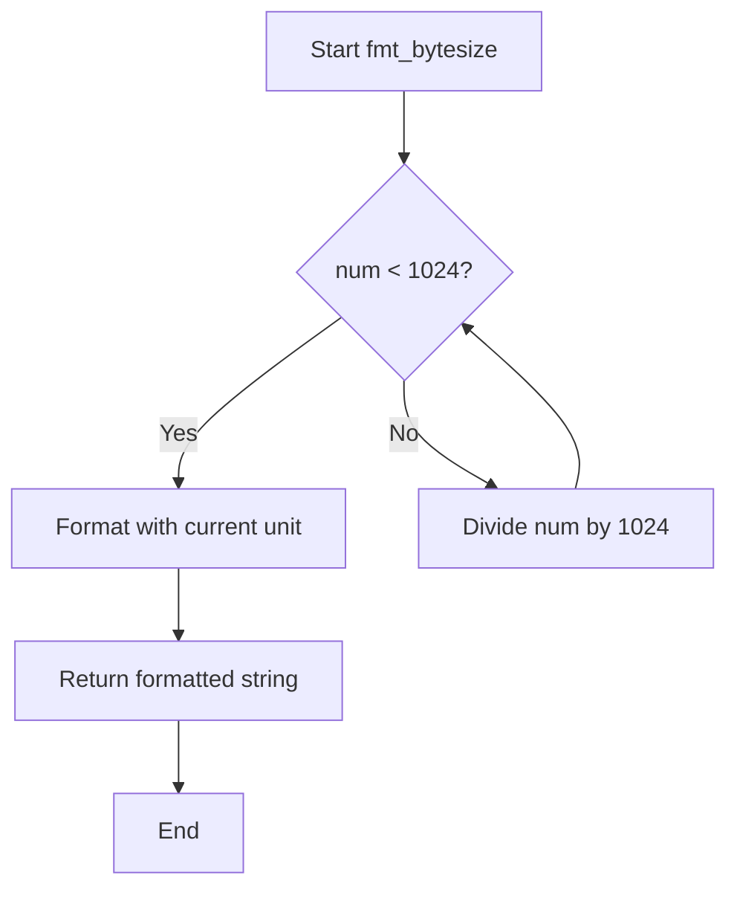
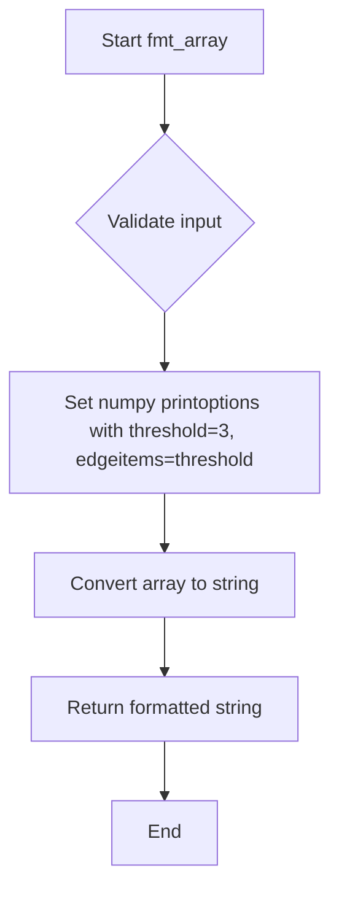

# `formatters.py`

## `src.ydata_profiling.report.formatters.list_args` · *function*

## Summary:
Decorator that enables a function to process either a single argument or a list of arguments uniformly.

## Description:
A higher-order function that transforms any callable to accept either a single argument or a list of arguments. When a list is provided as the first argument, the decorated function is applied to each element of the list. When a single argument is provided, the function is applied directly to that argument. This pattern is commonly used in data processing pipelines where the same transformation may need to be applied to individual elements or collections of elements.

## Args:
    func (Callable): The function to be decorated. This function can accept any number of positional and keyword arguments.

## Returns:
    Callable: A new function that behaves like the original function but with enhanced argument handling for lists.

## Raises:
    None: This decorator itself does not raise exceptions, though the wrapped function may raise exceptions based on its own implementation.

## Constraints:
    Preconditions:
    - The decorated function must be callable
    - The first argument passed to the returned function must be either a list or a single value that the wrapped function can process
    
    Postconditions:
    - If the first argument is a list, the result will be a list of the same length with the function applied to each element
    - If the first argument is not a list, the result will be the direct application of the function to that argument

## Side Effects:
    None: This decorator does not cause any side effects. It only modifies the behavior of the wrapped function.

## Control Flow:


## Examples:
```python
# Example usage with a simple function
def square(x):
    return x * x

# Decorate the function
decorated_square = list_args(square)

# Apply to single value
result1 = decorated_square(5)  # Returns 25

# Apply to list of values
result2 = decorated_square([1, 2, 3, 4])  # Returns [1, 4, 9, 16]
```

## `src.ydata_profiling.report.formatters.fmt_color` · *function*

## Summary:
Wraps text in an HTML span element with a specified color style.

## Description:
Formats text by wrapping it in an HTML span tag with an inline CSS color style attribute. This utility function is commonly used for generating colored text in HTML reports and dashboards.

## Args:
    text (str): The text content to be formatted with color.
    color (str): The CSS color value to apply to the text (e.g., 'red', '#FF0000', 'rgb(255,0,0)').

## Returns:
    str: An HTML string containing the text wrapped in a span element with the specified color style.

## Raises:
    None: This function does not raise any exceptions.

## Constraints:
    Preconditions:
        - Both `text` and `color` parameters must be strings.
        - The `color` parameter should be a valid CSS color specification.
    
    Postconditions:
        - The returned string is always a valid HTML span element with the specified color styling.
        - The original text content is preserved unchanged within the span element.

## Side Effects:
    None: This function has no side effects and is purely a transformation function.

## Control Flow:


## Examples:
    >>> fmt_color("Error message", "red")
    '<span style="color:red">Error message</span>'
    
    >>> fmt_color("Success", "#00FF00")
    '<span style="color:#00FF00">Success</span>'

## `src.ydata_profiling.report.formatters.fmt_class` · *function*

## Summary:
Wraps text in an HTML span element with a specified CSS class attribute.

## Description:
Formats input text by wrapping it in an HTML span tag with the provided CSS class. This utility function is used to apply styling or semantic markup to text elements within report generation.

## Args:
    text (str): The text content to be wrapped in HTML span tags.
    cls (str): The CSS class name to apply to the span element.

## Returns:
    str: An HTML string containing the text wrapped in a span element with the specified class.

## Raises:
    None: This function does not raise any exceptions.

## Constraints:
    Preconditions:
        - Both `text` and `cls` parameters must be strings.
        - The `cls` parameter should contain valid CSS class characters (letters, numbers, hyphens, underscores).
    
    Postconditions:
        - The returned string will always be in the format '<span class="CLASS_NAME">TEXT_CONTENT</span>'.
        - The function preserves the original text content exactly as provided.

## Side Effects:
    None: This function has no side effects. It performs no I/O operations or external state mutations.

## Control Flow:


## Examples:
    >>> fmt_class("Hello World", "highlight")
    '<span class="highlight">Hello World</span>'
    
    >>> fmt_class("Error message", "error")
    '<span class="error">Error message</span>'

## `src.ydata_profiling.report.formatters.fmt_bytesize` · *function*

## Summary:
Formats numeric byte values into human-readable strings with appropriate binary prefixes.

## Description:
Converts a raw byte count into a formatted string with the most appropriate binary unit (B, KiB, MiB, GiB, etc.) for better readability. This function is commonly used in data profiling reports to display file sizes, memory usage, or data dimensions in a user-friendly format.

## Args:
    num (float): The numeric byte value to format. Can be any positive or negative floating-point number.
    suffix (str): Optional suffix to append to the unit (default is "B"). Typically "B" for bytes, but could be "bits" or other units.

## Returns:
    str: A formatted string showing the value with appropriate binary prefix and suffix (e.g., "1.5 KiB", "2.3 MiB").

## Raises:
    None: This function does not raise any exceptions under normal operation.

## Constraints:
    Preconditions:
        - Input `num` should be a valid numeric value (int or float)
        - Input `suffix` should be a string
    
    Postconditions:
        - Output string always contains exactly one space between the numeric value and the unit
        - Output string uses exactly one decimal place for the numeric portion
        - Output string uses the appropriate binary prefix (B, Ki, Mi, Gi, Ti, Pi, Ei, Zi, Yi)

## Side Effects:
    None: This function has no side effects and is purely a formatting utility.

## Control Flow:


## Examples:
    >>> fmt_bytesize(1024)
    '1.0 KiB'
    
    >>> fmt_bytesize(1536)
    '1.5 KiB'
    
    >>> fmt_bytesize(1048576)
    '1.0 MiB'
    
    >>> fmt_bytesize(1073741824)
    '1.0 GiB'
    
    >>> fmt_bytesize(1099511627776)
    '1.0 TiB'
    
    >>> fmt_bytesize(1024, suffix="bits")
    '1.0 Ki bits'
```

## `src.ydata_profiling.report.formatters.fmt_percent` · *function*

## Summary:
Formats numeric values as percentages with special handling for near-zero and near-one values.

## Description:
Converts a numeric value to a percentage string representation, applying special formatting for edge cases where values are very close to 0 or 1. This function is designed to provide more readable percentage representations by showing "< 0.1%" for values that are positive but very close to zero, and "> 99.9%" for values that are less than one but very close to one.

## Args:
    value (float): The numeric value to format as a percentage. Must be between 0 and 1 inclusive.
    edge_cases (bool): Flag to enable special edge case handling. When True (default), values rounded to 0.000 are shown as "< 0.1%" and values rounded to 1.000 are shown as "> 99.9%". When False, all values are formatted normally.

## Returns:
    str: A string representation of the percentage value. Returns "< 0.1%" for positive values very close to 0, "> 99.9%" for values very close to 1, or standard formatted percentage like "50.0%" otherwise.

## Raises:
    None

## Constraints:
    Preconditions:
    - The input value must be a float between 0 and 1 inclusive
    - The edge_cases parameter must be a boolean value
    
    Postconditions:
    - The returned string will always end with "%"
    - For edge_cases=True, values that round to exactly 0.000 will return "< 0.1%"
    - For edge_cases=True, values that round to exactly 1.000 will return "> 99.9%"
    - All other values will be formatted as "{value*100:2.1f}%" where the precision is 1 decimal place

## Side Effects:
    None

## Control Flow:
```mermaid
flowchart TD
    A[Start fmt_percent] --> B{edge_cases is True?}
    B -- Yes --> C{round(value,3) == 0 AND value > 0?}
    B -- No --> E[Format as {value*100:2.1f}%]
    C -- Yes --> D[Return "< 0.1%"]
    C -- No --> F{round(value,3) == 1 AND value < 1?}
    F -- Yes --> G[Return "> 99.9%"]
    F -- No --> E
    D --> H[End]
    G --> H
    E --> H
```

## Examples:
    >>> fmt_percent(0.5)
    '50.0%'
    
    >>> fmt_percent(0.0001)
    '< 0.1%'
    
    >>> fmt_percent(0.9999)
    '> 99.9%'
    
    >>> fmt_percent(0.0001, edge_cases=False)
    '0.0%'
    
    >>> fmt_percent(0.9999, edge_cases=False)
    '99.9%'
```

## `src.ydata_profiling.report.formatters.fmt_timespan` · *function*

## Summary:
Formats a time duration in seconds into a human-readable string representation.

## Description:
Converts a numeric time duration (in seconds or timedelta) into a readable format that shows the most significant time units. When the duration is less than 60 seconds and not in detailed mode, it returns a simple second count. Otherwise, it breaks down the time into appropriate units like minutes, hours, days, etc.

This function is extracted to handle time formatting consistently across the profiling report generation, separating the concerns of time conversion logic from the report generation process.

## Args:
    num_seconds (Any): Time duration in seconds or a timedelta object to format. Must be convertible to a numeric value.
    detailed (bool): If True, includes all applicable time units. If False, only includes the most significant units. Defaults to False.
    max_units (int): Maximum number of time units to display when not in detailed mode. Defaults to 3. Must be a positive integer.

## Returns:
    str: Human-readable time duration string with appropriate units and pluralization. Returns empty string for zero time or when no units apply.

## Raises:
    None explicitly raised.

## Constraints:
    Preconditions:
    - num_seconds must be convertible to a numeric value
    - max_units must be a positive integer
    
    Postconditions:
    - Returns a properly formatted string with time units
    - Handles edge cases like zero time and single units appropriately
    - When detailed=False, returns at most max_units time units

## Side Effects:
    None.

## Control Flow:
```mermaid
flowchart TD
    A[Start fmt_timespan] --> B{num_seconds < 60 AND not detailed?}
    B -- Yes --> C[Return pluralized seconds]
    B -- No --> D[Initialize result list]
    D --> E[num_seconds = coerce_seconds(num_seconds)]
    E --> F[num_seconds = Decimal(num_seconds)]
    F --> G[relevant_units = reversed(time_units[0:detailed else 3:])]
    G --> H{For each unit in relevant_units}
    H --> I[count = num_seconds / divider]
    I --> J[num_seconds %= divider]
    J --> K{unit != last_unit?}
    K -- Yes --> L[count = int(count)]
    K -- No --> M[count = round_number(count)]
    L --> N{count not in (0, "0")?}
    M --> N
    N -- Yes --> O[Append pluralized(count, singular, plural) to result]
    N -- No --> P[Continue to next unit]
    H --> Q{len(result) == 1?}
    Q -- Yes --> R[Return result[0]]
    Q -- No --> S{not detailed?}
    S -- Yes --> T[Truncate result to max_units]
    S -- No --> U[Skip truncation]
    T --> V[concatenate(result)]
    U --> V
    V --> W[End]
```

## Examples:
    >>> fmt_timespan(30)
    '30 seconds'
    
    >>> fmt_timespan(125)
    '2 minutes and 5 seconds'
    
    >>> fmt_timespan(3661, detailed=True)
    '1 hour, 1 minute and 1 second'
    
    >>> fmt_timespan(3661, detailed=False, max_units=2)
    '1 hour and 1 minute'
    
    >>> fmt_timespan(timedelta(hours=2, minutes=30))
    '2 hours and 30 minutes'
    
    >>> fmt_timespan(0)
    ''

## `src.ydata_profiling.report.formatters.fmt_timespan_timedelta` · *function*

## Summary:
Formats timedelta objects into human-readable time spans or numeric values based on input type.

## Description:
This function serves as a specialized formatter that handles pandas Timedelta objects by converting them to seconds and formatting them as readable time spans, while falling back to numeric formatting for other input types. It provides a unified interface for displaying time durations in a user-friendly format.

## Args:
    delta (Any): Input value to format, typically a pandas Timedelta object or numeric value
    detailed (bool): When True, includes all time units; when False, limits to significant units (default: False)
    max_units (int): Maximum number of time units to display when detailed=False (default: 3)
    precision (int): Decimal precision for numeric formatting when delta is not a Timedelta (default: 10)

## Returns:
    str: Formatted string representing either a human-readable time span (for Timedelta inputs) or numeric representation (for other inputs)

## Raises:
    None explicitly raised - relies on underlying functions for any exceptions

## Constraints:
    Preconditions:
    - Input must be compatible with pandas Timedelta operations or numeric conversion
    - When delta is a Timedelta, microsecond and nanosecond components are properly accounted for
    - max_units parameter must be a positive integer
    
    Postconditions:
    - Returns a properly formatted string representation
    - For Timedelta inputs, the result accurately reflects the total time duration
    - For non-Timedelta inputs, returns a properly formatted numeric string

## Side Effects:
    None

## Control Flow:
```mermaid
flowchart TD
    A[Input delta] --> B{Is instance of pandas.Timedelta?}
    B -- Yes --> C[Get total seconds]
    C --> D{Has microseconds?}
    D -- Yes --> E[Add microseconds to seconds]
    E --> F[Add nanoseconds to seconds]
    F --> G[Call fmt_timespan()]
    B -- No --> H[Call fmt_numeric()]
    G --> I[Return formatted timespan]
    H --> I
```

## Examples:
    # Format a Timedelta object
    fmt_timespan_timedelta(pd.Timedelta('2 days 3 hours 30 minutes')) 
    # Returns: "2 days, 3 hours and 30 minutes"
    
    # Format a numeric value
    fmt_timespan_timedelta(123.456, precision=2)
    # Returns: "123.46"
    
    # With detailed=True
    fmt_timespan_timedelta(pd.Timedelta('1 day 2 hours 3 minutes 4 seconds'), detailed=True)
    # Returns: "1 day, 2 hours, 3 minutes and 4 seconds"
    
    # With nanosecond precision
    fmt_timespan_timedelta(pd.Timedelta('1 second 123456789 nanoseconds'))
    # Returns: "1.123456789 seconds"
```

## `src.ydata_profiling.report.formatters.fmt_numeric` · *function*

## Summary:
Formats numeric values with scientific notation conversion to HTML superscript representation.

## Description:
Converts floating-point numbers into human-readable string representations, with special handling for scientific notation by transforming 'e+' and 'e-' into HTML superscript format. This function is used to present numeric data in a more readable format, particularly for statistical reports and data profiling outputs.

## Args:
    value (float): The numeric value to format.
    precision (int, optional): Number of significant digits to display. Defaults to 10.

## Returns:
    str: A formatted string representation of the numeric value. Scientific notation is converted to HTML superscript format (e.g., "1.23e-4" becomes "1.23 × 10<sup>-4</sup>").

## Raises:
    None explicitly raised.

## Constraints:
    Preconditions:
    - The value parameter must be a numeric type that can be formatted with Python's .g format specifier
    - The precision parameter must be a non-negative integer
    
    Postconditions:
    - The returned string will always be a valid HTML-formatted representation of the numeric value
    - Scientific notation in the input will be converted to HTML superscript format

## Side Effects:
    None.

## Control Flow:
```mermaid
flowchart TD
    A[Start fmt_numeric] --> B[value formatted with .{precision}g]
    B --> C{Contains e+ or e-?}
    C -->|Yes| D[Replace e+ with × 10<sup>]
    C -->|Yes| E[Replace e- with × 10<sup>]
    D --> F[Add </sup> to close tag]
    E --> F
    F --> G[Remove <sup>0 from result]
    G --> H[Add sign to <sup> tag]
    H --> I[Return formatted string]
    C -->|No| J[Return formatted string directly]
```

## Examples:
    >>> fmt_numeric(123.456)
    '123.456'
    
    >>> fmt_numeric(1.23e-4)
    '1.23 × 10<sup>-4</sup>'
    
    >>> fmt_numeric(1.23e5, precision=3)
    '1.23 × 10<sup>5</sup>'
    
    >>> fmt_numeric(0.0)
    '0'
```

## `src.ydata_profiling.report.formatters.fmt_number` · *function*

## Summary:
Formats a numeric value with locale-aware thousands separators.

## Description:
Converts a numeric value into a string representation with appropriate thousands separators based on the system's locale settings. This function is used to present numeric values in a more readable format for reporting purposes. The function leverages Python's built-in number formatting with the 'n' format specifier.

## Args:
    value (int): The numeric value to format with thousands separators. While the type hint specifies int, the underlying formatting supports various numeric types including floats and decimals.

## Returns:
    str: A string representation of the numeric value with locale-aware grouping separators.

## Raises:
    None: This function does not raise any exceptions.

## Constraints:
    Preconditions: The input must be a numeric type that supports Python's number formatting.
    Postconditions: The returned string will contain the numeric value formatted with locale-appropriate thousands separators.

## Side Effects:
    None: This function has no side effects.

## Control Flow:
```mermaid
flowchart TD
    A[Start fmt_number] --> B[value:numeric]
    B --> C{Input validation}
    C --> D[Format with f"{value:n}"]
    D --> E[Return formatted string]
```

## Examples:
    >>> fmt_number(1000)
    '1,000'
    
    >>> fmt_number(1234567)
    '1,234,567'
    
    >>> fmt_number(-1234)
    '-1,234'
    
    >>> fmt_number(1234.56)
    '1,234.56'

## `src.ydata_profiling.report.formatters.fmt_array` · *function*

## Summary:
Formats a NumPy array into a compact string representation suitable for report generation, truncating large arrays to prevent excessive output.

## Description:
Converts a NumPy array to a string representation with controlled display options, limiting the number of elements shown for large arrays. This function extracts the array formatting logic to provide consistent, readable output in profiling reports while preventing verbose displays of large datasets.

This logic is separated from inline usage to ensure consistent formatting behavior across different parts of the reporting system and to avoid repeated numpy printoptions configuration code.

## Args:
    value (np.ndarray): The NumPy array to format as a string for reporting purposes.
    threshold (Any, optional): Controls how many array elements are shown at the edges when formatting. Defaults to np.nan which allows NumPy to use its default behavior for edge item display.

## Returns:
    str: A string representation of the array with controlled display length. Large arrays will show beginning and ending elements with ellipsis (...) in between.

## Raises:
    None explicitly raised by this function.

## Constraints:
    Preconditions:
    - The input `value` must be a valid NumPy array
    - The `threshold` parameter should be compatible with NumPy's printoptions (integer, np.nan, or similar)
    
    Postconditions:
    - The returned string will represent the array in a compact form suitable for reports
    - The formatting follows NumPy's printoptions behavior with threshold=3 and edgeitems=threshold

## Side Effects:
    None.

## Control Flow:


## Examples:
    # Basic usage with default threshold
    arr = np.array([1, 2, 3, 4, 5, 6, 7, 8, 9, 10])
    result = fmt_array(arr)
    # Returns: '[1 2 3 ... 8 9 10]' (shows first 3 and last 3 elements)
    
    # Usage with custom threshold
    arr = np.array([1, 2, 3, 4, 5, 6, 7, 8, 9, 10])
    result = fmt_array(arr, threshold=2)
    # Returns: '[1 2 ... 9 10]' (shows first 2 and last 2 elements)
    
    # Usage with larger array
    arr = np.array(range(100))
    result = fmt_array(arr)
    # Returns: '[0 1 2 ... 97 98 99]' (shows first 3 and last 3 elements of 100 elements)
```

## `src.ydata_profiling.report.formatters.fmt` · *function*

## Summary:
Formats values for display in reports, applying specialized numeric formatting and HTML escaping for other types.

## Description:
This function provides type-aware formatting for values to be displayed in profiling reports. For numeric values (float, int), it applies specialized formatting that converts scientific notation to HTML superscript representation. For non-numeric values, it ensures safe HTML rendering by escaping special characters. This separation of concerns allows for consistent, safe display formatting throughout the reporting system.

## Args:
    value (Any): The value to format for display in reports

## Returns:
    str: Formatted string representation of the value, with numeric values converted to scientific notation with HTML superscript and non-numeric values HTML-escaped

## Raises:
    None explicitly raised

## Constraints:
    Preconditions:
    - Input value can be of any type
    - The function assumes `fmt_numeric` is properly implemented for numeric types
    
    Postconditions:
    - Return value is always a string
    - Numeric values are formatted with scientific notation support when appropriate
    - Non-numeric values are HTML-safe (escaped)

## Side Effects:
    None

## Control Flow:
```mermaid
flowchart TD
    A[Start fmt()] --> B{Is value numeric?}
    B -- Yes --> C[Call fmt_numeric(value)]
    B -- No --> D[Convert to str and escape]
    C --> E[Return formatted numeric]
    D --> E
```

## Examples:
    >>> fmt(3.14159)
    '3.14159'
    
    >>> fmt(1.23e-4)
    '1.23 × 10<sup>-4</sup>'
    
    >>> fmt("hello")
    'hello'
    
    >>> fmt("<script>alert('xss')</script>")
    '&lt;script&gt;alert(&#x27;xss&#x27;)&lt;/script&gt;'
```

## `src.ydata_profiling.report.formatters.fmt_monotonic` · *function*

## Summary:
Converts an integer monotonicity indicator to a human-readable descriptive string.

## Description:
Maps integer values representing different types of monotonic sequences to descriptive text labels. This function is used to provide readable output for monotonicity analysis results in data profiling reports.

## Args:
    value (int): An integer in the range [-2, 2] representing different monotonicity types:
        -2: Strictly decreasing
        -1: Decreasing  
        0: Not monotonic
        1: Increasing
        2: Strictly increasing

## Returns:
    str: Human-readable description of the monotonicity type:
        - "Strictly increasing" for value = 2
        - "Increasing" for value = 1
        - "Not monotonic" for value = 0
        - "Decreasing" for value = -1
        - "Strictly decreasing" for value = -2

## Raises:
    ValueError: When the input value is not an integer in the range [-2, 2].

## Constraints:
    Preconditions:
        - Input must be an integer
        - Input must be within the range [-2, 2]
    Postconditions:
        - Returns one of the five predefined string values
        - Raises ValueError for invalid inputs

## Side Effects:
    None

## Control Flow:
```mermaid
flowchart TD
    A[Start fmt_monotonic] --> B{value == 2?}
    B -- Yes --> C[Return "Strictly increasing"]
    B -- No --> D{value == 1?}
    D -- Yes --> E[Return "Increasing"]
    D -- No --> F{value == 0?}
    F -- Yes --> G[Return "Not monotonic"]
    F -- No --> H{value == -1?}
    H -- Yes --> I[Return "Decreasing"]
    H -- No --> J{value == -2?}
    J -- Yes --> K[Return "Strictly decreasing"]
    J -- No --> L[Raise ValueError]
```

## Examples:
    >>> fmt_monotonic(2)
    'Strictly increasing'
    >>> fmt_monotonic(0)
    'Not monotonic'
    >>> fmt_monotonic(-2)
    'Strictly decreasing'
    >>> fmt_monotonic(5)
    ValueError: Value should be integer ranging from -2 to 2.

## `src.ydata_profiling.report.formatters.help` · *function*

## Summary:
Generates HTML markup for a help badge element that displays a tooltip with descriptive text.

## Description:
Creates an HTML badge element styled as a help icon that shows a tooltip when hovered. The badge can either be a standalone element or linked to an external resource via URL.

## Args:
    title (str): Text to display in the tooltip when hovering over the help badge
    url (Optional[str]): Optional hyperlink destination for the help badge. If None, badge is not clickable

## Returns:
    str: HTML string containing the help badge element with appropriate styling and tooltip

## Raises:
    None: This function does not raise any exceptions

## Constraints:
    Preconditions: 
    - title must be a string
    - url, if provided, must be a valid string URL
    
    Postconditions:
    - Returns valid HTML string with proper CSS styling
    - Badge has consistent styling with blue background and white text
    - Tooltip displays the provided title text

## Side Effects:
    None: This function has no side effects

## Control Flow:
```mermaid
flowchart TD
    A[Start help()] --> B{url is None?}
    B -->|Yes| C[Return span badge]
    B -->|No| D[Return anchor badge]
    C --> E[End]
    D --> E
```

## Examples:
```python
# Basic help badge without URL
help("Column statistics")
# Returns: '<span class="badge pull-right" style="color:#fff;background-color:#337ab7;" title="Column statistics">?</span>'

# Help badge with URL
help("Data quality metrics", "https://example.com/docs")
# Returns: '<a title="Data quality metrics" href="https://example.com/docs"><span class="badge pull-right" style="color:#fff;background-color:#337ab7;" title="Data quality metrics">?</span></a>'
```

## `src.ydata_profiling.report.formatters.fmt_badge` · *function*

## Summary:
Converts parenthesized numeric values in a string into HTML badge elements.

## Description:
Formats a string by replacing patterns matching "(number)" with HTML span elements having the "badge" CSS class. This utility is used to visually highlight numeric counts or values within textual reports.

## Args:
    value (str): Input string potentially containing parenthesized numeric values to be converted into badges.

## Returns:
    str: Modified string with parenthesized numbers replaced by HTML badge elements.

## Raises:
    None: This function does not raise any exceptions.

## Constraints:
    Preconditions:
        - Input must be a string
    Postconditions:
        - All occurrences of "(number)" patterns are replaced with "<span class=\"badge\">number</span>"
        - Non-matching text remains unchanged

## Side Effects:
    None: This function has no side effects beyond returning the transformed string.

## Control Flow:
```mermaid
flowchart TD
    A[Input String] --> B{Contains "(\\d+)" pattern?}
    B -- Yes --> C[Replace with <span class="badge">\\1</span>]
    B -- No --> D[Return unchanged string]
    C --> E[Output formatted string]
    D --> E
```

## Examples:
    >>> fmt_badge("Items (5)")
    'Items <span class="badge">5</span>'
    
    >>> fmt_badge("Errors (12) and Warnings (3)")
    'Errors <span class="badge">12</span> and Warnings <span class="badge">3</span>'
    
    >>> fmt_badge("No badges here")
    'No badges here'

