# `src.ydata_profiling.report.presentation`

## Tree:
presentation/
├── core/
│   ├── __init__.py
│   ├── alerts.py
│   ├── collapse.py
│   ├── container.py
│   ├── correlation_table.py
│   ├── dropdown.py
│   ├── duplicate.py
│   ├── frequency_table.py
│   ├── frequency_table_small.py
│   ├── html.py
│   ├── image.py
│   ├── item_renderer.py
│   ├── renderable.py
│   ├── root.py
│   ├── sample.py
│   ├── table.py
│   ├── toggle_button.py
│   ├── variable.py
│   └── variable_info.py
├── flavours/
│   ├── __init__.py
│   ├── flavours.py
│   ├── html/
│   │   ├── __init__.py
│   │   ├── alerts.py
│   │   ├── collapse.py
│   │   ├── container.py
│   │   ├── correlation_table.py
│   │   ├── dropdown.py
│   │   ├── duplicate.py
│   │   ├── frequency_table.py
│   │   ├── frequency_table_small.py
│   │   ├── html.py
│   │   ├── image.py
│   │   ├── root.py
│   │   ├── sample.py
│   │   ├── table.py
│   │   ├── templates.py
│   │   ├── toggle_button.py
│   │   ├── variable.py
│   │   └── variable_info.py
│   └── widget/
│       ├── __init__.py
│       ├── alerts.py
│       ├── collapse.py
│       ├── container.py
│       ├── correlation_table.py
│       ├── dropdown.py
│       ├── duplicate.py
│       ├── frequency_table.py
│       ├── frequency_table_small.py
│       ├── html.py
│       ├── image.py
│       ├── notebook.py
│       ├── root.py
│       ├── sample.py
│       ├── table.py
│       ├── toggle_button.py
│       ├── variable.py
│       └── variable_info.py
└── frequency_table_utils.py

## Role:
Defines the rendering infrastructure for data profiling reports in multiple output formats (HTML and Jupyter widgets).

## Description:
This module provides the foundation for rendering data profiling reports in different formats. It implements a two-layer architecture where core components define the structure and behavior of UI elements, while flavour-specific implementations handle the actual rendering for different output targets (HTML vs Jupyter widgets). The module enables flexible report generation that can be adapted to different environments and user interfaces.

Primary consumers include the report generation pipeline and configuration management systems that need to produce formatted output for web browsers or Jupyter notebooks.

The separation into core and flavour layers allows for consistent UI structure while enabling different presentation behaviors for different output formats, maintaining a clean separation of concerns between data representation and presentation logic.

## Components:
*   `Alerts` - Renders alert notifications with styling
*   `Collapse` - Creates collapsible UI elements
*   `Container` - Manages collections of UI elements with different layout strategies
*   `CorrelationTable` - Displays correlation matrices
*   `Dropdown` - Implements dropdown selection controls
*   `Duplicate` - Shows duplicate row information
*   `FrequencyTable` - Renders frequency distribution tables
*   `FrequencyTableSmall` - Renders compact frequency tables
*   `HTML` - Embeds raw HTML content
*   `Image` - Displays images with optional captions
*   `ItemRenderer` - Base class for renderable items
*   `Renderable` - Abstract base class for all UI elements
*   `Root` - Top-level container for entire reports
*   `Sample` - Shows sample data from datasets
*   `Table` - Renders general data tables
*   `ToggleButton` - Implements toggle buttons
*   `Variable` - Wraps variable-specific UI elements
*   `VariableInfo` - Displays detailed variable information
*   `HTMLReport` - Applies HTML flavour mappings to report structure
*   `WidgetReport` - Applies widget flavour mappings to report structure
*   `freq_table` - Generates frequency table data structures
*   `extreme_obs_table` - Generates extreme observations table data

```mermaid
graph TD
    A[Renderable] --> B[ItemRenderer]
    B --> C[Alerts]
    B --> D[Collapse]
    B --> E[Container]
    B --> F[CorrelationTable]
    B --> G[Dropdown]
    B --> H[Duplicate]
    B --> I[FrequencyTable]
    B --> J[FrequencyTableSmall]
    B --> K[HTML]
    B --> L[Image]
    B --> M[Root]
    B --> N[Sample]
    B --> O[Table]
    B --> P[ToggleButton]
    B --> Q[Variable]
    B --> R[VariableInfo]
    
    S[HTMLReport] --> T[get_html_renderable_mapping]
    T --> U[HTMLContainer]
    T --> V[HTMLVariable]
    T --> W[HTMLVariableInfo]
    T --> X[HTMLTable]
    T --> Y[HTMLHTML]
    T --> Z[HTMLRoot]
    T --> AA[HTMLImage]
    T --> AB[HTMLFrequencyTable]
    T --> AC[HTMLFrequencyTableSmall]
    T --> AD[HTMLAlerts]
    T --> AE[HTMLDuplicate]
    T --> AF[HTMLDropdown]
    T --> AG[HTMLSample]
    T --> AH[HTMLToggleButton]
    T --> AI[HTMLCollapse]
    T --> AJ[HTMLCorrelationTable]
    
    AK[WidgetReport] --> AL[get_widget_renderable_mapping]
    AL --> AM[WidgetContainer]
    AL --> AN[WidgetVariable]
    AL --> AO[WidgetVariableInfo]
    AL --> AP[WidgetTable]
    AL --> AQ[WidgetHTML]
    AL --> AR[WidgetRoot]
    AL --> AS[WidgetImage]
    AL --> AT[WidgetFrequencyTable]
    AL --> AU[WidgetFrequencyTableSmall]
    AL --> AV[WidgetAlerts]
    AL --> AW[WidgetDuplicate]
    AL --> AX[WidgetDropdown]
    AL --> AY[WidgetSample]
    AL --> AZ[WidgetToggleButton]
    AL --> BA[WidgetCollapse]
    AL --> BB[WidgetCorrelationTable]
    
    U -->|HTML| CE[HTMLContainer]
    V -->|HTML| CF[HTMLVariable]
    W -->|HTML| CG[HTMLVariableInfo]
    X -->|HTML| CH[HTMLTable]
    Y -->|HTML| CI[HTMLHTML]
    Z -->|HTML| CJ[HTMLRoot]
    AA -->|HTML| CK[HTMLImage]
    AB -->|HTML| CL[HTMLFrequencyTable]
    AC -->|HTML| CM[HTMLFrequencyTableSmall]
    AD -->|HTML| CN[HTMLAlerts]
    AE -->|HTML| CO[HTMLDuplicate]
    AF -->|HTML| CP[HTMLDropdown]
    AG -->|HTML| CQ[HTMLSample]
    AH -->|HTML| CR[HTMLToggleButton]
    AI -->|HTML| CS[HTMLCollapse]
    AJ -->|HTML| CT[HTMLCorrelationTable]
    
    AM -->|Widget| CU[WidgetContainer]
    AN -->|Widget| CV[WidgetVariable]
    AO -->|Widget| CW[WidgetVariableInfo]
    AP -->|Widget| CX[WidgetTable]
    AQ -->|Widget| CY[WidgetHTML]
    AR -->|Widget| CZ[WidgetRoot]
    AS -->|Widget| DA[WidgetImage]
    AT -->|Widget| DB[WidgetFrequencyTable]
    AU -->|Widget| DC[WidgetFrequencyTableSmall]
    AV -->|Widget| DD[WidgetAlerts]
    AW -->|Widget| DE[WidgetDuplicate]
    AX -->|Widget| DF[WidgetDropdown]
    AY -->|Widget| DG[WidgetSample]
    AZ -->|Widget| DH[WidgetToggleButton]
    BA -->|Widget| DI[WidgetCollapse]
    BB -->|Widget| DJ[WidgetCorrelationTable]
```

## Public API:
*   `HTMLReport(structure: Root)` - Applies HTML flavour mappings to a report structure
*   `WidgetReport(structure: Root)` - Applies widget flavour mappings to a report structure
*   `freq_table(freqtable: Union[pd.Series, List[pd.Series]], n: Union[int, List[int]], max_number_to_print: int)` - Generates frequency table data structures
*   `extreme_obs_table(freqtable: Union[pd.Series, List[pd.Series]], number_to_print: int, n: Union[int, List[int]])` - Generates extreme observations table data structures

## Dependencies:
*   Internal: `ydata_profiling.report.presentation.core` - Core UI element definitions
*   Internal: `ydata_profiling.report.presentation.flavours.html` - HTML-specific implementations
*   Internal: `ydata_profiling.report.presentation.flavours.widget` - Widget-specific implementations
*   External: `jinja2` - Template engine for HTML rendering
*   External: `ipywidgets` - Jupyter widget library for interactive UI
*   External: `pandas` - Data manipulation for frequency tables
*   External: `numpy` - Numerical operations for data processing

## Constraints:
*   All renderable objects must implement the `render()` method
*   Flavour conversion mappings must be complete for all core renderable types
*   HTML templates must exist for all HTML flavour implementations
*   Widget implementations must be compatible with Jupyter environment
*   Frequency table utility functions require pandas Series input
*   Thread safety: The module is stateless and thread-safe for concurrent rendering
*   Initialization: Requires proper configuration of template paths and asset directories for HTML output

---

## Files

- [`frequency_table_utils.py`](presentation/frequency_table_utils.md)

