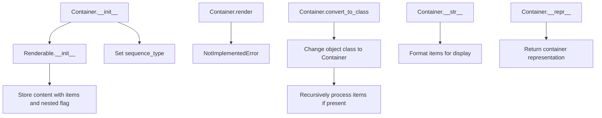

# `container.py`

## `src.ydata_profiling.report.presentation.core.container.Container` · *class*

## Summary:
Container represents a structured collection of Renderable elements that can be rendered in a report presentation layer.

## Description:
The Container class serves as a base abstraction for grouping multiple Renderable objects together. It is designed to be subclassed for specific container types (like lists, grids, or sections) that need to organize and present collections of report elements. The container maintains a sequence type identifier and can hold nested structures of Renderable objects.

This class enforces a clear boundary between container composition and rendering behavior, with rendering being implemented by subclasses. It provides utility methods for converting existing Renderable objects into container instances.

## State:
- items: Sequence[Renderable] - Collection of Renderable objects contained within this container
- sequence_type: str - Identifier describing the type of sequence (e.g., "list", "grid", "section")
- nested: bool - Flag indicating whether the container contains nested structures (default: False)
- name: Optional[str] - Human-readable identifier for the container (inherited from Renderable)
- anchor_id: Optional[str] - HTML anchor identifier for linking (inherited from Renderable)
- classes: Optional[str] - CSS classes for styling (inherited from Renderable)

The Container maintains its content through the parent Renderable class, storing items and nested flags in the content dictionary. The sequence_type is stored as a direct instance attribute.

## Lifecycle:
Creation: Instantiate with a sequence of Renderable items, required sequence_type, and optional metadata parameters (name, anchor_id, classes).

Usage: Typically used by creating subclasses that implement the render() method to define how the container's contents should be presented. The convert_to_class classmethod allows transforming existing Renderable objects into containers.

Destruction: No explicit cleanup required; relies on Python's garbage collection.

## Method Map:


## Raises:
- NotImplementedError: Raised by the render() method, indicating that subclasses must implement this method.

## Example:
```python
# Create a container with multiple renderable items
items = [header_element, table_element, chart_element]
container = Container(
    items=items,
    sequence_type="section",
    name="Data Overview",
    classes="report-section"
)

# Convert an existing renderable to a container type
existing_renderable = some_renderable_object
Container.convert_to_class(existing_renderable, lambda x: x)  # Converts to Container type
```

### `src.ydata_profiling.report.presentation.core.container.Container.__init__` · *method*

## Summary:
Initializes a Container object that holds multiple renderable items in a structured sequence.

## Description:
Configures a Container instance to manage a collection of renderable elements. This constructor prepares the container's internal state by delegating to the parent Renderable class and setting the sequence type identifier that determines how the contained items will be rendered.

## Args:
    items (Sequence[Renderable]): Collection of renderable objects to be contained within this container.
    sequence_type (str): String identifier specifying the type of sequence (e.g., 'list', 'grid', 'table') that defines rendering behavior.
    nested (bool): Flag indicating whether this container is nested within another container. Defaults to False.
    name (Optional[str]): Unique identifier for the container. Defaults to None.
    anchor_id (Optional[str]): HTML anchor ID for linking to this container. Defaults to None.
    classes (Optional[str]): CSS classes to apply to the container. Defaults to None.
    **kwargs: Additional keyword arguments passed to the parent Renderable constructor.

## Returns:
    None: This method initializes the object instance and does not return any value.

## Raises:
    None explicitly raised: Exceptions would be propagated from the parent Renderable.__init__ method if invalid arguments are provided.

## State Changes:
    Attributes READ: None
    Attributes WRITTEN: 
    - self.sequence_type: Set to the provided sequence_type parameter
    - self.content: Updated through parent Renderable.__init__ to store container configuration including items and nested flag

## Constraints:
    Preconditions:
    - items must be a sequence of Renderable objects
    - sequence_type must be a string identifying the sequence type
    - All arguments except nested, name, anchor_id, and classes are required
    Postconditions:
    - self.sequence_type is assigned the provided sequence_type value
    - The container's content dictionary is properly initialized with items and nested configuration

## Side Effects:
    None: This method performs no I/O operations, external service calls, or mutations to objects outside the instance being initialized.

### `src.ydata_profiling.report.presentation.core.container.Container.__str__` · *method*

## Summary:
Returns a formatted string representation of the container and its items, with proper indentation for multi-line content.

## Description:
This method provides a human-readable string representation of the Container object, displaying the container type followed by its items with sequential numbering. It's designed to create a clean, hierarchical view of container contents for debugging and logging purposes.

The method is called during string conversion operations (like `str(container)` or when printing the container object). It specifically handles multi-line item representations by indenting subsequent lines with tabs for better readability.

## Args:
    None

## Returns:
    str: A formatted string showing "Container" followed by numbered items, where each item's string representation is properly indented if it contains newlines.

## Raises:
    None

## State Changes:
    Attributes READ: self.content
    Attributes WRITTEN: None

## Constraints:
    Preconditions:
    - self.content must be a dictionary-like object
    - self.content must contain either no "items" key or an "items" key with a sequence/iterable value
    
    Postconditions:
    - Returns a string representation of the container structure
    - The returned string always starts with "Container\n"
    - Items are displayed with zero-based indexing

## Side Effects:
    None

### `src.ydata_profiling.report.presentation.core.container.Container.__repr__` · *method*

## Summary:
Returns a string representation of the Container object that includes its name when available.

## Description:
This method provides a human-readable representation of the Container instance for debugging and logging purposes. It checks if a name has been assigned to the container via the content dictionary and formats the output accordingly. This method is part of the standard Python object protocol and is automatically called when using repr() on a Container instance.

## Args:
    None

## Returns:
    str: A string representation of the Container. When a name is present in the content dictionary, returns "Container(name=<name>)", otherwise returns "Container".

## Raises:
    None

## State Changes:
    Attributes READ: self.content
    Attributes WRITTEN: None

## Constraints:
    Preconditions: The Container instance must have a content dictionary attribute
    Postconditions: The method returns a string representation without modifying the object's state

## Side Effects:
    None

### `src.ydata_profiling.report.presentation.core.container.Container.render` · *method*

## Summary:
Raises NotImplementedError to indicate that concrete implementations must override this method for rendering container contents.

## Description:
This method is part of the abstract interface defined by the Container class, which inherits from Renderable. As an abstract method, it enforces that all concrete subclasses must implement their own rendering logic. The method is designed to process and return a rendered representation of the container's contents, but the base implementation simply raises NotImplementedError to prevent direct instantiation or use of the abstract class.

## Args:
    self: The Container instance to render.

## Returns:
    Any: This method always raises NotImplementedError and never returns a value.

## Raises:
    NotImplementedError: Raised when this method is called on the base Container class, indicating that subclasses must implement this method.

## State Changes:
    Attributes READ: 
    - self.content: The method accesses the container's content dictionary which contains the "items" key with renderable objects
    - self.sequence_type: The method reads the sequence type identifier for the container
    Attributes WRITTEN: None

## Constraints:
    Preconditions:
    - The Container instance must be properly initialized with items and sequence_type
    - The items in self.content["items"] must be valid Renderable objects
    Postconditions:
    - When implemented by subclasses, the method should return a consistent data structure appropriate for the presentation layer

## Side Effects:
    None

### `src.ydata_profiling.report.presentation.core.container.Container.convert_to_class` · *method*

## Summary:
Converts a Renderable object to a specified class while processing contained items.

## Description:
Changes the class of a Renderable object to the specified class and recursively applies a transformation function to any items contained within the object's content. This utility function allows for dynamic class conversion of renderable components while maintaining their structural integrity.

## Args:
    cls: The target class to convert the object to
    obj: A Renderable object whose class will be changed
    flv: A callable function that will be applied to each item in obj.content["items"]

## Returns:
    None: This function modifies the object in-place and does not return anything

## Raises:
    KeyError: If obj.content does not contain the "items" key when processing is attempted
    AttributeError: If obj does not have a content attribute or if flv is not callable

## State Changes:
    Attributes READ: obj.content
    Attributes WRITTEN: obj.__class__ (modified in-place)

## Constraints:
    Preconditions: 
    - obj must be an instance of Renderable or subclass
    - obj must have a content attribute that is a dictionary-like object
    - flv must be callable
    Postconditions:
    - obj.__class__ will be set to cls
    - If items exist in obj.content, flv will be called on each item

## Side Effects:
    Mutates the class of the input object in-place
    Calls the provided callable function flv on each item in obj.content["items"]

