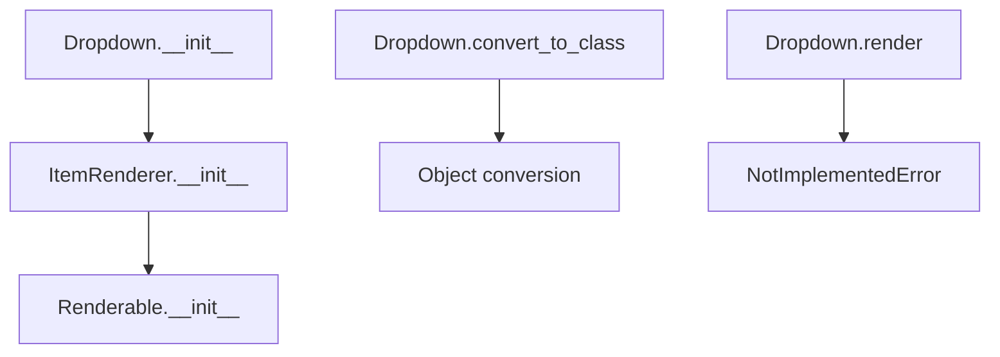

# `dropdown.py`

## `src.ydata_profiling.report.presentation.core.dropdown.Dropdown` · *class*

## Summary:
Represents a dropdown UI component that contains a list of items and a single selected item, commonly used in report presentations.

## Description:
The Dropdown class implements a dropdown UI element that displays a list of selectable items with a single selected item. It inherits from ItemRenderer, which itself inherits from Renderable, making it part of a hierarchical presentation component system. This class is typically used in report generation systems where interactive UI elements are needed. The convert_to_class method allows dynamic conversion of existing Renderable objects to Dropdown instances.

## State:
- name: str - The name identifier for the dropdown component
- id: str - Unique identifier for the dropdown element
- items: list - Collection of items that can be selected from the dropdown
- item: Container - The currently selected item displayed in the dropdown
- anchor_id: str - Anchor identifier for linking to other components
- classes: str - CSS classes applied to the dropdown element (joined from list input)
- is_row: bool - Flag indicating if the dropdown should be rendered in row orientation
- item_type: str - Set to "dropdown" by constructor, identifies the component type
- content: dict - Dictionary containing all component configuration data

## Lifecycle:
- Creation: Instantiate with required parameters including name, id, items, item (Container), anchor_id, classes (list), and is_row boolean
- Usage: Typically used in report generation pipelines where render() method would be called, though it raises NotImplementedError
- Destruction: No explicit cleanup required; relies on Python garbage collection

## Method Map:


## Raises:
- NotImplementedError: When render() method is called, as it's not implemented in this class

## Example:
```python
# Create a dropdown with items
container_item = Container(items=[], sequence_type="div")
dropdown = Dropdown(
    name="my_dropdown",
    id="dropdown_1",
    items=["option1", "option2", "option3"],
    item=container_item,
    anchor_id="anchor_1",
    classes=["dropdown-class", "custom-style"],
    is_row=True
)

# Convert existing renderable to dropdown
existing_renderable = SomeRenderable()
Dropdown.convert_to_class(existing_renderable, lambda x: x)
```

### `src.ydata_profiling.report.presentation.core.dropdown.Dropdown.__init__` · *method*

## Summary:
Initializes a dropdown component with configuration options for rendering in a report presentation.

## Description:
Configures a dropdown UI element with name, ID, items, associated container item, anchor ID, CSS classes, and orientation settings. This method serves as the constructor for dropdown components in the report presentation layer, setting up the internal content structure that will be rendered later.

## Args:
    name (str): Unique identifier for the dropdown component
    id (str): HTML ID attribute for the dropdown element
    items (list): Collection of items to display in the dropdown menu
    item (Container): Associated container element that represents the dropdown content
    anchor_id (str): Reference ID for anchoring the dropdown in the layout
    classes (list): List of CSS class names to apply to the dropdown element
    is_row (bool): Flag indicating whether the dropdown should be rendered in row orientation
    **kwargs: Additional keyword arguments passed to the parent constructor

## Returns:
    None: This method initializes the object's state and does not return a value

## Raises:
    None explicitly raised: The method delegates to parent constructors which may raise exceptions based on invalid arguments

## State Changes:
    Attributes READ: None
    Attributes WRITTEN: Sets up self.content dictionary with dropdown configuration data

## Constraints:
    Preconditions: 
    - All required parameters must be provided with correct types
    - The 'item' parameter must be a Container instance
    - The 'classes' parameter must be a list of strings
    - The 'items' parameter must be a list-like structure
    
    Postconditions:
    - The object's content dictionary is properly initialized with all dropdown configuration
    - The 'classes' field in content is a space-separated string representation of the input list
    - The dropdown type is set to "dropdown" in the parent initialization

## Side Effects:
    None: This method performs no I/O operations or external service calls. It only initializes internal object state.

### `src.ydata_profiling.report.presentation.core.dropdown.Dropdown.__repr__` · *method*

## Summary:
Returns a string representation of the Dropdown object for debugging and logging purposes.

## Description:
This method provides a standardized string representation of Dropdown instances, returning the literal string "Dropdown". It is part of the standard Python object protocol and is typically used for debugging, logging, and development purposes to quickly identify objects of this type.

## Args:
    None

## Returns:
    str: The string "Dropdown" representing this object type.

## Raises:
    None

## State Changes:
    Attributes READ: None
    Attributes WRITTEN: None

## Constraints:
    Preconditions: None
    Postconditions: Always returns the string "Dropdown"

## Side Effects:
    None

The method is intentionally simple and follows Python conventions for `__repr__` implementations. It doesn't access or modify any instance attributes, making it a minimal implementation that serves purely for identification purposes.

### `src.ydata_profiling.report.presentation.core.dropdown.Dropdown.render` · *method*

## Summary:
Raises NotImplementedError indicating that this method must be implemented by subclasses.

## Description:
This method serves as an abstract interface definition for the render functionality in dropdown components. As defined in the base Renderable class, all concrete implementations must override this method to provide specific rendering logic for dropdown elements. The current implementation simply raises NotImplementedError to enforce this requirement.

In the ydata-profiling framework, this method is part of the presentation layer architecture that converts internal data representations into human-readable formats for reports. Dropdown components inherit this abstract method and must provide their own implementation to render the dropdown UI element appropriately.

## Args:
    None

## Returns:
    This method does not return normally as it raises an exception.

## Raises:
    NotImplementedError: Always raised by this base implementation to indicate that subclasses must provide their own rendering logic.

## State Changes:
    Attributes READ: 
    - self.content: The internal content dictionary containing dropdown configuration and data
    - self.item_type: The type identifier for this dropdown item (inherited from ItemRenderer)
    
    Attributes WRITTEN: None

## Constraints:
    Preconditions:
    - This method should only be called on concrete subclasses that have implemented the render method
    - The Dropdown instance must be properly initialized with valid content
    
    Postconditions:
    - The method always raises NotImplementedError (unless overridden by subclasses)

## Side Effects:
    None

### `src.ydata_profiling.report.presentation.core.dropdown.Dropdown.convert_to_class` · *method*

## Summary:
Changes the class type of a Renderable object and optionally processes a contained item with a callback function.

## Description:
This function dynamically converts a Renderable object to a different class type while preserving its content structure. It's typically used during presentation layer rendering to transform objects between different representation types. When the object's content contains an "item" key, the provided callback function is invoked with that item.

## Args:
    cls: The target class to convert the object to
    obj: A Renderable object whose class will be changed
    flv: A callable function that processes the item from obj.content["item"] if it exists

## Returns:
    None: This function modifies the object in-place and doesn't return anything

## Raises:
    KeyError: If obj.content doesn't contain the "item" key when attempting to access obj.content["item"]
    AttributeError: If obj doesn't have a content attribute or if the target class doesn't properly handle the content structure
    TypeError: If flv is not callable

## State Changes:
    Attributes READ: obj.content
    Attributes WRITTEN: obj.__class__ (modified in-place)

## Constraints:
    Preconditions: 
    - obj must be an instance of Renderable or subclass
    - obj must have a content attribute that is a dictionary
    - cls must be a valid class type
    - flv must be callable
    
    Postconditions:
    - obj.__class__ will be set to cls
    - If obj.content contains "item" key, flv will be called with obj.content["item"]

## Side Effects:
    None: This function only modifies the object's class and potentially calls the provided callback function with a single item

