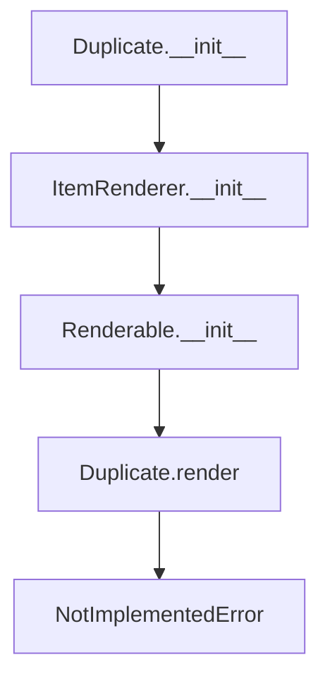

# `duplicate.py`

## `src.ydata_profiling.report.presentation.core.duplicate.Duplicate` · *class*

## Summary:
Represents a duplicate data visualization component in report presentations.

## Description:
The Duplicate class is a specialized renderer for displaying duplicate data findings in profiling reports. It inherits from ItemRenderer and serves as a container for duplicate data that will be rendered in a report. This class is part of the presentation layer of the ydata-profiling library and is designed to encapsulate duplicate data information for report generation.

The class is intended to be subclassed or used as part of a larger reporting framework where the actual rendering logic is implemented elsewhere.

## State:
- item_type: str - Set to "duplicate" indicating this is a duplicate data component
- content: dict - Contains the duplicate data under the key "duplicate" 
- name: str - Optional identifier for this duplicate component
- anchor_id: str - Optional anchor identifier for HTML linking
- classes: str - Optional CSS classes for styling

The __init__ method requires a name parameter (str) and duplicate DataFrame (pd.DataFrame), with optional keyword arguments for additional configuration.

## Lifecycle:
- Creation: Instantiate with a name string and pandas DataFrame containing duplicate data
- Usage: Typically used as part of a report generation pipeline where render() would be called
- Destruction: No special cleanup required; relies on Python's garbage collection

## Method Map:


## Raises:
- NotImplementedError: When the render() method is called, as it's not implemented in this base class

## Example:
```python
import pandas as pd
from ydata_profiling.report.presentation.core.duplicate import Duplicate

# Create duplicate data
duplicate_df = pd.DataFrame({'col1': [1, 2, 2], 'col2': ['a', 'b', 'b']})

# Create Duplicate instance
duplicate_component = Duplicate(name="my_duplicates", duplicate=duplicate_df)

# The component can be used in a report pipeline
# Note: render() raises NotImplementedError and must be implemented by subclasses
```

### `src.ydata_profiling.report.presentation.core.duplicate.Duplicate.__init__` · *method*

## Summary:
Initializes a Duplicate object with duplicate data for report presentation.

## Description:
Configures the Duplicate renderer with duplicate data and metadata for inclusion in profiling reports. This method establishes the object's content structure and type identifier for proper rendering in the presentation layer.

## Args:
    name (str): Unique identifier for this duplicate item
    duplicate (pd.DataFrame): DataFrame containing duplicate records to be displayed
    **kwargs: Additional configuration options passed to parent constructors

## Returns:
    None: This method initializes the object state and returns nothing

## Raises:
    None explicitly raised: All exceptions are propagated from parent class constructors

## State Changes:
    Attributes READ: None
    Attributes WRITTEN: 
    - self.item_type: Set to "duplicate"
    - self.content: Initialized with {"duplicate": duplicate} and additional metadata from kwargs

## Constraints:
    Preconditions:
    - duplicate parameter must be a valid pandas DataFrame
    - name parameter must be a string
    - All kwargs must be valid arguments for parent class constructors
    
    Postconditions:
    - self.item_type is set to "duplicate"
    - self.content contains the duplicate DataFrame under the "duplicate" key
    - Object is properly initialized for rendering in report presentations

## Side Effects:
    None: This method performs no I/O operations or external service calls

### `src.ydata_profiling.report.presentation.core.duplicate.Duplicate.__repr__` · *method*

*No documentation generated.*

### `src.ydata_profiling.report.presentation.core.duplicate.Duplicate.render` · *method*

## Summary:
Renders duplicate data into a presentation-ready format for reporting.

## Description:
This method is responsible for converting the stored duplicate DataFrame into a visual representation suitable for inclusion in reports. As an abstract method inherited from ItemRenderer, it must be implemented by subclasses to provide specific rendering behavior for duplicate data visualization.

## Args:
    None

## Returns:
    Any: A presentation-ready representation of duplicate data, typically HTML elements, JSON structures, or other format suitable for report generation.

## Raises:
    NotImplementedError: This method is not implemented in the base Duplicate class and must be overridden by subclasses.

## State Changes:
    Attributes READ: 
    - self.item_type: String identifier for the item type
    - self.content: Dictionary containing the duplicate DataFrame under the "duplicate" key
    
    Attributes WRITTEN: None

## Constraints:
    Preconditions:
    - The Duplicate instance must be properly initialized with duplicate data
    - The duplicate attribute in content must be a valid pandas DataFrame
    
    Postconditions:
    - When implemented, the method should return a valid presentation format
    - The returned object should be compatible with the reporting framework's rendering pipeline

## Side Effects:
    None

