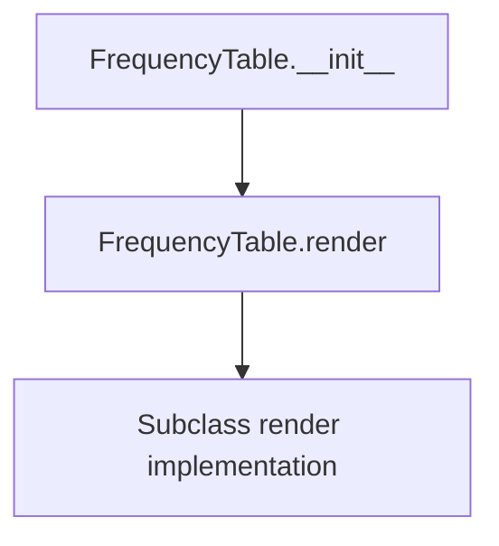

# `frequency_table.py`

## `src.ydata_profiling.report.presentation.core.frequency_table.FrequencyTable` · *class*

## Summary:
Represents a frequency table presentation component that displays categorical data frequencies.

## Description:
The FrequencyTable class is a specialized presentation component designed to render frequency tables for categorical data analysis. It inherits from ItemRenderer and serves as a base class for implementing specific frequency table rendering logic. This class provides the foundational structure for displaying data frequencies while leaving the actual rendering implementation to subclasses.

This class exists as a distinct abstraction to separate the data structure and configuration of frequency tables from their visual representation. It ensures consistent handling of frequency table data through standardized parameters while allowing flexible rendering implementations.

## State:
- rows: list - Collection of frequency table rows containing data values and their counts
- redact: bool - Flag indicating whether sensitive data should be redacted in the display
- item_type: str - Set to "frequency_table" to identify this component type
- content: dict - Dictionary containing the configuration parameters (rows, redact) and inherited properties

## Lifecycle:
- Creation: Instantiate with rows (list of frequency data) and redact (bool) parameters
- Usage: Call render() method to generate the visual representation (implementation-dependent)
- Destruction: No special cleanup required; relies on Python's garbage collection

## Method Map:


## Raises:
- None explicitly raised by __init__
- NotImplementedError raised by render() method (must be implemented by subclasses)

## Example:
```python
# Create a frequency table with sample data
rows = [
    {"value": "A", "count": 10},
    {"value": "B", "count": 5}
]
table = FrequencyTable(rows, redact=False)

# Note: render() method must be implemented by subclasses
# table.render()  # Would raise NotImplementedError
```

### `src.ydata_profiling.report.presentation.core.frequency_table.FrequencyTable.__init__` · *method*

## Summary:
Initializes a frequency table presentation component with rows and redaction settings.

## Description:
Constructs a FrequencyTable object that represents a frequency table visualization. This method sets up the internal state with the provided rows and redaction configuration, and registers the component with the appropriate item type for presentation rendering.

## Args:
    rows (list): A list of frequency table rows to display
    redact (bool): Flag indicating whether sensitive data should be redacted
    **kwargs: Additional keyword arguments passed to the parent ItemRenderer constructor

## Returns:
    None: This method initializes the object's state but does not return a value

## Raises:
    None: This method does not explicitly raise exceptions

## State Changes:
    Attributes READ: None
    Attributes WRITTEN: 
    - self.item_type: Set to "frequency_table"
    - Other attributes inherited from ItemRenderer parent class

## Constraints:
    Preconditions:
    - rows parameter must be a valid list
    - redact parameter must be a boolean value
    - All kwargs must be valid arguments for the parent ItemRenderer constructor
    
    Postconditions:
    - The object is initialized with item_type set to "frequency_table"
    - The content dictionary contains the rows and redact parameters
    - The object inherits all functionality from ItemRenderer base class

## Side Effects:
    None: This method performs no I/O operations or external service calls

### `src.ydata_profiling.report.presentation.core.frequency_table.FrequencyTable.__repr__` · *method*

## Summary:
Returns a string representation of the FrequencyTable object for debugging and logging purposes.

## Description:
This method implements Python's special `__repr__` protocol to provide a standardized string representation of FrequencyTable instances. It is called by Python's built-in `repr()` function and is primarily used for debugging and development purposes to quickly identify objects.

## Args:
    None

## Returns:
    str: Always returns the literal string "FrequencyTable" regardless of the object's internal state.

## Raises:
    None

## State Changes:
    Attributes READ: None
    Attributes WRITTEN: None

## Constraints:
    Preconditions: None
    Postconditions: The returned string is always "FrequencyTable"

## Side Effects:
    None

### `src.ydata_profiling.report.presentation.core.frequency_table.FrequencyTable.render` · *method*

## Summary:
Abstract method that must be implemented to render frequency table data into a displayable format for reports.

## Description:
This method serves as the rendering interface for frequency table items within the report generation pipeline. As an abstract method inherited from `ItemRenderer`, it must be overridden by concrete implementations to provide specific rendering logic for frequency table data. The method transforms the internal frequency table representation (containing rows and redaction settings) into a displayable format suitable for inclusion in generated reports.

## Args:
    None

## Returns:
    Any: The rendered representation of the frequency table, typically HTML, JSON, or another displayable format that presents the frequency data in a user-friendly manner.

## Raises:
    NotImplementedError: Raised by the base implementation to enforce that subclasses must provide their own rendering logic.

## State Changes:
    Attributes READ: 
    - self.item_type: String identifier for the item type ('frequency_table')
    - self.content: Dictionary containing the frequency table data including 'rows' and 'redact' keys
    
    Attributes WRITTEN: None

## Constraints:
    Preconditions:
    - The `FrequencyTable` instance must be properly initialized with valid `rows` and `redact` parameters
    - The method should only be called on concrete implementations, not the base class
    
    Postconditions:
    - When properly implemented, the method should return a valid rendered representation of the frequency table data that maintains the structure and semantics of the original frequency table

## Side Effects:
    None

