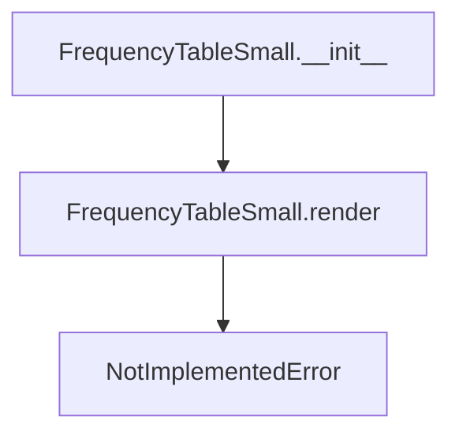

# `frequency_table_small.py`

## `src.ydata_profiling.report.presentation.core.frequency_table_small.FrequencyTableSmall` · *class*

## Summary:
Represents a compact frequency table visualization component for data profiling reports.

## Description:
The FrequencyTableSmall class is a specialized rendering component designed to display frequency tables in a compact format within data profiling reports. It inherits from ItemRenderer and serves as a base class for frequency table visualizations. This class provides the foundational structure for frequency data presentation, with the render method intended to be implemented by subclasses for actual visualization generation.

## State:
- rows: List[Any] - A list containing frequency data rows, where each row can be of any type (typically tuples or dictionaries containing value-frequency pairs)
- redact: bool - A flag indicating whether sensitive data should be redacted from the display
- item_type: str - Set to "frequency_table_small" by constructor, identifying this component type
- content: dict - Dictionary containing the configuration parameters (rows and redact) passed to the parent class

## Lifecycle:
- Creation: Instantiate with rows (list of frequency data) and redact (boolean flag) parameters
- Usage: Typically used within data profiling report generation workflows where frequency distributions need to be displayed in a compact format
- Destruction: Inherits standard object destruction behavior from parent classes

## Method Map:


## Raises:
- NotImplementedError: The render method raises this exception and must be overridden by subclasses

## Example:
```python
# Create a frequency table with sample data
rows = [("A", 10), ("B", 5), ("C", 15)]
table = FrequencyTableSmall(rows, redact=False)

# The render method would typically be called by the reporting framework
# table.render()  # Would raise NotImplementedError
```

### `src.ydata_profiling.report.presentation.core.frequency_table_small.FrequencyTableSmall.__init__` · *method*

## Summary:
Initializes a frequency table renderer with rows and redaction settings for presentation in reports.

## Description:
Constructs a FrequencyTableSmall instance that renders frequency tables with optional redaction. This method serves as the constructor for frequency table presentation components, setting up the underlying data structure with rows and redaction flags while maintaining compatibility with the rendering pipeline.

## Args:
    rows (List[Any]): List of frequency table rows to display
    redact (bool): Flag indicating whether sensitive data should be redacted
    **kwargs: Additional keyword arguments passed to parent classes for name, anchor_id, and classes configuration

## Returns:
    None: This method initializes the object state and does not return a value

## Raises:
    None explicitly raised: The method delegates to parent constructors which may raise exceptions if invalid arguments are passed

## State Changes:
    Attributes READ: None
    Attributes WRITTEN: 
    - self.item_type: Set to "frequency_table_small"
    - self.content: Dictionary containing "rows" and "redact" keys plus any additional kwargs

## Constraints:
    Preconditions:
    - rows parameter must be a valid list
    - redact parameter must be a boolean value
    - All kwargs must be valid arguments for the parent Renderable class
    
    Postconditions:
    - The instance is properly initialized with item_type set to "frequency_table_small"
    - The content dictionary contains the rows and redact configuration
    - Parent class initialization is completed successfully

## Side Effects:
    None: This method performs no I/O operations or external service calls. It only initializes object state.

### `src.ydata_profiling.report.presentation.core.frequency_table_small.FrequencyTableSmall.__repr__` · *method*

## Summary:
Returns a string representation of the FrequencyTableSmall class instance.

## Description:
This method provides a standard string representation for FrequencyTableSmall instances, returning the literal string "FrequencyTableSmall". It is typically called when the object needs to be displayed in a debugging context or when converting the object to a string representation.

## Args:
    None

## Returns:
    str: The string "FrequencyTableSmall" representing the class type.

## Raises:
    None

## State Changes:
    Attributes READ: None
    Attributes WRITTEN: None

## Constraints:
    Preconditions: None
    Postconditions: Always returns the string "FrequencyTableSmall"

## Side Effects:
    None

### `src.ydata_profiling.report.presentation.core.frequency_table_small.FrequencyTableSmall.render` · *method*

## Summary:
Renders the frequency table data into a presentation-ready format for reporting.

## Description:
This abstract method defines the interface for rendering frequency table data into a displayable format. It serves as a contract for subclasses to implement specific rendering logic for different output formats (HTML, JSON, etc.). The method is part of the presentation layer in data profiling reports.

## Args:
    self: The FrequencyTableSmall instance containing frequency table data to be rendered.

## Returns:
    Any: A rendered representation of the frequency table, typically HTML string or DOM element, suitable for inclusion in profiling reports.

## Raises:
    NotImplementedError: This abstract method must be implemented by subclasses to provide concrete rendering behavior.

## State Changes:
    Attributes READ: 
    - self.content: The underlying frequency table data structure
    - self.name: The name identifier for the frequency table
    - self.anchor_id: The anchor identifier for linking within reports
    - self.classes: CSS classes for styling the rendered output
    
    Attributes WRITTEN: None

## Constraints:
    Preconditions:
    - The instance must be properly initialized with required content and metadata
    - Subclasses must override this method with concrete implementation
    
    Postconditions:
    - When implemented, the method returns a valid presentation format
    - The returned value should be compatible with the report generation pipeline

## Side Effects:
    None

