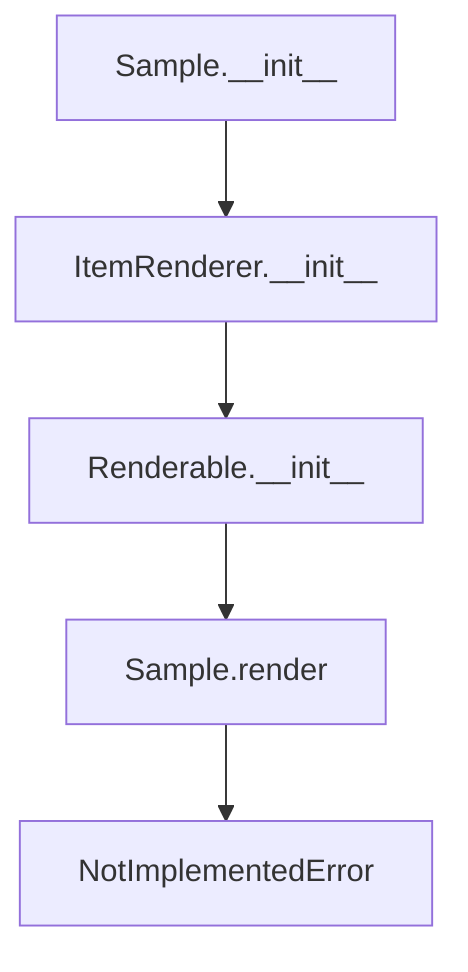

# `sample.py`

## `src.ydata_profiling.report.presentation.core.sample.Sample` · *class*

## Summary:
Abstract base class for sample data presentation components in profiling reports.

## Description:
The Sample class serves as an abstract base class for implementing sample data presentation components within the profiling report's presentation layer. It provides the foundational structure for displaying sample data from pandas DataFrames with optional captions. This class defines the interface contract for sample data rendering while requiring concrete implementations of the render() method in derived classes.

The class is typically extended by concrete implementations that provide the actual rendering logic for displaying sample data in various formats (HTML, JSON, etc.) within profiling reports.

## State:
- name: str - The identifier/name for this sample component
- sample: pd.DataFrame - The pandas DataFrame containing the sample data to be displayed
- caption: Optional[str] - An optional caption describing the sample data
- item_type: str - Set to "sample" indicating this is a sample type item (inherited from ItemRenderer)
- content: dict - Dictionary containing the sample data and caption (inherited from Renderable)

The class maintains the invariant that sample must be a valid pandas DataFrame and caption must be either a string or None.

## Lifecycle:
Creation: Instantiate with a name, pandas DataFrame sample, and optional caption
Usage: Extended by concrete classes that implement the render() method for actual presentation
Destruction: No special cleanup required; relies on Python's garbage collection

## Method Map:


## Raises:
- NotImplementedError: When the render() method is called, as it must be implemented by subclasses

## Example:
```python
import pandas as pd
from ydata_profiling.report.presentation.core.sample import Sample

# Create a sample DataFrame
sample_data = pd.DataFrame({'A': [1, 2, 3], 'B': [4, 5, 6]})

# This would typically be extended by a concrete implementation
# class HTMLSample(Sample):
#     def render(self):
#         # Implementation for HTML rendering
#         pass

# sample_component = Sample("first_sample", sample_data, "First 3 rows")
# sample_component.render()  # Would raise NotImplementedError
```

### `src.ydata_profiling.report.presentation.core.sample.Sample.__init__` · *method*

## Summary:
Initializes a Sample object with a DataFrame sample and optional caption for presentation rendering.

## Description:
This method sets up the Sample instance by initializing the parent class hierarchy with the appropriate parameters. It configures the sample data and caption for use in report generation and presentation rendering. The method serves as the primary constructor for creating sample display elements in the profiling report.

## Args:
    name (str): Unique identifier for the sample element
    sample (pd.DataFrame): The DataFrame containing the sample data to be displayed
    caption (Optional[str]): Optional caption text for the sample display, defaults to None
    **kwargs: Additional keyword arguments passed to the parent constructor for anchor_id and classes

## Returns:
    None: This method initializes the object state but does not return a value

## Raises:
    None explicitly raised: This method delegates to parent constructors which may raise exceptions based on invalid arguments

## State Changes:
    Attributes READ: None
    Attributes WRITTEN: 
    - self.item_type: Set to "sample" string
    - self.content: Dictionary containing "sample" and "caption" keys with respective values

## Constraints:
    Preconditions:
    - name must be a valid string
    - sample must be a pandas DataFrame
    - caption must be a string or None
    - All kwargs must be valid arguments for the parent class constructors (anchor_id, classes)
    
    Postconditions:
    - self.item_type is set to "sample"
    - self.content dictionary contains the sample data and caption under keys "sample" and "caption"
    - The object is properly initialized for presentation rendering through the parent class hierarchy

## Side Effects:
    None: This method performs no I/O operations or external service calls

### `src.ydata_profiling.report.presentation.core.sample.Sample.__repr__` · *method*

## Summary:
Returns a string representation of the Sample object for debugging and logging purposes.

## Description:
This method provides a concise string identifier for Sample objects, primarily used for debugging and logging. It's part of the standard Python object representation protocol and is automatically called by functions like `repr()` and when objects are displayed in interactive environments.

## Args:
    None

## Returns:
    str: Always returns the literal string "Sample" regardless of the object's internal state.

## Raises:
    None

## State Changes:
    Attributes READ: None
    Attributes WRITTEN: None

## Constraints:
    Preconditions: None
    Postconditions: The method always returns the same string value "Sample".

## Side Effects:
    None

### `src.ydata_profiling.report.presentation.core.sample.Sample.render` · *method*

## Summary:
Abstract method that must be implemented to render sample data for presentation in reports.

## Description:
This abstract method is part of the rendering interface defined by the Renderable base class and is responsible for converting stored sample data into a presentation-ready format. The Sample class inherits this method from ItemRenderer (which inherits from Renderable) and must be overridden by concrete implementations to provide actual rendering functionality.

During report generation, this method is called to transform sample data (stored in self.content['sample']) into HTML or other presentation formats suitable for display in reports. The method should return a representation that can be rendered by the reporting framework.

## Args:
    None

## Returns:
    This method does not return normally due to the NotImplementedError being raised in the base implementation.

## Raises:
    NotImplementedError: Raised in the base implementation to indicate that concrete subclasses must override this method with their own rendering logic.

## State Changes:
    Attributes READ: 
    - self.content: The content dictionary containing sample data and caption
    - self.item_type: The type identifier for this item
    
    Attributes WRITTEN: None

## Constraints:
    Preconditions: 
    - The Sample instance must be properly initialized with sample data
    - The content dictionary must contain the required "sample" key with DataFrame data
    - The caption field (if present) should be valid text
    
    Postconditions: 
    - In the base implementation, this method will always raise NotImplementedError
    - Concrete implementations must return a valid presentation format

## Side Effects:
    None

