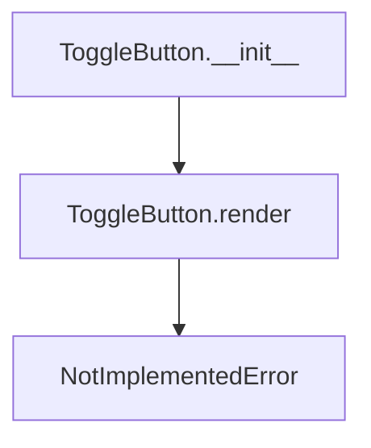

# `toggle_button.py`

## `src.ydata_profiling.report.presentation.core.toggle_button.ToggleButton` · *class*

## Summary:
Represents a toggle button component for report presentation that can be rendered in UI interfaces.

## Description:
The ToggleButton class is a specialized renderer for creating toggle button elements in report presentations. It serves as a building block for interactive UI components in data profiling reports. This class extends ItemRenderer, which itself extends Renderable, establishing a clear hierarchy for presentation components.

The toggle button is designed to be a clickable element that can switch between two states (on/off, active/inactive) and is typically used for filtering, toggling visibility, or controlling features in interactive dashboards or reports.

## State:
- item_type: str, set to "toggle_button" by constructor, defines the component type
- content: dict, contains the configuration data including the text label
- text: str, stored in content dictionary under "text" key, represents the button's label
- name: Optional[str], inherited from Renderable, provides a unique identifier
- anchor_id: Optional[str], inherited from Renderable, used for HTML anchors
- classes: Optional[str], inherited from Renderable, CSS classes for styling

The class maintains the invariant that item_type is always "toggle_button" and content always contains a "text" key.

## Lifecycle:
Creation: Instantiate with a text parameter and optional keyword arguments for name, anchor_id, and classes
Usage: Call render() method to generate the UI representation (must be implemented by subclasses)
Destruction: No explicit cleanup required; relies on Python garbage collection

## Method Map:


## Raises:
- NotImplementedError: Raised by render() method which must be implemented by subclasses

## Example:
```python
# Create a toggle button with text label
button = ToggleButton("Show Details")

# The render method would typically be called by the presentation layer
# button.render()  # Would raise NotImplementedError
```

### `src.ydata_profiling.report.presentation.core.toggle_button.ToggleButton.__init__` · *method*

*No documentation generated.*

### `src.ydata_profiling.report.presentation.core.toggle_button.ToggleButton.__repr__` · *method*

*No documentation generated.*

### `src.ydata_profiling.report.presentation.core.toggle_button.ToggleButton.render` · *method*

## Summary:
Renders the toggle button component into a displayable format for reports or UI presentations, raising NotImplementedError in the base implementation.

## Description:
This abstract method defines the interface for rendering toggle button components within the presentation layer. As part of the Renderable hierarchy, it must be implemented by concrete subclasses to provide actual rendering functionality. The ToggleButton class inherits this method from ItemRenderer and raises NotImplementedError to indicate that subclasses must implement the specific rendering logic for toggle buttons.

## Args:
    None

## Returns:
    Any: The rendered representation of the toggle button, typically an HTML string or equivalent UI representation that can be embedded in reports or displayed in user interfaces. The exact return type depends on the specific implementation in subclasses.

## Raises:
    NotImplementedError: Raised by the base ToggleButton implementation to indicate that subclasses must override this method with concrete rendering logic.

## State Changes:
    Attributes READ: 
    - self.content: Reads the stored content including the text field
    - self.item_type: Reads the item type identifier "toggle_button"
    
    Attributes WRITTEN: None

## Constraints:
    Preconditions:
    - The ToggleButton instance must be properly initialized with required parameters
    - The content dictionary must contain the necessary fields (like text)
    - Subclasses must implement this method to provide concrete rendering logic
    
    Postconditions:
    - The returned value must be a valid representation that can be rendered by the presentation layer
    - The method must not modify the internal state of the ToggleButton instance

## Side Effects:
    None

