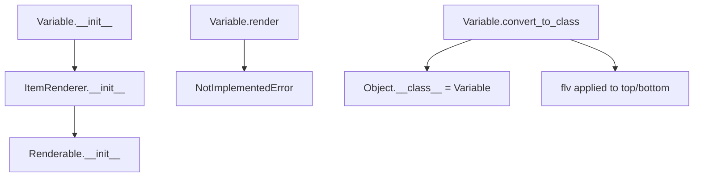

# `variable.py`

## `src.ydata_profiling.report.presentation.core.variable.Variable` · *class*

## Summary:
Represents a variable component in report presentations with top and bottom renderable elements.

## Description:
The Variable class is used to structure variable-specific content in report presentations. It serves as a container for a top renderable element and an optional bottom renderable element, allowing for hierarchical presentation of variable information. This class is part of the presentation layer of the ydata-profiling library and is typically used to organize variable-level statistics and visualizations.

## State:
- `top`: Renderable - Required component representing the main content of the variable
- `bottom`: Optional[Renderable] - Optional secondary content displayed below the main content
- `ignore`: bool - Flag indicating whether this variable should be ignored during processing, defaults to False
- Inherits `content` dictionary from Renderable containing all the above fields
- Inherits `item_type` string from ItemRenderer set to "variable"

## Lifecycle:
- Creation: Instantiate with a required `top` Renderable and optional `bottom` Renderable and `ignore` flag
- Usage: Typically rendered via the abstract `render()` method (which raises NotImplementedError in this implementation)
- Conversion: Can be converted to this class type using the `convert_to_class` classmethod

## Method Map:


## Raises:
- `NotImplementedError`: Raised by the `render()` method, indicating that subclasses must implement this method

## Example:
```python
# Create a variable with top and bottom components
top_component = Text("Variable Name")
bottom_component = Table(data=[...])
variable = Variable(top=top_component, bottom=bottom_component, ignore=False)

# Convert another renderable object to Variable type
other_renderable = SomeOtherRenderable()
Variable.convert_to_class(other_renderable, lambda x: x)  # Apply flv function
```

### `src.ydata_profiling.report.presentation.core.variable.Variable.__init__` · *method*

## Summary:
Initializes a Variable presentation component with top and bottom renderables and an ignore flag.

## Description:
Creates a Variable object that represents a variable presentation element in the profiling report. This method sets up the component's structure by storing the top and bottom renderable elements along with an ignore flag, which determines whether the variable should be excluded from rendering.

## Args:
    top (Renderable): The primary renderable element for this variable presentation.
    bottom (Optional[Renderable]): The secondary renderable element, defaults to None.
    ignore (bool): Flag indicating whether this variable should be ignored during rendering, defaults to False.
    **kwargs: Additional keyword arguments passed to the parent Renderable constructor.

## Returns:
    None: This method initializes the object's state and does not return a value.

## Raises:
    None: This method does not explicitly raise exceptions.

## State Changes:
    Attributes READ: None
    Attributes WRITTEN: 
    - self.item_type: Set to "variable"
    - self.content: Dictionary containing "top", "bottom", and "ignore" keys

## Constraints:
    Preconditions:
    - The `top` parameter must be a valid Renderable instance
    - The `bottom` parameter, if provided, must be a valid Renderable instance or None
    - The `ignore` parameter must be a boolean value
    
    Postconditions:
    - The object is properly initialized as a Variable presentation component
    - The content dictionary contains the required keys: "top", "bottom", and "ignore"

## Side Effects:
    None: This method performs no I/O operations or external service calls.

### `src.ydata_profiling.report.presentation.core.variable.Variable.__str__` · *method*

## Summary:
Returns a formatted string representation of a Variable object showing its top and bottom content elements.

## Description:
Formats and returns a human-readable string representation of the Variable instance. This method is primarily used for debugging and logging purposes to visualize the structure and content of a Variable object. The method accesses the top and bottom content elements stored in self.content and formats them with proper indentation for multi-line strings.

## Args:
    None

## Returns:
    str: A formatted string with the structure "Variable\n- top: {top_text}\n- bottom: {bottom_text}" where top_text and bottom_text are the string representations of self.content["top"] and self.content["bottom"], respectively. Multi-line strings are indented with tab characters.

## Raises:
    KeyError: If self.content does not contain the "top" or "bottom" keys.
    TypeError: If self.content["top"] or self.content["bottom"] cannot be converted to string.

## State Changes:
    Attributes READ: self.content
    Attributes WRITTEN: None

## Constraints:
    Preconditions: 
    - self.content must be a dictionary containing "top" and "bottom" keys
    - Both self.content["top"] and self.content["bottom"] must be convertible to string
    
    Postconditions:
    - Returns a properly formatted string representation
    - Multi-line content is indented with tab characters

## Side Effects:
    None

### `src.ydata_profiling.report.presentation.core.variable.Variable.__repr__` · *method*

## Summary:
Returns a string representation of the Variable object indicating its type.

## Description:
This method provides a concise string representation of the Variable instance, returning the literal string "Variable". It overrides the default object representation to clearly identify the object type in debugging and logging contexts.

## Args:
    self: The Variable instance being represented.

## Returns:
    str: The string "Variable" that identifies this object type.

## Raises:
    None: This method does not raise any exceptions.

## State Changes:
    Attributes READ: None - this method only reads the object's type information
    Attributes WRITTEN: None - this method does not modify any attributes

## Constraints:
    Preconditions: The method can be called on any Variable instance
    Postconditions: The return value is always the string "Variable"

## Side Effects:
    None: This method performs no I/O operations or external service calls.

### `src.ydata_profiling.report.presentation.core.variable.Variable.render` · *method*

## Summary:
Renders the variable presentation component by converting its top and bottom renderables into their final representation.

## Description:
This method is responsible for transforming the structured variable presentation (containing top and bottom renderable components) into its final rendered form. It's an abstract method that must be implemented by subclasses to define how the variable should be displayed in the final report. The method processes the internal `top` and `bottom` renderable components and returns their combined rendered representation.

## Args:
    None

## Returns:
    Any: The rendered representation of the variable, typically containing the rendered forms of both top and bottom components.

## Raises:
    NotImplementedError: This method is not implemented in the base Variable class and must be overridden by subclasses.

## State Changes:
    Attributes READ: 
    - self.content["top"]: The top renderable component of the variable
    - self.content["bottom"]: The bottom renderable component of the variable
    - self.content["ignore"]: Flag indicating whether the variable should be ignored in rendering

    Attributes WRITTEN: None

## Constraints:
    Preconditions:
    - The Variable instance must be properly initialized with valid top and bottom renderable components
    - Subclasses must implement this method to provide concrete rendering behavior
    
    Postconditions:
    - The returned value represents the final rendered form of the variable presentation
    - The method should handle cases where bottom component is None

## Side Effects:
    None

### `src.ydata_profiling.report.presentation.core.variable.Variable.convert_to_class` · *method*

## Summary:
Changes the class of a Renderable object and applies a transformation function to its top and bottom content elements.

## Description:
This function dynamically changes the class of a Renderable object to the specified class and applies a filtering/transformation function to the "top" and "bottom" content elements if they exist and are not None. This is used to modify the presentation behavior of renderable components while preserving their content structure. The function is part of a pattern used throughout the presentation layer to enable dynamic rendering behavior changes.

## Args:
    cls: The target class to change the object to
    obj: A Renderable object whose class will be changed
    flv: A callable function that will be applied to process the "top" and "bottom" content elements

## Returns:
    None

## Raises:
    None explicitly raised

## State Changes:
    Attributes READ: obj.content, obj.content["top"], obj.content["bottom"]
    Attributes WRITTEN: obj.__class__

## Constraints:
    Preconditions: 
    - obj must be an instance of Renderable or subclass
    - flv must be callable
    - obj.content must be a dictionary-like object
    
    Postconditions:
    - obj.__class__ will be set to cls
    - The "top" and "bottom" content elements (if present and not None) will have flv applied to them

## Side Effects:
    None

