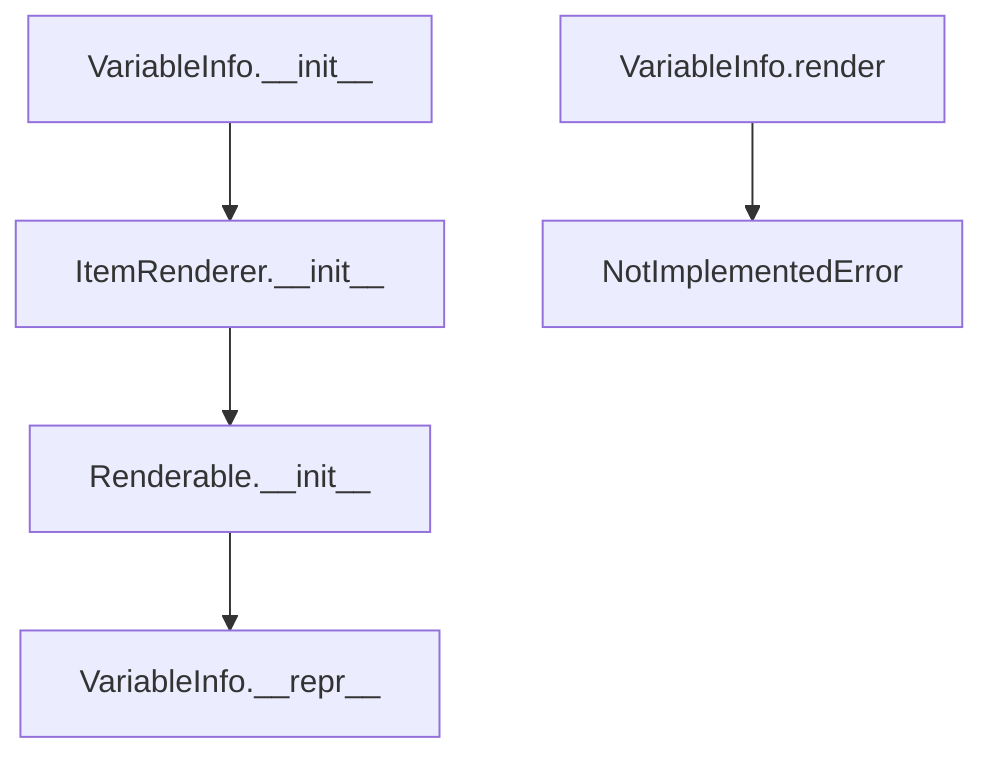

# `variable_info.py`

## `src.ydata_profiling.report.presentation.core.variable_info.VariableInfo` · *class*

## Summary:
Represents metadata and information about a variable in a data profiling report, including its type, alerts, and styling information.

## Description:
The VariableInfo class is used to encapsulate all relevant information about a variable within a data profiling report. It serves as a presentation layer component that holds metadata such as variable name, type, description, associated alerts, and styling configuration. This class is designed to be rendered in various report formats and provides a standardized way to represent variable-level information in data analysis reports.

## State:
- anchor_id: str - Unique identifier for the variable, used for linking and navigation
- var_name: str - Name of the variable being described
- var_type: str - Data type of the variable (e.g., 'numeric', 'categorical')
- alerts: List[Alert] - Collection of alerts or warnings associated with this variable
- description: str - Detailed description of the variable's characteristics
- style: Style - Styling configuration object for visual presentation
- item_type: str - Fixed value "variable_info" identifying this component type
- content: dict - Dictionary containing all the above information for rendering purposes

## Lifecycle:
- Creation: Instantiate with required parameters including anchor_id, var_name, var_type, alerts, description, and style
- Usage: Typically used within report generation pipelines where it gets processed by rendering engines
- Destruction: No explicit cleanup required; relies on Python's garbage collection

## Method Map:


## Raises:
- NotImplementedError: When the render() method is called, as it must be implemented by subclasses

## Example:
```python
from ydata_profiling.config import Style
from ydata_profiling.model.alerts import Alert
from ydata_profiling.report.presentation.core.variable_info import VariableInfo

# Create a sample alert
alert = Alert(alert_type="HIGH_CORRELATION", column_name="feature1")

# Create a style configuration
style = Style()

# Create variable info instance
variable_info = VariableInfo(
    anchor_id="var_123",
    var_name="age",
    var_type="numeric",
    alerts=[alert],
    description="Age of individuals in years",
    style=style
)

# Note: render() method raises NotImplementedError and must be implemented by subclasses
```

### `src.ydata_profiling.report.presentation.core.variable_info.VariableInfo.__init__` · *method*

*No documentation generated.*

### `src.ydata_profiling.report.presentation.core.variable_info.VariableInfo.__repr__` · *method*

## Summary:
Returns a string representation identifying the VariableInfo class instance.

## Description:
This method provides a standardized string representation for VariableInfo instances, returning the literal string "VariableInfo". It is part of the standard Python object protocol for debugging and logging purposes. This method is overridden from the parent ItemRenderer class to provide a clear identification of the object type.

## Args:
    None

## Returns:
    str: The string "VariableInfo" that identifies this class type.

## Raises:
    None

## State Changes:
    Attributes READ: None
    Attributes WRITTEN: None

## Constraints:
    Preconditions: None
    Postconditions: None

## Side Effects:
    None

### `src.ydata_profiling.report.presentation.core.variable_info.VariableInfo.render` · *method*

## Summary:
Converts variable information into a presentation-ready format for report generation.

## Description:
This method is responsible for transforming the structured variable metadata (name, type, alerts, description, styling) into a format suitable for display in profiling reports. It is an abstract method that must be implemented by subclasses to provide specific rendering logic for variable information presentation.

## Args:
    None

## Returns:
    Any: The rendered representation of variable information, typically HTML or a presentation object that can be embedded in reports.

## Raises:
    NotImplementedError: This method is not implemented in the base VariableInfo class and must be overridden by subclasses.

## State Changes:
    Attributes READ: 
    - self.item_type
    - self.content (accessed via parent class)
    - self.anchor_id
    - self.var_name
    - self.var_type
    - self.alerts
    - self.description
    - self.style

    Attributes WRITTEN: None

## Constraints:
    Preconditions:
    - The VariableInfo instance must be properly initialized with all required parameters
    - The content dictionary must contain valid data for all fields (anchor_id, var_name, description, var_type, alerts, style)
    
    Postconditions:
    - The method must return a valid presentation format that can be consumed by the reporting system
    - The returned value should be compatible with the expected output format of the report generation pipeline

## Side Effects:
    None

