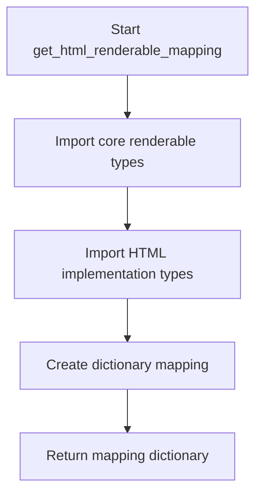
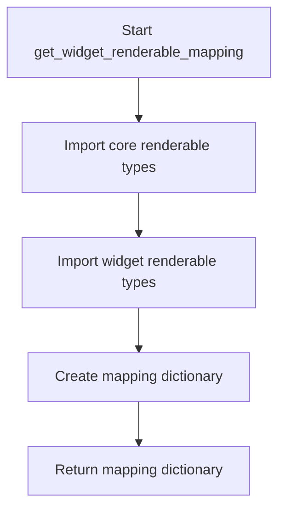

# `flavours.py`

## `src.ydata_profiling.report.presentation.flavours.flavours.apply_renderable_mapping` · *function*

## Summary:
Converts a renderable structure to its corresponding type in a different presentation flavour using a type mapping.

## Description:
Applies a type mapping to convert a renderable object from one presentation flavour to another by looking up the appropriate target class and invoking its convert_to_class method. This function enables dynamic conversion between different presentation flavours (such as HTML and Widget) in the reporting system.

## Args:
    mapping (Dict[Type[Renderable], Type[Renderable]]): Dictionary mapping source Renderable types to target Renderable types. Each key is a Renderable subclass, and each value is the corresponding flavour-specific Renderable subclass.
    structure (Renderable): The renderable object to be converted to a different presentation flavour. This object's type determines which mapping entry is used.
    flavour (Callable): A callable that specifies the target presentation flavour for conversion. This is typically a factory function or constructor for the target flavour.

## Returns:
    None: This function modifies the structure parameter in-place and does not return a value.

## Raises:
    KeyError: If the type of the structure parameter is not found in the mapping dictionary. This occurs when there is no corresponding flavour-specific implementation for the given renderable type.

## Constraints:
    Preconditions:
    - The mapping dictionary must contain an entry for the type of the structure parameter
    - The structure parameter must be an instance of Renderable
    - The flavour parameter must be a callable that can be used for conversion
    
    Postconditions:
    - The structure parameter is modified in-place to become an instance of the mapped type
    - The structure maintains its content but adopts the presentation flavour specified by the flavour parameter

## Side Effects:
    - Modifies the structure parameter in-place by converting it to a different type
    - May involve internal state changes in the converted renderable object

## Control Flow:
```mermaid
flowchart TD
    A[Start apply_renderable_mapping] --> B{Structure type in mapping?}
    B -- Yes --> C[Lookup target class from mapping using type(structure)]
    C --> D[Call convert_to_class on target class with structure and flavour]
    D --> E[Structure converted to target flavour]
    B -- No --> F[KeyError raised]
    F --> G[Exception propagates]
```

## Examples:
    # Converting an HTML structure to HTMLRoot flavour
    mapping = {HTML: HTMLRoot, Table: HTMLTable}
    structure = HTML(content="test")
    apply_renderable_mapping(mapping, structure, html_flavour)
    
    # This would convert the HTML structure to an HTMLRoot type using the html_flavour

## `src.ydata_profiling.report.presentation.flavours.flavours.get_html_renderable_mapping` · *function*

## Summary:
Creates a mapping between core renderable types and their HTML implementation counterparts for presentation rendering.

## Description:
This function establishes a type-to-type mapping that enables conversion of core renderable objects into their HTML representations. It serves as a central registry for HTML presentation flavour implementations, allowing the system to dynamically select appropriate HTML renderers based on the type of renderable object being processed. The mapping is used internally by the presentation layer to determine which HTML-specific implementation should be used for each core renderable type.

## Args:
    None

## Returns:
    Dict[Type[Renderable], Type[Renderable]]: A dictionary mapping core renderable types to their corresponding HTML implementation types. Each key is a core renderable type (like Container, Variable, Table, etc.) and each value is the associated HTML implementation type (like HTMLContainer, HTMLVariable, HTMLTable, etc.).

## Raises:
    None

## Constraints:
    Preconditions:
    - All core renderable types referenced in the mapping must be properly imported and defined
    - All HTML implementation types must be properly imported and defined
    - The function assumes that the mapping covers all necessary renderable types for HTML presentation
    
    Postconditions:
    - The returned dictionary contains exactly the mappings defined in the function body
    - All keys are valid core renderable types
    - All values are valid HTML implementation types

## Side Effects:
    None

## Control Flow:


## Examples:
```python
# Typical usage in presentation system
html_mapping = get_html_renderable_mapping()
# Returns: {Container: HTMLContainer, Variable: HTMLVariable, ...}
```

## `src.ydata_profiling.report.presentation.flavours.flavours.HTMLReport` · *function*

*No documentation generated.*

## `src.ydata_profiling.report.presentation.flavours.flavours.get_widget_renderable_mapping` · *function*

## Summary:
Creates a mapping between core renderable types and their widget-based counterparts for presentation rendering.

## Description:
This function establishes a type mapping that associates each core renderable component with its corresponding widget implementation. It serves as a central registry for converting between different presentation formats, specifically mapping HTML-based renderables to their widget equivalents. The function is designed to be called during initialization or setup phases to configure the widget presentation flavour.

## Args:
    None

## Returns:
    Dict[Type[Renderable], Type[Renderable]]: A dictionary mapping core renderable types to their widget-based renderable counterparts. Each key is a core renderable class and each value is the corresponding widget renderable class.

## Raises:
    None explicitly raised

## Constraints:
    Preconditions:
    - All core renderable types referenced in the mapping must be properly imported and defined
    - All widget renderable types referenced in the mapping must be properly imported and defined
    - The function assumes that for each core renderable type, there exists a corresponding widget renderable type with compatible interfaces
    
    Postconditions:
    - The returned dictionary contains exactly 13 key-value pairs
    - All keys are core Renderable subclasses
    - All values are Widget Renderable subclasses
    - The mapping maintains consistency between core and widget implementations

## Side Effects:
    None

## Control Flow:


## Examples:
```python
# Typical usage in widget presentation setup
widget_mapping = get_widget_renderable_mapping()
# Result: {Container: WidgetContainer, Variable: WidgetVariable, ...}
```

## `src.ydata_profiling.report.presentation.flavours.flavours.WidgetReport` · *function*

*No documentation generated.*

