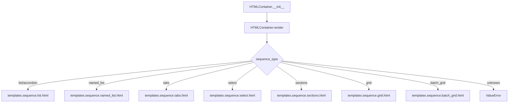

# `container.py`

## `src.ydata_profiling.report.presentation.flavours.html.container.HTMLContainer` · *class*

## Summary:
HTMLContainer is a presentation layer class that renders container elements as HTML templates based on sequence type.

## Description:
HTMLContainer extends the base Container class to provide HTML-specific rendering capabilities. It serves as a factory for generating HTML representations of containerized content, mapping different sequence types to appropriate HTML templates. This class is part of the HTML presentation flavour in the ydata-profiling report generation system and is responsible for converting structured container data into HTML markup.

## State:
- sequence_type (str): Determines which HTML template to render. Valid values include "list", "accordion", "named_list", "tabs", "select", "sections", "grid", "batch_grid".
- content (dict): Dictionary containing rendering parameters such as items, anchor_id, nested, full_width, batch_size, titles, and subtitles.
- items (Sequence[Renderable]): Collection of renderable objects to be displayed within the container.
- anchor_id (Optional[str]): Unique identifier for HTML anchors.
- nested (bool): Flag indicating if the container is nested within another container.
- full_width (bool): Flag for full-width section rendering.
- batch_size (int): Size of batches for batch_grid rendering.
- titles (bool): Flag to show/hide titles in batch_grid rendering.
- subtitles (bool): Flag to show/hide subtitles in batch_grid rendering.

## Lifecycle:
- Creation: Instantiate with items, sequence_type, and optional parameters like anchor_id, nested, etc. The parent Container.__init__ handles most initialization.
- Usage: Call render() method to generate HTML string representation. The render method dispatches to appropriate HTML templates based on sequence_type.
- Destruction: No special cleanup required; relies on Python garbage collection.

## Method Map:


## Raises:
- ValueError: When sequence_type is not recognized or supported by any template.

## Example:
```python
from ydata_profiling.report.presentation.flavours.html.container import HTMLContainer

# Create a container with list sequence type
container = HTMLContainer(
    items=[item1, item2, item3],
    sequence_type="list",
    anchor_id="my-list-container"
)

# Render to HTML
html_output = container.render()
```

### `src.ydata_profiling.report.presentation.flavours.html.container.HTMLContainer.render` · *method*

## Summary:
Renders HTML content by selecting and populating the appropriate Jinja2 template based on the container's sequence type.

## Description:
This method generates HTML markup for container elements by delegating to different Jinja2 templates based on the container's sequence type. It serves as the primary rendering mechanism for HTML containers in the report presentation layer, enabling various visual layouts (lists, tabs, grids, etc.) to be rendered consistently.

The method is called during the HTML report generation phase when container elements need to be converted to their HTML representation. It's separated from inline logic to maintain clean code organization and enable easy extension with new sequence types.

## Args:
    None

## Returns:
    str: HTML string containing the rendered container content

## Raises:
    ValueError: When the sequence_type is not recognized or supported by any of the available templates

## State Changes:
    Attributes READ: self.sequence_type, self.content
    Attributes WRITTEN: None

## Constraints:
    Preconditions:
    - self.sequence_type must be one of the supported types: "list", "accordion", "named_list", "tabs", "select", "sections", "grid", "batch_grid"
    - self.content must contain the required keys for the specific sequence_type being rendered
    - All items in self.content["items"] must be valid Renderable objects
    - For most sequence types, self.content must contain "anchor_id" and "items" keys
    - For "sections" sequence type, self.content must contain "sections" and "full_width" keys
    - For "batch_grid" sequence type, self.content must contain "items" and "batch_size" keys, with optional "titles" and "subtitles" keys

    Postconditions:
    - Returns properly formatted HTML string for the specified sequence type
    - Template rendering errors will propagate as exceptions

## Side Effects:
    None

