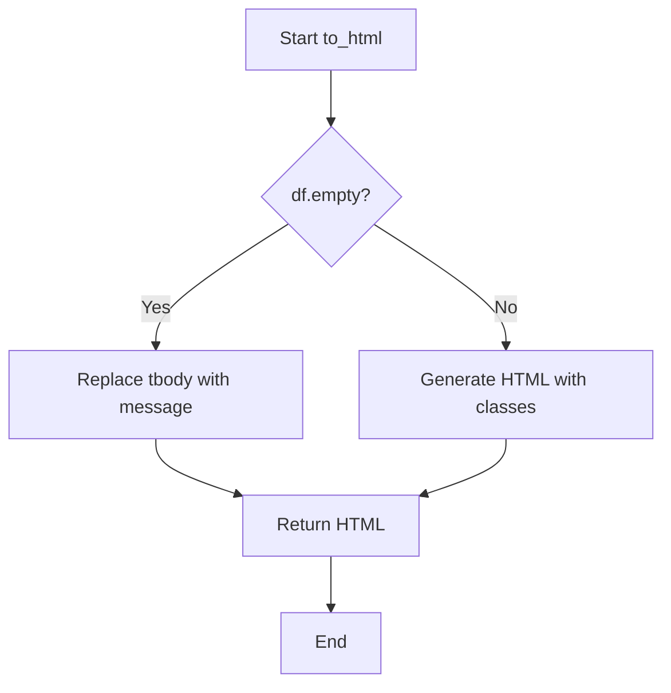

# `duplicate.py`

## `src.ydata_profiling.report.presentation.flavours.html.duplicate.to_html` · *function*

## Summary:
Converts a pandas DataFrame of duplicate rows into styled HTML table format with special handling for empty datasets.

## Description:
Transforms a pandas DataFrame containing duplicate row information into an HTML table with Bootstrap styling classes. When the DataFrame is empty, it displays a user-friendly message indicating no duplicates were found.

This function is part of the HTML presentation flavour implementation for duplicate data visualization in the ydata-profiling library. It's designed to be called by the Duplicate class's rendering mechanism to generate HTML output for reports.

## Args:
    df (pd.DataFrame): A pandas DataFrame containing duplicate row data. May be empty.

## Returns:
    str: HTML string representing the formatted duplicate data table with appropriate styling and empty dataset handling.

## Raises:
    None explicitly raised, but may propagate exceptions from pandas DataFrame operations.

## Constraints:
    Preconditions:
    - Input must be a valid pandas DataFrame object
    - DataFrame columns should be properly defined
    
    Postconditions:
    - Output is a valid HTML string with proper table structure
    - Empty DataFrames are handled with appropriate messaging

## Side Effects:
    None - Pure function with no external state mutation or I/O operations.

## Control Flow:


## Examples:
```python
import pandas as pd
from ydata_profiling.report.presentation.flavours.html.duplicate import to_html

# Example with duplicate data
df_with_duplicates = pd.DataFrame({
    'A': [1, 2, 1],
    'B': [3, 4, 3]
})
html_output = to_html(df_with_duplicates)
# Returns HTML table with duplicate rows

# Example with empty DataFrame
empty_df = pd.DataFrame()
html_output = to_html(empty_df)
# Returns HTML table with message "Dataset does not contain duplicate rows."
```

## `src.ydata_profiling.report.presentation.flavours.html.duplicate.HTMLDuplicate` · *class*

## Summary:
HTMLDuplicate is a presentation layer class that renders duplicate data information as HTML content.

## Description:
This class extends the core Duplicate class to provide HTML-specific rendering capabilities. It is responsible for transforming duplicate data information into HTML format for web-based reporting. The class is typically instantiated by the profiling system when generating HTML reports containing duplicate row information.

The motivation for this separate abstraction is to maintain a clean separation between the core data representation (handled by Duplicate) and its HTML presentation format. This follows the presentation pattern where different output formats (HTML, JSON, etc.) can be generated from the same underlying data structure.

## State:
- content: dict - Contains the duplicate data and associated metadata. The key "duplicate" holds a pandas DataFrame with duplicate rows information.
- item_type: str - Set to "duplicate" by the parent constructor
- name: str - Optional name identifier for the duplicate section
- anchor_id: str - Optional anchor ID for HTML linking
- classes: str - Optional CSS classes for styling

The __init__ method inherits from Duplicate and accepts the same parameters:
- name: str - Optional name for the duplicate section (default: None)
- duplicate: pd.DataFrame - DataFrame containing duplicate rows information
- **kwargs - Additional keyword arguments for parent initialization

## Lifecycle:
Creation: Instantiate using `HTMLDuplicate(name="section_name", duplicate=dataframe)` where dataframe is a pandas DataFrame containing duplicate rows.

Usage: Call the `render()` method to generate HTML output. The render method serves as the presentation layer for duplicate detection results in the HTML report generation pipeline.

Destruction: No special cleanup required; inherits standard object destruction behavior.

## Method Map:
```mermaid
graph TD
    A[HTMLDuplicate.__init__] --> B[Renderable.__init__]
    B --> C[ItemRenderer.__init__]
    C --> D[Duplicate.__init__]
    D --> E[HTMLDuplicate.render]
    E --> F[to_html]
    E --> G[templates.template("duplicate.html")]
    G --> H[Template.render]
```

## Raises:
- TypeError: If duplicate parameter is not a pandas DataFrame
- KeyError: If content dictionary doesn't contain required "duplicate" key
- TemplateNotFound: If the "duplicate.html" template is not found in the templates directory

## Example:
```python
import pandas as pd
from ydata_profiling.report.presentation.flavours.html.duplicate import HTMLDuplicate

# Create sample duplicate data
duplicate_df = pd.DataFrame({
    'A': [1, 2, 1],
    'B': [3, 4, 3],
    'C': [5, 6, 5]
})

# Create HTMLDuplicate instance
html_duplicate = HTMLDuplicate(name="my_duplicates", duplicate=duplicate_df)

# Render to HTML
html_output = html_duplicate.render()
print(html_output)
```

### `src.ydata_profiling.report.presentation.flavours.html.duplicate.HTMLDuplicate.render` · *method*

## Summary:
Renders duplicate detection results as an HTML string using a Jinja2 template.

## Description:
This method converts duplicate DataFrame content into HTML format and renders it within a predefined HTML template. It serves as the presentation layer for duplicate detection results in the HTML report generation pipeline.

## Args:
    None

## Returns:
    str: HTML-formatted string containing the duplicate detection results

## Raises:
    None explicitly raised

## State Changes:
    Attributes READ: self.content
    Attributes WRITTEN: None

## Constraints:
    Preconditions:
    - self.content must contain a key "duplicate" with a pandas DataFrame value
    - The templates module must be properly initialized with the "duplicate.html" template
    
    Postconditions:
    - Returns a valid HTML string representation of duplicate data
    - The returned HTML includes proper formatting and styling classes

## Side Effects:
    - Calls to_html function which performs DataFrame to_html conversion
    - Template rendering which may involve file system access for template loading

