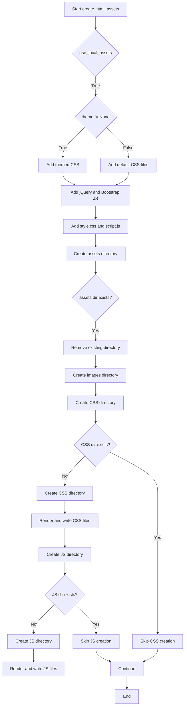

# `templates.py`

## `src.ydata_profiling.report.presentation.flavours.html.templates.template` · *function*

## Summary:
Retrieves a Jinja2 template from the global template environment by name.

## Description:
Provides a convenient interface for accessing pre-configured Jinja2 templates within the reporting system. This function acts as a wrapper around the global Jinja2 environment to simplify template retrieval throughout the application. It is commonly used in HTML report generation to fetch templates for different sections of the report.

## Args:
    template_name (str): The name of the template to retrieve from the Jinja2 environment.

## Returns:
    jinja2.Template: A Jinja2 Template object that can be used to render content with provided context.

## Raises:
    jinja2.exceptions.TemplateNotFound: When the specified template name does not exist in the Jinja2 environment.

## Constraints:
    Preconditions:
    - The global `jinja2_env` must be properly initialized before calling this function
    - The `template_name` must correspond to an existing template in the environment
    
    Postconditions:
    - Returns a valid Jinja2 Template object if the template exists
    - The returned template is ready to be rendered with context data

## Side Effects:
    None

## Control Flow:
```mermaid
flowchart TD
    A[Call template()] --> B{Template exists in jinja2_env?}
    B -- Yes --> C[Return jinja2.Template]
    B -- No --> D[Throw TemplateNotFound Exception]
```

## Examples:
```python
# Basic usage
template_obj = template("report_header.html")
rendered_content = template_obj.render(title="My Report", date="2023-01-01")

# In a reporting context
from ydata_profiling.report.presentation.flavours.html.templates import template
header_template = template("html/header.html")
```

## `src.ydata_profiling.report.presentation.flavours.html.templates.create_html_assets` · *function*

## Summary:
Creates HTML asset files (CSS and JavaScript) for report generation by rendering template files with configuration parameters.

## Description:
This function prepares the necessary static assets for HTML reports by copying and rendering template files to a designated assets directory. It handles both local and remote asset loading based on configuration settings, and ensures proper directory structure is maintained.

## Args:
    config (Settings): Configuration object containing HTML report settings including asset paths, themes, and styling options
    output_file (Path): Path to the output HTML file, used to determine the assets directory location

## Returns:
    None: This function performs file I/O operations and does not return any value

## Raises:
    None explicitly raised: The function uses standard Python file operations that may raise IOError or OSError if file operations fail

## Constraints:
    Preconditions:
    - config must be a valid Settings object with properly configured HTML settings
    - output_file must be a valid Path object
    - The template system must be properly initialized (jinja2_env must be available)
    
    Postconditions:
    - Assets directory is created at the location determined by config.html.assets_prefix
    - CSS and JavaScript files are rendered and saved to their respective directories
    - Images directory is created within the assets directory
    - Existing assets directory is removed and recreated if it already exists

## Side Effects:
    - Creates or removes directories in the file system
    - Writes multiple files to disk (CSS and JS files)
    - Modifies the file system structure by creating assets directory and subdirectories

## Control Flow:


## Examples:
```python
# Basic usage
config = Settings()
output_path = Path("report.html")
create_html_assets(config, output_path)

# With custom configuration
config.html.assets_prefix = "custom_assets"
config.html.use_local_assets = True
config.html.style.theme = Theme.SOLAR
create_html_assets(config, output_path)
```

