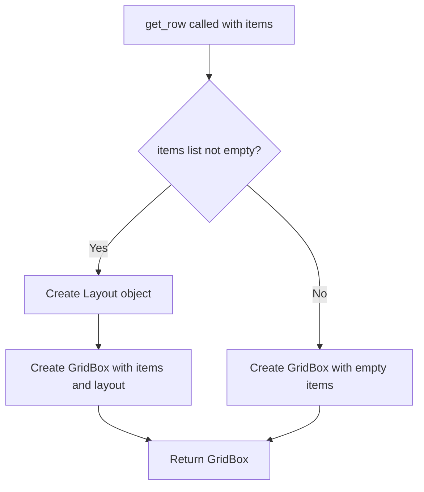

# `alerts.py`

## `src.ydata_profiling.report.presentation.flavours.widget.alerts.get_row` · *function*

## Summary:
Creates a grid layout widget with a 75%/25% column ratio for displaying alert items in a widget-based report interface.

## Description:
This function serves as a utility for creating consistent grid layouts in the widget presentation flavour of the profiling report. It takes a list of widget elements and arranges them in a GridBox with a predefined 75% width for the first column and 25% for the second column, which is commonly used for displaying alerts with main content and associated actions or metadata.

## Args:
    items (List[widgets.Widget]): A list of ipywidgets.Widget objects to be arranged in the grid layout. The function expects at least one widget for proper display.

## Returns:
    widgets.GridBox: A GridBox widget instance configured with the specified 75%/25% column layout and containing all provided widgets.

## Raises:
    None explicitly raised by this function.

## Constraints:
    Preconditions:
    - The input list must contain valid ipywidgets.Widget instances
    - The function assumes the widgets will properly render in a grid layout with two columns
    
    Postconditions:
    - The returned GridBox will have exactly two columns with the specified width ratio
    - All provided widgets will be contained within the GridBox

## Side Effects:
    None - This function only creates and configures widgets without performing I/O operations or mutating external state.

## Control Flow:


## Examples:
```python
# Basic usage with two widgets
from ipywidgets import HTML, Button
from ydata_profiling.report.presentation.flavours.widget.alerts import get_row

alert_content = HTML("<p>Warning: Missing values detected</p>")
action_button = Button(description="View Details")
grid_layout = get_row([alert_content, action_button])
```

## `src.ydata_profiling.report.presentation.flavours.widget.alerts.WidgetAlerts` · *class*

## Summary:
WidgetAlerts is a presentation layer component that renders alert notifications as interactive widgets in a Jupyter environment.

## Description:
WidgetAlerts is responsible for converting alert data into visual representations using ipywidgets. It inherits from the base Alerts class and implements the render method to display alerts in a GridBox layout. This class is specifically designed for the widget presentation flavour of the ydata-profiling report generation system.

## State:
- self.content: Dictionary containing alert data with key "alerts" that holds a list of Alert objects
- styles: Dictionary mapping alert type names to CSS button styles ("warning", "danger", "info", or empty string)
- items: List of ipywidgets (HTML and Button) that are assembled for rendering

## Lifecycle:
- Creation: Instantiated with alert data through the parent class constructor
- Usage: Called via render() method to generate a widgets.GridBox containing HTML and Button widgets
- Destruction: No explicit cleanup required as widgets handle their own lifecycle

## Method Map:
```mermaid
graph TD
    A[WidgetAlerts.render] --> B[styles lookup]
    A --> C[items list construction]
    C --> D[HTML widget creation]
    C --> E[Button widget creation]
    A --> F[get_row(items)]
    F --> G[widgets.GridBox return]
```

## Raises:
- ValueError: When get_row is called with more than 4 items (though this is handled by the get_row implementation in the widget flavour)

## Example:
```python
# Create alerts instance
alerts = Alerts(alert_list, style_config)

# Render as widgets
widget_grid = alerts.render()

# The resulting widget_grid contains HTML and Button widgets arranged in a GridBox
```

### `src.ydata_profiling.report.presentation.flavours.widget.alerts.WidgetAlerts.render` · *method*

*No documentation generated.*

