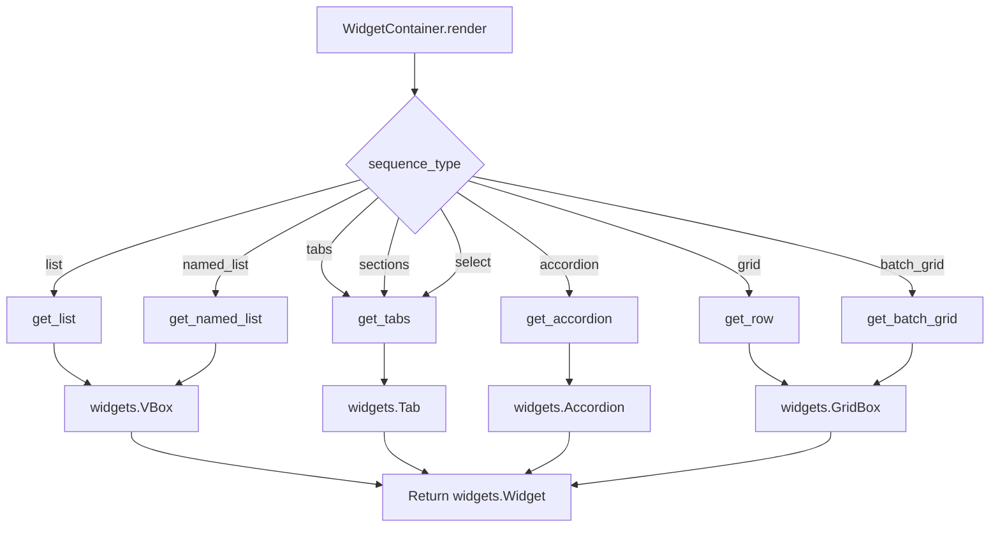

# `container.py`

## `src.ydata_profiling.report.presentation.flavours.widget.container.get_name` · *function*

## Summary:
Extracts a unique identifier name from a renderable item, preferring the explicit name attribute over the anchor ID.

## Description:
This utility function retrieves a human-readable identifier from a renderable item. It first attempts to access the `name` property of the item, falling back to the `anchor_id` property if the `name` attribute doesn't exist. This provides a consistent way to obtain identifying names for UI elements in the widget presentation flavour.

The function is extracted into its own utility to avoid duplication of the name resolution logic across different parts of the widget presentation system, enforcing a clear responsibility boundary for name retrieval.

## Args:
    item (Renderable): A renderable item that must have either a `name` or `anchor_id` attribute

## Returns:
    str: The name identifier from the item, either from the `name` property or `anchor_id` property

## Raises:
    None

## Constraints:
    Preconditions:
    - The item parameter must be an instance of Renderable or a subclass
    - The item must have either a `name` attribute or an `anchor_id` attribute
    
    Postconditions:
    - Returns a string identifier for the renderable item
    - The returned string is either the explicit name or fallback anchor ID

## Side Effects:
    None

## Control Flow:
```mermaid
flowchart TD
    A[get_name called with item] --> B{hasattr(item, "name")?}
    B -- Yes --> C[item.name]
    B -- No --> D[item.anchor_id]
    C --> E[Return name]
    D --> E
```

## Examples:
```python
# Example with name attribute
renderable_with_name = SomeRenderable(name="my_section")
name = get_name(renderable_with_name)  # Returns "my_section"

# Example with anchor_id attribute  
renderable_with_anchor = SomeRenderable(anchor_id="section_123")
name = get_name(renderable_with_anchor)  # Returns "section_123"
```

## `src.ydata_profiling.report.presentation.flavours.widget.container.get_tabs` · *function*

## Summary:
Creates an interactive tab widget from a list of renderable report components.

## Description:
Transforms a collection of renderable report elements into a tabbed interface using ipywidgets. This function abstracts the process of creating tab containers, rendering individual components, and assigning appropriate titles to each tab.

## Args:
    items (List[Renderable]): A list of renderable report components to display in tabs.

## Returns:
    widgets.Tab: An ipywidgets Tab object containing the rendered components as children with appropriate titles.

## Raises:
    None explicitly raised, but may propagate exceptions from item.render() or get_name() if items are malformed.

## Constraints:
    Preconditions:
    - All items in the input list must be instances of Renderable class
    - Each Renderable item must have either a name property or an anchor_id property
    
    Postconditions:
    - The returned widgets.Tab object will have the same number of children as input items
    - Each child in the tab will be the rendered result of the corresponding input item
    - Each tab will have a title derived from the item's name or anchor_id

## Side Effects:
    None

## Control Flow:
```mermaid
flowchart TD
    A[Start get_tabs] --> B{items empty?}
    B -- Yes --> C[Create empty Tab]
    B -- No --> D[Initialize children and titles lists]
    D --> E[For each item in items]
    E --> F[item.render() and append to children]
    F --> G[get_name(item) and append to titles]
    E --> H[End loop]
    H --> I[Create widgets.Tab()]
    I --> J[Set tab.children = children]
    J --> K[Set tab titles using set_title()]
    K --> L[Return tab]
```

## Examples:
```python
# Basic usage
from ydata_profiling.report.presentation.flavours.widget.container import get_tabs
from ydata_profiling.report.presentation.core.renderable import Renderable

# Assuming we have a list of renderable items
tabs_widget = get_tabs(renderable_items)
```

## `src.ydata_profiling.report.presentation.flavours.widget.container.get_list` · *function*

## Summary:
Creates a widget VBox container from a list of renderable components for Jupyter notebook display.

## Description:
Transforms a list of renderable objects into a vertical box widget layout for display in Jupyter environments. This utility function is part of the widget-based presentation flavour and serves as a bridge between abstract renderable components and concrete ipywidgets.VBox containers that can be rendered in notebook interfaces.

## Args:
    items (List[Renderable]): A list of renderable components that implement the render() method. Each item must be a subclass of Renderable.

## Returns:
    widgets.VBox: A vertical box widget containing the rendered representations of all input items in the same order.

## Raises:
    None explicitly raised, though underlying render() calls may raise exceptions if items are improperly configured.

## Constraints:
    Preconditions:
    - All items in the input list must implement the Renderable interface
    - Each item's render() method must return a valid widget object
    - Input list may be empty, in which case an empty VBox is returned

    Postconditions:
    - The returned VBox contains exactly one child widget for each input renderable
    - Child widgets are arranged vertically in the same order as input items
    - The VBox is suitable for direct display in Jupyter notebook environments

## Side Effects:
    None

## Control Flow:
```mermaid
flowchart TD
    A[get_list called with items] --> B{items empty?}
    B -- Yes --> C[Return empty VBox]
    B -- No --> D[Call render() on each item]
    D --> E[Create VBox with rendered items]
    E --> F[Return VBox]
```

## Examples:
```python
# Basic usage with multiple renderable items
from ydata_profiling.report.presentation.core.renderable import Renderable
from ydata_profiling.report.presentation.flavours.widget.container import get_list
from ipywidgets import widgets

# Assuming we have renderable objects
renderable_items = [item1, item2, item3]
widget_box = get_list(renderable_items)

# Usage with empty list
empty_box = get_list([])
```

## `src.ydata_profiling.report.presentation.flavours.widget.container.get_named_list` · *function*

## Summary:
Creates a vertically stacked widget container with labeled renderable items.

## Description:
Generates a `ipywidgets.VBox` layout containing a series of nested `VBox` elements, each displaying a labeled renderable item. Each item is presented with its name/identifier in bold HTML text followed by the rendered content.

This function serves as a utility for organizing and presenting collections of renderable components in a structured, labeled format suitable for Jupyter notebook visualizations. It's particularly useful for creating organized reports where each section needs a descriptive label.

## Args:
    items (List[Renderable]): A list of renderable components to be displayed with labels. Each item must be a Renderable object with a name or anchor_id attribute.

## Returns:
    widgets.VBox: A vertical box container with labeled renderable items. Each child VBox contains an HTML label (in bold) showing the item's name/anchor_id followed by the rendered content of the item.

## Raises:
    None explicitly raised.

## Constraints:
    Preconditions:
    - Items must be instances of Renderable class or compatible objects with render() method
    - Each item should have either a name property or anchor_id attribute accessible via get_name function
    - Items list may be empty, in which case an empty VBox is returned
    
    Postconditions:
    - Returns a valid ipywidgets.VBox instance
    - Each item in the returned container displays both its label and rendered content
    - Empty input list results in empty VBox with no children

## Side Effects:
    None.

## Control Flow:
```mermaid
flowchart TD
    A[get_named_list called with items] --> B{items not empty?}
    B -- Yes --> C[Create outer VBox]
    C --> D[For each item in items]
    D --> E[Get item name with get_name()]
    E --> F[Create inner VBox]
    F --> G[Add HTML label with name]
    G --> H[Add rendered item content]
    H --> I[Add inner VBox to outer VBox]
    I --> J[Return outer VBox]
    B -- No --> K[Return empty VBox]
    K --> J
```

## Examples:
```python
# Basic usage with renderable items
from ydata_profiling.report.presentation.core.renderable import Renderable
from ydata_profiling.report.presentation.flavours.widget.container import get_named_list

# Assuming we have a list of renderable items
renderable_items = [item1, item2, item3]
container = get_named_list(renderable_items)
# Displays items with their names in bold followed by rendered content

# Empty list usage
empty_container = get_named_list([])
# Returns an empty VBox
```

## `src.ydata_profiling.report.presentation.flavours.widget.container.get_row` · *function*

## Summary:
Creates a grid layout container for rendering report elements with responsive column sizing.

## Description:
Generates a GridBox widget with appropriate column widths based on the number of renderable items provided. This function abstracts the complexity of creating different grid layouts for varying numbers of items, ensuring consistent presentation formatting in widget-based report interfaces.

## Args:
    items (List[Renderable]): A list of renderable report elements to display in a grid layout. Must contain between 1 and 4 items inclusive.

## Returns:
    widgets.GridBox: A grid container widget with properly configured column widths and rendered child elements.

## Raises:
    ValueError: When the number of items is not between 1 and 4 inclusive, indicating that the layout is undefined for this number of columns.

## Constraints:
    Preconditions:
        - Items must be a list of Renderable objects
        - List length must be between 1 and 4 inclusive
    Postconditions:
        - Returns a valid widgets.GridBox instance
        - All items are rendered using their render() method
        - Grid template columns are set according to predefined ratios

## Side Effects:
    None

## Control Flow:
```mermaid
flowchart TD
    A[get_row called with items] --> B{len(items)}
    B -->|1| C[Set 100% width, 100% column]
    B -->|2| D[Set 100% width, 50% 50% columns]
    B -->|3| E[Set 100% width, 25% 25% 50% columns]
    B -->|4| F[Set 100% width, 25% 25% 25% 25% columns]
    B -->|else| G[Raise ValueError]
    C --> H[Return GridBox]
    D --> H
    E --> H
    F --> H
    G --> H
```

## `src.ydata_profiling.report.presentation.flavours.widget.container.get_batch_grid` · *function*

## Summary:
Creates a grid layout container for rendering multiple items with optional title/subtitle labels.

## Description:
Generates a widget-based grid layout that organizes renderable items in a specified number of columns. The function optionally adds title or subtitle labels to each item based on boolean flags. This utility function is used to structure report elements in a visually organized grid format within widget-based presentations.

## Args:
    items (List[Renderable]): A list of renderable objects to display in the grid
    batch_size (int): Number of columns in the resulting grid layout
    titles (bool): Flag indicating whether to display item names as h4 headings
    subtitles (bool): Flag indicating whether to display item names as h5 italicized headings

## Returns:
    widgets.GridBox: A grid box widget containing the formatted items arranged in the specified batch size

## Raises:
    None explicitly raised

## Constraints:
    Preconditions:
    - items must be a list of objects implementing the Renderable interface
    - batch_size must be a positive integer
    - titles and subtitles flags are mutually exclusive (only one can be True)
    
    Postconditions:
    - Returns a valid widgets.GridBox instance
    - All items are rendered and contained within the grid box
    - Grid columns are evenly distributed based on batch_size

## Side Effects:
    None

## Control Flow:
```mermaid
flowchart TD
    A[Start get_batch_grid] --> B{subtitles?}
    B -- Yes --> C[Create VBox with h5 subtitle]
    B -- No --> D{titles?}
    D -- Yes --> E[Create VBox with h4 title]
    D -- No --> F[Use item.render() directly]
    C --> G[Add to output list]
    E --> G
    F --> G
    G --> H[Create GridBox with layout]
    H --> I[Return GridBox]
```

## Examples:
```python
# Create a grid with 3 columns showing titles
items = [item1, item2, item3, item4]
grid = get_batch_grid(items, batch_size=3, titles=True, subtitles=False)

# Create a grid with 2 columns showing subtitles
items = [item1, item2, item3, item4]
grid = get_batch_grid(items, batch_size=2, titles=False, subtitles=True)
```

## `src.ydata_profiling.report.presentation.flavours.widget.container.get_accordion` · *function*

## Summary:
Creates an interactive ipywidgets Accordion component from a list of renderable items.

## Description:
This function transforms a collection of renderable report elements into an interactive accordion widget suitable for Jupyter notebook environments. It processes each renderable item by rendering its content and extracting a display title, then constructs a widgets.Accordion with these components.

The function is part of the widget-based presentation flavour for report generation, specifically designed to organize hierarchical report content in collapsible sections.

## Args:
    items (List[Renderable]): A list of renderable report elements that support the render() method and have either a name attribute or anchor_id property.

## Returns:
    widgets.Accordion: An ipywidgets Accordion instance containing the rendered content of each item with appropriate titles.

## Raises:
    None explicitly raised - however, underlying widget creation or rendering errors may occur if items are improperly formatted.

## Constraints:
    Preconditions:
    - All items in the input list must be instances of Renderable class or compatible subclasses
    - Each item must implement a render() method that returns a valid widget or HTML content
    - Items must have either a name attribute or anchor_id property accessible via the get_name helper function
    
    Postconditions:
    - The returned accordion widget contains exactly as many panels as there are input items
    - Each panel's content corresponds to the rendered output of the respective input item
    - Each panel has a title derived from the item's name or anchor_id

## Side Effects:
    None - this function is pure and doesn't modify external state or perform I/O operations.

## Control Flow:
```mermaid
flowchart TD
    A[Start get_accordion] --> B{Items provided?}
    B -- Yes --> C[Initialize children and titles lists]
    C --> D[For each item in items]
    D --> E[item.render() → children.append()]
    E --> F[get_name(item) → titles.append()]
    F --> G[Create widgets.Accordion]
    G --> H[Set titles for each panel]
    H --> I[Return accordion]
    B -- No --> J[Return empty accordion]
```

## Examples:
```python
# Basic usage with renderable items
from ydata_profiling.report.presentation.core.renderable import Renderable
from ydata_profiling.report.presentation.flavours.widget.container import get_accordion

# Assuming we have a list of renderable items
accordion_widget = get_accordion(renderable_items)
display(accordion_widget)  # In Jupyter notebook
```

## `src.ydata_profiling.report.presentation.flavours.widget.container.WidgetContainer` · *class*

## Summary:
WidgetContainer is a presentation layer class that renders container elements as interactive ipywidgets based on different sequence types.

## Description:
WidgetContainer extends the abstract Container class to provide concrete implementations for rendering various container types as ipywidgets. It specifically handles the conversion of container structures into interactive Jupyter widgets based on the sequence_type configuration. This class is part of the widget presentation flavour and is responsible for translating container representations into appropriate ipywidgets such as VBox, Tab, Accordion, GridBox, etc.

The primary purpose of this class is to provide widget-specific rendering capabilities for container elements in Jupyter environments, rather than serving as a general abstraction layer for different presentation flavours.

## State:
- sequence_type: str - determines the type of widget to render, with valid values including "list", "named_list", "tabs", "sections", "select", "accordion", "grid", "batch_grid"
- content: dict - contains the configuration and items for rendering, including "items" key with list of Renderable objects and potentially "batch_size", "titles", "subtitles" keys
- Inherits all attributes from Renderable base class including content dictionary, name, anchor_id, and classes properties

## Lifecycle:
- Creation: Instantiated with items (Sequence[Renderable]), sequence_type (str), and optional parameters like nested, name, anchor_id, classes
- Usage: Called primarily through the render() method which returns a widgets.Widget object
- Destruction: No explicit cleanup required; relies on ipywidgets' garbage collection

## Method Map:


## Raises:
- ValueError: Raised when sequence_type is not recognized or supported, with message indicating the unrecognized type

## Example:
```python
# Create a container with list sequence type
container = WidgetContainer(
    items=[renderable1, renderable2], 
    sequence_type="list"
)

# Render to ipywidgets
widget = container.render()  # Returns widgets.VBox

# Create a container with tabs sequence type
tab_container = WidgetContainer(
    items=[renderable1, renderable2], 
    sequence_type="tabs"
)

# Render to tabbed interface
tab_widget = tab_container.render()  # Returns widgets.Tab
```

### `src.ydata_profiling.report.presentation.flavours.widget.container.WidgetContainer.render` · *method*

## Summary:
Renders the container content as a specific ipywidgets.Widget based on the sequence type configuration.

## Description:
This method serves as the primary rendering entry point for WidgetContainer instances, dynamically selecting and constructing appropriate widget layouts based on the container's sequence_type configuration. It delegates to specialized helper functions that create specific widget types such as lists, tabs, accordions, grids, and batch grids.

The method is separated from inline logic to maintain clean code organization and enable easy extension with new widget types. It follows a factory pattern approach where different sequence types map to different widget construction strategies.

## Args:
    None

## Returns:
    widgets.Widget: A rendered ipywidgets.Widget instance representing the container's content in the appropriate layout structure

## Raises:
    ValueError: When the sequence_type is not recognized or supported, with error message containing the unrecognized sequence type

## State Changes:
    Attributes READ: self.sequence_type, self.content
    Attributes WRITTEN: None

## Constraints:
    Preconditions:
    - self.sequence_type must be one of: "list", "named_list", "tabs", "sections", "select", "accordion", "grid", "batch_grid"
    - self.content must contain a "items" key with a list of Renderable objects
    - For "batch_grid" sequence_type, self.content must also contain a "batch_size" key
    
    Postconditions:
    - Returns a valid ipywidgets.Widget instance
    - All items in self.content["items"] are properly rendered and included in the returned widget

## Side Effects:
    None

