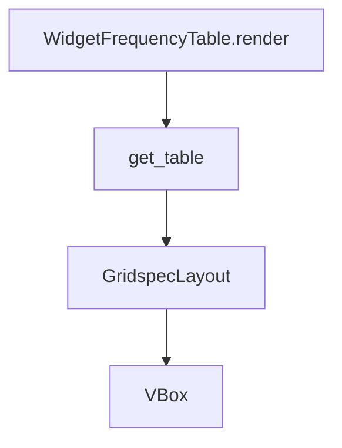

# `frequency_table.py`

## `src.ydata_profiling.report.presentation.flavours.widget.frequency_table.get_table` · *function*

## Summary
Creates a widget-based frequency table display using ipywidgets GridspecLayout and VBox containers.

## Description
This function organizes a list of widget tuples into a structured grid layout suitable for displaying frequency table data in Jupyter notebook environments. It's designed specifically for the widget-based presentation flavour of the ydata-profiling report generation system.

The function extracts the responsibility of widget layout organization from the main frequency table rendering logic, allowing for cleaner separation of concerns between data processing and UI presentation.

## Args
    items (List[Tuple[widgets.Label, widgets.FloatProgress, widgets.Label]]): A list of tuples where each tuple contains three widgets:
        - First widget: Label for displaying category names
        - Second widget: FloatProgress for showing percentage or count progress bars
        - Third widget: Label for displaying count values

## Returns
    VBox: A vertical box container holding the GridspecLayout table, where each row contains the three widgets arranged in columns.

## Raises
    None explicitly raised - however, underlying widget operations may raise exceptions if invalid widget objects are provided.

## Constraints
    Preconditions:
        - Each tuple in items must contain exactly three widgets
        - All widgets must be compatible with GridspecLayout positioning
        - Items list can be empty, resulting in a minimal GridspecLayout with 0 rows
    
    Postconditions:
        - Returns a VBox container wrapping a GridspecLayout with 3 columns
        - Each row in the GridspecLayout corresponds to one item in the input list
        - Widget positions are fixed as: column 0 = label, column 1 = progress bar, column 2 = count

## Side Effects
    None - This function is purely a UI layout utility with no external I/O or state mutations.

## Control Flow
```mermaid
flowchart TD
    A[Start get_table] --> B{items empty?}
    B -- Yes --> C[Create empty GridspecLayout(0,3)]
    B -- No --> D[Create GridspecLayout(len(items),3)]
    D --> E[Iterate through items]
    E --> F{Extract widgets from tuple}
    F --> G[Set table[row_id,0] = label]
    G --> H[Set table[row_id,1] = progress]
    H --> I[Set table[row_id,2] = count]
    I --> J[Return VBox([table])]
```

## Examples
```python
# Basic usage with sample widgets
from ipywidgets import Label, FloatProgress
from src.ydata_profiling.report.presentation.flavours.widget.frequency_table import get_table

# Create sample widgets
label1 = Label("Category A")
progress1 = FloatProgress(value=75, min=0, max=100)
count1 = Label("75%")

label2 = Label("Category B")
progress2 = FloatProgress(value=25, min=0, max=100)
count2 = Label("25%")

# Create table
items = [(label1, progress1, count1), (label2, progress2, count2)]
widget_table = get_table(items)
```

## `src.ydata_profiling.report.presentation.flavours.widget.frequency_table.WidgetFrequencyTable` · *class*

## Summary:
WidgetFrequencyTable renders frequency table data as interactive ipywidgets with styled progress bars and labels.

## Description:
This class implements a widget-based frequency table renderer for Jupyter notebooks. It inherits from FrequencyTable and provides a concrete implementation of the render method that creates interactive UI elements displaying categorical data distributions.

The implementation processes frequency data rows and generates a VBox container with GridspecLayout that displays each entry as a row containing:
1. A label widget showing the category name
2. A FloatProgress widget showing the relative frequency with color coding
3. A label widget showing the absolute count

Different progress bar styles are applied based on the row's extra_class attribute: "danger" for missing values, "info" for other categories, and no special styling for regular entries.

## State:
- Inherits all state from FrequencyTable parent class
- `self.content` contains the frequency data structure with nested "rows" key
- The "rows" structure is expected to be a list of lists, where the first element (rows[0]) contains the actual row data
- Each row is expected to have keys: "label", "count", "n", and "extra_class"

## Lifecycle:
- Creation: Instantiate with frequency data via parent class constructor
- Usage: Call render() method to generate the VBox widget containing styled progress bars
- Destruction: Widget cleanup handled automatically by ipywidgets/Jupyter environment

## Method Map:


## Raises:
- No explicit exceptions raised by WidgetFrequencyTable.__init__
- May raise KeyError or TypeError if self.content structure doesn't match expected format
- May raise AttributeError if self.content or required keys are missing

## Example:
```python
# Create frequency table with sample data
rows = [[
    {"label": "Category A", "count": 10, "n": 100, "extra_class": ""},
    {"label": "Missing Values", "count": 5, "n": 100, "extra_class": "missing"}
]]
freq_table = WidgetFrequencyTable(rows)

# Render the widget
widget = freq_table.render()
display(widget)
```

### `src.ydata_profiling.report.presentation.flavours.widget.frequency_table.WidgetFrequencyTable.render` · *method*

## Summary:
Renders frequency table data as interactive ipywidgets with styled progress bars and labels.

## Description:
Creates a visual representation of frequency table data using ipywidgets. Processes rows from the content attribute and generates labeled progress bars with different styling based on row categories. This method is separated from the initialization to allow for deferred rendering of the widget interface.

## Args:
    None

## Returns:
    VBox: A vertical container holding a grid layout of frequency table entries with labels, progress bars, and counts.

## Raises:
    KeyError: If self.content does not contain the expected "rows" key structure.
    TypeError: If self.content["rows"][0] is not iterable or contains malformed row data.

## State Changes:
    Attributes READ: self.content
    Attributes WRITTEN: None

## Constraints:
    Preconditions:
    - self.content must contain a "rows" key with a list structure where rows[0] is iterable
    - Each row in rows[0] must be a dictionary with keys: "label", "count", "n", and "extra_class"
    - The "extra_class" field must be either "missing", "other", or another value for default styling
    
    Postconditions:
    - Returns a VBox widget containing properly formatted frequency table data
    - Progress bars are correctly sized based on count/n ratio
    - Widget styling matches the extra_class value

## Side Effects:
    None

