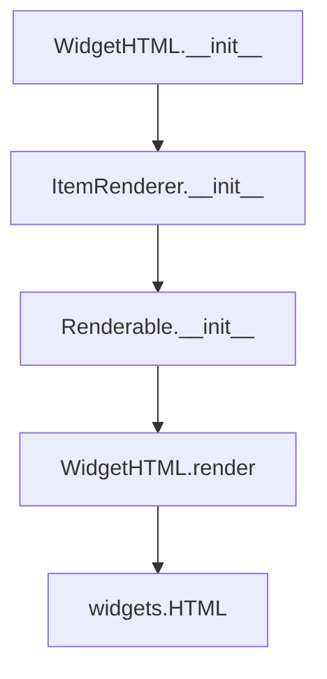

# `html.py`

## `src.ydata_profiling.report.presentation.flavours.widget.html.WidgetHTML` · *class*

## Summary:
WidgetHTML is a presentation layer component that renders HTML content as an interactive ipywidgets HTML widget.

## Description:
This class serves as a bridge between the abstract HTML presentation layer and the concrete ipywidgets implementation. It is responsible for converting HTML content into interactive widgets that can be displayed in Jupyter notebooks or other ipywidgets-compatible environments. The class is typically instantiated by the reporting framework when generating widget-based visualizations.

## State:
- content: dict containing HTML content under the key "html"
  - Type: dict with string key "html" 
  - Valid values: Either a string containing HTML markup or an existing widgets.HTML object
  - Invariant: The content dictionary must contain the "html" key with either a string or widgets.HTML object
- item_type: string identifier set to "html" by parent class
- All inherited attributes from Renderable base class

## Lifecycle:
- Creation: Instantiate with HTML content (string) via parent class constructor
- Usage: Call render() method to obtain a widgets.HTML widget instance
- Destruction: No explicit cleanup required; relies on ipywidgets' garbage collection

## Method Map:


## Raises:
- None explicitly raised by __init__
- May raise exceptions from widgets.HTML constructor if invalid HTML content is provided

## Example:
```python
# Create WidgetHTML instance
widget_html = WidgetHTML("<h1>Hello World</h1>")

# Render to ipywidgets HTML widget
html_widget = widget_html.render()

# The result can be displayed in Jupyter notebooks
display(html_widget)
```

### `src.ydata_profiling.report.presentation.flavours.widget.html.WidgetHTML.render` · *method*

## Summary:
Converts HTML content to a Jupyter widgets HTML object for widget-based presentation environments.

## Description:
This method transforms HTML content stored in the instance's content dictionary into a proper ipywidgets.HTML object. It serves as a specialized renderer for widget-based environments, providing flexibility to handle both raw HTML strings and pre-existing widgets.HTML objects. This method is specifically designed for use in Jupyter notebook environments where interactive widgets are required.

## Args:
    None

## Returns:
    widgets.HTML: A Jupyter widgets HTML object containing the rendered HTML content. If the content is already a widgets.HTML object, it returns that object directly; otherwise, it wraps the HTML string in a widgets.HTML instance.

## Raises:
    None explicitly raised

## State Changes:
    Attributes READ: self.content
    Attributes WRITTEN: None

## Constraints:
    Preconditions: 
    - self.content must be a dictionary containing an "html" key
    - The value of self.content["html"] must be either a string or a widgets.HTML object
    
    Postconditions:
    - Always returns a widgets.HTML object
    - The returned object contains the HTML content from self.content["html"]

## Side Effects:
    None

