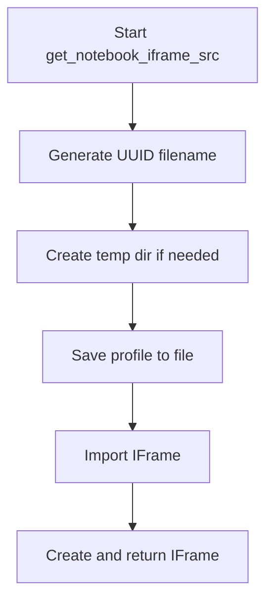
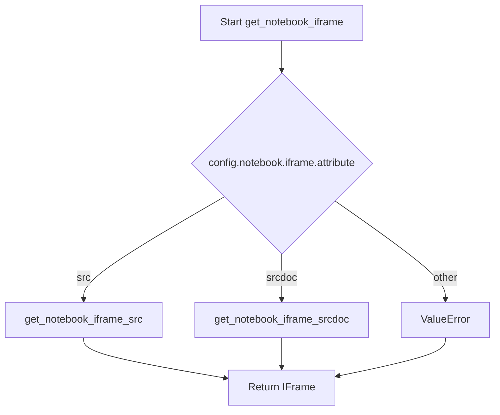

# `notebook.py`

## `src.ydata_profiling.report.presentation.flavours.widget.notebook.get_notebook_iframe_srcdoc` · *function*

## Summary:
Generates an HTML iframe element for displaying a profile report within a Jupyter notebook environment.

## Description:
Creates an HTML iframe with srcdoc attribute to embed a pandas profiling report directly in a Jupyter notebook cell output. This function extracts iframe dimensions from the configuration and safely escapes the report HTML content to prevent XSS vulnerabilities.

The function is part of the widget presentation flavour and specifically designed for notebook environments where inline HTML rendering is preferred over separate file output. It enables seamless integration of profiling reports into interactive notebook workflows.

## Args:
    config (Settings): Configuration object containing notebook-specific settings, particularly iframe dimensions (width and height)
    profile (ProfileReport): The pandas profiling report instance to be rendered in the iframe

## Returns:
    HTML: An IPython HTML object containing the iframe element that displays the profile report

## Raises:
    None explicitly raised by this function

## Constraints:
    Preconditions:
    - config must be a valid Settings object with proper notebook configuration
    - profile must be a valid ProfileReport instance with rendered HTML content
    - The profile.to_html() method must return valid HTML string

    Postconditions:
    - Returns a properly formatted HTML iframe element
    - The iframe contains the escaped HTML content of the profile report
    - The iframe dimensions match the configured values

## Side Effects:
    None

## Control Flow:
```mermaid
flowchart TD
    A[Start get_notebook_iframe_srcdoc] --> B[Extract iframe width from config]
    B --> C[Extract iframe height from config]
    C --> D[Get HTML content from profile.to_html()]
    D --> E[Escape HTML content with html.escape()]
    E --> F[Construct iframe HTML string]
    F --> G[Wrap in IPython HTML object]
    G --> H[Return HTML object]
```

## Examples:
```python
# Basic usage in a Jupyter notebook cell
from ydata_profiling import ProfileReport
from ydata_profiling.config import Settings

# Create a profile report
df = pd.read_csv('data.csv')
profile = ProfileReport(df)

# Configure iframe settings
config = Settings()
config.notebook.iframe.width = "100%"
config.notebook.iframe.height = "600px"

# Display in notebook iframe
from ydata_profiling.report.presentation.flavours.widget.notebook import get_notebook_iframe_srcdoc
display(get_notebook_iframe_srcdoc(config, profile))
```

## `src.ydata_profiling.report.presentation.flavours.widget.notebook.get_notebook_iframe_src` · *function*

## Summary:
Creates an IFrame displaying a profile report by saving it to a temporary HTML file and returning an IFrame object with configured dimensions.

## Description:
This function generates a temporary HTML file containing the profile report content, then wraps it in an IFrame for display in Jupyter notebooks. It's part of a larger system for rendering profile reports in different environments (notebook vs standalone HTML). The function extracts the iframe creation logic to separate concerns and enable reuse in different contexts.

## Args:
    config (Settings): Configuration object containing notebook-specific settings including iframe dimensions
    profile (ProfileReport): The profile report instance to render and display in the iframe

## Returns:
    IFrame: An IPython IFrame object configured with the temporary HTML file path and specified dimensions from config.notebook.iframe.width and config.notebook.iframe.height

## Raises:
    None explicitly raised, but may propagate exceptions from:
    - Path operations (if directory creation fails)
    - File writing operations (if temporary file cannot be written)
    - IFrame construction (if invalid parameters are passed)

## Constraints:
    Preconditions:
    - config must contain a valid notebook.iframe configuration with width and height attributes
    - profile must be a valid ProfileReport instance with properly initialized configuration
    - The system must have write permissions to the ./ipynb_tmp directory
    
    Postconditions:
    - A temporary HTML file is created in ./ipynb_tmp with a unique UUID-based filename
    - The profile report is saved to this temporary file in HTML format
    - An IFrame object is returned with correct width and height from config

## Side Effects:
    - Creates a temporary directory ./ipynb_tmp if it doesn't exist
    - Writes a temporary HTML file to ./ipynb_tmp with a UUID-based filename
    - The temporary file persists until manually cleaned up or system cleanup occurs

## Control Flow:


## Examples:
```python
# Basic usage in a Jupyter notebook
from ydata_profiling import ProfileReport
from ydata_profiling.config import Settings

# Create a profile report
df = pd.read_csv('data.csv')
profile = ProfileReport(df)

# Get iframe for display
config = Settings()
iframe = get_notebook_iframe_src(config, profile)
display(iframe)
```

## `src.ydata_profiling.report.presentation.flavours.widget.notebook.get_notebook_iframe` · *function*

## Summary:
Creates a notebook-compatible iframe display object for a profiling report based on configured iframe attributes.

## Description:
This function serves as a dispatcher that generates either an IFrame or HTML object for displaying a profiling report in Jupyter notebooks. It selects between two approaches based on the `notebook.iframe.attribute` configuration setting: "src" which creates a temporary HTML file and references it, or "srcdoc" which embeds the HTML directly in the iframe.

## Args:
    config (Settings): Configuration object containing notebook-specific settings including iframe attributes
    profile (ProfileReport): The profiling report to display in the iframe

## Returns:
    Union[IFrame, HTML]: An IFrame object when attribute is "src", or HTML object when attribute is "srcdoc"

## Raises:
    ValueError: When the iframe attribute is neither "src" nor "srcdoc"

## Constraints:
    Preconditions:
        - config must contain a valid notebook.iframe.attribute setting
        - profile must be a valid ProfileReport instance
    Postconditions:
        - Returns either an IFrame or HTML object suitable for Jupyter notebook display
        - The returned object will have appropriate width and height settings from config

## Side Effects:
    - Creates temporary files when using the "src" attribute approach (stored in ./ipynb_tmp directory)
    - May modify filesystem by creating temporary directories and files
    - No external service calls or global state mutations

## Control Flow:


