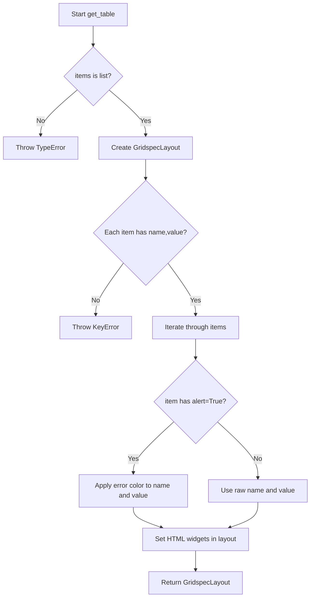

# `table.py`

## `src.ydata_profiling.report.presentation.flavours.widget.table.get_table` · *function*

## Summary:
Creates a widget-based table layout from a list of name-value pairs with optional alert styling.

## Description:
Generates a GridspecLayout widget containing name-value pairs arranged in two columns. Each row displays a name in the left column and its corresponding value in the right column. When an item contains an "alert" flag set to True, both the name and value are styled with error coloring.

## Args:
    items (List[Dict[str, Any]]): A list of dictionaries, each containing at minimum "name" and "value" keys. Optional "alert" key can be used to indicate error states.

## Returns:
    GridspecLayout: A widget layout object with dimensions (n_items, 2) where n_items is the length of the input list.

## Raises:
    KeyError: If any dictionary in items does not contain "name" or "value" keys.
    TypeError: If items is not a list or contains non-dictionary elements.

## Constraints:
    Preconditions:
        - items must be a list
        - Each item in items must be a dictionary containing "name" and "value" keys
        - Items may optionally contain an "alert" key with boolean value
    Postconditions:
        - Returns a GridspecLayout with exactly len(items) rows and 2 columns
        - All items are rendered as HTML widgets in the layout

## Side Effects:
    None

## Control Flow:


## Examples:
```python
# Basic usage
items = [
    {"name": "Count", "value": "100"},
    {"name": "Mean", "value": "50.5"}
]
table = get_table(items)

# With alerts
items_with_alerts = [
    {"name": "Count", "value": "100"},
    {"name": "Error Rate", "value": "0.05", "alert": True}
]
table = get_table(items_with_alerts)
```

## `src.ydata_profiling.report.presentation.flavours.widget.table.WidgetTable` · *class*

*No documentation generated.*

### `src.ydata_profiling.report.presentation.flavours.widget.table.WidgetTable.render` · *method*

## Summary:
Renders a table widget with optional caption from the table content.

## Description:
Creates a vertical box layout containing a table widget and optional caption. This method transforms the structured table data into a Jupyter widget representation suitable for display in notebook environments.

## Args:
    None

## Returns:
    VBox: A vertical box container holding the table widget and optional caption HTML element.

## Raises:
    None explicitly raised

## State Changes:
    Attributes READ: self.content (accessed via self.content["rows"] and self.content["caption"])
    Attributes WRITTEN: None

## Constraints:
    Preconditions: 
    - self.content must be a dictionary containing "rows" key with a list of table row data
    - self.content must be a dictionary containing "caption" key that can be None or string
    Postconditions:
    - Returns a VBox widget containing properly formatted table and caption elements

## Side Effects:
    None

